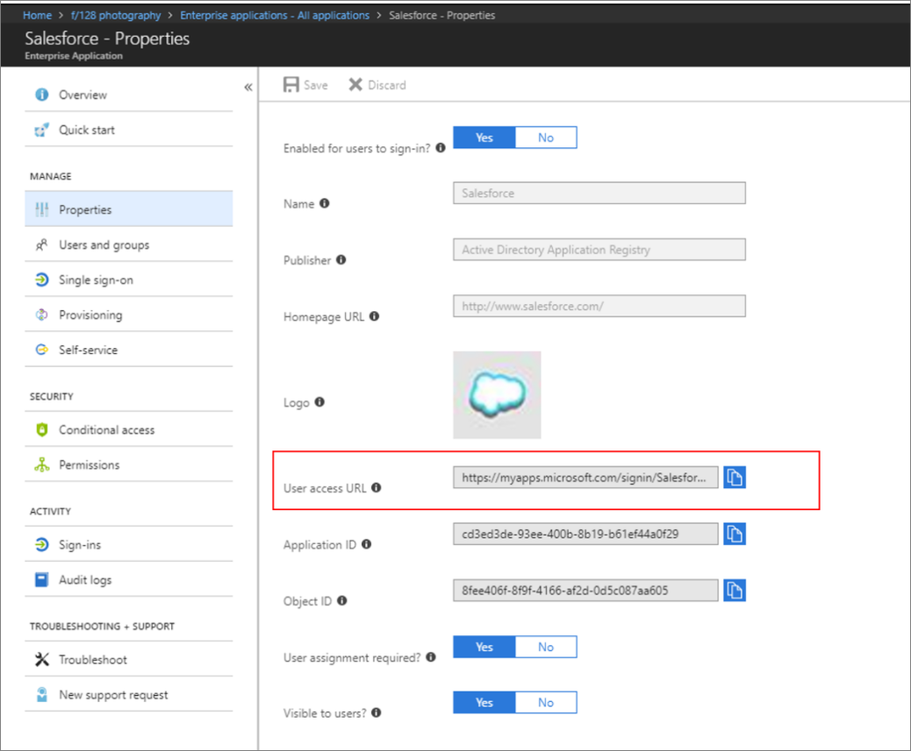

# Plan an Azure Active Directory My Apps deployment

Azure Active Directory (Azure AD) My Apps is a web-based portal that helps lower support costs, increase productivity and security, and reduce user frustration. The system includes detailed reporting that tracks when you access the system and notifies administrators of misuse or abuse. To learn about using My Apps from an end-user perspective, see [My Apps portal help](../user-help/my-apps-portal-end-user-access.md).

By using Azure AD My Apps, you can:

* Discover and access all of their company’s Azure AD-connected resources, such as applications
* Request access to new apps and groups
* Manage access to these resources for others
* Manage self-service password resets and Azure Multi-Factor Authentication settings
* Manage their devices

It also allows administrators to manage:

* Terms of service
* Organizations
* Access reviews

## Benefits of Azure AD My Apps integration

Azure AD My Apps benefits businesses in the following ways:

**Provides intuitive user experience**: My Apps provides you with a single platform for all of your Azure single sign-on (SSO)-connected applications. You have a unified portal to find existing settings and new capabilities, like group management and self-service password reset, as they're added. The intuitive experience allows users to return to work faster and be more productive, while reducing their frustration.

**Increases productivity**: All user applications in My Apps have SSO enabled. Enabling SSO across enterprise applications and Microsoft 365 creates a superior sign-in experience by reducing or eliminating additional sign-in prompts. My Apps uses self-service and dynamic membership and improves the overall security of your identity system. My Apps ensures that the right people manage access to the applications. My Apps serves as a coherent landing page for you to quickly find resources and continue work tasks.

**Manages cost**: Enabling My Apps with Azure AD can help with the divestment of on-premises infrastructures. It reduces support costs by providing you with a consistent portal to find all of your apps, request access to resources, and manage accounts.

**Increases flexibility and security**: My Apps gives you access to the security and flexibility that a cloud platform provides. Administrators can easily change settings to applications and resources and can accommodate new security requirements without affecting users.

**Enables robust auditing and usage tracking**: Auditing and usage tracking for all user capabilities let you know when users are using their resources and ensures that you can assess security.

### Licensing considerations

My Apps is free and requires no licenses to use at a basic level. However, the number of objects in your directory and the additional features you want to deploy can require additional licenses. Some common Azure AD scenarios that have licensing requirements include the following security features:

* [Azure Multi-Factor Authentication](https://docs.microsoft.com/azure/multi-factor-authentication/multi-factor-authentication-how-it-works)
* [Group-based membership](https://docs.microsoft.com/azure/active-directory/active-directory-manage-groups)
* [Self-service password reset](https://docs.microsoft.com/azure/active-directory/authentication/quickstart-sspr)
* [Azure Active Directory Identity Protection](https://docs.microsoft.com/azure/active-directory/active-directory-identityprotection)

See the [full licensing guide for Azure AD](https://azure.microsoft.com/pricing/details/active-directory/).

### Prerequisites for deploying Azure AD My Apps

Complete the following prerequisites before you begin this project:

* [Integrate application SSO](https://docs.microsoft.com/azure/active-directory/manage-apps/plan-sso-deployment)
* [Manage Azure AD user and group infrastructure](https://docs.microsoft.com/azure/active-directory/fundamentals/active-directory-manage-groups)

## Plan Azure AD My Apps deployment

The following table outlines the key use cases for a My Apps deployment:

| Area| Description |
| - | - |
| Access| My Apps portal is accessible from corporate and personal devices within the corporate network. |
|Access | My Apps portal is accessible from corporate devices outside of the corporate network. |
| Auditing| Usage data is downloaded into corporate systems at least every 29 days. |
| Governance| Life cycle of the user assignments to Azure AD-connected applications and groups is defined and monitored. |
| Security| Access to resources is controlled via user and group assignments. Only authorized users can manage resource access. |
| Performance| Access assignment propagation timelines are documented and monitored. |
| User Experience| Users are aware of My Apps capabilities and how to use them.|
| User Experience| Users can manage their access to applications and groups.|
| User Experience| Users can manage their accounts. |
| User Experience| Users are aware of browser compatibility. |
| Support| Users can find support for My Apps issues. |

> [!TIP]
> My Apps can be used with internal company URLs while remote using Application Proxy. To learn more, see [Tutorial: Add an on-premises application for remote access through Application Proxy in Azure Active Directory](application-proxy-add-on-premises-application.md).

### Best practices for deploying Azure AD My Apps

The functionality of My Apps can be enabled gradually. We recommend the following order of deployment:

1. My Apps
   * App launcher
   * Self-service app management
   * Microsoft 365 integration

1. Self-service app discovery
   * Self-service password reset
   * Multi-Factor Authentication settings
   * Device management
   * Terms of use
   * Manage organizations

1. My Groups
   * Self-service group management
1. Access reviews
   * Access review management

Starting with My Apps introduces users to the portal as a common place for accessing resources. The addition of self-service application discovery builds on the My Apps experience. My Groups and access reviews build on the self-service capabilities.

### Plan configurations for Azure My Apps

The following table lists several important My Apps configurations and the typical values you might use:

| Configuration| Typical values |
| - | - |
| Determine the pilot groups| Identify the Azure AD security group to be used and ensure all pilot members are a part of the group. |
| Determine the group or groups to be enabled for production.| Identify the Azure AD security groups, or the Active Directory groups synced to Azure AD, to be used. Ensure all pilot members are a part of the group. |
| Allow users to use SSO to certain types of applications| Federated SSO, OAuth, Password SSO, App Proxy |
| Allow users to use self-service password reset | Yes |
| Allow users to use Multi-Factor Authentication| Yes |
| Allow users to use self-service group management for certain types of groups| Security groups, Microsoft 365 groups |
| Allow users to use self-service app management| Yes |
| Allow users to use access reviews| Yes |

### Plan consent strategy

Users or administrators must consent to any application’s terms of use and privacy policies. If possible, given your business rules, use administrator consent, which gives users a better experience.

To use administrator consent, you must be a global administrator of the organization, and the applications must be either:

* Registered in your organization
* Registered in another Azure AD organization and previously consented by at least one user

For more information, see [Configure the way end users consent to an application in Azure Active Directory](configure-user-consent.md).

### Engage the right stakeholders

When technology projects fail, they typically do so because of mismatched expectations on impact, outcomes, and responsibilities. To avoid these pitfalls, [ensure that you're engaging the right stakeholders](../fundamentals/active-directory-deployment-plans.md) and that stakeholder roles in the project are well understood.

### Plan communications

Communication is critical to the success of any new service. Proactively inform your users how and when their experience will change and how to gain support if needed.

Although My Apps doesn't typically create user issues, it's important to prepare. Create guides and a list of all resources for your support personnel before your launch.

#### Communications templates

Microsoft provides [customizable templates for emails and other communications](https://aka.ms/APTemplates) for My Apps. You can adapt these assets for use in other communications channels as appropriate for your corporate culture.

## Plan your SSO configuration

When a user signs in to an application, they go through an authentication process and are required to prove who they are. Without SSO, a password is stored in the application, and the user is required to know this password. With SSO, users’ credentials are passed to the application, so they don't need to reenter passwords for each application.

To launch applications in My Apps, SSO must be enabled. Azure AD supports multiple SSO options. To learn more, see [Single sign-on options in Azure AD](sso-options.md).

> [!NOTE]
> To learn more about using Azure AD as an identity provider for an app, see the [Quickstart Series on Application Management](view-applications-portal.md).

For the best experience with the My Apps page, start with the integration of cloud applications that are available for federated SSO. Federated SSO allows users to have a consistent one-click experience across their app launching surfaces and tends to be more robust in configuration control.

Use Federated SSO with Azure AD (OpenID Connect/SAML) when an application supports it, instead of password-based SSO and ADFS.

For more information on how to deploy and configure your SaaS applications, see the [SaaS SSO deployment plan](https://aka.ms/deploymentplans/sso).

#### Plan to deploy the My Apps browser extension

When users sign in to password-based SSO applications, they need to install and use the My Apps secure sign-in extension. The extension executes a script that transmits the password into the application’s sign-in form. Users are prompted to install the extension when they first launch the password-based SSO application. More information about the extension can found in this documentation on [installing My Apps browser extension](access-panel-extension-problem-installing.md).

If you must integrate password-based SSO applications, you should define a mechanism to deploy the extension at scale with [supported browsers](https://docs.microsoft.com/azure/active-directory/active-directory-saas-access-panel-introduction). Options include:

* [Group Policy for Internet Explorer](https://azure.microsoft.com/documentation/articles/active-directory-saas-ie-group-policy/)
* [Configuration Manager for Internet Explorer](https://docs.microsoft.com/configmgr/core/clients/deploy/deploy-clients-to-windows-computers)
* [User-driven download and configuration for Chrome, Firefox, Microsoft Edge, or IE](https://docs.microsoft.com/azure/active-directory/active-directory-saas-access-panel-introduction)

Users who don't use password-based SSO applications also benefit from the extension. These benefits include the ability to launch any app from its search bar, finding access to recently used applications, and having a link to the My Apps page.

#### Plan for mobile access

A browser protected with Intune policy (Microsoft Edge or Intune Managed Browser) is necessary for mobile users launching password-based SSO applications. A policy-protected browser enables the transfer of the password saved for the application. Microsoft Edge or the managed browser provides a set of web data protection features. You can also use Microsoft Edge for enterprise scenarios on iOS and Android devices. Microsoft Edge supports the same management scenarios as the Intune Managed Browser and improves the user experience. Learn more: [Manage web access using a Microsoft Intune policy-protected browser](https://docs.microsoft.com/intune/app-configuration-managed-browser).

## Plan your My Apps Deployment

The foundation of My Apps is the application launcher portal, which users access at [https://myapps.microsoft.com](https://myapps.microsoft.com/). The My Apps page gives users a single place to start their work and get to their necessary applications. Here, users find a list of all the applications they have single sign-on access to. 

> [!NOTE]
> The same applications will be shown in the Microsoft 365 app launcher.

Plan the order in which you'll add applications to the My Apps launcher, and decide whether you'll roll them out gradually or all at once. To do so, create an application inventory listing the type of authentication and any existing SSO integrations for each application.

#### Add applications to the My Apps panel

Any Azure AD SSO-enabled application can be added to the My Apps launcher. Other applications are added by using the Linked SSO option. You can configure an application tile that links to the URL of your existing web application. Linked SSO allows you to start directing users to the My Apps portal without migrating all the applications to Azure AD SSO. You can gradually move to Azure AD SSO-configured applications without disrupting the users' experience.

#### Use My Apps collections

By default, all applications are listed together on a single page. But you can use collections to group together related applications and present them on a separate tab, making them easier to find. For example, you can use collections to create logical groupings of applications for specific job roles, tasks, projects, and so on. For information, see [How to use My Apps collections](access-panel-collections.md). 

#### Plan whether to use My Apps or an existing portal

Your users might already have an application or portal other than My Apps. If so, decide whether to support both portals or only use one.

If an existing portal is already being used as a starting point for users, you can integrate My Apps functionality by using user access URLs. User access URLs function as direct links to the applications available in the My Apps portal. These URLs can be embedded within any existing website. When a user selects the link, it opens the application from the My Apps portal.

You can find the user access URL property in the **Properties** area of the application in the Azure portal.

## Plan self-service application discovery and access

Once a core set of applications is deployed to a user’s My Apps page, you should enable self-service app management features. Self-service app discovery enables users to:

* Find new apps to add to their My Apps. 
* Add optional apps that they might not know they need during setup.

Approval workflows are available for explicit approval to access applications. Users who are approvers will receive notifications within the My Apps portal when there are pending request for access to the application.

## Plan self-service group membership 

You can enable users to create and manage their own security groups or Microsoft 365 groups in Azure AD. The owner of the group can approve or deny membership requests and delegate control of group membership. Self-service group management features aren't available for mail-enabled security groups or distribution lists.

To plan for self-service group membership, determine if you'll allow all users in your organization to create and manage groups or only a subset of users. If you're allowing a subset of users, you'll need to set up a group to which those people are added. See [Set up self-service group management in Azure Active Directory](../users-groups-roles/groups-self-service-management.md) for details on enabling these scenarios.

## Plan reporting and auditing

Azure AD provides [reports that offer technical and business insights](../reports-monitoring/overview-reports.md). Work with your business and technical application owners to assume ownership of these reports and to consume them on a regular basis. The following table provides some examples of typical reporting scenarios.

| Example | Manage risk| Increase productivity| Governance and compliance |
|  - |- | - | - |
| Report types|  Application permissions and usage| Account provisioning activity| Review who is accessing the applications |
| Potential actions| Audit access; revoke permissions| Remediate any provisioning errors| Revoke access |

Azure AD keeps most auditing data for 30 days. The data is available via Azure Admin Portal or API for you to download into your analysis systems.

#### Auditing

Audit logs for application access are available for 30 days. If security auditing within your enterprise requires longer retention, the logs need to be exported into a Security Information Event and Management (SIEM) tool, such as Splunk or ArcSight.

For auditing, reporting, and disaster recovery backups, document the required frequency of download, what the target system is, and who's responsible for managing each backup. You might not need separate auditing and reporting backups. Your disaster recovery backup should be a separate entity.

## Deploy applications to users’ My Apps panel

After an application has been configured for SSO, groups are assigned access. Users in the assigned groups will have access, and they will see the application in their My Apps and the Microsoft 365 app launcher.

See [Assign users and groups to an application in Active Directory](methods-for-assigning-users-and-groups.md).

If during testing or deployment you want to add the groups but not yet allow the applications to show in My Apps, see [Hide an application from user’s experience in Azure Active Directory](hide-application-from-user-portal.md).

### Deploy Microsoft 365 applications to My Apps

For Microsoft 365 applications, users receive a copy of Office based on licenses assigned to them. A prerequisite for access to Office applications is for users to be assigned the correct licenses tied to the Office applications. When you assign a user a license, they'll automatically see the applications that are associated with the license in their My Apps page and in the Microsoft 365 app launcher.

If you want to hide a set of Office applications from users, there's an option to hide apps from the My Apps portal, while still allowing access from the Microsoft 365 portal. Learn more: [Hide an application from user’s experience in Azure Active Directory](hide-application-from-user-portal.md).

### Deploy application self-service capabilities

Self-service application access allows users to self-discover and request access to applications. Users have the freedom to access the apps they need without going through an IT group each time to request access. When a user requests access and is approved, either automatically or manually by an app owner, they're added to a group on the back end. Reporting is enabled on who has requested, approved, or removed access, and it gives you control over managing the assigned roles.

You can delegate approval of application access requests to business approvers. The business approver can set the app access passwords from the business approver’s My Apps page.

Learn more: [How to use self-service application access](access-panel-manage-self-service-access.md).

## Validate your deployment

Ensure your My Apps deployment is thoroughly tested and a rollback plan is in place.

The following tests should be conducted with both corporate-owned devices and personal devices. These test cases should also reflect your business use cases. Following are a few cases based on the sample business requirements in this document and on typical technical scenarios. Add others specific to your needs.

#### Application SSO access test case examples:

| Business case| Expected result |
| - | -|
| User signs in into the My Apps portal| User can sign in and see their applications |
| User launches a federated SSO application| User is automatically signed in to the application |
| User launches a password SSO application for the first time| User needs to install the My Apps extension |
| User launches a password SSO application a subsequent time| User is automatically signed in to the application |
| User launches an app from Microsoft 365 Portal| User is automatically signed in to the application |
| User launches an app from the Managed Browser| User is automatically signed in to the application |

#### Application self-service capabilities test case examples

| Business case| Expected result |
| - | - |
| User can manage membership to the application| User can add/remove members who have access to the app |
| User can edit the application| User can edit the application’s description and credentials for password SSO applications |

### Rollback steps

It’s important to plan what to do if your deployment doesn’t go as planned. If SSO configuration fails during deployment, you must understand how to [troubleshoot SSO issues](https://docs.microsoft.com/azure/active-directory/hybrid/tshoot-connect-sso) and reduce impact to your users. In extreme circumstances, you might need to [roll back SSO](../manage-apps/plan-sso-deployment.md#rollback-process).

## Manage your implementation

Use the least privileged role to accomplish a required task within Azure Active Directory. [Review the different roles that are available](../users-groups-roles/directory-assign-admin-roles.md) and choose the right one to solve your needs for each persona for this application. Some roles might need to be applied temporarily and removed after the deployment is completed.

| Personas| Roles| Azure AD role  |
| - | -| -|
| Helpdesk admin| Tier 1 support| None |
| Identity admin| Configure and debug when issues impact Azure AD| Global admin |
| Application admin| User attestation in application, configuration on users with permissions| None |
| Infrastructure admins| Cert rollover owner| Global admin |
| Business owner/stakeholder| User attestation in application, configuration on users with permissions| None |

You can use [Privileged Identity Management](../privileged-identity-management/pim-configure.md) to manage your roles to provide additional auditing, control, and access review for users with directory permissions.

## Next steps
[Plan a deployment of Azure Multi-Factor Authentication](https://aka.ms/deploymentplans/mfa)
