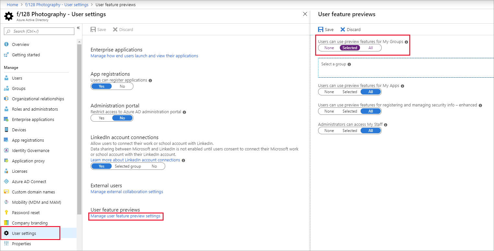
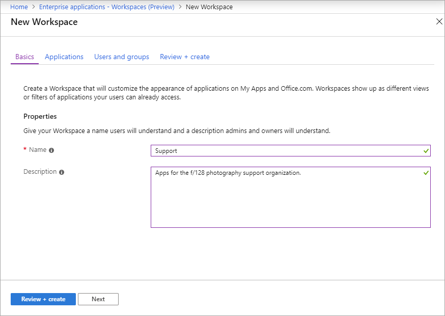
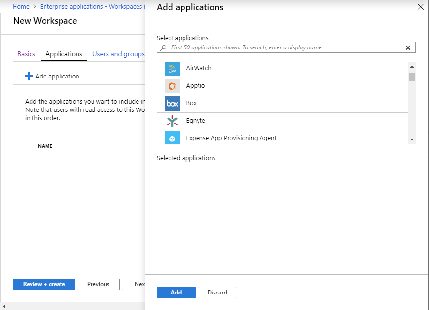
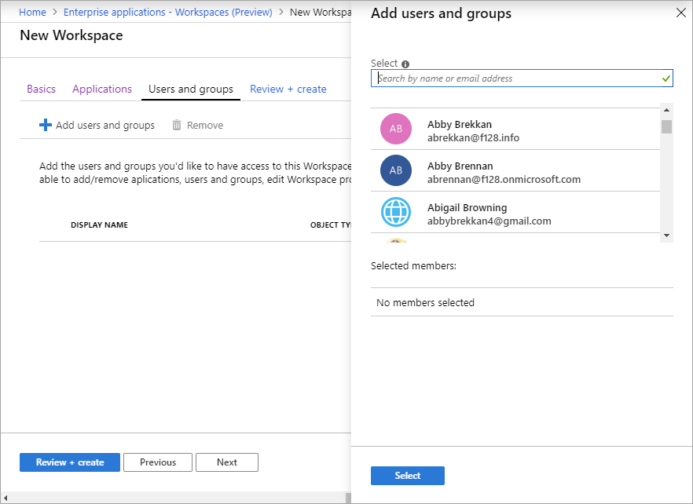
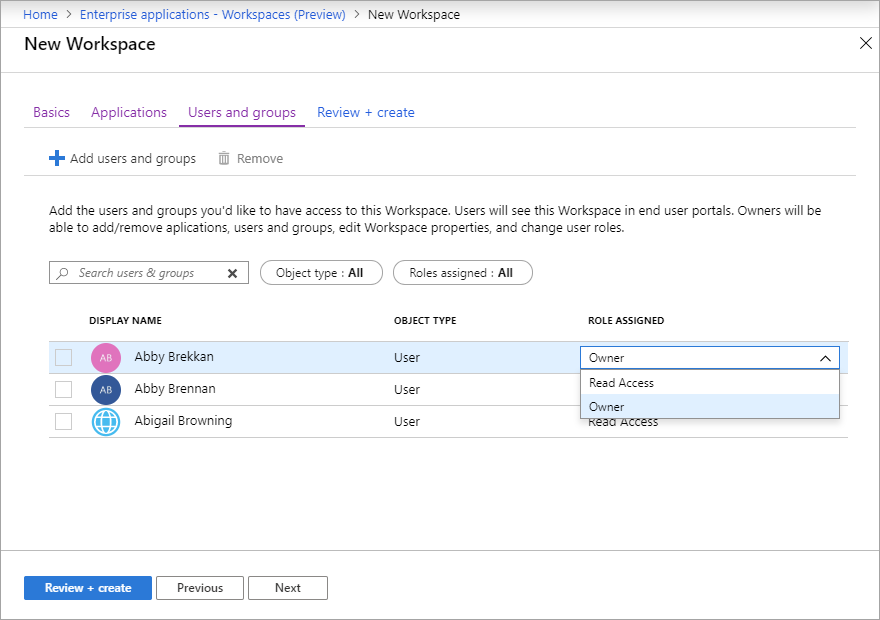

# Create workspaces on the My Apps (preview) portal

Your users can use the My Apps (preview) portal to view and start the cloud-based applications they have access to. By default, all the applications a user can access are listed together on a single page. To better organize this page for your users, if you have an Azure AD Premium P1 or P2 license you can set up workspaces. With a workspace, you can group together applications that are related (for example, by job role, task, or project) and display them on a separate tab. A workspace essentially applies a filter to the applications a user can already access, so the user sees only those applications in the workspace that have been assigned to them.

> [!NOTE]
> This article covers how an admin can enable and create workspaces. For information for the end user about how to use the My Apps portal and workspaces, see [Access and use workspaces](https://docs.microsoft.com/azure/active-directory/user-help/).

## Enable My Apps preview features

1. Open the [**Azure portal**](https://portal.azure.com/) and sign in as a user administrator or Global Administrator.

2. Go to **Azure Active Directory** > **User settings**.

3. Under **User feature previews**, select **Manage user feature preview settings**.

4. Under **Users can use preview features for My Apps**, choose one of the following options:
   * **Selected** - Enables preview features for a specific group. Use the **Select a group** option to select the group for which you want to enable preview features.  
   * **All** - Enables preview features for all users.

   

> [!NOTE]
> To open the My Apps portal, users can use the link `https://myapps.microsoft.com` or the customized link for your organization, such as `https://myapps.microsoft.com/contoso.com`. If users aren't redirected to the My Apps preview version, users should try `https://myapplications.microsoft.com` or `https://myapplications.microsoft.com/contoso.com`.

## Create a workspace

To create a workspace, you must have an Azure AD Premium P1 or P2 license.

1. Open the [**Azure portal**](https://portal.azure.com/) and sign in as an admin with an Azure AD Premium P1 or P2 license.

2. Go to **Azure Active Directory** > **Enterprise Applications**.

3. Under **Manage**, select **Workspaces (Preview)**.

4. Select **New workspace**. In the **New workspace** page, enter a **Name** for the workspace (we recommend not using "workspace" in the name. Then enter a **Description**.

   

5. Select **Review + Create**. The properties for the new workspace appear.

6. Select the **Applications** tab. Under **Add applications**, select all the applications you want to add to the workspace, or use the **Search** box to find applications. 

   

7. Select **Add**. The list of selected applications appears. You can use the up and down arrows to change the order of applications in the list.

   

8. Select the **Users and groups** tab. To add a user or group, select **Add user**. 

9. On the **Select members** page, select the users or groups you want to assign the workspace to. Or use the **Search** box to find users or groups.

   

10. When you're finished selecting users and groups, choose **Select**.

11. To change a user's role from **Read Access** to **Owner** or vice versa, click the current role and select a new role.

    

## View audit logs

The Audit logs record My Apps workspaces operations, including workspace creation end-user actions. The following events are generated from My Apps:

* Create workspace
* Edit workspace
* Delete workspace
* Launch an application (end user)
* Self-service application adding (end user)
* Self-service application deletion (end user)

You can access audit logs in the [Azure portal](https://portal.azure.com) by selecting **Azure Active Directory** > **Enterprise Applications** > **Audit logs** in the Activity section. For **Service**, select **My Apps**.

   

## Next steps
[End-user experiences for applications in Azure Active Directory](end-user-experiences.md)