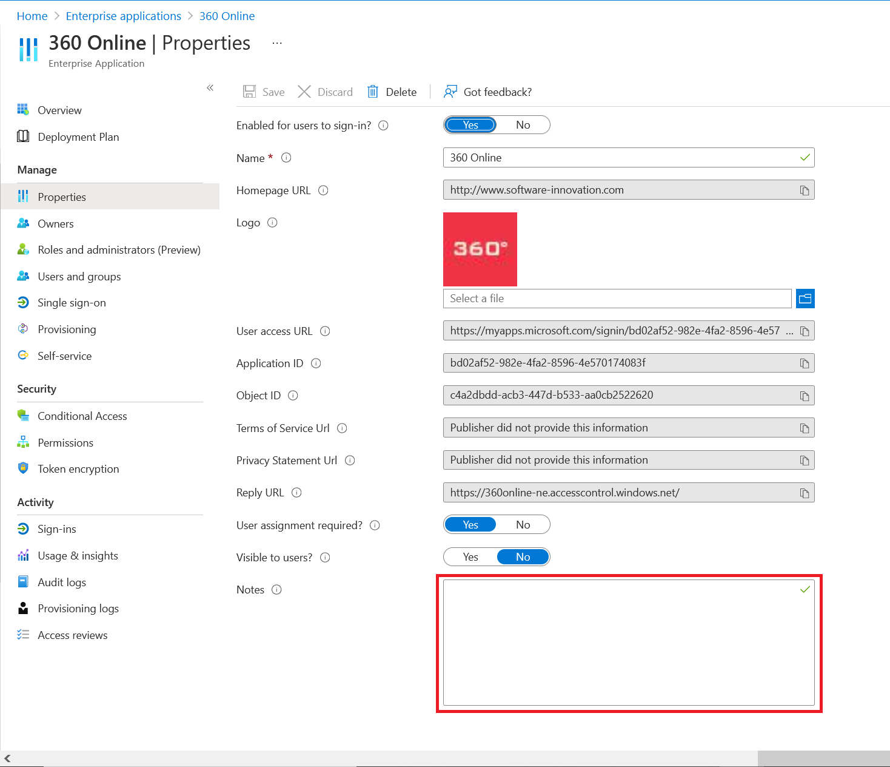

# Quickstart: Configure properties for an application in your Azure Active Directory (Azure AD) tenant

In the previous quickstart, you added an application to your Azure Active Directory (Azure AD) tenant. When you add an application, you're letting your Azure AD tenant know it's the identity provider for the app. Now you'll configure some of the properties for the app.
 
## Prerequisites

To configure the properties of an application in your Azure AD tenant, you need:

- An Azure account with an active subscription. [Create an account for free](https://azure.microsoft.com/free/?WT.mc_id=A261C142F).
- One of the following roles: Global Administrator, Cloud Application Administrator, Application Administrator, or owner of the service principal.
- Optional: Completion of [View your apps](view-applications-portal.md).
- Optional: Completion of [Add an app](add-application-portal.md).

>[!IMPORTANT]
>Use a non-production environment to test the steps in this quickstart.

## Configure app properties

When you finish adding an application to your Azure AD tenant, the overview page appears. If you're configuring an application that was already added, look at the first quickstart. It walks you through viewing the applications added to your tenant. 

To edit the application properties:

1. In the Azure AD portal, select **Enterprise applications**. Then find and select the application you want to configure.
2. In the **Manage** section, select **Properties** to open the **Properties** pane for editing.

    

3. Take a moment to understand the options available to configure:
    - **Enabled for users to sign in?** determines whether users assigned to the application can sign in.
    - **User assignment required?** determines whether users who aren't assigned to the application can sign in.
    - **Visible to users?** determines whether users assigned to an app can see it in [My Apps](https://myapps.microsoft.com) and Microsoft 365 app launcher. (See the waffle menu in the upper-left corner of a Microsoft 365 website.)
    
    > [!TIP]
    > Assigning users happens on the **Users and groups** section of navigation.

    The three options can be toggled independently of each other and the resulting behavior is not always obvious. Here is a table that might help:
    
    | Enabled for users to sign in? | User assignment required? | Visible to users? | Behavior for users who have either been assigned to the app or not. |
    |---|---|---|---|
    | Yes | Yes | Yes | Assigned users can see the app and sign in. Unassigned users cannot see the app and cannot sign in. |
    | Yes | Yes | No  | Assigned uses cannot see the app but they can sign in. Unassigned users cannot see the app and cannot sign in. |
    | Yes | No  | Yes | Assigned users can see the app and sign in. Unassigned users cannot see the app but can sign in. |
    | Yes | No  | No  | Assigned users cannot see the app but can sign in. Unassigned users cannot see the app but can sign in. |
    | No  | Yes | Yes | Assigned users cannot see the app and cannot sign in. Unassigned users cannot see the app and cannot sign in. |
    | No  | Yes | No  | Assigned users cannot see the app and cannot sign in. Unassigned users cannot see the app and cannot sign in. |
    | No  | No  | Yes | Assigned users cannot see the app and cannot sign in. Unassigned users cannot see the app and cannot sign in. |
    | No  | No  | No  | Assigned users cannot see the app and cannot sign in. Unassigned users cannot see the app and cannot sign in. |

4. When you're finished, select **Save**.

## Use a custom logo

To use a custom logo:

1. Create a logo that's 215 by 215 pixels, and save it in .png format.
2. In the Azure AD portal, select **Enterprise applications**. Then find and select the application you want to configure.
3. In the **Manage** section, select **Properties** to open the **Properties** pane for editing. 
4. Select the icon to upload the logo.
5. When you're finished, select **Save**.

    

   > [!NOTE]
   > The thumbnail displayed on this **Properties** pane doesn't update right away. You can close and reopen the **Properties** pane to see the updated icon.

> [!TIP]
> You can automate app management using the Graph API, see [Automate app management with Microsoft Graph API](https://docs.microsoft.com/graph/application-saml-sso-configure-api).

## Add notes

You can use the notes field to add any information that is relevant for the management of the application in Azure AD. Notes is a free text field with a maximum size of 1024 characters.

1. In the Azure AD portal, select **Enterprise applications**. Then find and select the application you want to configure.
2. In the **Manage** section, select **Properties** to open the **Properties** pane for editing.
3. Update the Notes field, select **Save**.

    

    
## Clean up resources

If you're not going to continue with the quickstart series, then consider deleting the app to clean up your test tenant. Deleting the app is covered in the last quickstart in this series, see [Delete an app](delete-application-portal.md).

## Next steps

Advance to the next article to learn how to assign users to the app.
> [!div class="nextstepaction"]
> [Assign users to an app](add-application-portal-assign-users.md)
