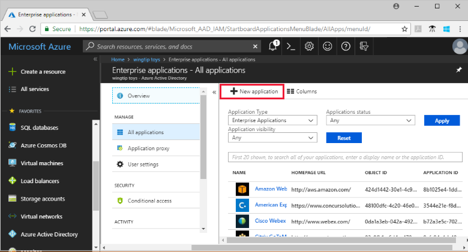
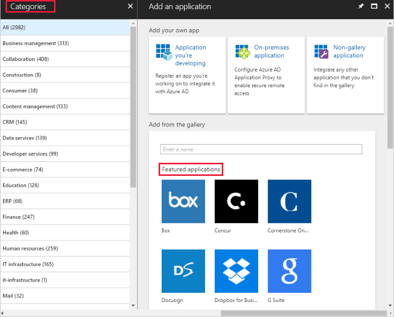
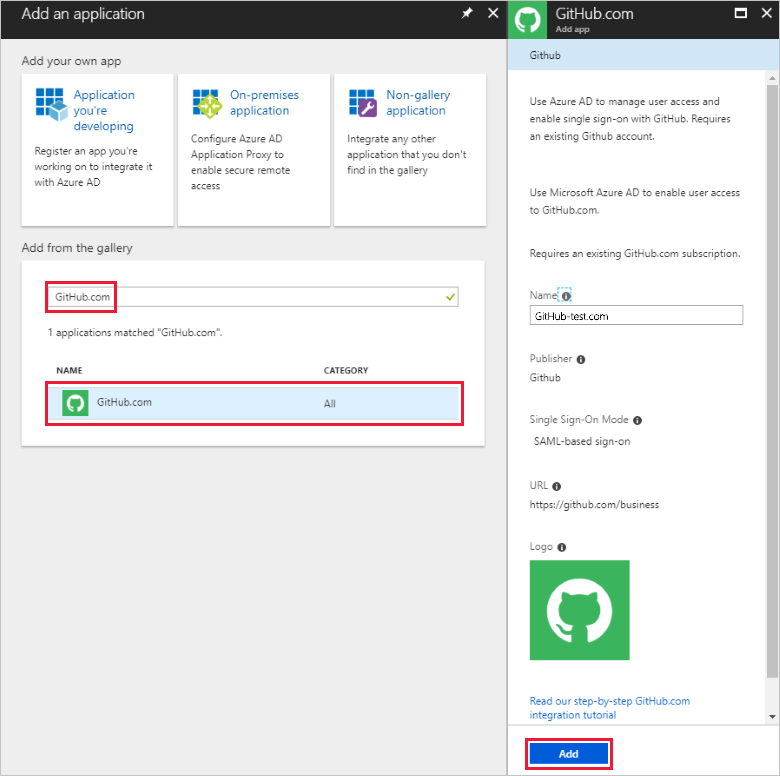
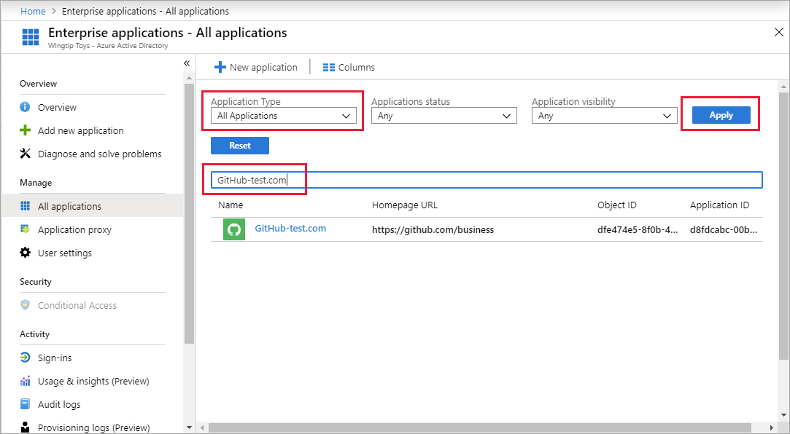
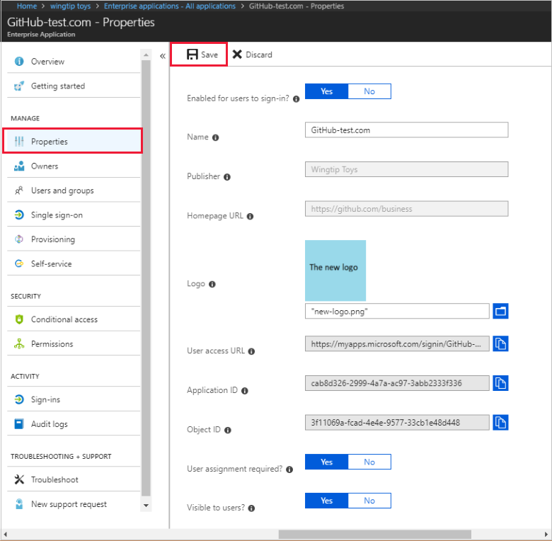
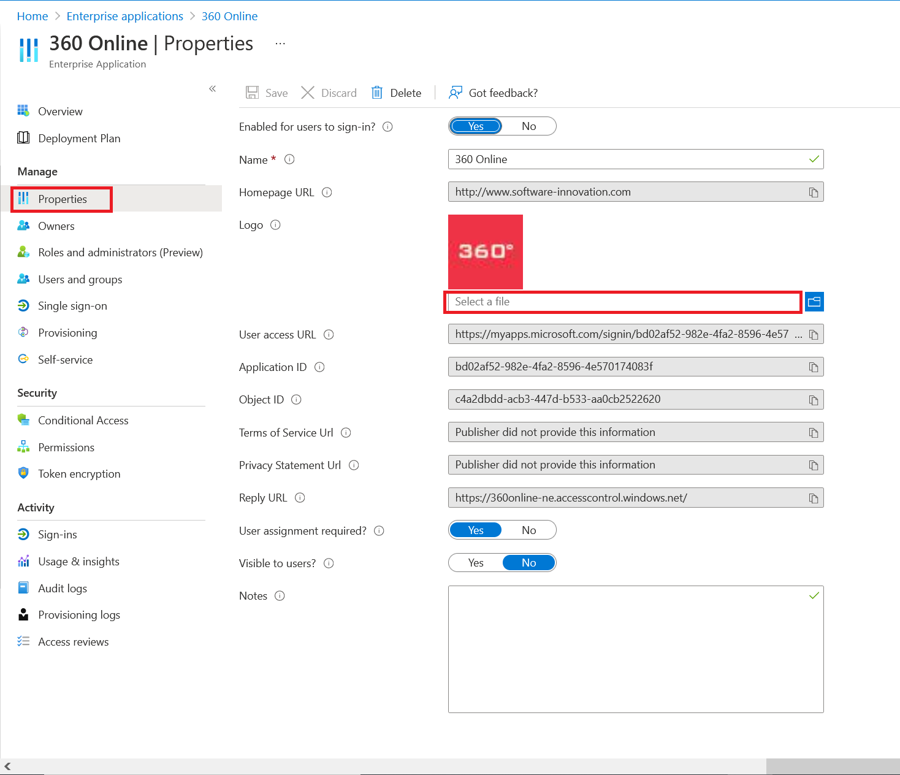

# Quickstart: Add an application to your Azure Active Directory tenant

Azure Active Directory (Azure AD) has a gallery that contains thousands of pre-integrated applications. Some of the applications your organization uses are probably in the gallery. This quickstart uses the Azure portal to add a gallery application to your Azure Active Directory (Azure AD) tenant.

After an application is added to your Azure AD tenant, you can:

- Manage user access to the application with a Conditional Access policy.
- Configure users to single sign-on to the application with their Azure AD accounts.

## Before you begin

To add an application to your tenant, you need:

- An Azure AD subscription
- A single sign-on enabled subscription for your application

Sign in to the [Azure portal](https://portal.azure.com) as a global admin for your Azure AD tenant, a cloud application admin, or an application admin.

To test the steps in this tutorial, we recommend using a non-production environment. If you don't have an Azure AD non-production environment, you can [get a one-month trial](https://azure.microsoft.com/pricing/free-trial/).

## Add an application to your Azure AD tenant

To add a gallery application to your Azure AD tenant:

1. In the [Azure portal](https://portal.azure.com), on the left navigation panel, select **Azure Active Directory**.
1. In the **Azure Active Directory** pane, select **Enterprise applications**.
1. The **All applications** pane opens to show a random sample of the applications in your Azure AD tenant. Select **New application** at the top of the **All applications** pane to add a gallery app to your tenant.

    

1. In the **Categories** pane, you'll see icons under the **Featured applications** area that are a random sample of gallery applications. To see more applications, you could select **Show more** but we don't recommend searching this way because there are thousands of applications in the gallery.

    

1. To search for an application, under **Add from the gallery**, enter the name of the application you want to add. Select the application from the results and select **Add**. The following example shows the **Add app** form that appears after searching for github.com.

    

1. In the application-specific form, you can change property information. For example, you can edit the name of the application to match the needs of your organization. This example uses the name **GitHub-test**.
1. When you've finished making changes to the properties, select **Add**.
1. A getting started page appears with the options for configuring the application for your organization.

You've finished adding your application. Feel free to take a break. The next sections show you how to change the logo and edit other properties for your application.

## Find your Azure AD tenant application

Let's assume you had to leave and now you're returning to continue configuring your application. The first thing to do is find your application.

1. In the **[Azure portal](https://portal.azure.com)**, on the left navigation panel, select **Azure Active Directory**.
1. In the **Azure Active Directory** pane, select **Enterprise applications**.
1. From the **Application Type** drop-down menu, select **All Applications**, and then select **Apply**. To learn more about the viewing options, see [View tenant applications](view-applications-portal.md).
1. You can now see a list of all the applications in your Azure AD tenant. The list is a random sample. To see more applications, select **Show more** one or more times.
1. To quickly find an application in your tenant, enter the application name in the search box and select **Apply**. This example finds the GitHub-test application added previously.

    

## Configure user sign-in properties

Now that you've found the application, you can open it and configure application properties.

To edit the application properties:

1. Select the application to open it.
1. Select **Properties** to open the properties pane for editing.

    

1. Take a moment to understand the sign-in options. The options determine how users who are assigned or unassigned to the application can sign into the application. And, the options also determine if a user can see the application in the access panel.

    - **Enabled for users to sign-in** determines whether users assigned to the application can sign in.
    - **User assignment required** determines whether users who aren't assigned to the application can sign in.
    - **Visible to user** determines whether users assigned to an app can see it in the access panel and O365 launcher.

1. Use the following tables to help you choose the best options for your needs.

   - Behavior for **assigned** users:

       | Application property settings | | | Assigned-user experience | |
       |---|---|---|---|---|
       | Enabled for users to sign-in? | User assignment required? | Visible to users? | Can assigned users sign in? | Can assigned users see the application?* |
       | yes | yes | yes | yes | yes  |
       | yes | yes | no  | yes | no   |
       | yes | no  | yes | yes | yes  |
       | yes | no  | no  | yes | no   |
       | no  | yes | yes | no  | no   |
       | no  | yes | no  | no  | no   |
       | no  | no  | yes | no  | no   |
       | no  | no  | no  | no  | no   |

   - Behavior for **unassigned** users:

       | Application property settings | | | Unassigned-user experience | |
       |---|---|---|---|---|
       | Enabled for users to sign in? | User assignment required? | Visible to users? | Can unassigned users sign in? | Can unassigned users see the application?* |
       | yes | yes | yes | no  | no   |
       | yes | yes | no  | no  | no   |
       | yes | no  | yes | yes | no   |
       | yes | no  | no  | yes | no   |
       | no  | yes | yes | no  | no   |
       | no  | yes | no  | no  | no   |
       | no  | no  | yes | no  | no   |
       | no  | no  | no  | no  | no   |

     *Can the user see the application in the access panel and the Office 365 app launcher?

## Use a custom logo

To use a custom logo:

1. Create a logo that is 215 by 215 pixels, and save it in PNG format.
1. Since you've already found your application, select the application.
1. In the left pane, select **Properties**.
1. Upload the logo.
1. When you're finished, select **Save**.

    

## Next steps

In this quickstart, you've learned how to add a gallery application to your Azure AD tenant. You learned how to edit the properties for an application.

Now, you're ready to configure the application for single sign-on.

> [!div class="nextstepaction"]
> [Configure single sign-on](configure-single-sign-on-portal.md)
