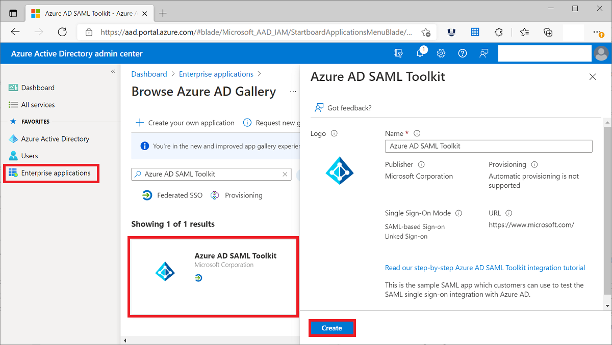

# Quickstart: Add an application to your Azure Active Directory (Azure AD) tenant

Azure Active Directory (Azure AD) has a gallery that contains thousands of pre-integrated applications. Many of the applications your organization uses are probably already in the gallery.

After an application is added to your Azure AD tenant, you can:

- Configure properties for the app.
- Manage user access to the app with a Conditional Access policy.
- Configure single sign-on so users can sign in to the app with their Azure AD credentials.

## Prerequisites

To add an application to your Azure AD tenant, you need:

- An Azure account with an active subscription. [Create an account for free](https://azure.microsoft.com/free/?WT.mc_id=A261C142F).
- One of the following roles: Global Administrator, Cloud Application Administrator, Application Administrator, or owner of the service principal.
- (Optional: Completion of [View your apps](view-applications-portal.md)).

>[!IMPORTANT]
>We recommend using a non-production environment to test the steps in this quickstart.

## Add an app to your Azure AD tenant

To add an application to your Azure AD tenant:

1. In the [Azure portal](https://portal.azure.com), on the left navigation panel, select **Azure Active Directory**.
2. In the **Azure Active Directory** pane, select **Enterprise applications**. The **All applications** pane opens and displays a random sample of the applications in your Azure AD tenant.
3. In the **Enterprise applications** pane, select **New application**. 
    
4. Switch to the new gallery preview experience: In the banner at the top of the **Add an application page**, select the link that says **Click here to try out the new and improved app gallery**.
5. The **Browse Azure AD Gallery (Preview)** pane opens and displays tiles for cloud platforms, on-premises applications, and featured applications. Applications listed in the **Featured applications** section have icons indicating whether they support federated single sign-on (SSO) and provisioning. 
    
6. You can browse the gallery for the application you want to add, or search for the application by entering its name in the search box. Then select the application from the results. 
7. The next step depends on the way the developer of the application implemented single sign-on (SSO). Single sign-on can be implemented by app developers in four ways. The four ways are SAML, OpenID Connect, Password, and Linked. When you add an app, you can choose to filter and see only apps using a particular SSO implementation as shown in the screenshot. For example, a popular standard to implement SSO is called Security Assertion Markup Language (SAML). Another standard that is popular is called OpenId Connect (OIDC). The way you configure SSO with these standards is different so take note of the type of SSO that is implemented by the app that you are adding.

    :::image type="content" source="media/add-application-portal/sso-types.png" alt-text="Screenshot shows the SSO types selector." lightbox="media/add-application-portal/sso-types.png":::

    - If the developer of the app used the **OIDC standard** for SSO then select **Sign Up**. A setup page appears. Next, go to the quickstart on setting up OIDC-based single sign-on.
    :::image type="content" source="media/add-application-portal/sign-up-oidc-sso.png" alt-text="Screenshot shows adding an OIDC-based SSO app.":::

    - If the developer of the app used the **SAML standard** for SSO then select **Create**. A getting started page appears with the options for configuring the application for your organization. In the form, you can edit the name of the application to match the needs of your organization. Next, go to the quickstart on setting up SAML-based single sign-on.
    :::image type="content" source="media/add-application-portal/create-application.png" alt-text="Screenshot shows adding an SAML-based SSO app.":::

> [!IMPORTANT]
> There are some key differences between SAML-based and OIDC-based SSO implementations. With SAML-based apps you can add multiple instances of the same app. For example, GitHub1, GitHub2, etc.. For OIDC-based apps you can only add one instance of an app. If you have already added an OIDC-based app and try to add the same app again and provide consent twice, it will not be added again in the tenant.

If the application you are looking for is not in the gallery then you can select the link **Create your own application** and then under **What are you looking to do with your application?** choose **Integrate any other application you don't find in the gallery**. Microsoft has already worked with many application developers to pre-configure them to work with Azure AD. The pre-configured apps show up in the gallery. But if the app you want to add is not listed then you can create a new, generic, app and then configure it yourself or with the guidance of the developer that created it.

You've finished adding an application. The next quickstart shows you how to change the logo and edit other properties for your application.

> [!TIP]
> You can automate app management using the Graph API, see [Automate app management with Microsoft Graph API](https://docs.microsoft.com/graph/application-saml-sso-configure-api).

## Clean up resources

If you're not going to continue with the quickstart series, then consider deleting the app to clean up your test tenant. Deleting the app is covered in the last quickstart in this series, see [Delete an app](delete-application-portal.md).

## Next steps

Advance to the next article to learn how to configure an app.
> [!div class="nextstepaction"]
> [Configure an app](add-application-portal-configure.md)
