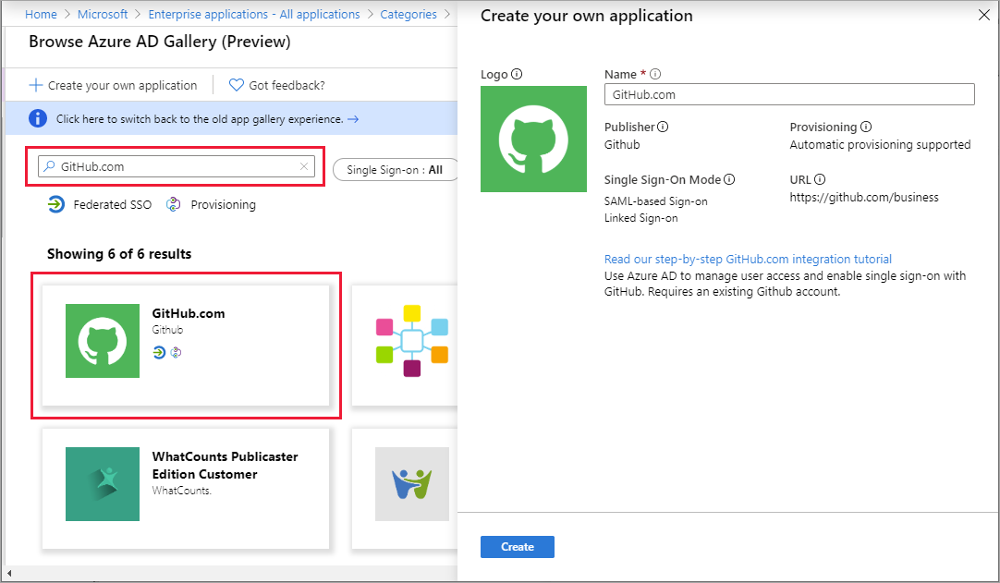

# Quickstart: Add an application to your Azure Active Directory (Azure AD) tenant

Azure Active Directory (Azure AD) has a gallery that contains thousands of pre-integrated applications. Many of the applications your organization uses are probably already in the gallery.

After an application is added to your Azure AD tenant, you can:

- Configure properties for the app.
- Manage user access to the app with a Conditional Access policy.
- Configure single sign-on so users can sign in to the app with their Azure AD credentials.

## Prerequisites

To add an application to your Azure AD tenant, you need:

- An Azure account with an active subscription. [Create an account for free](https://azure.microsoft.com/free/?WT.mc_id=A261C142F).
- One of the following roles: Global Administrator, Cloud Application Administrator, Application Administrator, or owner of the service principal.
- (Optional: Completion of [View your apps](view-applications-portal.md)).

>[!IMPORTANT]
>We recommend using a non-production environment to test the steps in this quickstart.

## Add an app to your Azure AD tenant

To add an application to your Azure AD tenant:

1. In the [Azure portal](https://portal.azure.com), on the left navigation panel, select **Azure Active Directory**.
2. In the **Azure Active Directory** pane, select **Enterprise applications**. The **All applications** pane opens and displays a random sample of the applications in your Azure AD tenant.
3. In the **Enterprise applications** pane, select **New application**. 
    
4. Switch to the new gallery preview experience: In the banner at the top of the **Add an application page**, select the link that says **Click here to try out the new and improved app gallery**.
5. The **Browse Azure AD Gallery (Preview)** pane opens and displays tiles for cloud platforms, on-premises applications, and featured applications. Applications listed in the **Featured applications** section have icons indicating whether they support federated single sign-on (SSO) and provisioning.
    
6. You can browse the gallery for the application you want to add, or search for the application by entering its name in the search box. Then select the application from the results. In the form, you can edit the name of the application to match the needs of your organization. In this example, we've selected GitHub and changed the name to **GitHub-test**.
    
    >[!TIP]
    >If the application you are looking for is not in the gallery then you can click the link **Create your own application** and then under **What are you looking to do with your application?** choose **Integrate any other application you don't find in the gallery**. Microsoft has already worked with many application developers to pre-configure them to work with Azure AD. These are the apps that show up in the gallery. But if the app you want to add is not listed then you can create a new, generic, app and then configure it yourself or with the guidance of the developer that created it.
7. Select **Create**. A getting started page appears with the options for configuring the application for your organization.

You've finished adding an application. The next quickstart shows you how to change the logo and edit other properties for your application.

> [!TIP]
> You can automate app management using the Graph API, see [Automate app management with Microsoft Graph API](https://docs.microsoft.com/graph/application-saml-sso-configure-api).

## Clean up resources

If you're not going to continue with the quickstart series then consider deleting the app to clean up your test tenant. Deleting the app is covered in the last quickstart in this series, see [Delete an app](delete-application-portal.md).

## Next steps

Advance to the next article to learn how to configure an app.
> [!div class="nextstepaction"]
> [Configure an app](add-application-portal-configure.md)
