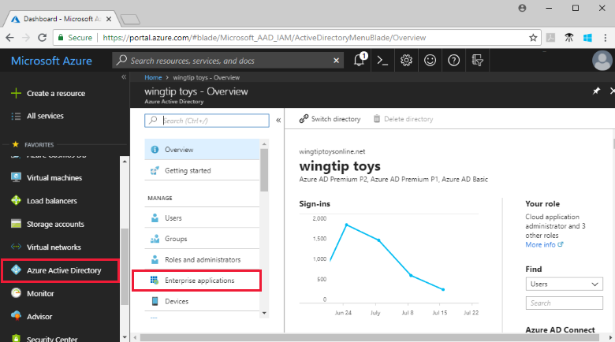

# Add a gallery app to your Azure AD organization

Azure Active Directory (Azure AD) has a gallery that contains thousands of pre-integrated applications that are enabled with Enterprise single sign-on. This article describes the general steps for adding an app from the gallery to your Azure AD organization.

> [!IMPORTANT]
> First, check for your app in the [List of tutorials on how to integrate SaaS apps with Azure Active Directory](https://azure.microsoft.com/documentation/articles/active-directory-saas-tutorial-list/). You'll likely find step-by-step guidance for adding and configuring the gallery app you want to add.

## Add a gallery application

1. Sign in to the [Azure portal](https://portal.azure.com) as a global admin for your Azure AD tenant, a cloud application admin, or an application admin.

1. In the [Azure portal](https://portal.azure.com), on the left navigation panel, select **Azure Active Directory**.

1. In the **Azure Active Directory** pane, select **Enterprise applications**.

    

1. Select **New application**.

    

1. Under **Add from the gallery**, in the search box, enter the name of the application you want to add. 

    

1. Select the application from the results.

1. (Optional) In the application-specific form, you can edit the name of the application to match the needs of your organization.

1. Select **Add**. The application **Overview** page opens.

## Configure user sign-in properties

1. Select **Properties** to open the properties pane for editing.

    

1. Set the following options to determine how users who are assigned or unassigned to the application can sign into the application and if a user can see the application in the access panel.

    - **Enabled for users to sign-in** determines whether users assigned to the application can sign in.
    - **User assignment required** determines whether users who aren't assigned to the application can sign in.
    - **Visible to user** determines whether users assigned to an app can see it in the access panel and O365 launcher.

      Behavior for **assigned** users:

       | Application property settings | | | Assigned-user experience | |
       |---|---|---|---|---|
       | Enabled for users to sign-in? | User assignment required? | Visible to users? | Can assigned users sign in? | Can assigned users see the application?* |
       | yes | yes | yes | yes | yes  |
       | yes | yes | no  | yes | no   |
       | yes | no  | yes | yes | yes  |
       | yes | no  | no  | yes | no   |
       | no  | yes | yes | no  | no   |
       | no  | yes | no  | no  | no   |
       | no  | no  | yes | no  | no   |
       | no  | no  | no  | no  | no   |

      Behavior for **unassigned** users:

       | Application property settings | | | Unassigned-user experience | |
       |---|---|---|---|---|
       | Enabled for users to sign in? | User assignment required? | Visible to users? | Can unassigned users sign in? | Can unassigned users see the application?* |
       | yes | yes | yes | no  | no   |
       | yes | yes | no  | no  | no   |
       | yes | no  | yes | yes | no   |
       | yes | no  | no  | yes | no   |
       | no  | yes | yes | no  | no   |
       | no  | yes | no  | no  | no   |
       | no  | no  | yes | no  | no   |
       | no  | no  | no  | no  | no   |

     *Can the user see the application in the access panel and the Office 365 app launcher?

1. To use a custom logo, create a logo that is 215 by 215 pixels, and save it in PNG format. Then browse to your logo and upload it.

    

1. When you're finished, select **Save**.

## Next steps

Now that you've added the application to your Azure AD organization, [choose a single sign-on method](what-is-single-sign-on.md#choosing-a-single-sign-on-method) you want to use and refer to the appropriate article below:

- [Configure SAML-based single sign-on](configure-single-sign-on-non-gallery-applications.md)
- [Configure password single sign-on](configure-password-single-sign-on-non-gallery-applications.md)
- [Configure linked sign-on](configure-linked-sign-on.md)

