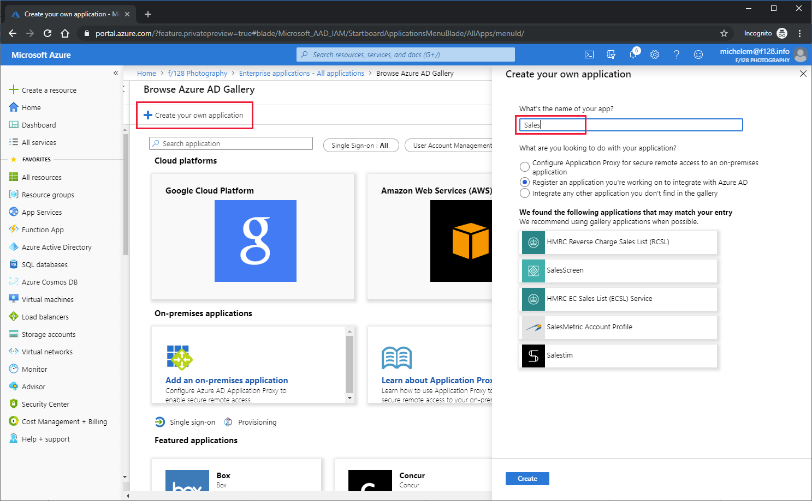
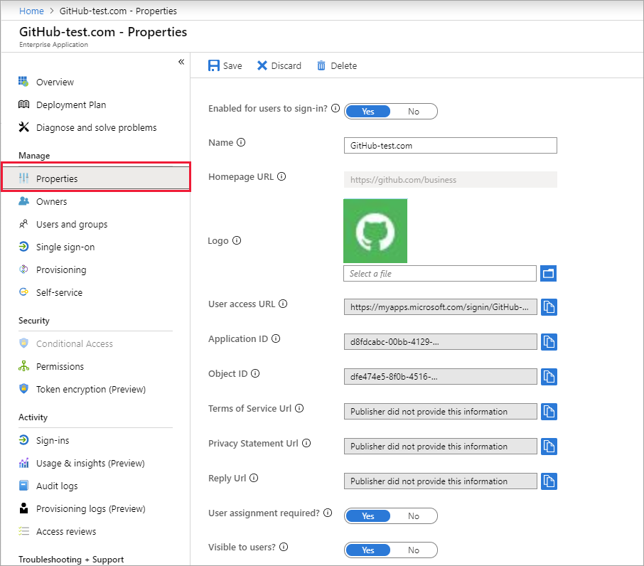

# Add an unlisted (non-gallery) application to your Azure AD organization

In addition to the choices in the [Azure AD application gallery](https://azure.microsoft.com/documentation/articles/active-directory-saas-tutorial-list/), you have the option to add a **non-gallery application**. You can add any application that already exists in your organization, or any third-party application  from a vendor who is not already part of the Azure AD gallery. Depending on your [license agreement](https://azure.microsoft.com/pricing/details/active-directory/), the following capabilities are available:

- Self-service integration of any application that supports [Security Assertion Markup Language (SAML) 2.0](https://wikipedia.org/wiki/SAML_2.0) identity providers (SP-initiated or IdP-initiated)
- Self-service integration of any web application that has an HTML-based sign-in page using [password-based SSO](what-is-single-sign-on.md#password-based-sso)
- Self-service connection of applications that use the [System for Cross-Domain Identity Management (SCIM) protocol for user provisioning](../app-provisioning/use-scim-to-provision-users-and-groups.md)
- Ability to add links to any application in the [Office 365 app launcher](https://www.microsoft.com/microsoft-365/blog/2014/10/16/organize-office-365-new-app-launcher-2/) or the [Azure AD access panel](what-is-single-sign-on.md#linked-sign-on)

This article describes how to add a non-gallery application to **Enterprise Applications** in the Azure portal without writing code. If instead you're looking for developer guidance on how to integrate custom apps with Azure AD, see [Authentication Scenarios for Azure AD](../develop/authentication-scenarios.md). When you develop an app that uses a modern protocol like [OpenId Connect/OAuth](../develop/active-directory-v2-protocols.md) to authenticate users, you can register it with the Microsoft identity platform by using the [App registrations](../develop/quickstart-register-app.md) experience in the Azure portal.

## Add a non-gallery application

1. Sign in to the [Azure Active Directory portal](https://aad.portal.azure.com/) using your Microsoft identity platform administrator account.

2. Select **Enterprise Applications** > **New application**.

3. (Optional but recommended) In the **Browse Azure AD Gallery** search box, enter the display name of the application. 

4. Select **Create your own application**. The **Create your own application** page appears.

   

5. Start typing the display name for your new application. If there are any gallery applications with similar names, they'll appear in a search results list.

   > [!NOTE]
   > We recommend using the gallery version of your application whenever possible. If the application you want to add appears in the search results, select the application and skip the rest of this procedure.

6. Under **What are you looking to do with your application?** choose **Integrate any other application you don't find in the gallery**. This option is typically used for SAML and WS-Fed applications.

   > [!NOTE]
   > The other two options are used in the following scenarios:
   >* **Configure Application Proxy for secure remote access to an on-premises application** opens the configuration page for Azure AD Application Proxy and connectors.
   >* **Register an application you're working on to integrate with Azure AD** opens the **App registrations** page. This option is typically used for OpenID Connect applications.

7. Select **Create**. The application **Overview** page opens.

## Configure user sign-in properties

1. Select **Properties** to open the properties pane for editing.

    

2. Set the following options to determine how users who are assigned or unassigned to the application can sign into the application and if a user can see the application in the access panel.

    - **Enabled for users to sign-in** determines whether users assigned to the application can sign in.
    - **User assignment required** determines whether users who aren't assigned to the application can sign in.
    - **Visible to user** determines whether users assigned to an app can see it in the access panel and O365 launcher.

      Behavior for **assigned** users:

       | Application property | Application property | Application property | Assigned-user experience | Assigned-user experience |
       |---|---|---|---|---|
       | Enabled for users to sign-in? | User assignment required? | Visible to users? | Can assigned users sign in? | Can assigned users see the application?* |
       | yes | yes | yes | yes | yes  |
       | yes | yes | no  | yes | no   |
       | yes | no  | yes | yes | yes  |
       | yes | no  | no  | yes | no   |
       | no  | yes | yes | no  | no   |
       | no  | yes | no  | no  | no   |
       | no  | no  | yes | no  | no   |
       | no  | no  | no  | no  | no   |

      Behavior for **unassigned** users:

       | Application property | Application property | Application property | Unassigned-user experience | Unassigned-user experience |
       |---|---|---|---|---|
       | Enabled for users to sign in? | User assignment required? | Visible to users? | Can unassigned users sign in? | Can unassigned users see the application?* |
       | yes | yes | yes | no  | no   |
       | yes | yes | no  | no  | no   |
       | yes | no  | yes | yes | no   |
       | yes | no  | no  | yes | no   |
       | no  | yes | yes | no  | no   |
       | no  | yes | no  | no  | no   |
       | no  | no  | yes | no  | no   |
       | no  | no  | no  | no  | no   |

     *Can the user see the application in the access panel and the Office 365 app launcher?

3. To use a custom logo, create a logo that is 215 by 215 pixels, and save it in PNG format. Then browse to your logo and upload it.

    

4. When you're finished, select **Save**.

## Next steps

Now that you've added the application to your Azure AD organization, [choose a single sign-on method](what-is-single-sign-on.md#choosing-a-single-sign-on-method) you want to use and refer to the appropriate article below:

- [Configure SAML-based single sign-on](configure-single-sign-on-non-gallery-applications.md)
- [Configure password single sign-on](configure-password-single-sign-on-non-gallery-applications.md)
- [Configure linked sign-on](configure-linked-sign-on.md)
