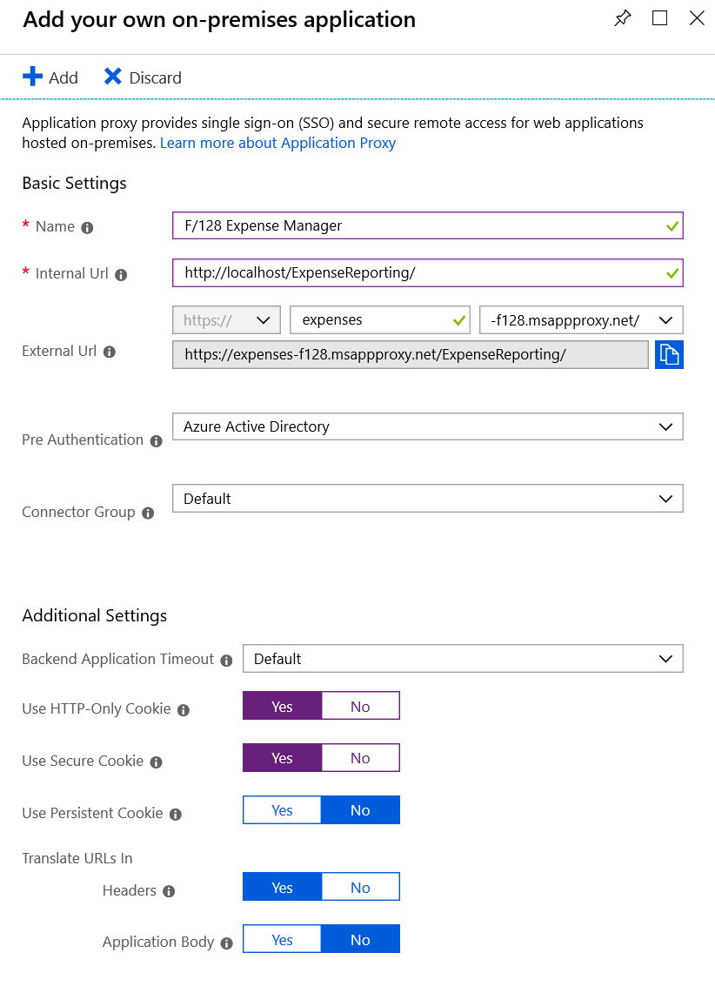

# Tutorial: Add an on-premises application for remote access through Application Proxy in Azure Active Directory

Azure Active Directory (Azure AD) has an Application Proxy service that enables users to access on-premises applications by signing in with their Azure AD account. This tutorial prepares your environment for use with Application Proxy. Once your environment is ready, you'll use the Azure portal to add an on-premises application to your Azure AD tenant.

This tutorial:

> [!div class="checklist"]
> * Opens ports for outbound traffic and allows access to specific URLs.
> * Installs the connector on your Windows server, and registers it with Application Proxy.
> * Verifies the connector installed and registered correctly.
> * Adds an on-premises application to your Azure AD tenant.
> * Verifies a test user can sign on to the application by using an Azure AD account.

## Before you begin

To add an application to your tenant, you need:

* A [Microsoft Azure AD basic or premium subscription](https://azure.microsoft.com/pricing/details/active-directory). 
* An application administrator account.

### Windows server

To use Application Proxy, you need a Windows server running Windows Server 2012 R2 or later. You'll install the Application Proxy connector on the server. This connector server needs to connect to the Application Proxy services in Azure, and the on-premises applications that you plan to publish.

For high availability in your production environment, we recommend having more than one Windows server. For this tutorial, one Windows server is sufficient.

#### Recommendations for the connector server

1. Physically locate the connector server close to the application servers to optimize performance between the connector and the application. For more information, see [Network topology considerations](application-proxy-network-topology.md).

2. The connector server and the web applications servers should belong to the same Active Directory domain or span trusting domains. Having the servers in the same domain or trusting domains is a requirement for using single sign-on (SSO) with Integrated Windows Authentication (IWA) and Kerberos Constrained Delegation (KCD). If the connector server and web application servers are in different Active Directory domains, you need to use resource-based delegation for single sign-on. For more information, see [KCD for single sign-on with Application Proxy](application-proxy-configure-single-sign-on-with-kcd.md).

#### Software requirements

The Windows connector server needs to have TLS 1.2 enabled before you install the Application Proxy connector. Existing connectors with versions below 1.5.612.0 will continue to work on prior versions of TLS until further notice. 

To enable TLS 1.2:

1. Set the following registry keys:
	
    ```
    [HKEY_LOCAL_MACHINE\SYSTEM\CurrentControlSet\Control\SecurityProviders\SCHANNEL\Protocols\TLS 1.2]
    [HKEY_LOCAL_MACHINE\SYSTEM\CurrentControlSet\Control\SecurityProviders\SCHANNEL\Protocols\TLS 1.2\Client] "DisabledByDefault"=dword:00000000 "Enabled"=dword:00000001
    [HKEY_LOCAL_MACHINE\SYSTEM\CurrentControlSet\Control\SecurityProviders\SCHANNEL\Protocols\TLS 1.2\Server] "DisabledByDefault"=dword:00000000 "Enabled"=dword:00000001
    [HKEY_LOCAL_MACHINE\SOFTWARE\Microsoft\.NETFramework\v4.0.30319] "SchUseStrongCrypto"=dword:00000001
    ```

2. Restart the server

## Prepare your on-premises environment

To prepare your environment for Azure AD Application Proxy, you first need to enable communication to Azure data centers. If there's a firewall in the path, make sure it's open so the connector can make HTTPS (TCP) requests to the Application Proxy.

### Open ports

Open the following ports to **outbound** traffic. 

   | Port number | How it's used |
   | --- | --- |
   | 80 | Downloading certificate revocation lists (CRLs) while validating the SSL certificate |
   | 443 | All outbound communication with the Application Proxy service |

If your firewall enforces traffic according to originating users, also open ports 80 and 443 for traffic from Windows services that run as a Network Service.

If you're already using Application Proxy, you might have an older version of the connector installed.  Follow this tutorial to install the latest version of the connector. Versions earlier than 1.5.132.0 also require the following open ports: 5671, 8080, 9090-9091, 9350, 9352, 10100–10120. 

### Allow access to URLs

Allow access to the following URLs:

| URL | How it's used |
| --- | --- |
| \*.msappproxy.net<br>\*.servicebus.windows.net | Communication between the connector and the Application Proxy cloud service |
| mscrl.microsoft.com:80<br>crl.microsoft.com:80<br>ocsp.msocsp.com:80<br>www.microsoft.com:80 | Azure uses these URLs to verify certificates |
| login.windows.net<br>login.microsoftonline.com<br>secure.aadcdn.microsoftonline-p.com  | The connector uses these URLs during the registration process. |

If your firewall or proxy allows DNS whitelisting, you can whitelist connections to \*.msappproxy.net and \*.servicebus.windows.net. If not, you need to allow access to the [Azure DataCenter IP ranges](https://www.microsoft.com/download/details.aspx?id=41653). The IP ranges are updated each week.

## Install and register a connector

To use Application Proxy, you need to install a connector on each Windows server you choose to use with the Application Proxy service. The connector is an agent that manages the outbound connection from the on-premises application servers to Application Proxy in Azure AD. You can install a connector on servers that also have other authentication agents installed such as Azure AD Connect.

To install the connector:

1. Sign in to the [Azure portal](https://portal.azure.com/) as an application administrator of the directory that uses Application Proxy. For example, if the tenant domain is contoso.com, the admin should be admin@contoso.com or any other admin alias on that domain.
2. Your current directory appears under your username in the upper right corner. Verify you're signed in to directory that uses Application Proxy. If you need to change directories, select that icon.
3. In left blade click **Azure Active Directory**, and then **Application proxy**.
4. Click **Download connector service**.
5. Read the Terms of Service.  When you're ready, click **Accept terms & Download**.
6. At the bottom of the window, you'll see a prompt to download **AADApplicationProxyConnectorInstaller.exe**. Click **Run** to install the connector. An install wizard opens. 
7. Follow the instructions in the wizard to install. When you're prompted to register the connector with the Application Proxy for your Azure AD tenant, provide your application administrator credentials.
    - For Internet Explorer (IE), if **IE Enhanced Security Configuration** is set to **On**, you may not see the registration screen. To get access, follow the instructions in the error message. Make sure that Internet Explorer Enhanced Security is set to **Off**.

### General remarks

If you've previously installed a connector, reinstall to get the latest version. To see information about previously released versions and what changes they include, see [Application Proxy- Version Release History](application-proxy-release-version-history.md).

If you choose to have more than one Windows server for your on-premises applications, you'll need to install and register the connector on each server. You can organize the connectors into connector groups. For more information, see [Connector groups](application-proxy-connector-groups.md). 

If your organization uses proxy servers to connect to the internet, you need to configure them for Application Proxy.  For more information, see [Work with existing on-premises proxy servers](application-proxy-configure-connectors-with-proxy-servers.md). 

For information about connectors, capacity planning, and how they stay up-to-date, see [Understand Azure AD Application Proxy connectors](application-proxy-connectors.md). 


## Verify the connector installed and registered correctly

You can use the Azure portal or your Windows server to confirm that a new connector installed correctly.

### Verify - Azure portal

To confirm the connector installed and registered correctly:

1. Sign in to your tenant directory in the [Azure portal](https://portal.azure.com).
2. Click **Azure Active Directory** and then **Application Proxy**. All of your connectors and connector groups appear on this page. 
3. Select a connector to verify its details. An active green label indicates that your connector can connect to the service. However, even though the label is green, a network issue could still block the connector from receiving messages. 

    

For more help with installing a connector, see [Problems installing an Application Proxy Connector](application-proxy-connector-installation-problem.md).

### Verify - Windows server

To confirm the connector installed and registered correctly:

1. Open the Windows Services Manager by clicking the **Windows** key and entering *services.msc*.
2. Check to see if the status for the following two services is **Running**.
   - **Microsoft AAD Application Proxy Connector** enables connectivity
   - **Microsoft AAD Application Proxy Connector Updater** is an automated update service. The updater checks for new versions of the connector and updates the connector as needed.

     

3. If the status for the services isn't **running**, right-click each service and choose **start**. 

## Add an on-premises app to Azure AD

Now that you've prepared your environment and installed a connector, you're ready to add on-premises applications to Azure AD.  

1. Sign in as an administrator in the [Azure portal](https://portal.azure.com/).
2. Select **Azure Active Directory** > **Enterprise applications** > **New application**.

    

3. Select **All**, then select **On-premises application**.  

    

4. In the **Add your own on-premises application** blade, provide the following information about your application:

    

    | Field | Description |
    | :---- | :---------- |
    | **Name** | The name of the application that will appear on the access panel and in the Azure portal. |
    | **Internal URL** | The URL for accessing the application from inside your private network. You can provide a specific path on the backend server to publish, while the rest of the server is unpublished. In this way, you can publish different sites on the same server as different apps, and give each one its own name and access rules.<br><br>If you publish a path, make sure that it includes all the necessary images, scripts, and style sheets for your application. For example, if your app is at https:\//yourapp/app and uses images located at https:\//yourapp/media, then you should publish https:\//yourapp/ as the path. This internal URL doesn't have to be the landing page your users see. For more information, see [Set a custom home page for published apps](application-proxy-configure-custom-home-page.md). |
    | **External URL** | The address for users to access the app from outside your network. If you don't want to use the default Application Proxy domain, read about [custom domains in Azure AD Application Proxy](application-proxy-configure-custom-domain.md).|
    | **Pre Authentication** | How Application Proxy verifies users before giving them access to your application.<br><br>**Azure Active Directory** - Application Proxy redirects users to sign in with Azure AD, which authenticates their permissions for the directory and application. We recommend keeping this option as the default, so that you can take advantage of Azure AD security features like conditional access and Multi-Factor Authentication. **Azure Active Directory** is required for monitoring the application with Microsoft Cloud Application Security.<br><br>**Passthrough** - Users don't have to authenticate against Azure Active Directory to access the application. You can still set up authentication requirements on the backend. |
    | **Connector Group** | Connectors process the remote access to your application, and connector groups help you organize connectors and apps by region, network, or purpose. If you don't have any connector groups created yet, your app is assigned to **Default**.<br><br>If your application uses WebSockets to connect, all connectors in the group must be version 1.5.612.0 or later.|

5. If necessary, configure **Additional settings**. For most applications, you should keep these settings in their default states. 

    | Field | Description |
    | :---- | :---------- |
    | **Backend Application Timeout** | Set this value to **Long** only if your application is slow to authenticate and connect. |
    | **Use HTTP-Only Cookie** | Set this value to **Yes** to have Application Proxy cookies include the HTTPOnly flag in the HTTP response header. If using Remote Desktop Services, set this value to **No**.|
    | **Use Secure Cookie**| Set this value to **Yes** to transmit cookies over a secure channel such as an encrypted HTTPS request.
    | **Use Persistent Cookie**| Keep this value set to **No**. This setting should only be used for applications that cannot share cookies between processes. For more information about cookie settings see [Cookie settings for accessing on-premises applications in Azure Active Directory](https://docs.microsoft.com/azure/active-directory/manage-apps/application-proxy-configure-cookie-settings)
    | **Translate URLs in Headers** | Keep this value as **Yes** unless your application required the original host header in the authentication request. |
    | **Translate URLs in Application Body** | Keep this value as **No** unless you have hardcoded HTML links to other on-premises applications, and don't use custom domains. For more information, see [Link translation with Application Proxy](application-proxy-configure-hard-coded-link-translation.md).<br><br>Set this value to **Yes** if you plan to monitor this application with Microsoft Cloud App Security (MCAS). For more information, see [Configure real-time application access monitoring with Microsoft Cloud App Security and Azure Active Directory](application-proxy-integrate-with-microsoft-cloud-application-security.md) |
   
6. Select **Add**.

## Test the application

You're ready to test the application is added correctly. In the following steps, you'll add a user account to the application, and try signing in.

### Add a user for testing

Before adding a user to the application, verify the user account already has permissions to access the application from inside the corporate network.

To add a test user:

1. Back on the **Quick start** blade, select **Assign a user for testing**.

    

2. On the **Users and groups** blade, select **Add user**.

    

3. On the **Add assignment** blade, select **Users and groups**, and then choose the account you want to add. 
4. Select **Assign**.

### Test the sign-on

To test sign-on to the application:

1. In your browser, navigate to the external URL that you configured during the publish step. 
2. You should see the start screen.
3. Try signing in as the user you created in the previous section.

    

For troubleshooting, see [Troubleshoot Application Proxy problems and error messages](application-proxy-troubleshoot.md).

## Next steps

In this tutorial, you prepared your on-premises environment to work with Application Proxy, and then installed and registered the Application Proxy connector. Next, you added an application to your Azure AD tenant. You verified that a user can sign on to the application by using an Azure AD account.

You did these things:
> [!div class="checklist"]
> * Opened ports for outbound traffic and allowed access to specific URLs
> * Installed the connector on your Windows server, and registered it with Application Proxy
> * Verified the connector installed and registered correctly
> * Added an on-premises application to your Azure AD tenant
> * Verified a test user can sign on to the application by using an Azure AD account.

You're ready to configure the application for single sign-on. Use the following link to choose a single sign-on method, and to find single sign-on tutorials. 

> [!div class="nextstepaction"]
>[Configure single sign-on](what-is-single-sign-on.md#choosing-a-single-sign-on-method)
