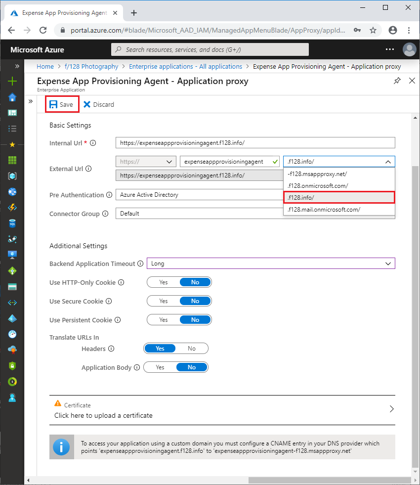
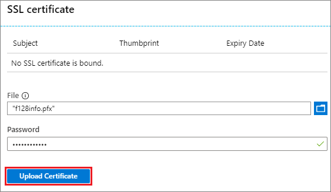
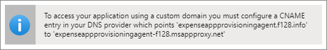
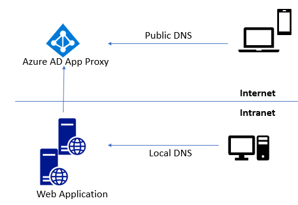

# Configure custom domains with Azure AD Application Proxy

When you publish an application through Azure Active Directory Application Proxy, you create an external URL for your users. This URL gets the default domain *yourtenant.msappproxy.net*. For example, if you publish an app named *Expenses* in your tenant named *Contoso*, the external URL is *https:\//expenses-contoso.msappproxy.net*. If you want to use your own domain name instead of *msappproxy.net*, you can configure a custom domain for your application. 

It's a good idea to set up custom domains for your apps whenever possible. Some reasons to use custom domains include:

- Links between apps work even outside the corporate network. Without a custom domain, if your app has hard-coded internal links to targets outside the Application Proxy, and the links aren't externally resolvable, they will break. When your internal and external URLs are the same, you avoid this problem. If you're not able to use custom domains, see [Redirect hardcoded links for apps published with Azure AD Application Proxy](../application-proxy-link-translation.md) for other ways to address this issue. 
  
- Your users will have an easier experience, because they can get to the app with the same URL from inside or outside your network. They don’t need to learn different internal and external URLs, or track their current location. 

- You can control your branding and create the URLs you want. A custom domain can help build your users' confidence, because users see and use a familiar name instead of *msappproxy.net*.

- Some configurations will only work with custom domains. For example, you need custom domains for apps that use Security Assertion Markup Language (SAML), such as when you’re using Active Directory Federation Services (AD FS) but are unable to use WS-Federation. For more information, see [Work with claims-aware apps in Application Proxy](application-proxy-configure-for-claims-aware-applications.md). 

If you're not able to make the internal and external URLs match, it's not as important to use custom domains, but there may still be other benefits. 

## Set up and use custom domains

To configure an on-premises app to use a custom domain, you need a verified Azure Active Directory custom domain, a PFX certificate for the custom domain, and an on-premises app to configure. 

### Create and verify a custom domain

To create and verify a custom domain:

1. In Azure Active Directory, select **Custom domain names** in the left navigation, and then select **Add custom domain**. 
1. Enter your custom domain name and select **Add Domain**. 
1. On the domain page, copy the TXT record information for your domain. 
1. Go to your domain registrar and create a new TXT record for your domain, based on your copied DNS information.
1. After you register the domain, on the domain's page in Azure Active Directory, select **Verify**. Once the domain status is **Verified**, you can use the domain across all your Azure AD configurations, including Application Proxy. 

For more detailed instructions, see [Add your custom domain name using the Azure Active Directory portal](../fundamentals/add-custom-domain.md).

### Configure an app to use a custom domain

To publish your app through Application Proxy with a custom domain:

1. For a new app, in Azure Active Directory, select **Enterprise applications** in the left navigation, select **New application**, and then select **On-premises application**. 
   
   For an app already in **Enterprise applications**, select it from the list, and then select **Application proxy** in the left navigation. 

1. On the **Application proxy** page, in the **External Url** field, drop down the list and select the custom domain you want to use. 
   
1. Select **Save**.
   
   
   
1. If the domain already has a certificate, the **Certificate** field displays the certificate information. Otherwise, select the **Certificate** field. 
   
   
   
1. On the **SSL certificate** page, browse to and select your PFX certificate file. Enter the password for the certificate, and select **Upload Certificate**. For more information about certificates, see the [Certificates](#certificates) section.
   
   
   
   > [!TIP] 
   > A custom domain only needs its certificate uploaded once. After that, the uploaded certificate is applied automatically when you use the custom domain for other apps.
   
1. If you added a certificate, on the **Application Proxy** page, select **Save**. 
   
1. In the information bar on the **Application Proxy** page, note the CNAME entry you need to add to your DNS zone. 
   
   
   
1. Follow the instructions at [Manage DNS records and record sets by using the Azure portal](../../dns/dns-operations-recordsets-portal.md) to add a DNS record that redirects the new external URL to the *msappproxy.net* domain. For more information about DNS configuration, see the [DNS entries](#dns-entries) section.
   
1. To check that the DNS record is configured correctly, use the [nslookup](https://social.technet.microsoft.com/wiki/contents/articles/29184.nslookup-for-beginners.aspx) command to confirm that your external URL is reachable and the *msapproxy.net* domain appears as an alias.

Your application is now set up to use the custom domain. Be sure to assign users to your application before you test or release it. 

To change the domain for an app, select a different domain from the dropdown list in **External URL** on the app's **Application Proxy** page. Upload a certificate for the updated domain, if necessary, and update the DNS record. If you don't see the custom domain you want in the dropdown list in **External URL**, it might not be verified.

For more detailed instructions for Application Proxy, see [Tutorial: Add an on-premises application for remote access through Application Proxy in Azure Active Directory](application-proxy-add-on-premises-application.md).

## Certificates

Certificates create the secure SSL connection for your custom domain. 

### Certificate formats

You must use a PFX certificate, to ensure all required intermediate certificates are included. The certificate must include the private key.

There's no restriction on the certificate signature methods. Elliptic Curve Cryptography (ECC), Subject Alternative Name (SAN), and other common certificate types are supported. 

You can use wildcard certificates as long as the wildcard matches the external URL. You must use wildcard certificates for [wildcard applications](application-proxy-wildcard.md). If you want to use the certificate to also access subdomains, you must add the subdomain wildcards as subject alternative names in the same certificate. For example, a certificate for *\*.adventure-works.com* won't work for *\*.apps.adventure-works.com* unless you add *\*.apps.adventure-works.com* as a subject alternative name. 

You can use certificates issued by your own public key infrastructure (PKI) if the certificate chain is installed on your client devices. Intune can deploy these certificates to managed devices. For non-managed devices, you must manually install these certificates.

Don't use a private root CA. The private root CA would also need to be pushed to client machines, which introduces many challenges. 

### Certificate management

All certificate management is through the individual application pages. Go to the application's **Application Proxy** page to access the **Certificate** field.

You can use the same certificate for many applications. If an uploaded certificate works with another application, it will be applied automatically. You won't be prompted to upload it again when you add or configure the app. 

When a certificate expires, you get a warning telling you to upload another certificate. If the certificate is revoked, your users may see a security warning when accessing the app. To update the certificate for an app, navigate to the **Application Proxy** page for the app, select **Certificate**, and upload a new certificate. If the old certificate isn't being used by other apps, it's deleted automatically. 

## DNS entries

When you select a custom domain for an external URL, an information bar shows the CNAME entry you need to add to the external DNS provider. You can always see this information again by going to the app's **Application Proxy** page.

There are several options for setting up your DNS configuration, depending on your requirements:

### Same internal and external URL, different internal and external behavior 

If you don't want your internal users to be directed through the Application Proxy, you can set up a *split-brain DNS*. A split DNS infrastructure directs internal hosts to an internal domain name server, and external hosts to an external domain name server, for name resolution. 

### Same internal and external URL, same internal and external behavior 

In this scenario, both the internal and external DNS CNAME entries point to the *msapproxy.net* URL. 

A common case for this scenario is to apply conditional access to the web app or website regardless of device location. For example, only Azure AD Registered/Join Device trusted devices are allowed access. 

### Different internal and external URLs 

If the internal and external URLs are different, you don't need to configure split-brain behavior, because user routing is determined by the URL. In this case, you change only the external DNS, and route the external URL to the Application Proxy endpoint. 

## Next steps
* [Enable single sign-on](application-proxy-configure-single-sign-on-with-kcd.md) to your published apps with Azure AD authentication.
* [Enable Conditional Access](../conditional-access/technical-reference.md#cloud-apps-assignments) to your published apps.

