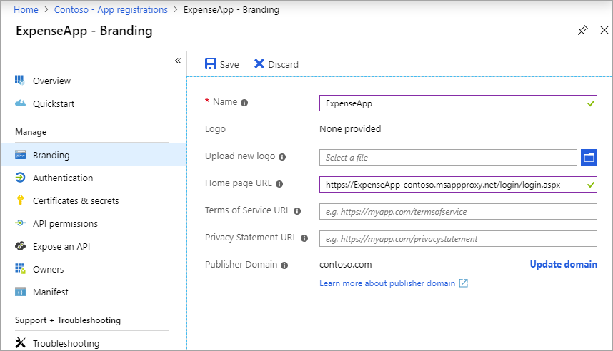

# Set a custom home page for published apps by using Azure AD Application Proxy

This article discusses how to configure an app to direct a user to a custom home page. When you publish an app with Application Proxy, you set an internal URL, but sometimes that's not the page a user should see first. Set a custom home page so that a user gets the right page when they access the app. A user will see the custom home page that you set, regardless of whether they access the app from the Azure Active Directory Access Panel or the Office 365 app launcher.

When a user launches the app, they're directed by default to the root domain URL for the published app. The landing page is typically set as the home page URL. Use the Azure AD PowerShell module to define a custom home page URL when you want an app user to land on a specific page within the app.

Here's one scenario that explains why your company would set a custom home page:

- Inside your corporate network, a user goes to `https://ExpenseApp/login/login.aspx` to sign in and access your app.
- Because you have other assets (such as images) that Application Proxy needs to access at the top level of the folder structure, you publish the app with `https://ExpenseApp` as the internal URL.
- The default external URL is `https://ExpenseApp-contoso.msappproxy.net`, which doesn't take an external user to the sign-in page.
- You want to set `https://ExpenseApp-contoso.msappproxy.net/login/login.aspx` as the home page URL instead, so an external user sees the sign-in page first.

> [!NOTE]
> When you give users access to published apps, the apps are displayed in the [Azure AD Access Panel](../user-help/my-apps-portal-end-user-access.md) and the [Office 365 app launcher](https://www.microsoft.com/microsoft-365/blog/2016/09/27/introducing-the-new-office-365-app-launcher/).

## Before you start

Before you set the home page URL, keep in mind the following requirements:

- The path that you specify must be a subdomain path of the root domain URL.

  For example, if the root-domain URL is `https://apps.contoso.com/app1/`, the home page URL that you configure must start with `https://apps.contoso.com/app1/`.

- If you make a change to the published app, the change might reset the value of the home page URL. When you update the app in the future, you should recheck and, if necessary, update the home page URL.

You can set the home page URL either through the Azure portal or by using PowerShell.

## Change the home page in the Azure portal

To change the home page URL of your app through the Azure AD portal, follow these steps:

1. Sign in to the [Azure portal](https://portal.azure.com/) as an administrator.
1. Select **Azure Active Directory**, and then **App registrations**. The list of registered apps appears.
1. Choose your app from the list. A page showing the details of the registered app appears.
1. Under **Manage**, select **Branding**.
1. Update the **Home page URL**  with your new path.

   

1. Select **Save**.

## Change the home page with PowerShell

To configure the home page of an app using PowerShell, you need to:

1. Install the Azure AD PowerShell module.
1. Find the ObjectId value of the app.
1. Update the app's home page URL using PowerShell commands.

### Install the Azure AD PowerShell module

Before you define a custom home page URL by using PowerShell, install the Azure AD PowerShell module. You can download the package from the [PowerShell Gallery](https://www.powershellgallery.com/packages/AzureAD/2.0.2.16), which uses the Graph API endpoint.

To install the package, follow these steps:

1. Open a standard PowerShell window, and then run the following command:

   ```powershell
   Install-Module -Name AzureAD
   ```

    If you're running the command as a non-admin, use the `-scope currentuser` option.

1. During the installation, select **Y** to install two packages from Nuget.org. Both packages are required.

### Find the ObjectId of the app

You get the ObjectId of the app by searching for the app by its display name or home page.

1. In the same PowerShell window, import the Azure AD module.

   ```powershell
   Import-Module AzureAD
   ```

1. Sign in to the Azure AD module as the tenant administrator.

   ```powershell
   Connect-AzureAD
   ```

1. Find the app. This example uses PowerShell to find the ObjectId by searching for the app with a display name of `SharePoint`.

   ```powershell
   Get-AzureADApplication | Where-Object { $_.DisplayName -eq "SharePoint" } | Format-List DisplayName, Homepage, ObjectId
   ```

   You should get a result that's similar to the one shown here. Copy the ObjectId GUID to use in the next section.

   ```console
   DisplayName : SharePoint
   Homepage    : https://sharepoint-iddemo.msappproxy.net/
   ObjectId    : 8af89bfa-eac6-40b0-8a13-c2c4e3ee22a4
   ```

   Alternatively, you could just pull the list of all apps, search the list for the app with a specific display name or home page, and copy the app's ObjectId once the app is found.

   ```powershell
   Get-AzureADApplication | Format-List DisplayName, Homepage, ObjectId
   ```

### Update the home page URL

Create the home page URL, and update your app with that value. Continue using the same PowerShell window, or if you're using a new PowerShell window, sign in to the Azure AD module again using `Connect-AzureAD`. Then follow these steps:

1. Create a variable to hold the ObjectId value you copied in the previous section. (Replace the ObjectId value used for in this SharePoint example with your app's ObjectId value.)

   ```powershell
   $objguid = "8af89bfa-eac6-40b0-8a13-c2c4e3ee22a4"
   ```

1. Confirm that you have the correct app by running the following command. The output should be identical to the output you saw in the previous section ([Find the ObjectId of the app](#find-the-objectid-of-the-app)).

   ```powershell
   Get-AzureADApplication -ObjectId $objguid | Format-List DisplayName, Homepage, ObjectId
   ```

1. Create a blank application object to hold the changes that you want to make.

   ```powershell
   $appnew = New-Object "Microsoft.Open.AzureAD.Model.Application"
   ```

1. Set the home page URL to the value that you want. The value must be a subdomain path of the published app. For example, if you change the home page URL from `https://sharepoint-iddemo.msappproxy.net/` to `https://sharepoint-iddemo.msappproxy.net/hybrid/`, app users go directly to the custom home page.

   ```powershell
   $homepage = "https://sharepoint-iddemo.msappproxy.net/hybrid/"
   ```

1. Make the update of the home page.

   ```powershell
   Set-AzureADApplication -ObjectId $objguid -Homepage $homepage
   ```

1. To confirm that the change was successful, run the following command from step 2 again.

   ```powershell
   Get-AzureADApplication -ObjectId $objguid | Format-List DisplayName, Homepage, ObjectId
   ```

   For our example, the output should now appear as follows:

   ```console
   DisplayName : SharePoint
   Homepage    : https://sharepoint-iddemo.msappproxy.net/hybrid/
   ObjectId    : 8af89bfa-eac6-40b0-8a13-c2c4e3ee22a4
   ```

1. Restart the app to confirm that the home page appears as the first screen, as expected.

> [!NOTE]
> Any changes that you make to the app might reset the home page URL. If your home page URL resets, repeat the steps in this section to set it back.

## Next steps

- [Enable remote access to SharePoint with Azure AD Application Proxy](application-proxy-integrate-with-sharepoint-server.md)
- [Tutorial: Add an on-premises application for remote access through Application Proxy in Azure Active Directory](application-proxy-add-on-premises-application.md)