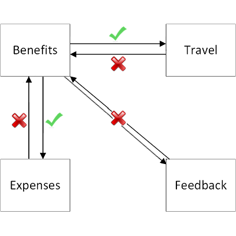
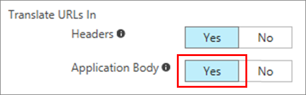

# Redirect hardcoded links for apps published with Azure AD Application Proxy

Azure AD Application Proxy makes your on-premises apps available to users who are remote or on their own devices. Some apps, however, were developed with local links embedded in the HTML. These links don't work correctly when the app is used remotely. When you have several on-premises applications point to each other, your users expect the links to keep working when they're not at the office. 

The best way to make sure that links work the same both inside and outside of your corporate network is to configure the external URLs of your apps to be the same as their internal URLs. Use [custom domains](application-proxy-configure-custom-domain.md) to configure your external URLs to have your corporate domain name instead of the default application proxy domain.

If you can't use custom domains in your tenant, there are several other options for providing this functionality. All of these are also compatible with custom domains and each other, so you can configure custom domains and other solutions if needed. 

**Option 1: Use the Managed Browser** – This solution is only applicable if you plan to recommend or require that users access the application through the Intune Managed Browser. It will handle all published URLs. 

**Option 2: Use the MyApps Extension** – This solution requires users to install a client-side browser extension, but it will handle all published URLs and works with most popular browsers. 

**Option 3: Use the link translation setting** – This is an admin side setting that is invisible to users. However, it will only handle URLs in HTML and CSS. Hard-coded internal URLs generated through Javascript (for example) will not work.  

These three features keep your links working no matter where your users are. When you have apps that point directly to internal endpoints or ports, you can map these internal URLs to the published external Application Proxy URLs. 

 
> [!NOTE]
> The last option is only for tenants that, for whatever reason, can't use custom domains to have the same  internal and external URLs for their apps. Before you enable this feature, see if [custom domains in Azure AD Application Proxy](application-proxy-configure-custom-domain.md) can work for you. 
> 
> Or, if the application you need to configure with link translation is SharePoint, see [Configure alternate access mappings for SharePoint 2013](https://technet.microsoft.com/library/cc263208.aspx) for another approach to mapping links. 

 
### Option 1: Intune Managed Browser Integration 

You can use the Intune Managed Browser to further protect your application and content. To use this solution, you need to require/recommend users access the application through the Intune Managed Browser. All internal URLs published with Application Proxy will be recognized by the Managed Browser and redirected to the corresponding external URL. This ensures that all the hard-coded internal URLs work, and if a user goes to the browser and directly types the internal URL, it works even if the user is remote.  

To learn more, including how to configure this option, please see the [Managed Browser](https://docs.microsoft.com/intune/app-configuration-managed-browser) documentation.  

### Option 2: MyApps Browser Extension 

With the MyApps Browser Extension, all internal URLs published with Application Proxy are recognized by the extension and redirected to the corresponding external URL. This ensures that all the hard-coded internal URLs work, and if a user goes to the browser's address bar and directly types the internal URL, it works even if the user is remote.  

To use this feature, the user needs to download the extension and be logged in. There is no other configuration needed for admins or the users. 

To learn more, including how to configure this option, please see the [MyApps Browser Extension](https://docs.microsoft.com/azure/active-directory/user-help/my-apps-portal-end-user-access#download-and-install-the-my-apps-secure-sign-in-extension) documentation.

### Option 3: Link Translation Setting 

When link translation is enabled, the Application Proxy service searches through HTML and CSS for published internal links and translates them so that your users get an uninterrupted experience. Using the MyApps Browser Extension is preferred to the Link Translation Setting since it gives a more performant experience to users.

> [!NOTE]
> If you are using option 2 or 3, only one of these should be enabled at a time.

## How link translation works

After authentication, when the proxy server passes the application data to the user, Application Proxy scans the application for hardcoded links and replaces them with their respective, published external URLs.

Application Proxy assumes that applications are encoded in UTF-8. If that's not the case, specify the encoding type in an http response header, like `Content-Type:text/html;charset=utf-8`.

### Which links are affected?

The link translation feature only looks for links that are in code tags in the body of an app. Application Proxy has a separate feature for translating cookies or URLs in headers. 

There are two common types of internal links in on-premises applications:

- **Relative internal links** that point to a shared resource in a local file structure like `/claims/claims.html`. These links automatically work in apps that are published through Application Proxy, and continue to work with or without link translation. 
- **Hardcoded internal links** to other on-premises apps like `http://expenses` or published files like `http://expenses/logo.jpg`. The link translation feature works on hardcoded internal links, and changes them to point to the external URLs that remote users need to go through.

The complete list of HTML code tags that Application Proxy supports link translation for include:
* a
* audio
* base
* button
* div
* embed
* form
* frame
* head
* html
* iframe
* img
* input
* link
* menuitem
* meta
* object
* script
* source
* track
* video

Additionally, within CSS the URL attribute is also translated.

### How do apps link to each other?

Link translation is enabled for each application, so that you have control over the user experience at the per-app level. Turn on link translation for an app when you want the links *from* that app to be translated, not links *to* that app. 

For example, suppose that you have three applications published through Application Proxy that all link to each other: Benefits, Expenses, and Travel. There's a fourth app, Feedback, that isn't published through Application Proxy.

When you enable link translation for the Benefits app, the links to Expenses and Travel are redirected to the external URLs for those apps, but the link to Feedback is not redirected because there is no external URL. Links from Expenses and Travel back to Benefits don't work, because link translation has not been enabled for those two apps.

### Which links aren't translated?

To improve performance and security, some links aren't translated:

- Links not inside of code tags. 
- Links not in HTML or CSS. 
- Links in URL-encoded format.
- Internal links opened from other programs. Links sent through email or instant message, or included in other documents, won't be translated. The users need to know to go to the external URL.

If you need to support one of these two scenarios, use the same internal and external URLs instead of link translation.  

## Enable link translation

Getting started with link translation is as easy as clicking a button:

1. Sign in to the [Azure portal](https://portal.azure.com) as an administrator.
2. Go to **Azure Active Directory** > **Enterprise applications** > **All applications** > select the app you want to manage > **Application proxy**.
3. Turn **Translate URLs in application body** to **Yes**.

   
4. Select **Save** to apply your changes.

Now, when your users access this application, the proxy will automatically scan for internal URLs that have been published through Application Proxy on your tenant.

## Send feedback

We want your help to make this feature work for all your apps. We search over 30 tags in HTML and CSS. If you have an example of generated links that aren't being translated, send a code snippet to [Application Proxy Feedback](mailto:aadapfeedback@microsoft.com). 

## Next steps
[Use custom domains with Azure AD Application Proxy](application-proxy-configure-custom-domain.md) to have the same internal and external URL

[Configure alternate access mappings for SharePoint 2013](https://technet.microsoft.com/library/cc263208.aspx)
