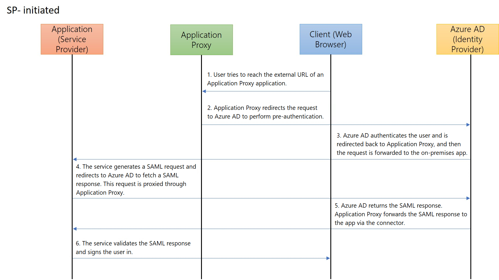
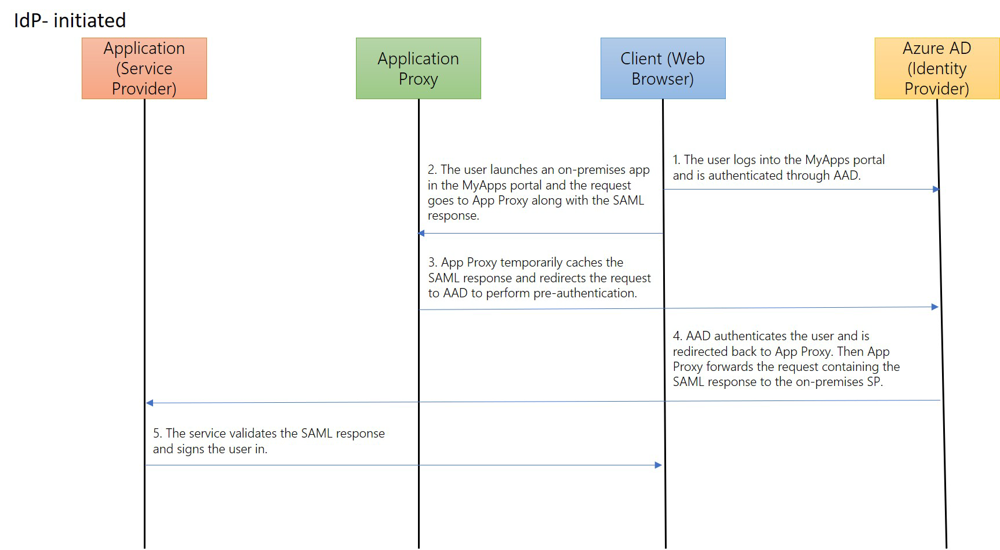
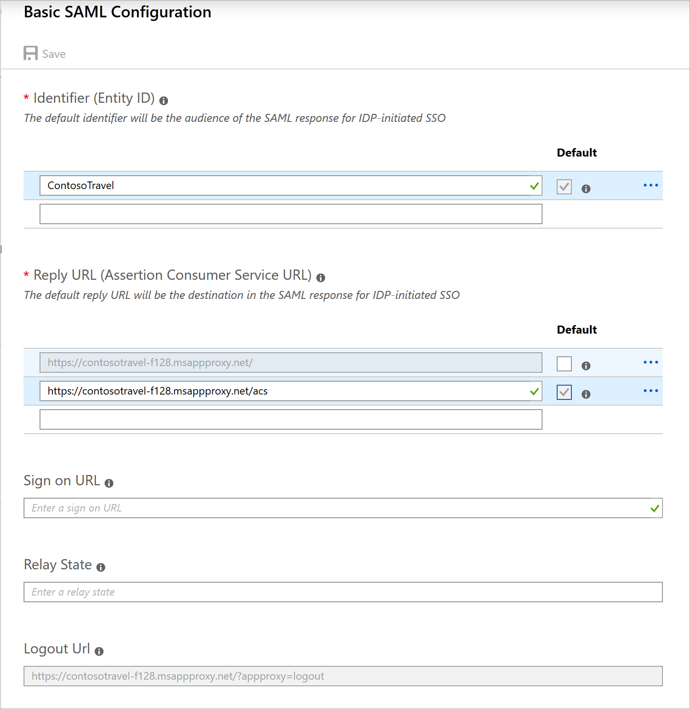

# SAML single sign-on for on-premises applications with Application Proxy (Preview)

You can provide single sign-on (SSO) to on-premises applications that are secured with SAML authentication and provide remote access to these applications through Application Proxy. With SAML single sign-on, Azure Active Directory (Azure AD) authenticates to the application by using the user's Azure AD account. Azure AD communicates the sign-on information to the application through a connection protocol. You can also map users to specific application roles based on rules you define in your SAML claims. By enabling Application Proxy in addition to SAML SSO, your users will have external access to the application and a seamless SSO experience.

The applications must be able to consume SAML tokens issued by **Azure Active Directory**. 
This configuration doesn't apply to applications using an on-premises identity provider. For these scenarios, we recommend reviewing [Resources for migrating applications to Azure AD](migration-resources.md).

SAML SSO with Application Proxy also works with the SAML token encryption feature. For more info, see [Configure Azure AD SAML token encryption](howto-saml-token-encryption.md).

The protocol diagrams below describe the single sign-on sequence for both a service provider-initiated (SP-initiated) flow and an identity provider-initiated (IdP-initiated) flow. Application Proxy works with SAML SSO by caching the SAML request and response to and from the on-premises application.

  

  

## Create an application and set up SAML SSO

1. In the Azure portal, select **Azure Active Directory > Enterprise applications** and select **New application**.

2. Under **Add your own app**, select **Non-gallery application**.

3. Enter the display name for your new application, and then select **Add**.

4. On the app's **Overview** page, select **Single sign-on**.

5. Select **SAML** as the single sign-on method.

6. First set up SAML SSO to work while on the corporate network. In the **Set up Single Sign-On with SAML** page, go to the **Basic SAML Configuration** heading and select its **Edit** icon (a pencil). Follow the steps in [Enter basic SAML configuration](configure-single-sign-on-non-gallery-applications.md#saml-based-single-sign-on) to configure SAML-based authentication for the application.

7. Add at least one user to the application and make sure the test account has access to the application. While connected to the corporate network, use the test account to see if you have single sign-on to the application. 

   > [!NOTE]
   > After you set up Application Proxy, you'll come back and update the SAML **Reply URL**.

## Publish the on-premises application with Application Proxy

Before you can provide SSO for on-premises applications, you need to enable Application Proxy and install a connector. See the tutorial [Add an on-premises application for remote access through Application Proxy in Azure AD](application-proxy-add-on-premises-application.md) to learn how to prepare your on-premises environment, install and register a connector, and test the connector. Then follow these steps to publish your new application with Application Proxy. For other settings not mentioned below, refer to the [Add an on-premises app to Azure AD](application-proxy-add-on-premises-application.md#add-an-on-premises-app-to-azure-ad) section in the tutorial.

1. With the application still open in the Azure portal, select **Application Proxy**. Provide the **Internal URL** for the application. If you're using a custom domain, you also need to upload the SSL certificate for your application. 
   > [!NOTE]
   > As a best practice, use custom domains whenever possible for an optimized user experience. Learn more about [Working with custom domains in Azure AD Application Proxy](application-proxy-configure-custom-domain.md).

2. Select **Azure Active Directory** as the **Pre Authentication** method for your application.

3. Copy the **External URL** for the application. You'll need this URL to complete the SAML configuration.

4. Using the test account, try to open the application with the **External URL** to validate that Application Proxy is set up correctly. If there are issues, see [Troubleshoot Application Proxy problems and error messages](application-proxy-troubleshoot.md).

## Update the SAML configuration

1. With the application still open in the Azure portal, select **Single sign-on**. 

2. In the **Set up Single Sign-On with SAML** page, go to the **Basic SAML Configuration** heading and select its **Edit** icon (a pencil). The **External URL** you configured in Application Proxy automatically populates the **Identifier**, **Reply URL**, and **Logout URL** fields. Don't edit these URLs because they are required for Application Proxy to work correctly.

3. Edit the **Reply URL** configured earlier so that its domain is reachable by Application Proxy. For example, if your **External URL** is `https://contosotravel-f128.msappproxy.net` and the original **Reply URL** was `https://contosotravel.com/acs`, you'll need to update the original **Reply URL** to `https://contosotravel-f128.msappproxy.net/acs`. 

    

4. Select the checkbox next to the updated **Reply URL** to mark it as the default.

   * If the required **Reply URL** is already listed, mark this **Reply URL** as default and delete the previously configured **Reply URL**.

   * For an SP-initiated flow, make sure the back-end application specifies the correct **Reply URL** or Assertion Consumer Service URL for receiving the authentication token.

    > [!NOTE]
    > If the back-end application expects the **Reply URL** to be the Internal URL, you'll need to either use [custom domains](application-proxy-configure-custom-domain.md) to have matching internal and external URLS or install the My Apps secure sign-in extension on users' devices. This extension will automatically redirect to the appropriate Application Proxy Service. To install the extension, see [My Apps secure sign-in extension](../user-help/my-apps-portal-end-user-access.md#download-and-install-the-my-apps-secure-sign-in-extension).
    
## Test your app

When you've completed all these steps, your app should be up and running. To test the app:

1. Open a browser and navigate to the **External URL** that you created when you published the app. 
1. Sign in with the test account that you assigned to the app. You should be able to load the application and have SSO into the application.

## Next steps

- [How does Azure AD Application Proxy provide single sign-on?](application-proxy-single-sign-on.md)
- [Troubleshoot Application Proxy](application-proxy-troubleshoot.md)
