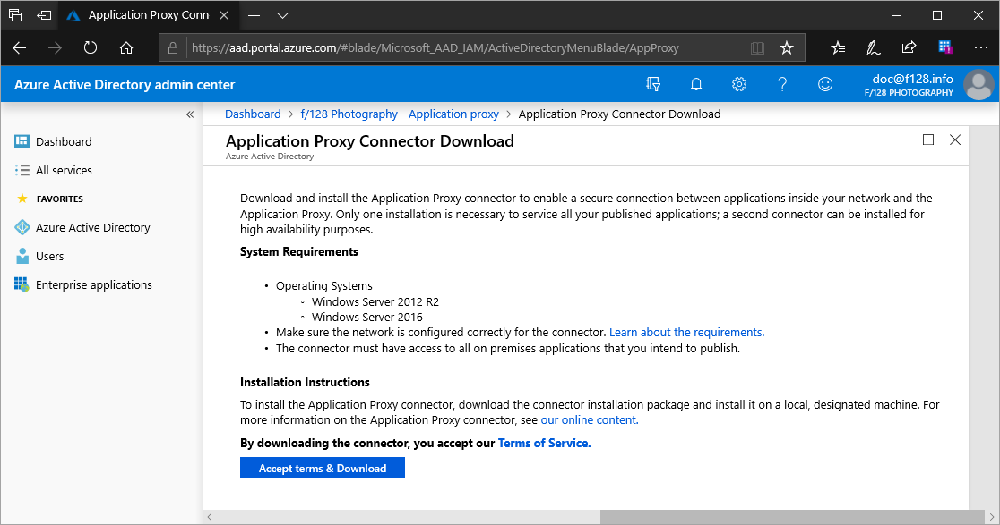
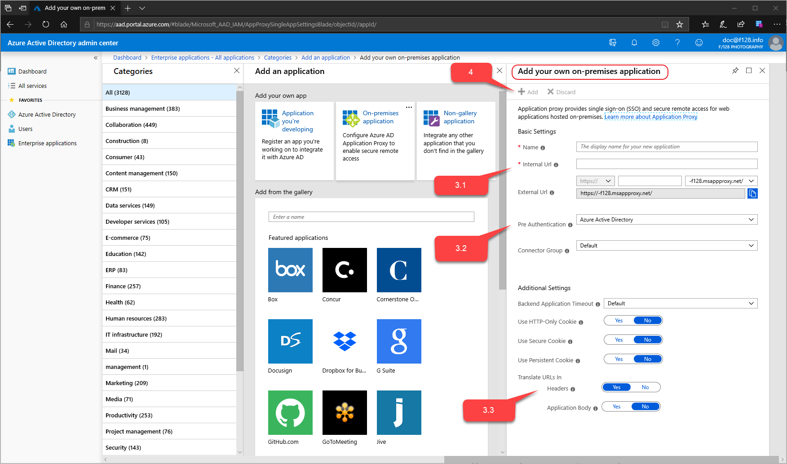
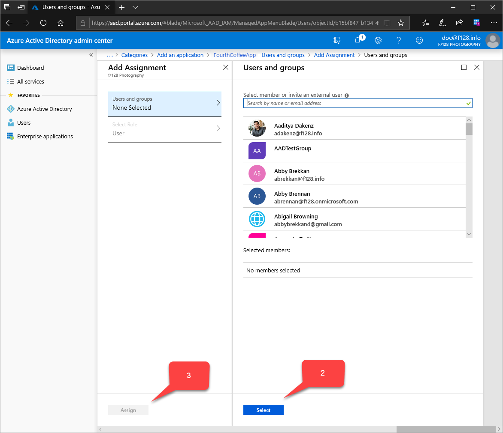
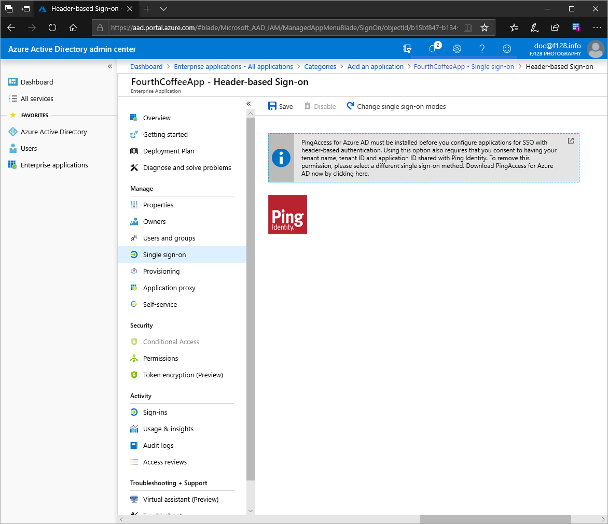
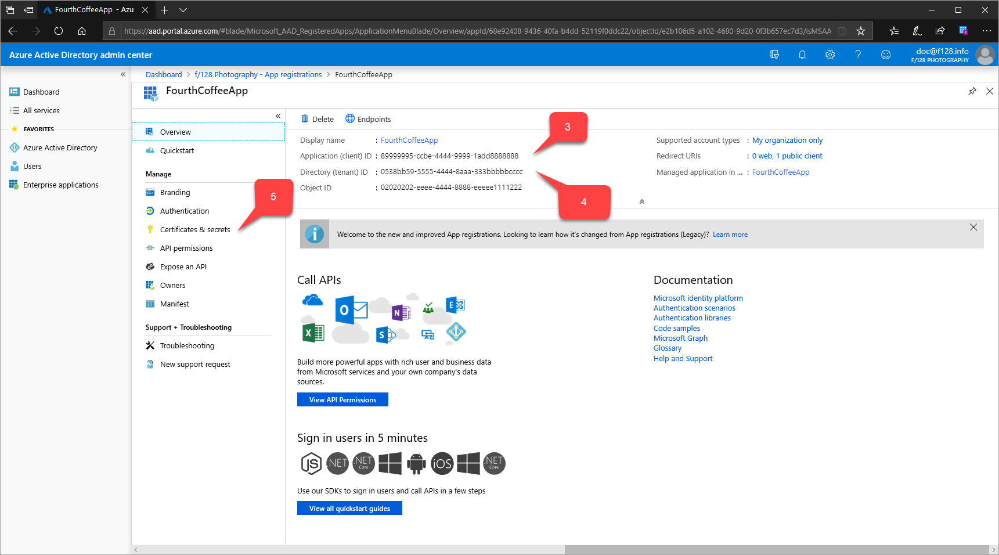
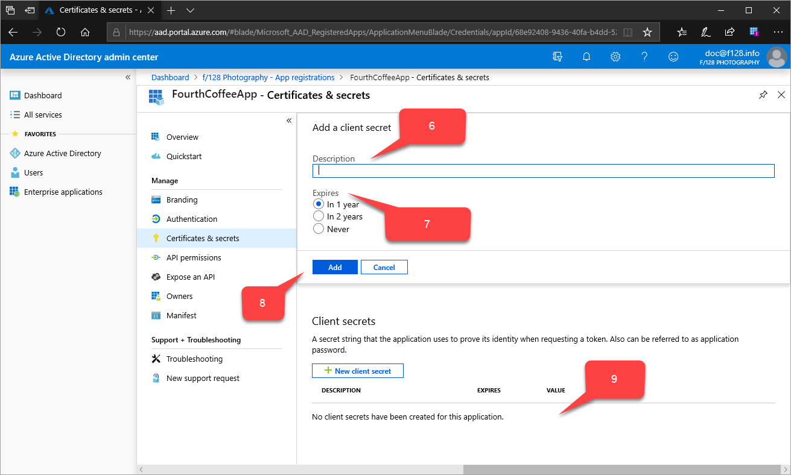

# Header-based authentication for single sign-on with Application Proxy and PingAccess

Azure Active Directory (Azure AD) Application Proxy has partnered with PingAccess so that your Azure AD customers can access more of your applications. PingAccess expands the [existing Application Proxy offerings](application-proxy.md) to include single sign-on access to applications that use headers for authentication.

## What's PingAccess for Azure AD?

With PingAccess for Azure AD, you can give users access and single sign-on (SSO) to applications that use headers for authentication. Application Proxy treats these applications like any other, using Azure AD to authenticate access and then passing traffic through the connector service. PingAccess sits in front of the applications and translates the access token from Azure AD into a header. The application then receives the authentication in the format it can read.

Your users won’t notice anything different when they sign in to use your corporate applications. They can still work from anywhere on any device. The Application Proxy connectors direct remote traffic to all apps without regard to their authentication type, so they’ll still balance loads automatically.

## How do I get access?

Since this scenario comes from a partnership between Azure Active Directory and PingAccess, you need licenses for both services. However, Azure Active Directory Premium subscriptions include a basic PingAccess license that covers up to 20 applications. If you need to publish more than 20 header-based applications, you can purchase an additional license from PingAccess.

For more information, see [Azure Active Directory editions](../fundamentals/active-directory-whatis.md).

## Publish your application in Azure

This article is for people to publish an application with this scenario for the first time. Besides detailing the publishing steps, it guides you in getting started with both Application Proxy and PingAccess. If you’ve already configured both services but want a refresher on the publishing steps, skip to the [Add your application to Azure AD with Application Proxy](#add-your-application-to-azure-ad-with-application-proxy) section.

> [!NOTE]
> Since this scenario is a partnership between Azure AD and PingAccess, some of the instructions exist on the Ping Identity site.

### Install an Application Proxy connector

If you've enabled Application Proxy enabled and installed a connector already, you can skip this section and go to [Add your application to Azure AD with Application Proxy](#add-your-application-to-azure-ad-with-application-proxy).

The Application Proxy connector is a Windows Server service that directs the traffic from your remote employees to your published applications. For more detailed installation instructions, see [Tutorial: Add an on-premises application for remote access through Application Proxy in Azure Active Directory](application-proxy-add-on-premises-application.md).

1. Sign in to the [Azure Active Directory portal](https://aad.portal.azure.com/) as an application administrator. The **Azure Active Directory admin center** page appears.
1. Select **Azure Active Directory** > **Application proxy** > **Download connector service**. The **Application Proxy Connector Download** page appears.

   

1. Follow the installation instructions.

Downloading the connector should automatically enable Application Proxy for your directory, but if not, you can select **Enable Application Proxy**.

### Add your application to Azure AD with Application Proxy

There are two actions you need to take in the Azure portal. First, you need to publish your application with Application Proxy. Then, you need to collect some information about the application that you can use during the PingAccess steps.

#### Publish your application

You'll first have to publish your application. This action involves:

- Adding your on-premises application to Azure AD
- Assigning a user for testing the application and choosing header-based SSO
- Setting up the application's redirect URL
- Granting permissions for users and other applications to use your on-premises application

To publish your own on-premises application:

1. If you didn't in the last section, sign in to the [Azure Active Directory portal](https://aad.portal.azure.com/) as an application administrator.
1. Select **Enterprise applications** > **New application** > **On-premises application**. The **Add your own on-premises application** page appears.

   
1. Fill out the required fields with information about your new application. Use the guidance below for the settings.

   > [!NOTE]
   > For a more detailed walkthrough of this step, see [Add an on-premises app to Azure AD](application-proxy-add-on-premises-application.md#add-an-on-premises-app-to-azure-ad).

   1. **Internal URL**: Normally you provide the URL that takes you to the app’s sign-in page when you’re on the corporate network. For this scenario, the connector needs to treat the PingAccess proxy as the front page of the application. Use this format: `https://<host name of your PingAccess server>:<port>`. The port is 3000 by default, but you can configure it in PingAccess.

      > [!WARNING]
      > For this type of single sign-on, the internal URL must use `https` and can't use `http`.

   1. **Pre-authentication method**: Choose **Azure Active Directory**.
   1. **Translate URL in Headers**: Choose **No**.

   > [!NOTE]
   > If this is your first application, use port 3000 to start and come back to update this setting if you change your PingAccess configuration. For subsequent applications, the port will need to match the Listener you’ve configured in PingAccess. Learn more about [listeners in PingAccess](https://documentation.pingidentity.com/pingaccess/pa31/index.shtml#Listeners.html).

1. Select **Add**. The overview page for the new application appears.

Now assign a user for application testing and choose header-based single sign-on:

1. From the application sidebar, select **Users and groups** > **Add user** > **Users and groups (\<Number> Selected)**. A list of users and groups appears for you to choose from.

   

1. Select a user for application testing, and select **Select**. Make sure this test account has access to the on-premises application.
1. Select **Assign**.
1. From the application sidebar, select **Single sign-on** > **Header-based**.

   > [!TIP]
   > If this is your first time using header-based single sign-on, you need to install PingAccess. To make sure your Azure subscription is automatically associated with your PingAccess installation, use the link on this single sign-on page to download PingAccess. You can open the download site now, or come back to this page later.

   

1. Select **Save**.

Then make sure your redirect URL is set to your external URL:

1. From the **Azure Active Directory admin center** sidebar, select **Azure Active Directory** > **App registrations**. A list of applications appears.
1. Select your application.
1. Select the link next to **Redirect URIs**, showing the number of redirect URIs set up for web and public clients. The **\<application name> - Authentication** page appears.
1. Check whether the external URL that you assigned to your application earlier is in the **Redirect URIs** list. If it isn't, add the external URL now, using a redirect URI type of **Web**, and select **Save**.

Finally, set up your on-premises application so that users have read access and other applications have read/write access:

1. From the **App registrations** sidebar for your application, select **API permissions** > **Add a permission** > **Microsoft APIs** > **Microsoft Graph**. The **Request API permissions** page for **Microsoft Graph** appears, which contains the APIs for Windows Azure Active Directory.

   

1. Select **Delegated permissions** > **User** > **User.Read**.
1. Select **Application permissions** > **Application** > **Application.ReadWrite.All**.
1. Select **Add permissions**.
1. In the **API permissions** page, select **Grant admin consent for \<your directory name>**.

#### Collect information for the PingAccess steps

You need to collect these three pieces of information (all GUIDs) to set up your application with PingAccess:

| Name of Azure AD field | Name of PingAccess field | Data format |
| --- | --- | --- |
| **Application (client) ID** | **Client ID** | GUID |
| **Directory (tenant) ID** | **Issuer** | GUID |
| `PingAccess key` | **Client Secret** | Random string |

To collect this information:

1. From the **Azure Active Directory admin center** sidebar, select **Azure Active Directory** > **App registrations**. A list of applications appears.
1. Select your application. The **App registrations** page for your application appears.

   

1. Next to the **Application (client) ID** value, select the **Copy to clipboard** icon, then copy and save it. You specify this value later as PingAccess's client ID.
1. Next the **Directory (tenant) ID** value, also select **Copy to clipboard**, then copy and save it. You specify this value later as PingAccess's issuer.
1. From the sidebar of the **App registrations** for your application, select **Certificates and secrets** > **New client secret**. The **Add a client secret** page appears.

   

1. In **Description**, type `PingAccess key`.
1. Under **Expires**, choose how to set the PingAccess key: **In 1 year**, **In 2 years**, or **Never**.
1. Select **Add**. The PingAccess key appears in the table of client secrets, with a random string that autofills in the **VALUE** field.
1. Next to the PingAccess key's **VALUE** field, select the **Copy to clipboard** icon, then copy and save it. You specify this value later as PingAccess's client secret.

### Update GraphAPI to send custom fields (optional)

If you need a custom claim that sends other tokens within the access_token consumed by PingAccess, set the `acceptMappedClaims` application field to `True`. You can use Graph Explorer or the Azure AD portal's application manifest to make this change.

**This example uses Graph Explorer:**

```
PATCH https://graph.windows.net/myorganization/applications/<object_id_GUID_of_your_application>

{
  "acceptMappedClaims":true
}
```

**This example uses the [Azure Active Directory portal](https://aad.portal.azure.com/) to update the `acceptMappedClaims` field:**

1. Sign in to the [Azure Active Directory portal](https://aad.portal.azure.com/) as an application administrator.
1. Select **Azure Active Directory** > **App registrations**. A list of applications appears.
1. Select your application.
1. From the sidebar of the **App registrations** page for your application, select **Manifest**. The manifest JSON code for your application's registration appears.
1. Search for the `acceptMappedClaims` field, and change the value to `True`.
1. Select **Save**.

### Use of optional claims (optional)

Optional claims allows you to add standard-but-not-included-by-default claims that every user and tenant has. 
You can configure optional claims for your application by modifying the application manifest. For more info, see the [Understanding the Azure AD application manifest article](https://docs.microsoft.com/azure/active-directory/develop/reference-app-manifest/)

Example to include email address into the access_token that PingAccess will consume:
```
    "optionalClaims": {
        "idToken": [],
        "accessToken": [
            {
                "name": "email",
                "source": null,
                "essential": false,
                "additionalProperties": []
            }
        ],
        "saml2Token": []
    },
```

### Use of claims mapping policy (optional)

[Claims Mapping Policy (preview)](https://docs.microsoft.com/azure/active-directory/develop/active-directory-claims-mapping#claims-mapping-policy-properties) for attributes which do not exist in AzureAD. Claims mapping allows you to migrate old on-prem apps to the cloud by adding additional custom claims that are backed by your ADFS or user objects

To make your application use a custom claim and include additional fields, be sure you've also [created a custom claims mapping policy and assigned it to the application](../develop/active-directory-claims-mapping.md#claims-mapping-policy-assignment).

> [!NOTE]
> To use a custom claim, you must also have a custom policy defined and assigned to the application. This policy should include all required custom attributes.
>
> You can do policy definition and assignment through PowerShell, Azure AD Graph Explorer, or Microsoft Graph. If you're doing them in PowerShell, you may need to first use `New-AzureADPolicy` and then assign it to the application with `Add-AzureADServicePrincipalPolicy`. For more information, see [Claims mapping policy assignment](../develop/active-directory-claims-mapping.md#claims-mapping-policy-assignment).

Example:
```powershell
$pol = New-AzureADPolicy -Definition @('{"ClaimsMappingPolicy":{"Version":1,"IncludeBasicClaimSet":"true", "ClaimsSchema": [{"Source":"user","ID":"employeeid","JwtClaimType":"employeeid"}]}}') -DisplayName "AdditionalClaims" -Type "ClaimsMappingPolicy"

Add-AzureADServicePrincipalPolicy -Id "<<The object Id of the Enterprise Application you published in the previous step, which requires this claim>>" -RefObjectId $pol.Id
```

### Enable PingAccess to use custom claims

Enabling PingAccess to use custom claims is optional, but required if you expect the application to consume additional claims.

When you will configure PingAccess in the following step, the Web Session you will create (Settings->Access->Web Sessions) must have **Request Profile** deselected and **Refresh User Attributes** set to **No**

## Download PingAccess and configure your application

Now that you've completed all the Azure Active Directory setup steps, you can move on to configuring PingAccess.

The detailed steps for the PingAccess part of this scenario continue in the Ping Identity documentation. Follow the instructions in [Configure PingAccess for Azure AD to protect applications published using Microsoft Azure AD Application Proxy](https://docs.pingidentity.com/bundle/paaad_m_ConfigurePAforMSAzureADSolution_paaad43/page/pa_c_PAAzureSolutionOverview.html) on the Ping Identity web site.

Those steps help you install PingAccess and set up a PingAccess account (if you don't already have one). Then, to create an Azure AD OpenID Connect (OIDC) connection, you set up a token provider with the **Directory (tenant) ID** value that you copied from the Azure AD portal. Next, to create a web session on PingAccess, you use the **Application (client) ID** and `PingAccess key` values. After that, you can set up identity mapping and create a virtual host, site, and application.

### Test your application

When you've completed all these steps, your application should be up and running. To test it, open a browser and navigate to the external URL that you created when you published the application in Azure. Sign in with the test account that you assigned to the application.

## Next steps

- [Configure PingAccess for Azure AD to protect applications published using Microsoft Azure AD Application Proxy](https://docs.pingidentity.com/bundle/paaad_m_ConfigurePAforMSAzureADSolution_paaad43/page/pa_c_PAAzureSolutionOverview.html)
- [Single sign-on to applications in Azure Active Directory](what-is-single-sign-on.md)
- [Troubleshoot Application Proxy problems and error messages](application-proxy-troubleshoot.md)
