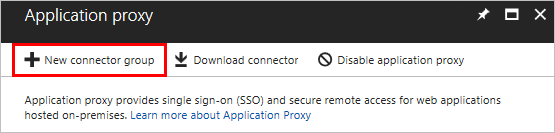

# Publish applications on separate networks and locations using connector groups

Customers utilize Azure AD's Application Proxy for more and more scenarios and applications. So we've made App Proxy even more flexible by enabling more topologies. You can create Application Proxy connector groups so that you can assign specific connectors to serve specific applications. This capability gives you more control and ways to optimize your Application Proxy deployment.

Each Application Proxy connector is assigned to a connector group. All the connectors that belong to the same connector group act as a separate unit for high-availability and load balancing. All connectors belong to a connector group. If you don't create groups, then all your connectors are in a default group. Your admin can create new groups and assign connectors to them in the Azure portal.

All applications are assigned to a connector group. If you don't create groups, then all your applications are assigned to a default group. But if you organize your connectors into groups, you can set each application to work with a specific connector group. In this case, only the connectors in that group serve the application upon request. This feature is useful if your applications are hosted in different locations. You can create connector groups based on location, so that applications are always served by connectors that are physically close to them.

> [!TIP]
> If you have a large Application Proxy deployment, don't assign any applications to the default connector group. That way, new connectors don't receive any live traffic until you assign them to an active connector group. This configuration also enables you to put connectors in an idle mode by moving them back to the default group, so that you can perform maintenance without impacting your users.

## Prerequisites

To group your connectors, you have to make sure you [installed multiple connectors](application-proxy-add-on-premises-application.md). When you install a new connector, it automatically joins the **Default** connector group.

## Create connector groups

Use these steps to create as many connector groups as you want.

1. Sign in to the [Azure portal](https://portal.azure.com).
1. Select **Azure Active Directory** > **Enterprise applications** > **Application proxy**.
1. Select **New connector group**. The New Connector Group blade appears.

   

1. Give your new connector group a name, then use the dropdown menu to select which connectors belong in this group.
1. Select **Save**.

## Assign applications to your connector groups

Use these steps for each application that you've published with Application Proxy. You can assign an application to a connector group when you first publish it, or you can use these steps to change the assignment whenever you want.

1. From the management dashboard for your directory, select **Enterprise applications** > **All applications** > the application you want to assign to a connector group > **Application Proxy**.
1. Use the **Connector Group** dropdown menu to select the group you want the application to use.
1. Select **Save** to apply the change.

## Use cases for connector groups

Connector groups are useful for various scenarios, including:

### Sites with multiple interconnected datacenters

Many organizations have a number of interconnected datacenters. In this case, you want to keep as much traffic within the datacenter as possible because cross-datacenter links are expensive and slow. You can deploy connectors in each datacenter to serve only the applications that reside within the datacenter. This approach minimizes cross-datacenter links and provides an entirely transparent experience to your users.

### Applications installed on isolated networks

Applications can be hosted in networks that are not part of the main corporate network. You can use connector groups to install dedicated connectors on isolated networks to also isolate applications to the network. This usually happens when a third-party vendor maintains a specific application for your organization.

Connector groups allow you to install dedicated connectors for those networks that publish only specific applications, making it easier and more secure to outsource application management to third-party vendors.

### Applications installed on IaaS

For applications installed on IaaS for cloud access, connector groups provide a common service to secure the access to all the apps. Connector groups don't create additional dependency on your corporate network, or fragment the app experience. Connectors can be installed on every cloud datacenter and serve only applications that reside in that network. You can install several connectors to achieve high availability.

Take as an example an organization that has several virtual machines connected to their own IaaS hosted virtual network. To allow employees to use these applications, these private networks are connected to the corporate network using site-to-site VPN. This provides a good experience for employees that are located on-premises. But, it may not be ideal for remote employees, because it requires additional on-premises infrastructure to route access, as you can see in the diagram below:

  
With Azure AD Application Proxy connector groups, you can enable a common service to secure the access to all applications without creating additional dependency on your corporate network:

### Multi-forest – different connector groups for each forest

Most customers who have deployed Application Proxy are using its single-sign-on (SSO) capabilities by performing Kerberos Constrained Delegation (KCD). To achieve this, the connector’s machines need to be joined to a domain that can delegate the users toward the application. KCD supports cross-forest capabilities. But for companies who have distinct multi-forest environments with no trust between them, a single connector cannot be used for all forests. 

In this case, specific connectors can be deployed per forest, and set to serve applications that were published to serve only the users of that specific forest. Each connector group represents a different forest. While the tenant and most of the experience is unified for all forests, users can be assigned to their forest applications using Azure AD groups.

### Disaster Recovery sites

There are two different approaches you can take with a disaster recovery (DR) site, depending on how your sites are implemented:

* If your DR site is built in active-active mode where it is exactly like the main site and has the same networking and AD settings, you can create the connectors on the DR site in the same connector group as the main site. This enables Azure AD to detect failovers for you.
* If your DR site is separate from the main site, you can create a different connector group in the DR site, and either 1) have backup applications or 2) manually divert the existing application to the DR connector group as needed.

### Serve multiple companies from a single tenant

There are many different ways to implement a model in which a single service provider deploys and maintains Azure AD related services for multiple companies. Connector groups help the admin segregate the connectors and applications into different groups. One way, which is suitable for small companies, is to have a single Azure AD tenant while the different companies have their own domain name and networks. This is also true for M&A scenarios and situations where a single IT division serves several companies for regulatory or business reasons.

## Sample configurations

Some examples that you can implement, include the following connector groups.

### Default configuration – no use for connector groups

If you don’t use connector groups, your configuration would look like this:

This configuration is sufficient for small deployments and tests. It will also work well if your organization has a flat network topology.

### Default configuration and an isolated network

This configuration is an evolution of the default one, in which there is a specific app that runs in an isolated network such as IaaS virtual network:

### Recommended configuration – several specific groups and a default group for idle

The recommended configuration for large and complex organizations is to have the default connector group as a group that doesn’t serve any applications and is used for idle or newly installed connectors. All applications are served using customized connector groups. This enables all the complexity of the scenarios described above.

In the example below, the company has two datacenters, A and B, with two connectors that serve each site. Each site has different applications that run on it.

## Next steps

* [Understand Azure AD Application Proxy connectors](application-proxy-connectors.md)
* [Enable single-sign on](what-is-single-sign-on.md)
