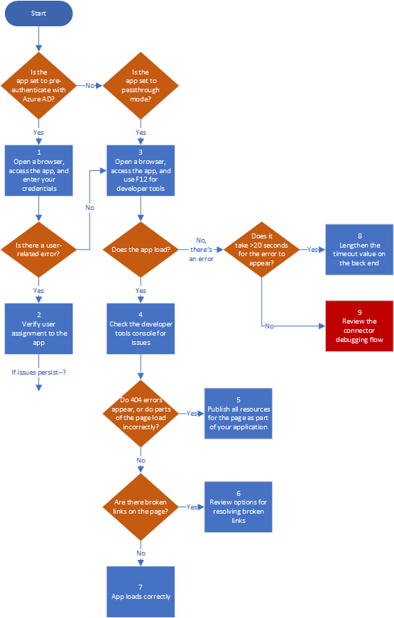

# Debug Application Proxy application issues 

This article helps you troubleshoot issues with Azure Active Directory (Azure AD) Application Proxy applications. If you're using the Application Proxy service for remote access to an on-premises web application, but you're having trouble connecting to the application, use this flowchart to debug application issues. 

## Before you begin

This article assumes you are using the Application Proxy service and are having an issue connecting to the application. 

For more information about about Application Proxy and using its connectors, see:

- [Remote access to on-premises applications through Application Proxy](application-proxy.md)
- [Application Proxy connectors](application-proxy-connectors.md)
- [Install and register a connector](application-proxy-add-on-premises-application.md) 

## Flowchart for connector issues

This flowchart walks you through the steps for debugging issues with connecting to the application. For details about each step, see the table following the flowchart.

|  | Action | Description | 
|---------|---------|---------|
|1 | Open a browser, access the app, and enter your credentials | Try using your credentials to sign in to the app, and check for any user-related errors, like "[This corporate app can't be accessed](application-proxy-sign-in-bad-gateway-timeout-error.md)." To learn more about preparing for remote application access, see  [Tutorial: Add an on-premises application for remote access through Application Proxy](application-proxy-add-on-premises-application.md). |
|2 | Verify user assignment to the app | Make sure your user account has permissions to access the application from inside the corporate network, and then verify assigned to the application for testing. For details, see [Test the application](application-proxy-add-on-premises-application.md#test-the-application) in the tutorial for adding an application. |
|3 | Open a browser, access the app, and use F12 for developer tools |  |
|4 | Check the developer tools console for issues | For information about display issues, see to [Application page does not display correctly for an Application Proxy application](application-proxy-page-appearance-broken-problem.md) |
|5 | Publish all resources for the page as part of your application | When publishing a path to the application, make sure the path includes all the necessary images, scripts, and style sheets for your application. For details, see [Add an on-premises app to Azure AD](application-proxy-add-on-premises-application.md#add-an-on-premises-app-to-azure-ad). about adding and publishing an application, see help with issues Check for publishing issues as described in   |
|6 | Review options for resolving broken links | For troubleshooting options, see [Links on the page don't work for an Application Proxy application](application-proxy-page-links-broken-problem.md) |
|7 | Verify that the app loads correctly | If issues persist, review the troubleshooting help under [Application Proxy troubleshooting](application-proxy-page-appearance-broken-problem.md). | 
|8 | Lengthen the time-out value on the back end | In the **Additional Settings** for your application, change the **Backend Application Timeout** setting to **Long**. See [Add an on-premises app to Azure AD](application-proxy-add-on-premises-application.md#add-an-on-premises-app-to-azure-ad). |
|9 | Review the connector debugging flow | There could be a connectivity issue, either between the proxy and the connector or between the connector and the back end. Use the [Debug Application Proxy connectors](application-proxy-debug-connectors.md) troubleshooting flow. |

## Next steps

* [Publish applications on separate networks and locations using connector groups](application-proxy-connector-groups.md)
* [Work with existing on-premises proxy servers](application-proxy-configure-connectors-with-proxy-servers.md)
* [Troubleshoot Application Proxy and connector errors](application-proxy-troubleshoot.md)
* [How to silently install the Azure AD Application Proxy Connector](application-proxy-register-connector-powershell.md)
