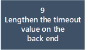

# Debug Application Proxy connector issues 

This article helps you troubleshoot issues with Azure Active Directory (Azure AD) Application Proxy connectors. If you're using the Application Proxy service for remote access to an on-premises web application, but you're having trouble connecting to the application, use this flowchart to debug connector issues. 

## Before you begin

This article assumes you have installed the Application Proxy connector and are having an issue. When troubleshooting Application Proxy issues, we recommend you start with this troubleshooting flow to determine if Application Proxy connectors are configured correctly. If you're still having trouble connecting to the application, follow the troubleshooting flow in [Debug Application Proxy application issues](application-proxy-debug-apps.md).  

For more information about Application Proxy and using its connectors, see:

- [Remote access to on-premises applications through Application Proxy](application-proxy.md)
- [Application Proxy connectors](application-proxy-connectors.md)
- [Install and register a connector](application-proxy-add-on-premises-application.md)
- [Troubleshoot Application Proxy problems and error messages](application-proxy-troubleshoot.md)

## Flowchart for connector issues

This flowchart walks you through the steps for debugging some of the more common connector issues. For details about each step, see the table following the flowchart.

|  | Action | Description | 
|---------|---------|---------|
|1 | Find the connector group assigned to the app | You probably have a connector installed on multiple servers, in which case the connectors should be [assigned to connector groups](application-proxy-connector-groups.md#assign-applications-to-your-connector-groups). To learn more about connector groups, see [Publish applications on separate networks and locations using connector groups](application-proxy-connector-groups.md). |
|2 | Install the connector and assign a group | If you don't have a connector installed, see [Install and register a connector](application-proxy-add-on-premises-application.md#install-and-register-a-connector).  If the connector isn't assigned to a group, see [Assign the connector to a group](application-proxy-connector-groups.md#create-connector-groups).  If the application isn't assigned to a connector group, see [Assign the application to a connector group](application-proxy-connector-groups.md#assign-applications-to-your-connector-groups).|
|3 | Run a port test on the connector server | On the connector server, run a port test by using [telnet](https://docs.microsoft.com/windows-server/administration/windows-commands/telnet) or other port testing tool to check if ports 443 and 80 are open.|
|4 | Configure the domains and ports | [Make sure that your domains and ports are configured correctly](application-proxy-add-on-premises-application.md#prepare-your-on-premises-environment) For the connector to work properly, there are certain ports that must be open and URLs that your server must be able to access. |
|5 | Check if a back-end proxy is in use | Check to see if the connectors are using back-end proxy servers or bypassing them. For details, see [Troubleshoot connector proxy problems and service connectivity issues](application-proxy-configure-connectors-with-proxy-servers.md#troubleshoot-connector-proxy-problems-and-service-connectivity-issues). |
|6 | Update the connector and updater to use the back-end proxy | If a back-end proxy is in use, you'll want to make sure the connector is using the same proxy. For details about troubleshooting and configuring connectors to work with proxy servers, see [Work with existing on-premises proxy servers](application-proxy-configure-connectors-with-proxy-servers.md). |
|7 | Load the app's internal URL on the connector server | On the connector server, load the app's internal URL. |
|8 | Check internal network connectivity | There's a connectivity issue in your internal network that this debugging flow is unable to diagnose. The application must be accessible internally for the connectors to work. You can enable and view connector event logs as described in [Application Proxy connectors](application-proxy-connectors.md#under-the-hood). |
|9 | Lengthen the time-out value on the back end | In the **Additional Settings** for your application, change the **Backend Application Timeout** setting to **Long**. See [Add an on-premises app to Azure AD](application-proxy-add-on-premises-application.md#add-an-on-premises-app-to-azure-ad). |
|10 | If issues persist, target specific flow issues, review app and SSO debugging flows | Use the [Debug Application Proxy application issues](application-proxy-debug-apps.md) troubleshooting flow. |

## Next steps

* [Publish applications on separate networks and locations using connector groups](application-proxy-connector-groups.md)
* [Work with existing on-premises proxy servers](application-proxy-configure-connectors-with-proxy-servers.md)
* [Troubleshoot Application Proxy and connector errors](application-proxy-troubleshoot.md)
* [How to silently install the Azure AD Application Proxy Connector](application-proxy-register-connector-powershell.md)
