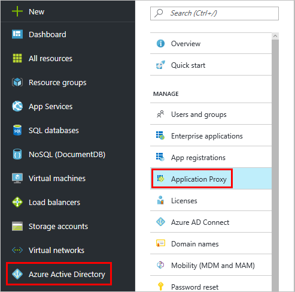

# Get started with Application Proxy and install the connector
This article walks you through the steps to enable Microsoft Azure AD Application Proxy for your cloud directory in Azure AD.

If you're not yet aware of the security and productivity benefits Application Proxy brings to your organization, learn more about [How to provide secure remote access to on-premises applications](application-proxy.md).

## Application Proxy prerequisites
Before you can enable and use Application Proxy services, you need to have:

* A [Microsoft Azure AD basic or premium subscription](../fundamentals/active-directory-whatis.md) and an Azure AD directory for which you are a global administrator.
* A server running Windows Server 2012 R2 or 2016, on which you can install the Application Proxy Connector. The server needs to be able to connect to the Application Proxy services in the cloud, and the on-premises applications that you are publishing.
  * For single sign-on to your published applications using Kerberos Constrained Delegation, this machine should be domain-joined in the same AD domain as the applications that you are publishing. For information, see [KCD for single sign-on with Application Proxy](application-proxy-configure-single-sign-on-with-kcd.md).

If your organization uses proxy servers to connect to the internet, read [Work with existing on-premises proxy servers](application-proxy-configure-connectors-with-proxy-servers.md) for details on how to configure them before you get started with Application Proxy.

## Open your ports

To prepare your environment for Azure AD Application Proxy, you first need to enable communication to Azure data centers. If there is a firewall in the path, make sure that it's open so that the Connector can make HTTPS (TCP) requests to the Application Proxy.

1. Open the following ports to **outbound** traffic:

   | Port number | How it's used |
   | --- | --- |
   | 80 | Downloading certificate revocation lists (CRLs) while validating the SSL certificate |
   | 443 | All outbound communication with the Application Proxy service |

   If your firewall enforces traffic according to originating users, open these ports for traffic from Windows services that run as a Network Service.

   > [!IMPORTANT]
   > The table reflects the port requirements for connector versions 1.5.132.0 and newer. If you still have an older connector version, you also need to enable the following ports in addition to 80 and 443: 5671, 8080, 9090-9091, 9350, 9352, 10100–10120.
   >
   >For information about updating your connectors to the newest version, see [Understand Azure AD Application Proxy connectors](application-proxy-connectors.md#automatic-updates).

2. If your firewall or proxy allows DNS whitelisting, you can whitelist connections to msappproxy.net and servicebus.windows.net. If not, you need to allow access to the [Azure DataCenter IP ranges](https://www.microsoft.com/download/details.aspx?id=41653), which are updated each week.

3. Microsoft uses four addresses to verify certificates. Allow access to the following URLs if you haven't done so for other products:
   * mscrl.microsoft.com:80
   * crl.microsoft.com:80
   * ocsp.msocsp.com:80
   * www.microsoft.com:80

4. Your connector needs access to login.windows.net and login.microsoftonline.com for the registration process.

## Install and register a connector
1. Sign in as an administrator in the [Azure portal](https://portal.azure.com/).
2. Your current directory appears under your username in the top right corner. If you need to change directories, select that icon.
3. Go to **Azure Active Directory** > **Application Proxy**.

   

4. Select **Download Connector**.

   

5. Run **AADApplicationProxyConnectorInstaller.exe** on the server you prepared according to the prerequisites.
6. Follow the instructions in the wizard to install. During installation, you are prompted to register the connector with the Application Proxy of your Azure AD tenant.

   * Provide your Azure AD global administrator credentials. Your global administrator tenant may be different from your Microsoft Azure credentials.
   * Make sure the admin who registers the connector is in the same directory where you enabled the Application Proxy service. For example, if the tenant domain is contoso.com, the admin should be admin@contoso.com or any other alias on that domain.
   * If **IE Enhanced Security Configuration** is set to **On** on the server where you are installing the connector, you may not see the registration screen. To get access, follow the instructions in the error message. Make sure that Internet Explorer Enhanced Security is off.

For high availability purposes, you should deploy at least two connectors. Each connector must be registered separately.

## Test that the connector installed correctly

You can confirm that a new connector installed correctly by checking for it in either the Azure portal or on your server. 

In the Azure portal, sign in to your tenant and navigate to **Azure Active Directory** > **Application Proxy**. All of your connectors and connector groups appear on this page. Select a connector to see its details or move it into a different connector group. 

On your server, check the list of active services for the connector and the connector updater. The two services should start running immediately, but if not, turn them on: 

   * **Microsoft AAD Application Proxy Connector** enables connectivity

   * **Microsoft AAD Application Proxy Connector Updater** is an automated update service. The updater checks for new versions of the connector and updates the connector as needed.

   

For information about connectors and how they stay up to date, see [Understand Azure AD Application Proxy connectors](application-proxy-connectors.md).

## Next steps
You are now ready to [Publish applications with Application Proxy](application-proxy-publish-azure-portal.md).

If you have applications that are on separate networks or different locations, use connector groups to organize the different connectors into logical units. Learn more about [Working with Application Proxy connectors](application-proxy-connector-groups.md).
