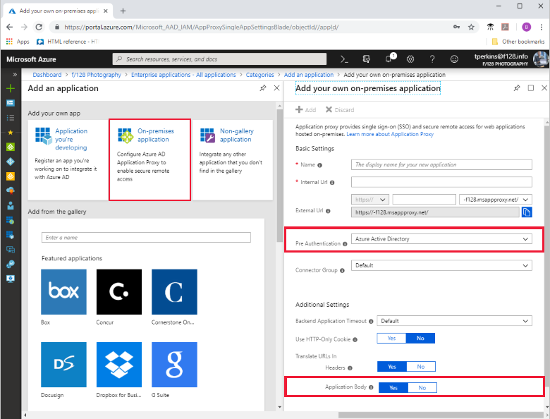

# Integrate an on-premises Azure Active Directory application with Microsoft Cloud App Security

Configure an on-premises application in Azure Active Directory to work with Microsoft Cloud App Security (MCAS). MCAS monitors application access in real-time, and can monitor on-premises applications that use Application Proxy in Azure Active Directory (Azure AD). 

With MCAS, you can:

- Block the download of sensitive documents on unmanaged devices. 
- Monitor when high-risk users sign-on to applications, and then log their actions from within the session. With this information, you can analyze user behavior to determine how to apply session policies. 
- Use client certificates or device compliance to block access to specific applications from unmanaged devices.
- Restrict user sessions from non-corporate networks. You can give restricted access to users accessing an application from outside your corporate network. For example, this restricted access can block the user from downloading sensitive documents.

For more information, see [Protect apps with Microsoft Cloud App Security Conditional Access App Control](/cloud-app-security/proxy-intro-aad.md).

## Requirements

License:

- EMS E5 license, or 
- Azure Active Directory Premium P1 and MCAS Standalone.

Application:

- The on-premises application must use Kerberos Constrained Delegation (KCD)

Application Proxy:

- Azure AD needs to be configured to use Application Proxy, which includes preparing your environment and installing the Application Proxy connector. For a tutorial on configuring Application Proxy, see [Add an on-premises applications for remote access through Application Proxy in Azure AD](application-proxy-add-on-premises-application.md). 

## Add on-premises application to Azure AD

Use [Add an on-premises app to Azure AD](application-proxy-add-on-premises-application.md#add-an-on-premises-app-to-azure-ad) to add the on-premises application to Azure AD. When you fill in the application information, choose the following two settings which are required for the application to work with MCAS:

- Pre-authentication method: Azure Active Directory
- Full body link translation: This must be set to Yes to work with MCAS.

You'll find the settings in the **Add your on-premises application** blade:

## Test the on-premises application in Azure AD

After adding your application to Azure AD, use the steps in [Test the application](application-proxy-add-on-premises-application.md#test-the-application) to add a user for testing, and test the sign-on. 

## Add a conditional access policy

While you are signed in to the Azure portal, configure a conditional access policy on your application. You can start with a policy designed to test whether the configuration is working.

To configure a conditional access policy for use with Cloud App Security:

1. In the [Azure portal](https://portal.azure.com), [Find your application](view-applications-portal.md), and then click on the application to open it.
2. To create a new conditional access policy, click **Conditional Access** > **New policy**.

     

3. Click **Session** and check **Use Conditional Access App Control**.  Click Select.

    .

4. Click **Users and groups** and assign a user that can be used to test the sign-on.

## Add on-premises application to MCAS

To start monitoring the application, you'll need to add your application to the Conditional Access App Control which is in the Cloud App Security portal.

To add your application to the Conditional Access App Control:

1. Sign in to the Cloud App Security portal as an application for the Azure AD directory to which you added the on-premises application. The URL for Cloud App Security is `https://<directory>.portal.cloudappsecurity.com` where `<directory>` if the name of your Azure AD directory. For example, if the tenant directory is `f128`, sign in to `https://f128.portal.cloudappsecurity.com`.

    

2. Follow the configuration steps in the [Cloud Application Security](/cloud-app-security/proxy-deployment-aad#step-3-return-to-the-cloud-app-security-portal-and-select-the-banner-notification-to-add-the-apps-) guidance.

## Test the deployment

To test the deployment:

1. Sign out of any existing sessions. Then, try to sign in to the application that was successfully deployed in MCAS. Sign in using a user that is assigned to the conditional access policy in Azure AD.
2. In the Cloud App Security portal, under **Investigate**, select **Activity log**, and verify the sign-in activities are captured for the application. 
3. To filter the log, click **Advanced**, and then filter using Source equals Access Control.
 
For more information, see [Test the deployment](/cloud-app-security/proxy-deployment-aad#test-the-deployment) in the Cloud Application Security guidance.

