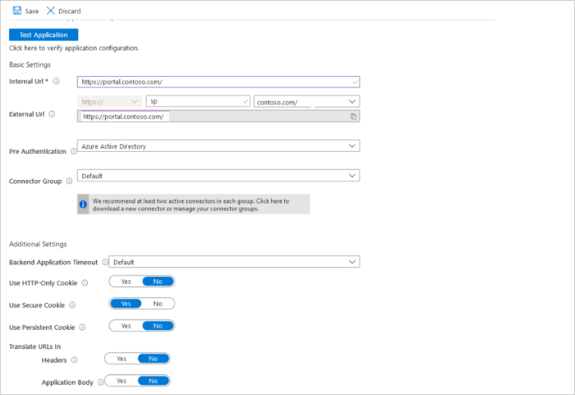

# Integrate with SharePoint (SAML)

This step-by-step guide explains how to integrate a SharePoint on-premises farm with Azure Active Directory (Azure AD) Application Proxy for SAML. You can allow your Azure Active Directory (AD) users to access your SharePoint on-premises instance from an external network. 

This process requires two Enterprise Applications. One is a SharePoint on-premises instance that you publish from the gallery to your list of managed SaaS apps. The second is an on-premises application (non-gallery application) you'll use to publish the first Enterprise Gallery Application.

There are three primary advantages for this process: 

 - If the on-premises SharePoint instance is using Azure AD as single-sign on (SSO), you can extend the access and allow remote users to access SharePoint securely without VPN.
 - You can apply Azure AD security features like Conditional Access and multi-factor authorization (MFA) for external access.
 - You can grant B2B users in Azure AD access to your on-premises SharePoint instance. 

## Prerequisites

To complete this configuration, you need the following resources:
 - A SharePoint 2013 farm or newer. The Sharepoint farm must be [integrated with Azure AD](https://docs.microsoft.com/azure/active-directory/saas-apps/sharepoint-on-premises-tutorial).
 - An Azure AD tenant with a plan that includes Application Proxy. Learn more about [Azure AD plans and pricing](https://azure.microsoft.com/pricing/details/active-directory/).
 - A [custom, verified domain](https://docs.microsoft.com/azure/active-directory/fundamentals/add-custom-domain) in the Azure AD tenant.
 - On-premises Active Directory synchronized with Azure AD Connect, through which users can [sign in to Azure](https://docs.microsoft.com/azure/active-directory/hybrid/plan-connect-user-signin). 
 - For B2B guest users, you need to [grant access to a guest account to SharePoint on-premises in the Azure portal](https://docs.microsoft.com/azure/active-directory/saas-apps/sharepoint-on-premises-tutorial#grant-access-to-a-guest-account-to-sharepoint-on-premises-in-the-azure-portal)
 - An Application Proxy connector installed and running on a machine within the corporate domain.

## Step 1: Integrate SharePoint on-premises with Azure AD 

1. Configure the SharePoint on-premises app. For more information, see [Tutorial: Azure Active Directory single sign-on integration with SharePoint on-premises](https://docs.microsoft.com/azure/active-directory/saas-apps/sharepoint-on-premises-tutorial).
2. Validate the configuration before moving to the next step. To validate, try to access the SharePoint on-premises from the internal network and confirm it's accessible internally. 

## Step 2: Publish the Sharepoint on-premises application with Application Proxy

Find the following values that you configured when you [integrated with Azure AD](https://docs.microsoft.com/azure/active-directory/saas-apps/sharepoint-on-premises-tutorial),

 - Internal URL: https://<YourSharePointSiteURL>/ 
 - External URL: https://<YourSharePointSiteURL>/

> [!NOTE]
> The values match the Sign on URL under the SAML Based Application configuration in Step 1.

   

 1. Create the app as described and use following settings. For step-by-step instructions, see [Add an on-premises app to Azure AD](https://docs.microsoft.com/azure/active-directory/manage-apps/application-proxy-add-on-premises-application#add-an-on-premises-app-to-azure-ad).

    - Internal URL= External URL = Sign On URL= https://portal.contoso.com/
    - Pre-Authentication: Azure Active Directory
    - Translate URLs in Headers: No
    - Translate URLs in Application Body: No

    

2. Assign the [same groups](https://docs.microsoft.com/azure/active-directory/saas-apps/sharepoint-on-premises-tutorial#create-an-azure-ad-security-group-in-the-azure-portal) that were assigned to the On-premises SharePoint Gallery Application.

3. Optionally, you can prevent the visibility of two applications for the SharePoint on-premises. For **myapplications.microsoft.com**, go to the Properties section and set **Visible to users?** to **No** for one of your applications. 

   
 
## Step 3: Test your application
1. Using a browser from a computer on an external network, navigate to the URL (https://portal.contoso.com/) that you configured during the publish step. Make sure you can sign in with the test account you set up.

