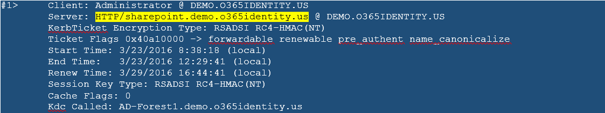
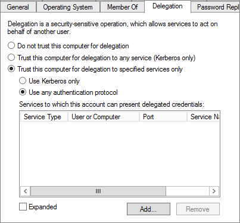
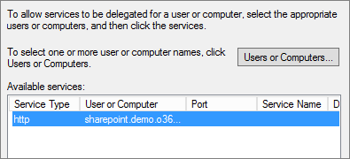

# Enable remote access to SharePoint with Azure AD Application Proxy

This article discusses how to integrate an on-premises SharePoint server with Azure Active Directory (Azure AD) Application Proxy.

To enable remote access to SharePoint with Azure AD Application Proxy, follow the sections in this article step by step.

## Prerequisites

This article assumes that you already have SharePoint 2013 or newer in your environment. In addition, consider the following prerequisites:

* SharePoint includes native Kerberos support. Therefore, users who are accessing internal sites remotely through Azure AD Application Proxy can assume to have a single sign-on (SSO) experience.

* This scenario includes configuration changes to your SharePoint server. We recommend using a staging environment. This way, you can make updates to your staging server first, and then facilitate a testing cycle before going into production.

* We require SSL on the published URL. You need to have SSL enabled on your internal site to ensure that links are sent/mapped correctly. If you haven't configured SSL, see [Configure SSL for SharePoint](https://blogs.msdn.microsoft.com/fabdulwahab/2013/01/20/configure-ssl-for-sharepoint-2013) for instructions. Also, make sure that the connector machine trusts the certificate that you issue. (The certificate does not need to be publicly issued.)

## Step 1: Set up single sign-on to SharePoint

For on-premises applications that use Windows authentication, you can achieve single sign-on (SSO) with the Kerberos authentication protocol and a feature called Kerberos constrained delegation (KCD). KCD, when configured, allows the Application Proxy connector to obtain a Windows token for a user, even if the user hasn’t signed in to Windows directly. To learn more about KCD, see [Kerberos Constrained Delegation Overview](https://technet.microsoft.com/library/jj553400.aspx).

To set up KCD for a SharePoint server, use the procedures in the following sequential sections:

### Ensure that SharePoint web application is running under a domain account

First, make sure that SharePoint web application is running under a domain account--not local system, local service, or network service. Do this so that you can attach service principal names (SPNs) to this account. SPNs are how the Kerberos protocol identifies different services. And you will need the account later to configure the KCD.

> [!NOTE]
You need to have a previously created Azure AD account for the service. We suggest that you allow for an automatic password change. For more information about the full set of steps and troubleshooting issues, see [Configure automatic password change in SharePoint](https://technet.microsoft.com/library/ff724280.aspx).

To ensure that your sites are running under a defined service account, perform the following steps:

1. Open the **SharePoint Central Administration** site.
2. Go to **Security** and select **Configure service accounts**.
3. Select **Web Application Pool - SharePoint - 80**. The options may be slightly different based on the name of your web pool, or if the web pool uses SSL by default.

  

4. If **Select an account for this component** field is set to **Local Service** or **Network Service**, you need to create an account. If not, you're finished and can move to the next section.
5. Select **Register new managed account**. After your account is created, you must set **Web Application Pool** before you can use the account.

### Set a service principal name for the SharePoint service account

Before you configure  KCD, you need to identify the SharePoint service running as the service account that you've configured. Identify the service by setting an SPN. For more information, see [Service Principal Names](https://technet.microsoft.com/library/cc961723.aspx).

The SPN format is:

```
<service class>/<host>:<port>
```

In the SPN format:

* _service class_ is a unique name for the service. For SharePoint, you use **HTTP**.
* _host_ is the fully qualified domain or NetBIOS name of the host that the service is running on. For a SharePoint site, this text might need to be the URL of the site, depending on the version of IIS that you're using.
* _port_ is optional.

If the FQDN of the SharePoint server is:

```
sharepoint.demo.o365identity.us
```

Then the SPN is:

```
HTTP/sharepoint.demo.o365identity.us demo
```

You might also need to set SPNs for specific sites on your server. For more information, see [Configure Kerberos authentication](https://technet.microsoft.com/library/cc263449(v=office.12).aspx). Pay close attention to the "Create Service Principal Names for your Web applications using Kerberos authentication" section.

The easiest way for you to set SPNs is to follow the SPN formats that may already be present for your sites. Copy those SPNs to register against the service account. To do this:

1. Browse to the site with the SPN from another machine.
 When you do, the relevant set of Kerberos tickets is cached on the machine. These tickets contain the SPN of the target site that you browsed to.

2. You can pull the SPN for that site by using a tool called [Klist](https://web.mit.edu/kerberos/krb5-devel/doc/user/user_commands/klist.html). In a command window that's running in the same context as the user who accessed the site in the browser, run the following command:
```
Klist
```
Klist then returns the set of target SPNs. In this example, the highlighted value is the SPN that's needed:

  

4. Now that you have the SPN, make sure that it's configured correctly on the service account that you set up for the web application earlier. Run the following command from the command prompt as an administrator of the domain:

 ```
 setspn -S http/sharepoint.demo.o365identity.us demo\sp_svc
 ```

 This command sets the SPN for the SharePoint service account running as _demo\sp_svc_.

 Replace _http/sharepoint.demo.o365identity.us_ with the SPN for your server and _demo\sp_svc_ with the service account in your environment. The Setspn command searches for the SPN before it adds it. In this case, you might see a **Duplicate SPN Value** error. If you see this error, make sure that the value is associated with the service account.

You can verify that the SPN was added by running the Setspn command with the -l option. To learn more about this command, see [Setspn](https://technet.microsoft.com/library/cc731241.aspx).

### Ensure that the connector is set as a trusted delegate to SharePoint

Configure the KCD so that the Azure AD Application Proxy service can delegate user identities to the SharePoint service. Configure KCD by enabling the Application Proxy connector to retrieve Kerberos tickets for your users who have been authenticated in Azure AD. Then that server passes the context to the target application, or SharePoint in this case.

To configure the KCD, repeat the following steps for each connector machine:

1. Log in as a domain administrator to a DC, and then open **Active Directory Users and Computers**.
2. Find the computer that the connector is running on. In this example, it's the same SharePoint server.
3. Double-click the computer, and then click the **Delegation** tab.
4. Ensure that the delegation settings are set to **Trust this computer for delegation to the specified services only**. Then, select **Use any authentication protocol**.

  

5. Click the **Add** button, click **Users or Computers**, and locate the service account.

  

6. In the list of SPNs, select the one that you created earlier for the service account.
7. Click **OK**. Click **OK** again to save the changes.

## Step 2: Enable remote access to SharePoint

Now that you’ve enabled SharePoint for Kerberos and configured KCD, you're ready to publish the SharePoint farm for remote access through Azure AD Application Proxy.

1. Publish your SharePoint site with the following settings. For step-by-step instructions, see [Publishing applications using Azure AD Application Proxy](application-proxy-publish-azure-portal.md). 
   * **Internal URL**: the URL of the SharePoint site internally, such as **https://SharePoint/**. In this example, make sure to use **https**
   * **Preauthentication Method**: Azure Active Directory
   * **Translate URL in Headers**: NO

   >[!TIP]
   >SharePoint uses the _Host Header_ value to look up the site. It also generates links based on this value. The net effect is that any link that SharePoint generates is a published URL that is correctly set to use the external URL. Setting the value to **YES** also enables the connector to forward the request to the back-end application. However, setting the value to **NO** means that the connector will not send the internal host name. Instead, the connector sends the host header as the published URL to the back-end application.

   

2. Once your app is published, configure the single sign-on settings with the following steps:

   1. On the application page in the portal, select **Single sign-on**.
   2. For Single Sign-on Mode, select **Integrated Windows Authentication**.
   3. Set Internal Application SPN to the value that you set earlier. For this example, that would be **http/sharepoint.demo.o365identity.us**.
   4. In "Delegated Login Identity", select *On-premises SAM account name*

   

3. To finish setting up your application, go to the **Users and groups** section and assign users to access this application. 

## Step 3: Configure SharePoint to use Kerberos and Azure AD Proxy URLs

Next step is to extend SharePoint web application to a new zone, configured with Kerberos and the appropriate alternate access mapping to allow SharePoint to handle incoming requests sent to the Internal URL, and respond with links built for the External URL.

1. Start the **SharePoint Mamangement Shell**.
2. Run the following script to extend the web application to Extranet zone and enable Kerberos authentication:

```powershell
# Replace "http://spsites/" with the URL of your web application
# Replace "https://sharepoint-iddemo.msappproxy.net" with the External URL in Azure AD proxy application
$winAp = New-SPAuthenticationProvider -UseWindowsIntegratedAuthentication -DisableKerberos:$false
Get-SPWebApplication "http://spsites/" | New-SPWebApplicationExtension -Name "SharePoint - AAD Proxy" -SecureSocketsLayer -Zone "Extranet" -Url "https://sharepoint-iddemo.msappproxy.net" -AuthenticationProvider $winAp
```

3. Open the **SharePoint Central Administration** site.
4. Under **System Settings**, select **Configure Alternate Access Mappings**. The Alternate Access Mappings box opens.
5. Select your site--for example, **SharePoint - 80**. For the moment, Extranet zone doesn't have the Internal URL properly set yet:


6. Click **Add Internal URLs**.
7. In **URL protocol, host and port** textbox, type the **Internal URL** configured in Azure AD proxy, e.g. <https://SharePoint/>.
8. Select Zone **Extranet** in the drop down list.
9. Click **Save**.
10. The Alternate Access Mappings should now look like this:


## Step 4: Ensure that a HTTPS certificate is configured for the IIS site of the Extranet zone

SharePoint configuration is now finished, but since the Internal URL of the Extranet zone is <https://SharePoint/>, a certificate must be set for this site.

1. Open Windows PowerShell console.
2. Run the following script to generate a self-signed certificate and add it to the computer MY store:

```powershell
# Replace "SharePoint" with the actual hostname of the Internal URL of your Azure AD proxy application
New-SelfSignedCertificate -DnsName "SharePoint" -CertStoreLocation "cert:\LocalMachine\My"
```

> [!NOTE]
Self-signed certificate is suitable only for test purpose. In production environments, it is strongly recommended to use certificates issued by a certificate authority instead.

3. Open "Internet Information Services Manager" console.
4. Expand the server in the tree view, expand "Sites", select the site "SharePoint - AAD Proxy" and click on **Bindings**.
5. Select https binding and click **Edit...**.
6. In SSL certificate field, choose **SharePoint** certificate and click OK.

You can now access the SharePoint site externally via Azure AD Application Proxy.

## Next steps

* [Working with custom domains in Azure AD Application Proxy](application-proxy-configure-custom-domain.md)
* [Understand Azure AD Application Proxy connectors](application-proxy-connectors.md)
