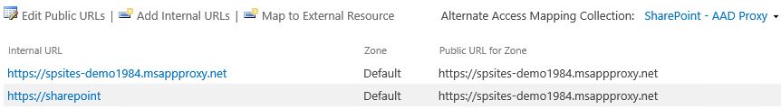
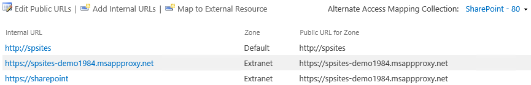

# Enable remote access to SharePoint with Azure AD Application Proxy

This step by step guide explains how to integrate an on-premises SharePoint farm with Azure Active Directory (Azure AD) Application Proxy.

## Prerequisites

To perform the configuration, you need the following resources:
- A SharePoint 2013 farm or newer.
- An Azure Active Directory tenant with a plan that includes Application Proxy. Learn more about the [Azure Active Directory plans and pricing](https://azure.microsoft.com/pricing/details/active-directory/).
- A [custom verified domain](../fundamentals/add-custom-domain.md) in the Azure AD tenant.
- On-premises Active Directory synchronized with Azure AD Connect with users able to [sign in to Azure](../hybrid/plan-connect-user-signin.md).
- An Application Proxy connector installed and running on a machine within the corporate domain.

Configuring SharePoint with Application Proxy requires two URLs:
- An external URL, visible to end-users and determined in Azure Active Directory. This URL may use a custom domain. Learn more about [Working with custom domains in Azure AD Application Proxy](application-proxy-configure-custom-domain.md).
- An internal URL, known only within the corporate domain and never used directly.

> [!IMPORTANT]
> To ensure that the links are mapped correctly, follow these recommendations for the internal URL:
> - Use HTTPS
> - Do not use custom ports
> - In the corporate DNS, create a Host (A) to point to the SharePoint WFE (or load balancer), and not an Alias (CName)

In this article, the following values will be used:
- Internal URL: `https://sharepoint`
- External URL: `https://spsites-demo1984.msappproxy.net/`
- Application pool account for the SharePoint web application: `Contoso\spapppool`

## Step 1: Configure an application in Azure AD that uses Application Proxy

In this step, you create an application in your Azure Active Directory tenant that will use Application Proxy. You will set the external URL and specify the internal URL, both used later in SharePoint.

1. Create the app as described with the following settings. For step-by-step instructions, see [Publishing applications using Azure AD Application Proxy](application-proxy-add-on-premises-application.md#add-an-on-premises-app-to-azure-ad).
   * **Internal URL**: SharePoint Internal URL that will be set later in SharePoint, such as `https://sharepoint`.
   * **Pre-authentication Method**: Azure Active Directory
   * **Translate URL in Headers**: No
   * **Translate URL in Application Body**: No

   

1. Once your app is published, configure the single sign-on settings with the following steps:

   1. On the application page in the portal, select **Single sign-on**.
   1. For **Single Sign-on Mode**, select **Integrated Windows Authentication**.
   1. Set **Internal Application SPN** to the value you set earlier. For this example, the value would be `HTTP/sharepoint`.
   1. In **Delegated Login Identity**, select the most suitable option for your Active Directory forest configuration. For example if you have a single AD domain in your forest, select **On-premises SAM account name** (as shown below), but if your users are not in the same domain as SharePoint and the Application Proxy Connector servers, select **On-premises user principal name** (not shown).

   

1. To finish setting up your application, go to the **Users and groups** section and assign users to access this application. 

## Step 2: Configure the SharePoint web application

The SharePoint web application must be configured with Kerberos and the appropriate alternate access mappings to work correctly with Azure AD Application Proxy. There are two possible options:

1. Create a new web application and use only the Default zone. This is the preferred option to have the best experience with SharePoint (for example, the links in the email alerts generated by SharePoint always point to the Default zone).
1. Extend an existing web application to configure Kerberos on a non-default zone.

> [!IMPORTANT]
> Regardless of the zone that will be used, the application pool account of the SharePoint web application must be a domain account for Kerberos to work correctly.

### Provision the SharePoint web application

- If you create a new web application and use only the Default zone (preferred option):

    1. Start the **SharePoint Management Shell** and run the following script:

       ```powershell
       # This script creates a web application and configures the Default zone with the internal/external URL needed to work with Azure AD Application Proxy
       # Edit variables below to fit your environment. Note that the managed account must exist and it must be a domain account
       $internalUrl = "https://sharepoint"
       $externalUrl = "https://spsites-demo1984.msappproxy.net/"
       $applicationPoolManagedAccount = "Contoso\spapppool"
            
       $winAp = New-SPAuthenticationProvider -UseWindowsIntegratedAuthentication -DisableKerberos:$false
       $wa = New-SPWebApplication -Name "SharePoint - AAD Proxy" -Port 443 -SecureSocketsLayer -URL $externalUrl -ApplicationPool "SharePoint - AAD Proxy" -ApplicationPoolAccount (Get-SPManagedAccount $applicationPoolManagedAccount) -AuthenticationProvider $winAp
       New-SPAlternateURL -Url $internalUrl -WebApplication $wa -Zone Default -Internal
       ```

    1. Open the **SharePoint Central Administration** site.
    1. Under **System Settings**, select **Configure Alternate Access Mappings**. The Alternate Access Mappings box opens.
    1. Filter the display with the new web application and confirm you see something like this:

       

- If you extend an existing web application to a new zone (in case you cannot use the Default zone):

    1. Start the **SharePoint Management Shell** and run the following script:

       ```powershell
       # This scripts extends an existing web application to Internet zone with the internal/external URL needed to work with Azure AD Application Proxy
       # Edit variables below to fit your environment
       $webAppUrl = "http://spsites/"
       $internalUrl = "https://sharepoint"
       $externalUrl = "https://spsites-demo1984.msappproxy.net/"
       
       $winAp = New-SPAuthenticationProvider -UseWindowsIntegratedAuthentication -DisableKerberos:$false
       $wa = Get-SPWebApplication $webAppUrl
       New-SPWebApplicationExtension -Name "SharePoint - AAD Proxy" -Identity $wa -SecureSocketsLayer -Zone Extranet -Url $externalUrl -AuthenticationProvider $winAp
       New-SPAlternateURL -Url $internalUrl -WebApplication $wa -Zone Extranet -Internal
       ```

    1. Open the **SharePoint Central Administration** site.
    1. Under **System Settings**, select **Configure Alternate Access Mappings**. The Alternate Access Mappings box opens.
    1. Filter the display with the web application that was extended and confirm you see something like this:

        

### Ensure that the SharePoint web application is running under a domain account

Use the following steps to identify the account running the application pool of the SharePoint web application, and ensure it is a domain account:

1. Open the **SharePoint Central Administration** site.
1. Go to **Security** and select **Configure service accounts**.
1. Select **Web Application Pool - YourWebApplicationName**.

   

1. Confirm that **Select an account for this component** returns a domain account, and remember it as it will be needed in the next step.

### Ensure that an HTTPS certificate is configured for the IIS site of the Extranet zone

Because the Internal URL uses HTTPS protocol (`https://SharePoint/`), a certificate must be set in the IIS site.

1. Open Windows PowerShell console.
1. Run the following script to generate a self-signed certificate and add it to the computer MY store:

   ```powershell
   # Replace "SharePoint" with the actual hostname of the Internal URL of your Azure AD proxy application
   New-SelfSignedCertificate -DnsName "SharePoint" -CertStoreLocation "cert:\LocalMachine\My"
   ```

   > [!IMPORTANT]
   > Self-signed certificates are suitable only for test purposes. In production environments, it is strongly recommended to use certificates issued by a certificate authority instead.

1. Open "Internet Information Services Manager" console.
1. Expand the server in the tree view, expand "Sites", select the site "SharePoint - AAD Proxy" and click on **Bindings**.
1. Select https binding and click **Edit...**.
1. In SSL certificate field, choose **SharePoint** certificate and click OK.

You can now access the SharePoint site externally via Azure AD Application Proxy.

## Step 3: Configure Kerberos Constrained Delegation (KCD)

Users will initially authenticate in Azure Active Directory, then to SharePoint using Kerberos through the Azure AD Proxy connector. To allow the connector to obtain a Kerberos token on behalf of the Azure Active Directory user, it is required to configure Kerberos Constrained Delegation with protocol transition. To learn more about KCD, see [Kerberos Constrained Delegation Overview](https://docs.microsoft.com/previous-versions/windows/it-pro/windows-server-2012-R2-and-2012/jj553400(v=ws.11)).

### Set the service principal name for the SharePoint service account

In this article, the internal URL is `https://sharepoint`, so the SPN is `HTTP/sharepoint`. You need to replace those values with the ones corresponding to your environment.
To register SPN `HTTP/sharepoint` for the SharePoint application pool account `Contoso\spapppool`, run the following command from a command prompt, as an administrator of the domain:

`setspn -S HTTP/sharepoint Contoso\spapppool`

The Setspn command searches for the SPN before it adds it. If it already exists, you will see a **Duplicate SPN Value** error. In this case, consider removing the existing SPN if it's not set under the correct application pool account.  
You can verify that the SPN was added successfully by running the Setspn command with the -L option. To learn more about this command, see [Setspn](https://docs.microsoft.com/previous-versions/windows/it-pro/windows-server-2012-R2-and-2012/cc731241(v=ws.11)).

### Ensure that the connector is trusted for delegation to the SPN added to the SharePoint application pool account

Configure the KCD so that the Azure AD Application Proxy service can delegate user identities to the SharePoint application pool account. Configure KCD by enabling the Application Proxy connector to retrieve Kerberos tickets for your users who have been authenticated in Azure AD. Then that server passes the context to the target application, or SharePoint in this case.

To configure the KCD, repeat the following steps for each connector machine:

1. Sign in to a domain controller as a domain administrator, and then open **Active Directory Users and Computers**.
1. Find the computer running the Azure AD Proxy connector. In this example, it's the SharePoint server itself.
1. Double-click the computer, and then click the **Delegation** tab.
1. Ensure that the delegation settings are set to **Trust this computer for delegation to the specified services only**. Then, select **Use any authentication protocol**.
1. Click the **Add** button, click **Users or Computers**, and locate the SharePoint application pool account, for example `Contoso\spapppool`.
1. In the list of SPNs, select the one that you created earlier for the service account.
1. Click **OK**. Click **OK** again to save the changes.
  
   

You are now ready to sign in to SharePoint using the external URL and authenticate with Azure.

## Troubleshoot sign-in errors

If sign-in to the site is not working, you can get more information about the issue in the Connector logs: From the machine running the connector, open the event viewer, go to **Applications and Services Logs** > **Microsoft** > **AadApplicationProxy** > **Connector**, and inspect the **Admin** log.

## Next steps

* [Working with custom domains in Azure AD Application Proxy](application-proxy-configure-custom-domain.md)
* [Understand Azure AD Application Proxy connectors](application-proxy-connectors.md)
