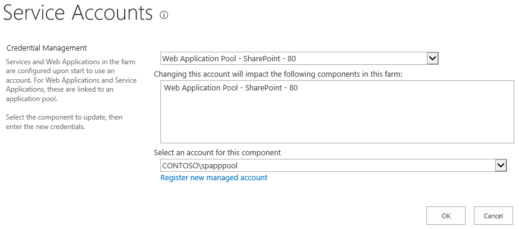
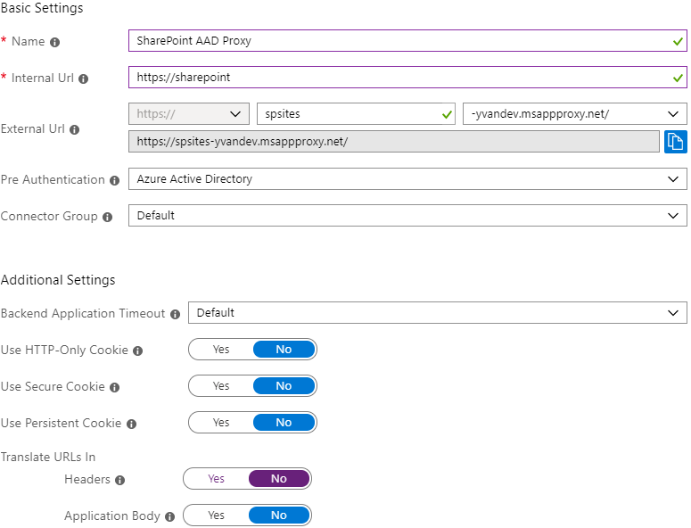
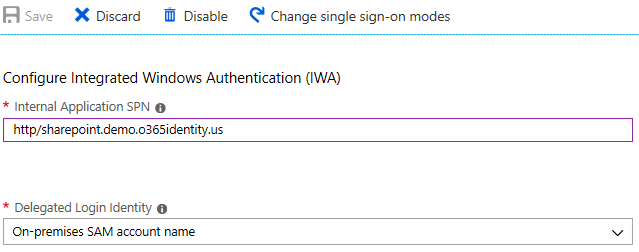
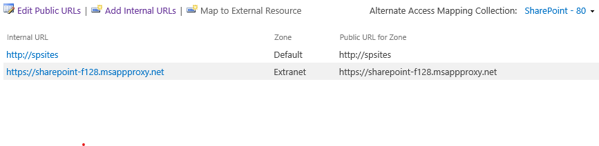
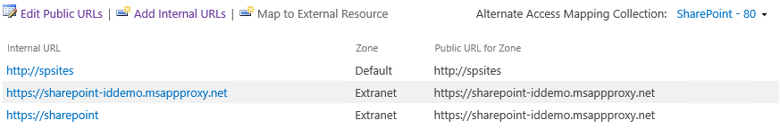

# Enable remote access to SharePoint with Azure AD Application Proxy

This article discusses how to integrate an on-premises SharePoint server with Azure Active Directory (Azure AD) Application Proxy.

To enable remote access to SharePoint with Azure AD Application Proxy, follow the sections in this article step by step.

## Prerequisites

This article assumes that you already have SharePoint 2013 or newer in your environment. In addition, consider the following prerequisites:

* SharePoint includes native Kerberos support. Therefore, users who are accessing internal sites remotely through Azure AD Application Proxy can assume to have a single sign-on (SSO) experience.
* This scenario includes configuration changes to your SharePoint server. We recommend using a staging environment. This way, you can make updates to your staging server first, and then facilitate a testing cycle before going into production.
* We require SSL on the published URL. SSL is also required on the internal URL to ensure that links are sent/mapped correctly.

## Step 1: Configure Kerberos Constrained Delegation (KCD)

For on-premises applications that use Windows authentication, you can achieve single sign-on (SSO) with the Kerberos authentication protocol and a feature called Kerberos constrained delegation (KCD). KCD, when configured, allows the Application Proxy connector to obtain a Windows token for a user, even if the user hasn’t signed in to Windows directly. To learn more about KCD, see [Kerberos Constrained Delegation Overview](https://technet.microsoft.com/library/jj553400.aspx).

To set up KCD for a SharePoint server, use the procedures in the following sequential sections:

### Ensure that SharePoint web application is running under a domain account

First, make sure that SharePoint web application is running under a domain account--not local system, local service, or network service. Do this so that you can attach service principal names (SPNs) to this account. SPNs are how the Kerberos protocol identifies different services. And you will need the account later to configure the KCD.

> [!NOTE]
> You need to have a previously created Azure AD account for the service. We suggest that you allow for an automatic password change. For more information about the full set of steps and troubleshooting issues, see [Configure automatic password change in SharePoint](https://technet.microsoft.com/library/ff724280.aspx).

To ensure that your sites are running under a defined service account, perform the following steps:

1. Open the **SharePoint Central Administration** site.
1. Go to **Security** and select **Configure service accounts**.
1. Select **Web Application Pool - SharePoint - 80**. The options may be slightly different based on the name of your web pool, or if the web pool uses SSL by default.

   

1. If **Select an account for this component** field is set to **Local Service** or **Network Service**, you need to create an account. If not, you're finished and can move to the next section.
1. Select **Register new managed account**. After your account is created, you must set **Web Application Pool** before you can use the account.

### Set a service principal name for the SharePoint service account

Before you configure KCD, you need to:

* Identify the domain account running the SharePoint web application that Azure AD Proxy will expose.
* Choose an Internal URL that will be configured in both Azure AD Proxy and SharePoint. This Internal URL must not already be used in the web application, and will never appear in the web browser.

Assuming the internal URL chosen is <https://sharepoint>, then the SPN is:

```
HTTP/SharePoint
```

> [!NOTE]
> Follow these recommendations for the internal URL:
> * Use HTTPS
> * Do not use custom ports
> * In the DNS, create a Host (A) to point to SharePoint WFE (or load balancer), and not an Alias (CName)

To register this SPN, run the following command from the command prompt as an administrator of the domain:

```
setspn -S HTTP/SharePoint demo\spAppPoolAccount
```

This command sets the SPN _HTTP/SharePoint_ for the SharePoint application pool account _demo\spAppPoolAccount_.

Replace _HTTP/SharePoint_ with the SPN for your internal URL and _demo\spAppPoolAccount_ with the application pool account in your environment. The Setspn command searches for the SPN before it adds it. In it already exists, you will see a **Duplicate SPN Value** error. In this case, consider to remove the existing SPN if it's not set under the correct application pool account.

You can verify that the SPN was added by running the Setspn command with the -L option. To learn more about this command, see [Setspn](https://technet.microsoft.com/library/cc731241.aspx).

### Ensure that the connector is trusted for delegation to the SPN added to the SharePoint application pool account

Configure the KCD so that the Azure AD Application Proxy service can delegate user identities to the SharePoint application pool account. Configure KCD by enabling the Application Proxy connector to retrieve Kerberos tickets for your users who have been authenticated in Azure AD. Then that server passes the context to the target application, or SharePoint in this case.

To configure the KCD, repeat the following steps for each connector machine:

1. Log in as a domain administrator to a DC, and then open **Active Directory Users and Computers**.
1. Find the computer that the connector is running on. In this example, it's the same SharePoint server.
1. Double-click the computer, and then click the **Delegation** tab.
1. Ensure that the delegation settings are set to **Trust this computer for delegation to the specified services only**. Then, select **Use any authentication protocol**.
1. Click the **Add** button, click **Users or Computers**, and locate the SharePoint application pool account, for example _demo\spAppPoolAccount_.
1. In the list of SPNs, select the one that you created earlier for the service account.
1. Click **OK**. Click **OK** again to save the changes.
  
   

## Step 2: Configure Azure AD Proxy

Now that you’ve configured KCD, you're ready to configure Azure AD Application Proxy.

1. Publish your SharePoint site with the following settings. For step-by-step instructions, see [Publishing applications using Azure AD Application Proxy](application-proxy-add-on-premises-application.md#add-an-on-premises-app-to-azure-ad).
   * **Internal URL**: SharePoint Internal URL that was chosen earlier, such as **<https://SharePoint/>**.
   * **Pre-authentication Method**: Azure Active Directory
   * **Translate URL in Headers**: NO

   > [!TIP]
   > SharePoint uses the _Host Header_ value to look up the site. It also generates links based on this value. The net effect is that any link that SharePoint generates is a published URL that is correctly set to use the external URL. Setting the value to **YES** also enables the connector to forward the request to the back-end application. However, setting the value to **NO** means that the connector will not send the internal host name. Instead, the connector sends the host header as the published URL to the back-end application.

   

1. Once your app is published, configure the single sign-on settings with the following steps:

   1. On the application page in the portal, select **Single sign-on**.
   1. For Single Sign-on Mode, select **Integrated Windows Authentication**.
   1. Set Internal Application SPN to the value that you set earlier. For this example, that would be **HTTP/SharePoint**.
   1. In "Delegated Login Identity", select the most suitable option for your Active Directory forest configuration. For example if you have a single AD domain in your forest, select **On-premises SAM account name** (as shown below), but if your users are not in the same domain as SharePoint and the App Proxy Connector servers then select **On-premises user principal name** (not shown).

   

1. To finish setting up your application, go to the **Users and groups** section and assign users to access this application. 

## Step 3: Configure SharePoint to use Kerberos and Azure AD Proxy URLs

Next step is to extend SharePoint web application to a new zone, configured with Kerberos and the appropriate alternate access mapping to allow SharePoint to handle incoming requests sent to the Internal URL, and respond with links built for the External URL.

1. Start the **SharePoint Management Shell**.
1. Run the following script to extend the web application to Extranet zone and enable Kerberos authentication:

   ```powershell
   # Replace "http://spsites/" with the URL of your web application
   # Replace "https://sharepoint-f128.msappproxy.net/" with the External URL in your Azure AD proxy application
   $winAp = New-SPAuthenticationProvider -UseWindowsIntegratedAuthentication -DisableKerberos:$false
   Get-SPWebApplication "http://spsites/" | New-SPWebApplicationExtension -Name "SharePoint - AAD Proxy" -SecureSocketsLayer -Zone "Extranet" -Url "https://sharepoint-f128.msappproxy.net/" -AuthenticationProvider $winAp
   ```

1. Open the **SharePoint Central Administration** site.
1. Under **System Settings**, select **Configure Alternate Access Mappings**. The Alternate Access Mappings box opens.
1. Select your site, for example **SharePoint - 80**. For the moment, Extranet zone doesn't have the Internal URL properly set yet:

   

1. Click **Add Internal URLs**.
1. In **URL protocol, host and port** textbox, type the **Internal URL** configured in Azure AD proxy, for example <https://SharePoint/>.
1. Select Zone **Extranet** in the drop-down list.
1. Click **Save**.
1. The Alternate Access Mappings should now look like this:

    

## Step 4: Ensure that an HTTPS certificate is configured for the IIS site of the Extranet zone

SharePoint configuration is now finished, but since the Internal URL of the Extranet zone is <https://SharePoint/>, a certificate must be set for this site.

1. Open Windows PowerShell console.
1. Run the following script to generate a self-signed certificate and add it to the computer MY store:

   ```powershell
   # Replace "SharePoint" with the actual hostname of the Internal URL of your Azure AD proxy application
   New-SelfSignedCertificate -DnsName "SharePoint" -CertStoreLocation "cert:\LocalMachine\My"
   ```

   > [!NOTE]
   > Self-signed certificates are suitable only for test purposes. In production environments, it is strongly recommended to use certificates issued by a certificate authority instead.

1. Open "Internet Information Services Manager" console.
1. Expand the server in the tree view, expand "Sites", select the site "SharePoint - AAD Proxy" and click on **Bindings**.
1. Select https binding and click **Edit...**.
1. In SSL certificate field, choose **SharePoint** certificate and click OK.

You can now access the SharePoint site externally via Azure AD Application Proxy.

## Next steps

* [Working with custom domains in Azure AD Application Proxy](application-proxy-configure-custom-domain.md)
* [Understand Azure AD Application Proxy connectors](application-proxy-connectors.md)
