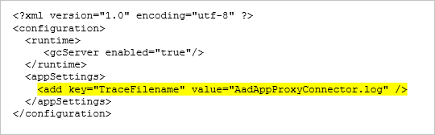

# Remove personal data for Azure Active Directory Application Proxy

Azure Active Directory Application Proxy requires that you install connectors on your devices, which means that there might be personal data on your devices. This article provides steps for how to delete that personal data to improve privacy.

## Where is the personal data?

It is possible for Application Proxy to write personal data to the following log types:

- Connector event logs
- Windows event logs

## Remove personal data from Windows event logs

For information on how to configure data retention for the Windows event logs, see [Settings for event logs](https://technet.microsoft.com/library/cc952132.aspx). To learn about Windows event logs, see [Using Windows Event Log](https://msdn.microsoft.com/library/windows/desktop/aa385772.aspx).

[!INCLUDE [GDPR-related guidance](../../../includes/gdpr-hybrid-note.md)]

## Remove personal data from Connector event logs

To ensure the Application Proxy logs do not have personal data, you can either:

- Delete or view data when needed, or
- Turn off logging

Use the following sections to remove personal data from connector event logs. You must complete the removal process for all devices on which the connector is installed.

[!INCLUDE [GDPR-related guidance](../../../includes/gdpr-intro-sentence.md)]

### View or export specific data

To view or export specific data, search for related entries in each of the connector event logs. The logs are located at `C:\ProgramData\Microsoft\Microsoft AAD Application Proxy Connector\Trace`.

Since the logs are text files, you can use [findstr](https://docs.microsoft.com/windows-server/administration/windows-commands/findstr) to search for text entries related to a user.  

To find personal data, search log files for UserID.

To find personal data logged by an application that uses Kerberos Constrained Delegation, search for these components of the username type:

- On-premises user principal name
- Username part of user principal name
- Username part of on-premises user principal name
- On-premises security accounts manager (SAM) account name

### Delete specific data

To delete specific data:

1. Restart the Microsoft Azure AD Application Proxy Connector service to generate a new log file. The new log file enables you to delete or modify the old log files. 
1. Follow the [View or export specific data](#view-or-export-specific-data) process described previously to find information that needs to be deleted. Search all of the connector logs.
1. Either delete the relevant log files or selectively delete the fields that contain personal data. You can also delete all old log files if you don’t need them anymore.

### Turn off connector logs

One option to ensure the connector logs do not contain personal data is to turn off the log generation. To stop generating connector logs, remove the following highlighted line from `C:\Program Files\Microsoft AAD App Proxy Connector\ApplicationProxyConnectorService.exe.config`.

## Next steps

For an overview of Application Proxy, see [How to provide secure remote access to on-premises applications](application-proxy.md).