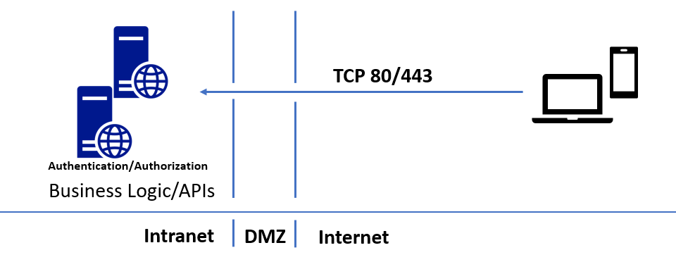
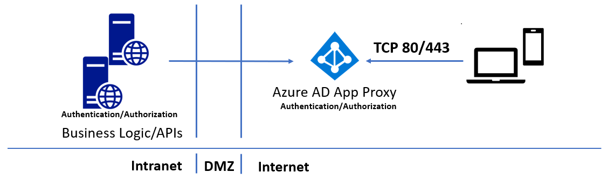
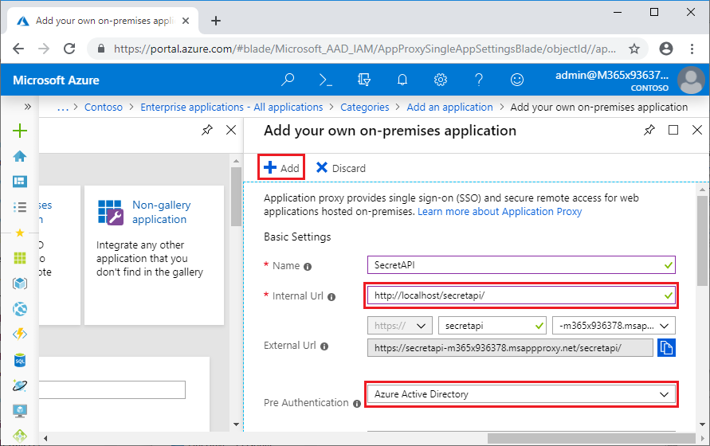
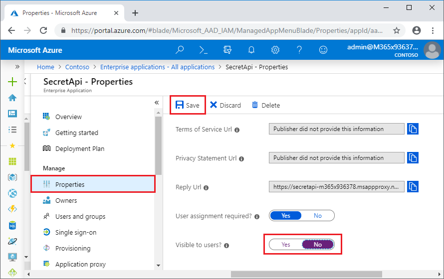
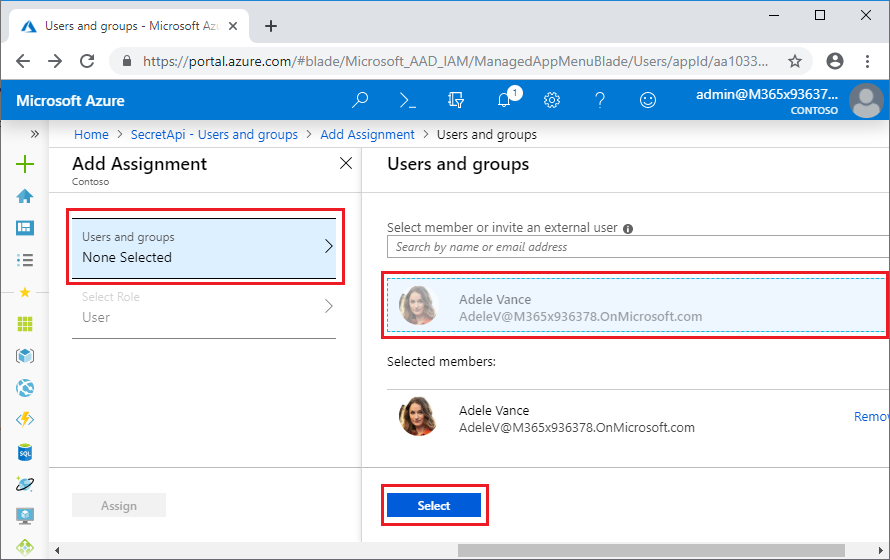
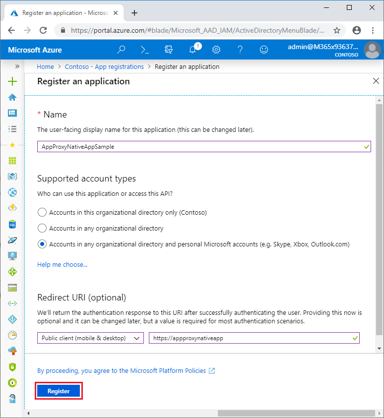
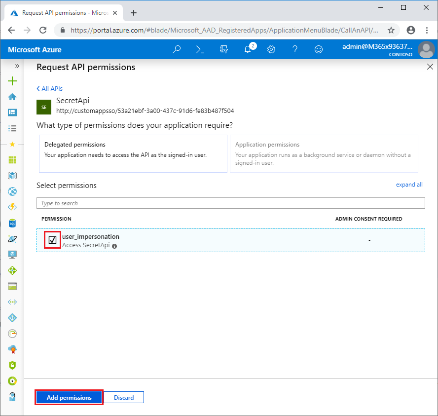
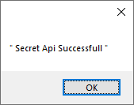

# Secure access to on-premises APIs with Azure AD Application Proxy

You may have business logic APIs running on-premises, or hosted on virtual machines in the cloud. Your native Android, iOS, Mac, or Windows apps need to interact with the API endpoints to use data or provide user interaction. Azure AD Application Proxy and the [Microsoft Authentication Library (MSAL)](/azure/active-directory/develop/active-directory-authentication-libraries) let your native apps securely access your on-premises APIs. Azure Active Directory Application Proxy is a faster and more secure solution than opening firewall ports and controlling authentication and authorization at the app layer.

This article walks you through setting up an Azure AD Application Proxy solution for hosting a web API service that native apps can access.

## Overview

The following diagram shows a traditional way to publish on-premises APIs. This approach requires opening incoming ports 80 and 443.



The following diagram shows how you can use Azure AD Application Proxy to securely publish APIs without opening any incoming ports:



The Azure AD Application Proxy forms the backbone of the solution, working as a public endpoint for API access, and providing authentication and authorization. You can access your APIs from a vast array of platforms by using the [ADAL](/azure/active-directory/develop/active-directory-authentication-libraries) libraries.

Since Azure AD Application Proxy authentication and authorization are built on top of Azure AD, you can use Azure AD Conditional Access to ensure only trusted devices can access APIs published through Application Proxy. Use Azure AD Join or Azure AD Hybrid Joined for desktops, and Intune Managed for devices. You can also take advantage of Azure Active Directory Premium features like Azure Multi-Factor Authentication, and the machine learning-backed security of [Azure Identity Protection](/azure/active-directory/active-directory-identityprotection).

## Prerequisites

To follow this walkthrough, you need:

- Admin access to an Azure directory, with an account that can create and register apps
- The sample web API and native client apps from [https://github.com/jeevanbisht/API-NativeApp-ADAL-SampleApp](https://github.com/jeevanbisht/API-NativeApp-ADAL-SampleApp)

## Publish the API through Application Proxy

To publish an API outside of your intranet through Application Proxy, you follow the same pattern as for publishing web apps. For more information, see [Tutorial: Add an on-premises application for remote access through Application Proxy in Azure Active Directory](application-proxy-add-on-premises-application.md).

To publish the SecretAPI web API through Application Proxy:

1. Build and publish the sample SecretAPI project as an ASP.NET web app on your local computer or intranet. Make sure you can access the web app locally.

1. In the [Azure portal](https://portal.azure.com), select **Azure Active Directory**. Then select **Enterprise applications**.

1. At the top of the **Enterprise applications - All applications** page, select **New application**.

1. On the **Add an application** page, select **On-premises applications**. The **Add your own on-premises application** page appears.

1. If you don't have an Application Proxy Connector installed, you'll be prompted to install it. Select **Download Application Proxy Connector** to download and install the connector.

1. Once you've installed the Application Proxy Connector, on the **Add your own on-premises application** page:

   1. Next to **Name**, enter *SecretAPI*.

   1. Next to **Internal Url**, enter the URL you use to access the API from within your intranet.

   1. Make sure **Pre-Authentication** is set to **Azure Active Directory**.

   1. Select **Add** at the top of the page, and wait for the app to be created.

   

1. On the **Enterprise applications - All applications** page, select the **SecretAPI** app.

1. On the **SecretAPI - Overview** page, select **Properties** in the left navigation.

1. You don't want APIs to be available to end users in the **MyApps** panel, so set **Visible to users** to **No** at the bottom of the **Properties** page, and then select **Save**.

   

You've published your web API through Azure AD Application Proxy. Now, add users who can access the app.

1. On the **SecretAPI - Overview** page, select **Users and groups** in the left navigation.

1. On the **Users and groups** page, select **Add user**.

1. On the **Add assignment** page, select **Users and groups**.

1. On the **Users and groups** page, search for and select users who can access the app, including at least yourself. After selecting all users, select **Select**.

   

1. Back on the **Add Assignment** page, select **Assign**.

> [!NOTE]
> APIs that use Integrated Windows Authentication might require [additional steps](/azure/active-directory/manage-apps/application-proxy-configure-single-sign-on-with-kcd).

## Register the native app and grant access to the API

Native apps are programs developed to use on a particular platform or device. Before your native app can connect and access an API, you must register it in Azure AD. The following steps show how to register a native app and give it access to the web API you published through Application Proxy.

To register the AppProxyNativeAppSample native app:

1. On the Azure Active Directory **Overview** page, select **App registrations**, and at the top of the **App registrations** pane, select **New registration**.

1. On the **Register an application** page:

   1. Under **Name**, enter *AppProxyNativeAppSample*.

   1. Under **Supported account types**, select **Accounts in any organizational directory and personal Microsoft accounts**.

   1. Under **Redirect URL**, drop down and select **Public client (mobile & desktop)**, and then enter *https://login.microsoftonline.com/common/oauth2/nativeclient*.

   1. Select **Register**, and wait for the app to be successfully registered.

      

You've now registered the AppProxyNativeAppSample app in Azure Active Directory. To give your native app access to the SecretAPI web API:

1. On the Azure Active Directory **Overview** > **App Registrations** page, select the **AppProxyNativeAppSample** app.

1. On the **AppProxyNativeAppSample** page, select **API permissions** in the left navigation.

1. On the **API permissions** page, select **Add a permission**.

1. On the first **Request API permissions** page, select the **APIs my organization uses** tab, and then search for and select **SecretAPI**.

1. On the next **Request API permissions** page, select the check box next to **user_impersonation**, and then select **Add permissions**.

    

1. Back on the **API permissions** page, you can select **Grant admin consent for Contoso** to prevent other users from having to individually consent to the app.

## Configure the native app code

The last step is to configure the native app. The following snippet from the *Form1.cs* file in the NativeClient sample app causes the ADAL library to acquire the token for requesting the API call, and attach it as bearer to the app header.

   ```
   // Acquire Access Token from AAD for Proxy Application
 IPublicClientApplication clientApp = PublicClientApplicationBuilder
.Create(<App ID of the Native app>)
.WithDefaultRedirectUri() // will automatically use the default Uri for native app
.WithAuthority("https://login.microsoftonline.com/{<Tenant ID>}")
.Build();

AuthenticationResult authResult = null;
var accounts = await clientApp.GetAccountsAsync();
IAccount account = accounts.FirstOrDefault();

IEnumerable<string> scopes = new string[] {"<Scope>"};

try
 {
    authResult = await clientApp.AcquireTokenSilent(scopes, account).ExecuteAsync();
 }
    catch (MsalUiRequiredException ex)
 {
     authResult = await clientApp.AcquireTokenInteractive(scopes).ExecuteAsync();                
 }
 
if (authResult != null)
 {
  //Use the Access Token to access the Proxy Application
  
  HttpClient httpClient = new HttpClient();
  HttpClient.DefaultRequestHeaders.Authorization = new AuthenticationHeaderValue("Bearer", authResult.AccessToken);
  HttpResponseMessage response = await httpClient.GetAsync("<Proxy App Url>");
 }
```

To configure the native app to connect to Azure Active Directory and call the API App Proxy, update the placeholder values in the *App.config* file of the NativeClient sample app with values from Azure AD:

- Paste the **Directory (tenant) ID** in the `<add key="ida:Tenant" value="" />` field. You can find and copy this value (a GUID) from the **Overview** page of either of your apps.

- Paste the AppProxyNativeAppSample **Application (client) ID** in the `<add key="ida:ClientId" value="" />` field. You can find and copy this value (a GUID) from the AppProxyNativeAppSample **Overview** page.

- Paste the AppProxyNativeAppSample **Redirect URI** in the `<add key="ida:RedirectUri" value="" />` field. You can find and copy this value (a URI) from the AppProxyNativeAppSample **Authentication** page.

- Paste the SecretAPI **Application ID URI** in the `<add key="todo:TodoListResourceId" value="" />` field. You can find and copy this value (a URI) from the SecretAPI **Expose an API** page.

- Paste the SecretAPI **Home Page URL** in the `<add key="todo:TodoListBaseAddress" value="" />` field. You can find and copy this value (a URL) from the SecretAPI **Branding** page.

After you configure the parameters, build and run the native app. When you select the **Sign In** button, the app lets you sign in, and then displays a success screen to confirm that it successfully connected to the SecretAPI.



## Next steps

- [Tutorial: Add an on-premises application for remote access through Application Proxy in Azure Active Directory](application-proxy-add-on-premises-application.md)
- [Quickstart: Configure a client application to access web APIs](../develop/quickstart-configure-app-access-web-apis.md)
- [How to enable native client applications to interact with proxy applications](application-proxy-configure-native-client-application.md)
