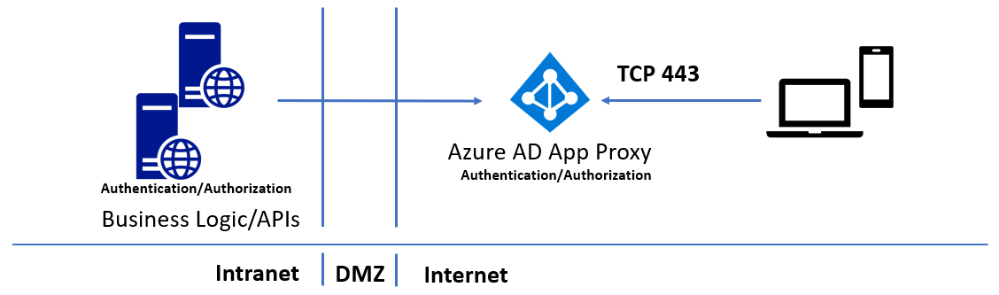
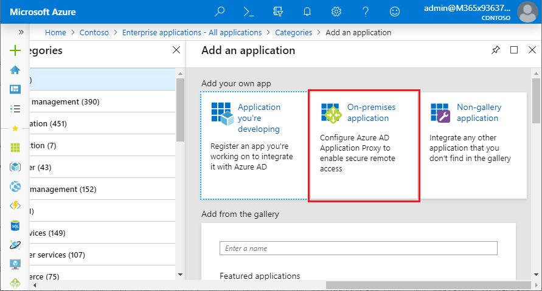
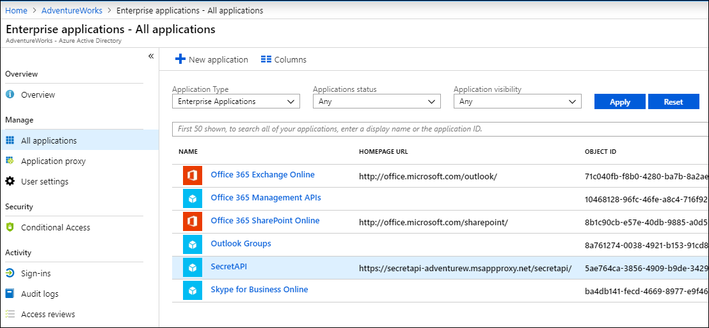
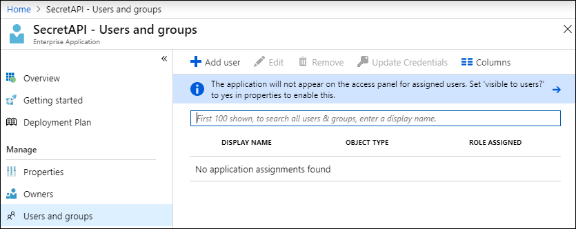
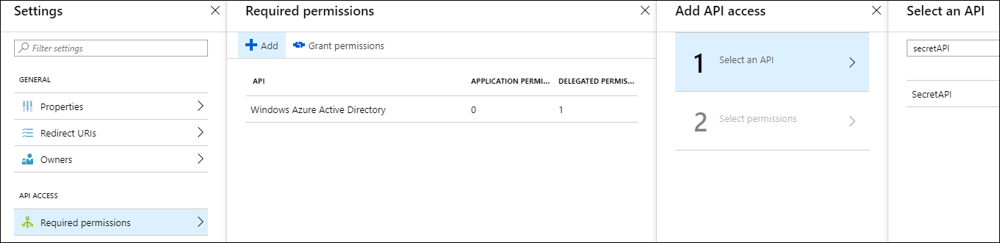
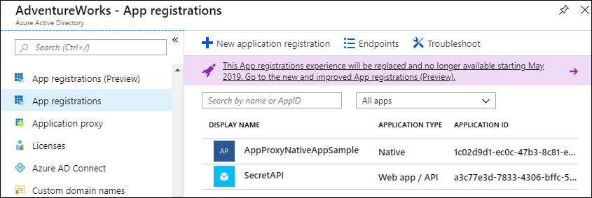
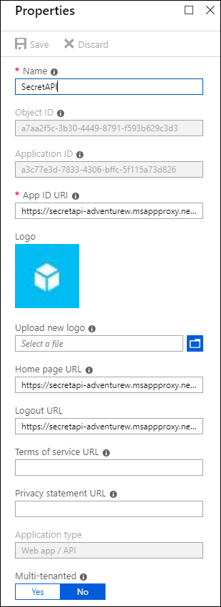
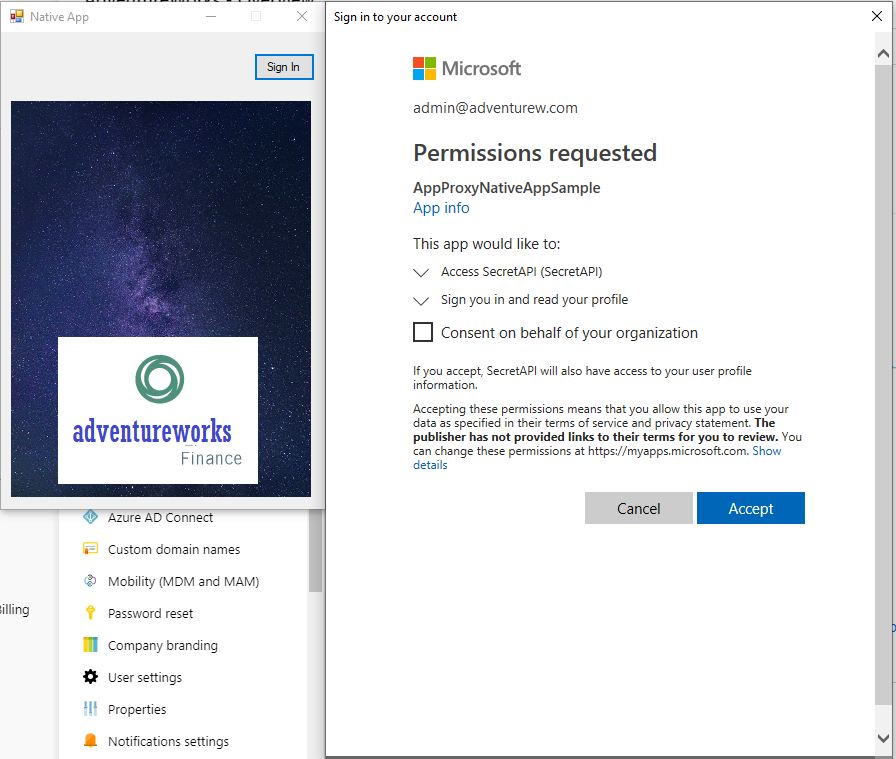

# Azure AD Application Proxy: Secure APIs walkthrough

Business logic and APIs may run on-premises, or be hosted in virtual machines in the cloud. Native Android, iOS, Mac, and Windows apps need to interact with these API endpoints to use data or provide user interaction. You can now use Azure AD Application Proxy and the [Azure Active Directory Authentication Libraries (ADAL)](/azure/active-directory/develop/active-directory-authentication-libraries) to securely access APIs hosted on-premises. Azure Active Directory Application Proxy is a faster and more secure solution than opening firewall ports and controlling authentication and authorization at the app layer. 

Since Azure AD Application Proxy authentication and authorization are built on top of Azure AD, you also use Azure AD conditional access to ensure that only trusted devices access APIs. You can use Azure AD Join or Azure AD Hybrid Joined for desktops, and Intune Managed for devices. You can also implement Azure Active Directory Premium features like Azure Multi-Factor Authentication, along with the machine learning-backed security of [Azure Identity Protection](/azure/active-directory/active-directory-identityprotection).

The following diagram shows a traditional way to publish on-premises APIs. This approach requires opening incoming ports 80 and 443.


The following diagram shows how to use the Azure AD Application Proxy to securely publish APIs without requiring any incoming ports:



The Azure AD Application Proxy forms the backbone of the solution, working as a public endpoint for API access, and providing authentication and authorization. You can access all your APIs from a vast array of platforms by using the [ADAL](/azure/active-directory/develop/active-directory-authentication-libraries) libraries. 

This article walks through an overview of the Azure AD Application Proxy solution. The example assumes that you host an API service on-premises. 

## Prerequisites

- Admin access to an Azure directory, with an account that can create and register apps
  - Azure free trial
  - Enterprise Mobility and Security E5 Free Trial

- **Azure AD Application Proxy Connector** installed. You can download and install it from [https://download.msappproxy.net/subscription/d3c8b69d-6bf7-42be-a529-3fe9c2e70c90/connector/download](https://download.msappproxy.net/subscription/d3c8b69d-6bf7-42be-a529-3fe9c2e70c90/connector/download).

- To follow the walkthrough, the sample web API and native client apps from [(https://github.com/jeevanbisht/API-NativeApp-ADAL-SampleApp)](https://github.com/jeevanbisht/API-NativeApp-ADAL-SampleApp) 

## Publish the API using the Application Proxy

To publish the API, you follow the same pattern as for publishing web apps. Follow these steps to publish your API outside of your intranet through the Application Proxy: 

1. From **Home** in the Azure portal, select **Azure Active Directory** in the left navigation.
   
1. On the **Overview** page, select **Enterprise applications** in the left navigation.
   
   
   
1. At the top of the **All applications** pane, select **New application**.
   
1. In the **Add an application** pane, under **Add your own app**, select **On-premises application**. 
   
   
   
1. On the **Add your own on-premises application** page:
   
   1. Enter *SecretAPI* next to **Name**.
      
   1. Enter the URL to access the API from within your intranet next to **Internal URL**. 
      
   1. Make sure **Pre-Authentication** is set to **Azure Active Directory**. 
      
   1. Select **Add** at the top of the page.
   
   
   
1. In the **All Enterprise Apps** pane, locate and select the new **SecretAPI** app. 
   
   
   
1. On the **SecretAPI - Overview** page, select **Properties** in the left navigation.
   
1. You do not want APIs to be available to end users in the **MyApps** panel. To hide the app from end users, at the bottom of the **Properties** page, set **Visible to users** to **No**, and then select **Save**.
   
   
   
1. In the left navigation, select **Users and groups**, and then select **Add user**. 
   
   
   
1. Select listed users, or search for and select users, who can access the app. For each user, select **Select**, and then select **Assign**. 
   
   
   
>[!NOTE]
>APIs that use Integrated Windows Authentication might require [additional steps](/azure/active-directory/manage-apps/application-proxy-configure-single-sign-on-with-kcd).

## Register a native app and grant access 

Native apps are programs developed to use on a particular platform or device. Before an app can connect and access an API, you must register it in Azure. The following steps show how to register a native app and allow it to access an API.

For more information, see [What is authentication](/azure/active-directory/develop/authentication-scenarios).

1. On the Azure Active Directory **Overview** page, select **App registrations**, and at the top of the pane, select **New application registration**.
   
1. On the **Create** page:
   
   1. Under **Name**, enter *AppProxyNativeAppSample*. 
      
   1. Under **Application type**, select **Native**. 
      
   1. Under **Redirect URL**, enter *http:\//appproxynativeapp*. 
      
   1. Select **Create**. 
      
      
   
1. On the new **AppProxyNativeAppSample** page, select *Settings**, and then under **API Access**, select **Required permissions**.
   
1. On the **Required permissions** page, select **Add**.
   
1. On the **Add API access** page, select **1 Select an API**. 
   
1. On the **Select an API** page, search for and select **SecretAPI**, and select **Select**. 
   
   
   
1. On the **Enable Access** page, select the checkbox next to **Access SecretAPI**, select **Select**, and then select **Done**.
   
1. On the **Required Permissions** page, select **Grant permissions**, and then select **Yes**.
   
   
   

## Configure the native app 

The last step is to identify and configure the native app. The app attaches the bearer token for requesting the API call to its header. The following snippet from the *Form1.cs* file in the example NativeClient app causes the ADAL library to acquire the token and attach it as bearer to the header. 
   
   ```csharp
       AuthenticationResult result = null;
       HttpClient httpClient = new HttpClient();
       authContext = new AuthenticationContext(authority);
       result = await authContext.AcquireTokenAsync(todoListResourceId, clientId, redirectUri, new PlatformParameters(PromptBehavior.Auto));
       
       // Append the token as bearer in the request header.
       httpClient.DefaultRequestHeaders.Authorization = new AuthenticationHeaderValue("Bearer", result.AccessToken);
       
       // Call the API.
       HttpResponseMessage response = await httpClient.GetAsync(todoListBaseAddress + "/api/values/4");
   
       //MessageBox.Show(response.RequestMessage.ToString());
       string s = await response.Content.ReadAsStringAsync();
       MessageBox.Show(s);
   ```
   
To configure the native app, update the placeholders in the *App.config* file of the NativeClient sample app. 

1. On the Azure Active Directory **Overview** page, select **App registrations**.
   
1. On the **App registrations** page, select **View all applications**, and then select each app in turn. 
   
   
   
1. On each app page, select **Settings**, and then select **Properties** in the left navigation.   
   
   1. For **SecretAPI**, copy the **App ID URI** and **Home Page URL**, and paste them into the `-- App Proxy Application App Uri --` and `-- App Proxy Application URL --` placeholders in the *App.config*. 
      
      
      
   1. For **AppProxyNativeAppSample**:
      - Copy the **Application ID** and paste it into the `--native client app id --` placeholder in the *App.config*. 
      - In the left navigation of the app, select **Redirect URIs**, copy the **http:\//appproxynativeapp** redirect, and paste it into the `--native client redirect Uri --` placeholder in the *App.config*. 
   
1. After you configure the parameters, build and run the native app, and confirm that it can successfully access the on-premises hosted API.
   
   
   

## Next steps


