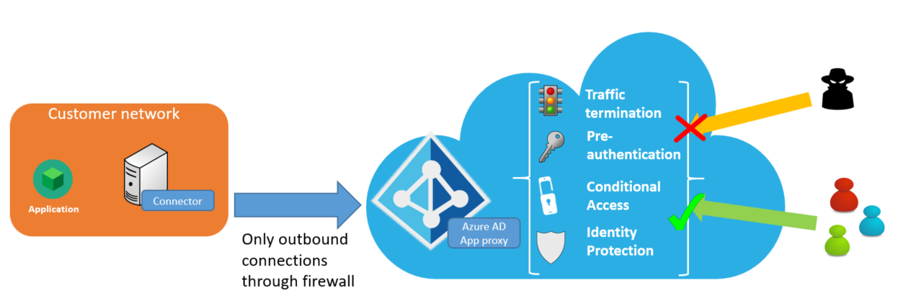

# Security considerations for accessing apps remotely with Azure AD Application Proxy

This article explains the components that work to keep your users and applications safe when you use Azure Active Directory Application Proxy.

The following diagram shows how Azure AD enables secure remote access to your on-premises applications.

 

## Security benefits

Azure AD Application Proxy offers the following security benefits:

### Authenticated access 

If you choose to use Azure Active Directory preauthentication, then only authenticated connections can access your network.

Azure AD Application Proxy relies on the Azure AD security token service (STS) for all authentication.  Preauthentication, by its very nature, blocks a significant number of anonymous attacks, because only authenticated identities can access the back-end application.

If you choose Passthrough as your preauthentication method, you don't get this benefit. 

### Conditional Access

Apply richer policy controls before connections to your network are established.

With [Conditional Access](../conditional-access/concept-conditional-access-cloud-apps.md), you can define restrictions on how users are allowed to access your applications. You can create policies that restrict sign-ins based on location, strength of authentication, and user risk profile.

You can also use Conditional Access to configure Multi-Factor Authentication policies, adding another layer of security to your user authentications. Additionally, your applications can also be routed to Microsoft Cloud App Security via Azure AD Conditional Access to provide real-time monitoring and controls, via [access](https://docs.microsoft.com/cloud-app-security/access-policy-aad) and [session](https://docs.microsoft.com/cloud-app-security/session-policy-aad) policies

### Traffic termination

All traffic is terminated in the cloud.

Because Azure AD Application Proxy is a reverse-proxy, all traffic to back-end applications is terminated at the service. The session can get reestablished only with the back-end server, which means that your back-end servers are not exposed to direct HTTP traffic. This configuration means that you are better protected from targeted attacks.

### All access is outbound 

You don't need to open inbound connections to the corporate network.

Application Proxy connectors only use outbound connections to the Azure AD Application Proxy service, which means that there is no need to open firewall ports for incoming connections. Traditional proxies required a perimeter network (also known as *DMZ*, *demilitarized zone*, or *screened subnet*) and allowed access to unauthenticated connections at the network edge. This scenario required investments in web application firewall products to analyze traffic and protect the environment. With Application Proxy, you don't need a perimeter network because all connections are outbound and take place over a secure channel.

For more information about connectors, see [Understand Azure AD Application Proxy connectors](application-proxy-connectors.md).

### Cloud-scale analytics and machine learning 

Get cutting-edge security protection.

Because it's part of Azure Active Directory, Application Proxy can leverage [Azure AD Identity Protection](../active-directory-identityprotection.md), with data from the Microsoft Security Response Center and Digital Crimes Unit. Together we proactively identify compromised accounts and offer protection from high-risk sign-ins. We take into account numerous factors to determine which sign-in attempts are high risk. These factors include flagging infected devices, anonymizing networks, and atypical or unlikely locations.

Many of these reports and events are already available through an API for integration with your security information and event management (SIEM) systems.

### Remote access as a service

You don’t have to worry about maintaining and patching on-premises servers.

Unpatched software still accounts for a large number of attacks. Azure AD Application Proxy is an Internet-scale service that Microsoft owns, so you always get the latest security patches and upgrades.

To improve the security of applications published by Azure AD Application Proxy, we block web crawler robots from indexing and archiving your applications. Each time a web crawler robot tries to retrieve the robot's settings for a published app, Application Proxy replies with a robots.txt file that includes `User-agent: * Disallow: /`.

#### Azure DDoS protection service

Applications published through Application Proxy are protected against Distributed Denial of Service (DDoS) attacks. **Azure DDoS protection** is a service offered with the Azure platform to protect your Azure resources from denial of service attacks. The **Basic** service tier is automatically enabled, providing always-on traffic monitoring and real-time mitigation of common network-level attacks. A **Standard** tier is also available, offering additional mitigation capabilities that are tuned specifically to Azure Virtual Network resources. For details, see [Azure DDoS Protection Standard overview](https://docs.microsoft.com/azure/virtual-network/ddos-protection-overview).

## Under the hood

Azure AD Application Proxy consists of two parts:

* The cloud-based service: This service runs in Azure, and is where the external client/user connections are made.
* [The on-premises connector](application-proxy-connectors.md): An on-premises component, the connector listens for requests from the Azure AD Application Proxy service and handles connections to the internal applications. 

A flow between the connector and the Application Proxy service is established when:

* The connector is first set up.
* The connector pulls configuration information from the Application Proxy service.
* A user accesses a published application.

>[!NOTE]
>All communications occur over TLS, and they always originate at the connector to the Application Proxy service. The service is outbound only.

The connector uses a client certificate to authenticate to the Application Proxy service for nearly all calls. The only exception to this process is the initial setup step, where the client certificate is established.

### Installing the connector

When the connector is first set up, the following flow events take place:

1. The connector registration to the service happens as part of the installation of the connector. Users are prompted to enter their Azure AD admin credentials. The token acquired from this authentication is then presented to the Azure AD Application Proxy service.
2. The Application Proxy service evaluates the token. It checks whether the user is a company administrator in the tenant. If the user is not an administrator, the process is terminated.
3. The connector generates a client certificate request and passes it, along with the token, to the Application Proxy service. The service in turn verifies the token and signs the client certificate request.
4. The connector uses the client certificate for future communication with the Application Proxy service.
5. The connector performs an initial pull of the system configuration data from the service using its client certificate, and it is now ready to take requests.

### Updating the configuration settings

Whenever the Application Proxy service updates the configuration settings, the following flow events take place:

1. The connector connects to the configuration endpoint within the Application Proxy service by using its client certificate.
2. After the client certificate is validated, the Application Proxy service returns configuration data to the connector (for example, the connector group that the connector should be part of).
3. If the current certificate is more than 180 days old, the connector generates a new certificate request, which effectively updates the client certificate every 180 days.

### Accessing published applications

When users access a published application, the following events take place between the Application Proxy service and the Application Proxy connector:

1. The service authenticates the user for the app
2. The service places a request in the connector queue
3. A connector processes the request from the queue
4. The connector waits for a response
5. The service streams data to the user

To learn more about what takes place in each of these steps, keep reading.

#### 1. The service authenticates the user for the app

If you configured the app to use Passthrough as its preauthentication method, the steps in this section are skipped.

If you configured the app to preauthenticate with Azure AD, users are redirected to the Azure AD STS to authenticate, and the following steps take place:

1. Application Proxy checks for any Conditional Access policy requirements for the specific application. This step ensures that the user has been assigned to the application. If two-step verification is required, the authentication sequence prompts the user for a second authentication method.

2. After all checks have passed, the Azure AD STS issues a signed token for the application and redirects the user back to the Application Proxy service.

3. Application Proxy verifies that the token was issued to the correct application. It performs other checks also, such as ensuring that the token was signed by Azure AD, and that it is still within the valid window.

4. Application Proxy sets an encrypted authentication cookie to indicate that authentication to the application has occurred. The cookie includes an expiration timestamp that's based on the token from Azure AD and other data, such as the user name that the authentication is based on. The cookie is encrypted with a private key known only to the Application Proxy service.

5. Application Proxy redirects the user back to the originally requested URL.

If any part of the preauthentication steps fails, the user’s request is denied, and the user is shown a message indicating the source of the problem.

#### 2. The service places a request in the connector queue

Connectors keep an outbound connection open to the Application Proxy service. When a request comes in, the service queues up the request on one of the open connections for the connector to pick up.

The request includes items from the application, such as the request headers, data from the encrypted cookie, the user making the request, and the request ID. Although data from the encrypted cookie is sent with the request, the authentication cookie itself is not.

#### 3. The connector processes the request from the queue. 

Based on the request, Application Proxy performs one of the following actions:

* If the request is a simple operation (for example, there is no data within the body as is with a RESTful *GET* request), the connector makes a connection to the target internal resource and then waits for a response.

* If the request has data associated with it in the body (for example, a RESTful *POST* operation), the connector makes an outbound connection by using the client certificate to the Application Proxy instance. It makes this connection to request the data and open a connection to the internal resource. After it receives the request from the connector, the Application Proxy service begins accepting content from the user and forwards data to the connector. The connector, in turn, forwards the data to the internal resource.

#### 4. The connector waits for a response.

After the request and transmission of all content to the back end is complete, the connector waits for a response.

After it receives a response, the connector makes an outbound connection to the Application Proxy service, to return the header details and begin streaming the return data.

#### 5. The service streams data to the user. 

Some processing of the application may occur here. If you configured Application Proxy to translate headers or URLs in your application, that processing happens as needed during this step.

## Next steps

[Network topology considerations when using Azure AD Application Proxy](application-proxy-network-topology.md)

[Understand Azure AD Application Proxy connectors](application-proxy-connectors.md)
