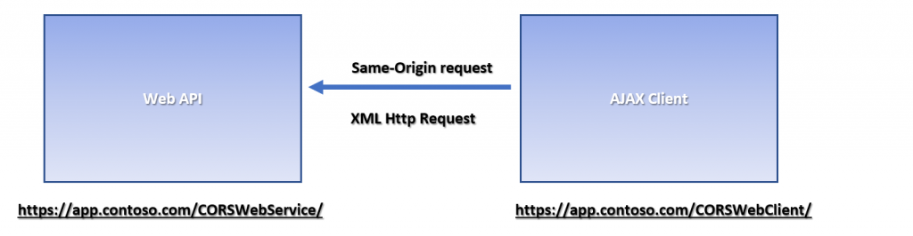
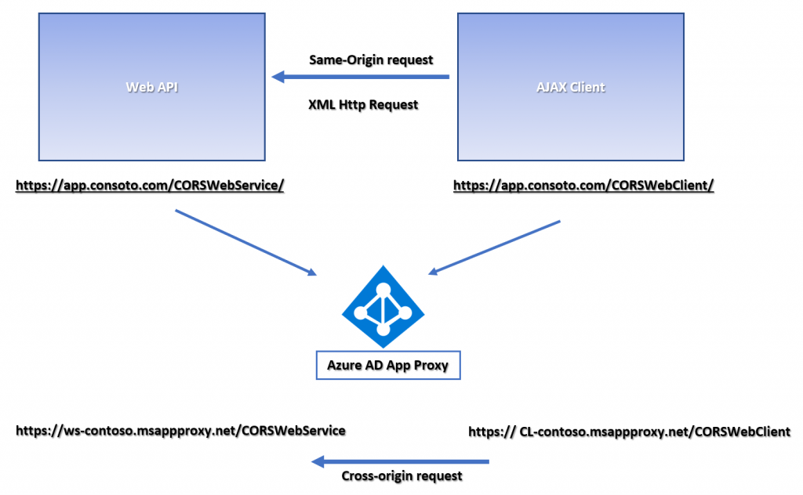
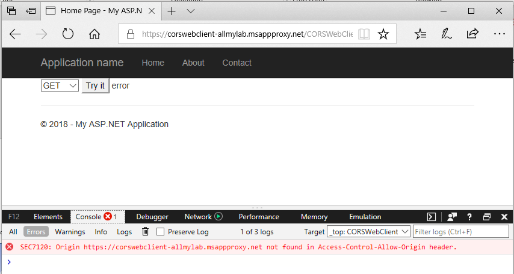
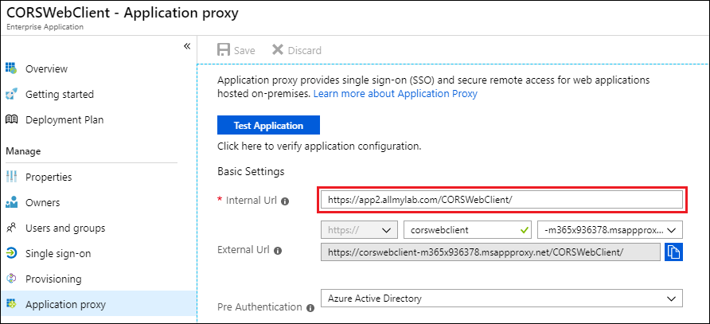
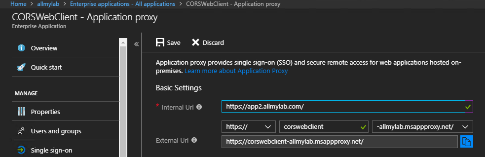
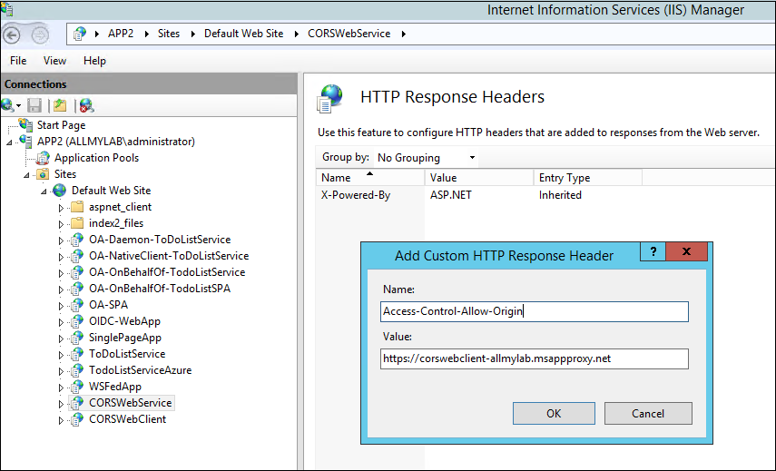

# Understand and solve Azure Active Directory Application Proxy CORS issues

[Cross-origin resource sharing (CORS)](http://www.w3.org/TR/cors/) can sometimes present challenges for the apps and APIs you publish through the Azure Active Directory Application Proxy. This article discusses Azure AD Application Proxy CORS issues and solutions.

Browser security usually prevents a web page from making AJAX requests to another domain. This restriction is called the *same-origin policy*, and prevents a malicious site from reading sensitive data from another site. However, sometimes you might want to let other sites call your web API. CORS is a W3C standard that lets a server relax the same-origin policy and explicitly allow some cross-origin requests while rejecting others.

## CORS challenges with Application Proxy

Two URLs have the same origin if they have identical schemes, hosts, and ports ([RFC 6454](https://tools.ietf.org/html/rfc6454)), such as:

-   http:\//contoso.com/foo.html
-   http:\//contoso.com/bar.html

The following URLs have different origins than the previous two:

-   http:\//contoso.net - Different domain
-   http:\//contoso.com:9000/foo.html - Different port
-   https:\//contoso.com/foo.html - Different scheme
-   http:\//www.contoso.com/foo.html - Different subdomain

The following example shows a typical Azure AD Application Proxy CORS scenario. The internal server hosts a **CORSWebService** web API controller, and a **CORSWebClient** that calls **CORSWebService**. There is an AJAX request from **CORSWebClient** to **CORSWebService**.

The CORSWebClient app may work when you host it on premises, but either fail to load or error out when you publish it via Azure AD Application Proxy. If you published the *CORSWebClient* directory separately through Application Proxy, the AJAX request from *CORSWebClient* to other directories or domains like *CORSWebService* is cross-origin, and it fails.

You can identify CORS issues by using browser debug tools:

1. Launch the browser and browse to the web app.
1. Press **F12** to bring up the debug console.
1. Try to reproduce the transaction, and review the console message. A CORS violation gives a console error about origin.

In the following example, the cross-origin call happens on the **Try It** button click. Instead of the test message, there's an error that https:\//corswebclient-contoso.msappproxy.net is missing from the Access-Control-Allow-Origin header.

## Solutions for Application Proxy CORS issues

You can resolve the preceding CORS issue in any one of several ways.

### Option 1: Custom domains

Use an Azure AD Application Proxy [custom domain](https://docs.microsoft.com/en-us/azure/active-directory/active-directory-application-proxy-custom-domains) to publish from the same origin, without having to make any changes to app origins, code, or headers. 

### Option 2: Publish the parent directory

Publish the parent directory of both apps. This solution works especially well if you only have two apps on the web server. Instead of publishing each app separately, you can publish the common parent directory to result in the same origin.

In the following example, the CORSWebClient app published from *contoso.com/CORSWebClient* can't access resources from *contoso.com/CORSWebService* because of the CORS issue:

Instead, you can publish the parent directory, which includes both the *CORSWebClient* and *CORSWebService* directories:

The resulting app URLs effectively resolve the CORS issue:

- https:\//corswebclient-contoso.msappproxy.net/CORSWebService
- https:\//corswebclient-contoso.msappproxy.net/CORSWebClient

### Option 3: Update HTTP headers

Add a custom HTTP response header on the web service to match the origin request. For websites running in Internet Information Services (IIS), use IIS Manager to modify the header:

This modification doesn't require any code changes. You can verify it in the Fiddler traces:

**Post the Header Addition**\
HTTP/1.1 200 OK\
Cache-Control: no-cache\
Pragma: no-cache\
Content-Type: text/plain; charset=utf-8\
Expires: -1\
Vary: Accept-Encoding\
Server: Microsoft-IIS/8.5 Microsoft-HTTPAPI/2.0\
**Access-Control-Allow-Origin: https://corswebclient-contoso.msappproxy.net**\
X-AspNet-Version: 4.0.30319\
X-Powered-By: ASP.NET\
Content-Length: 17

### Option 4: Modify the app

You can change your app to support CORS by adding the Access-Control-Allow-Origin header, with appropriate values. The way to add the header depends on the app's code language. Changing the code is the least recommended option, because it requires the most effort.

## See also
- [Tutorial: Add an on-premises application for remote access through Application Proxy in Azure Active Directory](application-proxy-add-on-premises-application.md) 
- [Plan an Azure AD Application Proxy deployment](application-proxy-deployment-plan.md) 
- [Remote access to on-premises applications through Azure Active Directory Application Proxy](application-proxy.md) 
