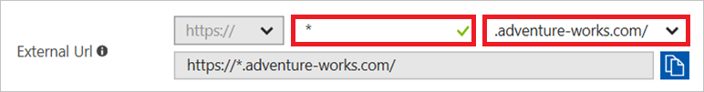
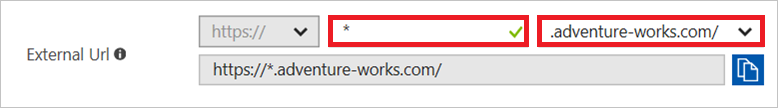
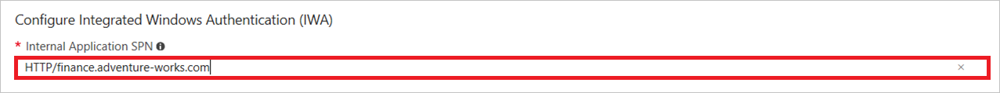
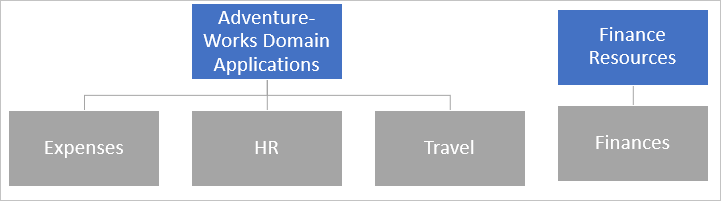

# Wildcard applications in the Azure Active Directory application proxy

In Azure Active Directory (Azure AD), configuring a large number of on-premises applications can quickly become unmanageable and introduces unnecessary risks for configuration errors if many of them require the same settings. With [Azure AD Application Proxy](application-proxy.md), you can address this issue by using wildcard application publishing to publish and manage many applications at once. This is a solution that allows you to:

- Simplify your administrative overhead
- Reduce the number of potential configuration errors
- Enable your users to securely access more resources

This article provides you with the information you need to configure wildcard application publishing in your environment.

## Create a wildcard application

You can create a wildcard (*) application if you have a group of applications with the same configuration. Potential candidates for a wildcard application are applications sharing the following settings:

- The group of users having access to them
- The SSO method
- The access protocol (http, https)

You can publish applications with wildcards if both, the internal and external URLs are in the following format:

> http(s)://*.\<domain\>

For example: `http(s)://*.adventure-works.com`.

While the internal and external URLs can use different domains, as a best practice, they should be same. When publishing the application, you see an error if one of the URLs doesn't have a wildcard.

Creating a wildcard application is based on the same [application publishing flow](application-proxy-add-on-premises-application.md) that is available for all other applications. The only difference is that you include a wildcard in the URLs and potentially the SSO configuration.

## Prerequisites

To get started, make sure you've met these requirements.

### Custom domains

While [custom domains](application-proxy-configure-custom-domain.md) are optional for all other applications, they are a prerequisite for wildcard applications. Creating custom domains requires you to:

1. Create a verified domain within Azure.
1. Upload a TLS/SSL certificate in the PFX format to your application proxy.

You should consider using a wildcard certificate to match the application you plan to create. Alternatively, you can also use a certificate that only lists specific applications. In this case, only the applications listed in the certificate will be accessible through this wildcard application.

For security reasons, this is a hard requirement and we will not support wildcards for applications that cannot use a custom domain for the external URL.

### DNS updates

When using custom domains, you need to create a DNS entry with a CNAME record for the external URL (for example,  `*.adventure-works.com`) pointing to the external URL of the application proxy endpoint.For wildcard applications, the CNAME record needs to point to the relevant external URLs:

> `<yourAADTenantId>.tenant.runtime.msappproxy.net`

To confirm that you have configured your CNAME correctly, you can use [nslookup](https://docs.microsoft.com/windows-server/administration/windows-commands/nslookup) on one of the target endpoints, for example, `expenses.adventure-works.com`.  Your response should include the already mentioned alias (`<yourAADTenantId>.tenant.runtime.msappproxy.net`).

## Considerations

Here are some considerations you should take into account for wildcard applications.

### Accepted formats

For wildcard applications, the **Internal URL** must be formatted as `http(s)://*.<domain>`.

When you configure an **External URL**, you must use the following format: `https://*.<custom domain>`

Other positions of the wildcard, multiple wildcards, or other regex strings are not supported and are causing errors.

### Excluding applications from the wildcard

You can exclude an application from the wildcard application by

- Publishing the exception application as regular application
- Enabling the wildcard only for specific applications through your DNS settings

Publishing an application as regular application is the preferred method to exclude an application from a wildcard. You should publish the excluded applications before the wildcard applications to ensure that your exceptions are enforced from the beginning. The most specific application will always take precedence – an application published as `budgets.finance.adventure-works.com` takes precedence over the application `*.finance.adventure-works.com`, which in turn takes precedence over the application `*.adventure-works.com`.

You can also limit the wildcard to only work for specific applications through your DNS management. As a best practice, you should create a CNAME entry that includes a wildcard and matches the format of the external URL you have configured. However, you can instead point specific application URLs to the wildcards. For example, instead of `*.adventure-works.com`, point `hr.adventure-works.com`, `expenses.adventure-works.com` and `travel.adventure-works.com individually` to `000aa000-11b1-2ccc-d333-4444eee4444e.tenant.runtime.msappproxy.net`.

If you use this option, you also need another CNAME entry for the value `AppId.domain`, for example, `00000000-1a11-22b2-c333-444d4d4dd444.adventure-works.com`, also pointing to the same location. You can find the **AppId** on the application properties page of the wildcard application:

### Setting the homepage URL for the MyApps panel

The wildcard application is represented with just one tile in the [MyApps panel](https://myapps.microsoft.com). By default this tile is hidden. To show the tile and have users land on a specific page:

1. Follow the guidelines for [setting a homepage URL](application-proxy-configure-custom-home-page.md).
1. Set **Show Application** to **true** on the application properties page.

### Kerberos constrained delegation

For applications using [kerberos constrained delegation (KCD) as the SSO method](application-proxy-configure-single-sign-on-with-kcd.md), the SPN listed for the SSO method may also need a wildcard. For example, the SPN could be: `HTTP/*.adventure-works.com`. You still need to have the individual SPNs configured on your backend servers (for example, `HTTP/expenses.adventure-works.com and HTTP/travel.adventure-works.com`).

## Scenario 1: General wildcard application

In this scenario, you have three different applications you want to publish:

- `expenses.adventure-works.com`
- `hr.adventure-works.com`
- `travel.adventure-works.com`

All three applications:

- Are used by all your users
- Use *Integrated Windows Authentication*
- Have the same properties

You can publish the wildcard application using the steps outlined in [Publish applications using Azure AD Application Proxy](application-proxy-add-on-premises-application.md). This scenario assumes:

- A tenant with the following ID: `000aa000-11b1-2ccc-d333-4444eee4444e`
- A verified domain called `adventure-works.com` has been configured.
- A **CNAME** entry that points `*.adventure-works.com` to `000aa000-11b1-2ccc-d333-4444eee4444e.tenant.runtime.msappproxy.net` has been created.

Following the [documented steps](application-proxy-add-on-premises-application.md), you create a new application proxy application in your tenant. In this example, the wildcard is in the following fields:

- Internal URL:

    

- External URL:

    

- Internal Application SPN:

    

By publishing the wildcard application, you can now access your three applications by navigating to the URLs you are used to (for example, `travel.adventure-works.com`).

The configuration implements the following structure:

| Color | Description |
| ---   | ---         |
| Blue  | Applications explicitly published and visible in the Azure portal. |
| Gray  | Applications you can accessible through the parent application. |

## Scenario 2: General wildcard application with exception

In this scenario, you have in addition to the three general applications another application, `finance.adventure-works.com`, which should only be accessible by Finance division. With the current application structure, your finance application would be accessible through the wildcard application and by all employees. To change this, you exclude your application from your wildcard by configuring Finance as a separate application with more restrictive permissions.

You need to make sure that a CNAME records exist that points `finance.adventure-works.com` to the application specific endpoint, specified on the Application Proxy page for the application. For this scenario, `finance.adventure-works.com` points to `https://finance-awcycles.msappproxy.net/`.

Following the [documented steps](application-proxy-add-on-premises-application.md), this scenario requires the following settings:

- In the **Internal URL**, you set **finance** instead of a wildcard.

    

- In the **External URL**, you set **finance** instead of a wildcard.

    

- Internal Application SPN you set **finance** instead of a wildcard.

    

This configuration implements the following scenario:

Because `finance.adventure-works.com` is a more specific URL than `*.adventure-works.com`, it takes precedence. Users navigating to `finance.adventure-works.com` have the experience specified in the Finance Resources application. In this case, only finance employees are able to access `finance.adventure-works.com`.

If you have multiple applications published for finance and you have `finance.adventure-works.com` as a verified domain, you could publish another wildcard application `*.finance.adventure-works.com`. Because this is more specific than the generic `*.adventure-works.com`, it takes precedence if a user accesses an application in the finance domain.

## Next steps

- To learn more about **Custom domains**, see [Working with custom domains in Azure AD Application Proxy](application-proxy-configure-custom-domain.md).
- To learn more about **Publishing applications**, see [Publish applications using Azure AD Application Proxy](application-proxy-add-on-premises-application.md)
