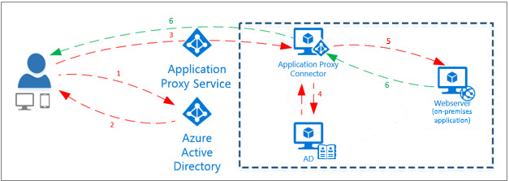

# Remote access to on-premises applications through Azure Active Directory's Application Proxy

Azure Active Directory's Application Proxy provides secure remote access to on-premises web applications. After a single sign-on to Azure AD, users can access both cloud and on-premises applications through an external URL or an internal application portal. For example, Application Proxy can provide remote access and single sign-on to Remote Desktop, SharePoint, Teams, Tableau, Qlik, and line of business (LOB) applications.

Azure AD Application Proxy is:

- **Simple to use**. Users can access your on-premises applications the same way they access O365 and other SaaS apps integrated with Azure AD. You don't need to change or update your applications to work with Application Proxy.

- **Secure**. On-premises applications can use Azure's authorization controls and security analytics. For example, on-premises applications can use Conditional Access and two-step verification. Application Proxy doesn't require you to open inbound connections through your firewall.

- **Cost-effective**. On-premises solutions typically require you to set up and maintain demilitarized zones (DMZs), edge servers, or other complex infrastructures. Application Proxy runs in the cloud, which makes it easy to use. To use Application Proxy, you don't need to change the network infrastructure or install additional appliances in your on-premises environment.

## What is Application Proxy?
Application Proxy is a feature of Azure AD that enables users to access on-premises web applications from a remote client. Application Proxy includes both the Application Proxy service which runs in the cloud, and the Application Proxy connector which runs on an on-premises server. Azure AD, the Application Proxy service, and the Application Proxy connector work together to securely pass the user sign-on token from Azure AD to the web application.

Application Proxy works with:

* Web applications that use [Integrated Windows Authentication](application-proxy-configure-single-sign-on-with-kcd.md) for authentication
* Web applications that use form-based or [header-based](application-proxy-configure-single-sign-on-with-ping-access.md) access
* Web APIs that you want to expose to rich applications on different devices
* Applications hosted behind a [Remote Desktop Gateway](application-proxy-integrate-with-remote-desktop-services.md)
* Rich client apps that are integrated with the Microsoft Authentication Library (MSAL)

Application Proxy supports single sign-on. For more information on supported methods, see [Choosing a single sign-on method](what-is-single-sign-on.md#choosing-a-single-sign-on-method).

Application Proxy is recommended for giving remote users access to internal resources. Application Proxy replaces the need for a VPN or reverse proxy. It is not intended for internal users on the corporate network.  These users who unnecessarily use Application Proxy can introduce unexpected and undesirable performance issues.

## How Application Proxy works

The following diagram shows how Azure AD and Application Proxy work together to provide single sign-on to on-premises applications.

1. After the user has accessed the application through an endpoint, the user is directed to the Azure AD sign-in page.
2. After a successful sign-in, Azure AD sends a token to the user's client device.
3. The client sends the token to the Application Proxy service, which retrieves the user principal name (UPN) and security principal name (SPN) from the token. Application Proxy then sends the request to the Application Proxy connector.
4. If you have configured single sign-on, the connector performs any additional authentication required on behalf of the user.
5. The connector sends the request to the on-premises application.
6. The response is sent through the connector and Application Proxy service to the user.

| Component | Description |
| --------- | ----------- |
| Endpoint  | The endpoint is a URL or an [end-user portal](end-user-experiences.md). Users can reach applications while outside of your network by accessing an external URL. Users within your network can access the application through a URL or an end-user portal. When users go to one of these endpoints, they authenticate in Azure AD and then are routed through the connector to the on-premises application.|
| Azure AD | Azure AD performs the authentication using the tenant directory stored in the cloud. |
| Application Proxy service | This Application Proxy service runs in the cloud as part of Azure AD. It passes the sign-on token from the user to the Application Proxy Connector. Application Proxy forwards any accessible headers on the request and sets the headers as per its protocol, to the client IP address. If the incoming request to the proxy already has that header, the client IP address is added to the end of the comma separated list that is the value of the header.|
| Application Proxy Connector | The connector is a lightweight agent that runs on a Windows Server inside your network. The connector manages communication between the Application Proxy service in the cloud and the on-premises application. The connector only uses outbound connections, so you don't have to open any inbound ports or put anything in the DMZ. The connectors are stateless and pull information from the cloud as necessary. For more information about connectors, like how they load-balance and authenticate, see [Understand Azure AD Application Proxy connectors](application-proxy-connectors.md).|
| Active Directory (AD) | Active Directory runs on-premises to perform authentication for domain accounts. When single sign-on is configured, the connector communicates with AD to perform any additional authentication required.
| On-premises application | Finally, the user is able to access an on-premises application.

## Next steps
To start using Application Proxy, see [Tutorial: Add an on-premises application for remote access through Application Proxy](application-proxy-add-on-premises-application.md).

