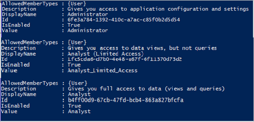

# Assign users and groups to an application

This article shows you how to assign users and groups to an enterprise application in Azure Active Directory (Azure AD) using PowerShell. When you assign a user to an application, the application appears in the user's [My Apps](https://myapps.microsoft.com/) portal for easy access. If the application exposes app roles, you can also assign a specific app role to the user.

When you assign a group to an application, only users in the group will have access. The assignment doesn't cascade to nested groups.

Group-based assignment requires Azure Active Directory Premium P1 or P2 edition. Group-based assignment is supported for Security groups only. Nested group memberships and Microsoft 365 groups aren't currently supported. For more licensing requirements for the features discussed in this article, see the [Azure Active Directory pricing page](https://azure.microsoft.com/pricing/details/active-directory). 

For greater control, certain types of enterprise applications can be configured to require user assignment. For more information on requiring user assignment for an app, see [Manage access to an application](what-is-access-management.md#requiring-user-assignment-for-an-app).

## Prerequisites

To assign users to an enterprise application, you need:

- An Azure AD account with an active subscription. If you don't already have one, you can [Create an account for free](https://azure.microsoft.com/free/?WT.mc_id=A261C142F).
- One of the following roles: Global Administrator, Cloud Application Administrator, Application Administrator, or owner of the service principal.
- Azure Active Directory Premium P1 or P2 for group-based assignment. For more licensing requirements for the features discussed in this article, see the [Azure Active Directory pricing page](https://azure.microsoft.com/pricing/details/active-directory).


:::zone pivot="portal"

To assign a user or group account to an enterprise application:

1. In the [Azure portal](https://portal.azure.com), select **Enterprise applications**, and then search for and select the application to which you want to assign the user or group account.
1. Browse to **Azure Active Directory** > **Users and groups**, and then select **Add user/group**.

    :::image type="content" source="media/add-application-portal-assign-users/assign-user.png" alt-text="Assign user account to an application in your Azure AD tenant.":::

1. On the **Add Assignment** pane, select **None Selected** under **Users and groups**.
1. Search for and select the user or group that you want to assign to the application. For example, `contosouser1@contoso.com` or `contosoteam1@contoso.com`.
1. Select **Select**.
1. On the **Add Assignment** pane, select **Assign** at the bottom of the pane.

:::zone-end

:::zone pivot="aad-powershell"

1. Open an elevated Windows PowerShell command prompt.
1. Run `Connect-AzureAD -Scopes "Application.Read.All", "Directory.Read.All", "Application.ReadWrite.All", "Directory.ReadWrite.All"` and sign in with a Global Administrator user account.
1. Use the following script to assign a user and role to an application:

    ```powershell
    # Assign the values to the variables
    $username = "<Your user's UPN>"
    $app_name = "<Your App's display name>"
    $app_role_name = "<App role display name>"

    # Get the user to assign, and the service principal for the app to assign to
    $user = Get-AzureADUser -ObjectId "$username"
    $sp = Get-AzureADServicePrincipal -Filter "displayName eq '$app_name'"
    $appRole = $sp.AppRoles | Where-Object { $_.DisplayName -eq $app_role_name }

    # Assign the user to the app role
    New-AzureADUserAppRoleAssignment -ObjectId $user.ObjectId -PrincipalId $user.ObjectId -ResourceId $sp.ObjectId -Id $appRole.Id
    ```

To assign a group to an enterprise app, you must replace `Get-AzureADUser` with `Get-AzureADGroup` and replace `New-AzureADUserAppRoleAssignment` with `New-AzureADGroupAppRoleAssignment`.

For more information about how to assign a group to an application role, see the documentation for [New-AzureADGroupAppRoleAssignment](/powershell/module/azuread/new-azureadgroupapproleassignment).

### Example

This example assigns the user Britta Simon to the Microsoft Workplace Analytics application using PowerShell.

1. In PowerShell, assign the corresponding values to the variables $username, $app_name and $app_role_name.

    ```powershell
    # Assign the values to the variables
    $username = "britta.simon@contoso.com"
    $app_name = "Workplace Analytics"
    ```

1. In this example, we don't know what is the exact name of the application role we want to assign to Britta Simon. Run the following commands to get the user ($user) and the service principal ($sp) using the user UPN and the service principal display names.

    ```powershell
    # Get the user to assign, and the service principal for the app to assign to
    $user = Get-AzureADUser -ObjectId "$username"
    $sp = Get-AzureADServicePrincipal -Filter "displayName eq '$app_name'"
    ```

1. Run the command `$sp.AppRoles` to display the roles available for the Workplace Analytics application. In this example, we want to assign Britta Simon the Analyst (Limited access) Role.
   
1. Assign the role name to the `$app_role_name` variable.

    ```powershell
    # Assign the values to the variables
    $app_role_name = "Analyst (Limited access)"
    $appRole = $sp.AppRoles | Where-Object { $_.DisplayName -eq $app_role_name }
    ```

1. Run the following command to assign the user to the app role:

    ```powershell
    # Assign the user to the app role
    New-AzureADUserAppRoleAssignment -ObjectId $user.ObjectId -PrincipalId $user.ObjectId -ResourceId $sp.ObjectId -Id $appRole.Id
    ```

## Unassign users, and groups, from an application

1. Open an elevated Windows PowerShell command prompt.
1. Run `Connect-AzureAD -Scopes "Application.ReadWrite.All", "Directory.ReadWrite.All", "AppRoleAssignment.ReadWrite.All"` and sign in with a Global Administrator user account. Use the following script to remove a user and role from an application.

    ```powershell
    # Store the proper parameters
    $user = get-azureaduser -ObjectId <objectId>
    $spo = Get-AzureADServicePrincipal -ObjectId <objectId>

    #Get the ID of role assignment 
    $assignments = Get-AzureADServiceAppRoleAssignment -ObjectId $spo.ObjectId | Where {$_.PrincipalDisplayName -eq $user.DisplayName}

    #if you run the following, it will show you what is assigned what
    $assignments | Select *

    #To remove the App role assignment run the following command.
    Remove-AzureADServiceAppRoleAssignment -ObjectId $spo.ObjectId -AppRoleAssignmentId $assignments[assignment number].ObjectId
    ```

## Remove all users who are assigned to the application

Use the following script to remove all users and groups assigned to the application.

```powershell
#Retrieve the service principal object ID.
$app_name = "<Your App's display name>"
$sp = Get-AzureADServicePrincipal -Filter "displayName eq '$app_name'"
$sp.ObjectId

# Get Service Principal using objectId
$sp = Get-AzureADServicePrincipal -ObjectId "<ServicePrincipal objectID>"

# Get Azure AD App role assignments using objectId of the Service Principal
$assignments = Get-AzureADServiceAppRoleAssignment -ObjectId $sp.ObjectId -All $true

# Remove all users and groups assigned to the application
$assignments | ForEach-Object {
    if ($_.PrincipalType -eq "User") {
        Remove-AzureADUserAppRoleAssignment -ObjectId $_.PrincipalId -AppRoleAssignmentId $_.ObjectId
    } elseif ($_.PrincipalType -eq "Group") {
        Remove-AzureADGroupAppRoleAssignment -ObjectId $_.PrincipalId -AppRoleAssignmentId $_.ObjectId
    }
}
```
:::zone-end

:::zone pivot="ms-powershell"

1. Open an elevated Windows PowerShell command prompt.
1. Run `Connect-MgGraph -Scopes "Application.ReadWrite.All", "Directory.ReadWrite.All", "AppRoleAssignment.ReadWrite.All"` and sign in with a Global Administrator user account.
1. Use the following script to assign a user and role to an application:

```powershell    
# Assign the values to the variables

$userId = "<Your user's ID>"
$app_name = "<Your App's display name>"
$app_role_name = "<App role display name>"
$sp = Get-MgServicePrincipal -Filter "displayName eq '$app_name'"

# Get the user to assign, and the service principal for the app to assign to

$params = @{
    "PrincipalId" =$userId
    "ResourceId" =$sp.Id
    "AppRoleId" =($sp.AppRoles | Where-Object { $_.DisplayName -eq $app_role_name }).Id
    }

# Assign the user to the app role

New-MgUserAppRoleAssignment -UserId $userId -BodyParameter $params |
    Format-List Id, AppRoleId, CreationTime, PrincipalDisplayName,
    PrincipalId, PrincipalType, ResourceDisplayName, ResourceId
```

## Unassign users, and groups, from an application

1. Open an elevated Windows PowerShell command prompt.
1. Run `Connect-MgGraph -Scopes "Application.ReadWrite.All", "Directory.ReadWrite.All", "AppRoleAssignment.ReadWrite.All"` and sign in with a Global Administrator user account. Use the following script to remove a user and role from an application.
```powershell
# Get the user and the service principal

$user = Get-MgUser -UserId <userid>
$spo = Get-MgServicePrincipal -ServicePrincipalId <ServicePrincipalId>

# Get the Id of the role assignment

$assignments = Get-MgServicePrincipalAppRoleAssignedTo -ServicePrincipalId $spo.Id | Where {$_.PrincipalDisplayName -eq $user.DisplayName}

# if you run the following, it will show you the list of users assigned to the application

$assignments | Select *

# To remove the App role assignment run the following command.

Remove-MgServicePrincipalAppRoleAssignedTo -AppRoleAssignmentId  '<AppRoleAssignment-id>' -ServicePrincipalId $spo.Id
```

## Remove all users and groups assigned to the application

Use the following script to remove all users and groups assigned to the application.

```powershell
$assignments | ForEach-Object {
    if ($_.PrincipalType -in ("user", "Group")) {
        Remove-MgServicePrincipalAppRoleAssignedTo -ServicePrincipalId $Sp.Id -AppRoleAssignmentId $_.Id  }
}
```

:::zone-end

:::zone pivot="ms-graph"

1. To assign users and groups to an application, sign in to [Graph Explorer](https://developer.microsoft.com/graph/graph-explorer) with one of the roles listed in the prerequisite section.

    You'll need to consent to the following permissions: 

    `Application.ReadWrite.All`, `Directory.ReadWrite.All`, `AppRoleAssignment.ReadWrite.All`.

    To grant an app role assignment, you need three identifiers:

    - `principalId`: The ID of the user or group to which you're assigning the app role.
    - `resourceId`: The ID of the resource servicePrincipal that has defined the app role.
    - `appRoleId`: The ID of the appRole (defined on the resource service principal) to assign to a user or group.

1. Get the enterprise application. Filter by DisplayName.

    ```http
    GET https://graph.microsoft.com/v1.0/servicePrincipals?$filter=displayName eq '{appDisplayName}'
    ```
    Record the following values from the response body:

    - Object ID of the enterprise application
    - appRoleId that you'll assign to the user. If the application doesn't expose any roles, the user will be assigned the default access role.

1. Get the user by filtering by the user's principal name. Record the object ID of the user.

    ```http
    GET https://graph.microsoft.com/v1.0/users/{userPrincipalName}
    ```
1. Assign the user to the application.
    ```http
    POST https://graph.microsoft.com/v1.0/servicePrincipals/{resource-servicePrincipal-id}/appRoleAssignedTo

    {
    "principalId": "33ad69f9-da99-4bed-acd0-3f24235cb296",
    "resourceId": "9028d19c-26a9-4809-8e3f-20ff73e2d75e",
    "appRoleId": "ef7437e6-4f94-4a0a-a110-a439eb2aa8f7"
    }
    ```
    In the example, both the resource-servicePrincipal-id and resourceId represent the enterprise application.

## Unassign users, and groups, from an application
To unassign user and groups from the application, run the following query.

1. Get the enterprise application. Filter by displayName.

    ```http
    GET https://graph.microsoft.com/v1.0/servicePrincipals?$filter=displayName eq '{appDisplayName}'
    ```
1. Get the list of appRoleAssignments for the application.

    ```http
    GET https://graph.microsoft.com/v1.0/servicePrincipals/{id}/appRoleAssignedTo
    ```
1. Remove the appRoleAssignments by specifying the appRoleAssignment ID.

    ```http
    DELETE https://graph.microsoft.com/v1.0/servicePrincipals/{resource-servicePrincipal-id}/appRoleAssignedTo/{appRoleAssignment-id}
    ```
:::zone-end

## Next steps

- [Assign custom security attributes](custom-security-attributes-apps.md)
- [Disable user sign-in](disable-user-sign-in-portal.md).
