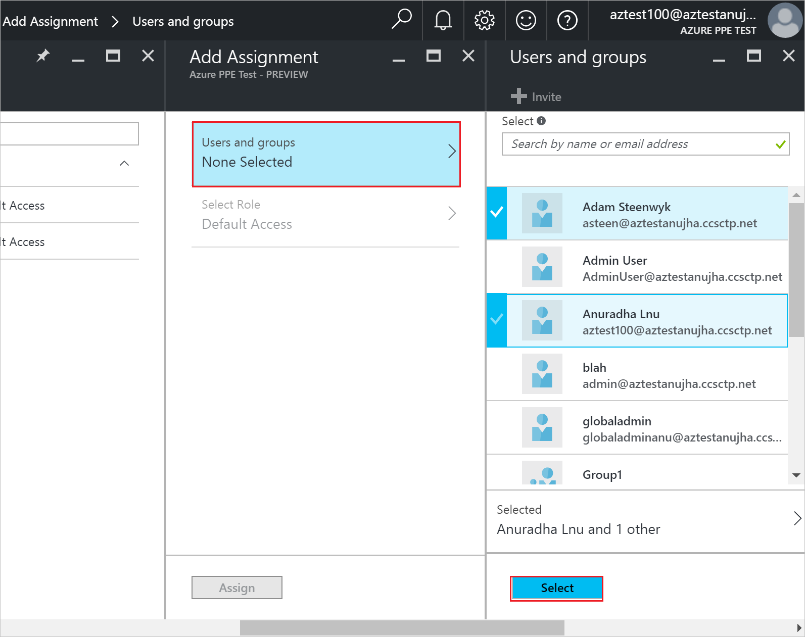

# Assign a user or group to an enterprise app in Azure Active Directory

To assign a user or group to an enterprise app, you must have the appropriate permissions to manage the enterprise app, and you must be global admin for the directory. For Microsoft Applications (such as Office 365 apps), use PowerShell to assign users to an enterprise app.

> [!NOTE]
> For licensing requirements for the features discussed in this article, see the [Azure Active Directory pricing page](https://azure.microsoft.com/pricing/details/active-directory).

## Assign a user to an app - portal

1. Sign in to the [Azure portal](https://portal.azure.com) with an account that's a global admin for the directory.
1. Select **All services**, enter Azure Active Directory in the text box, and then select **Enter**.
1. Select **Enterprise applications**.
1. On the **Enterprise applications - All applications** pane, you see a list of the apps you can manage. Select an app.
1. On the ***appname*** pane (that is, the pane with the name of the selected app in the title), select **Users & Groups**.
1. On the ***appname*** **- User and groups** pane, select **Add user**.
1. On the **Add Assignment** pane, select **Users and groups**.

   

1. On the **Users and groups** pane, select one or more users or groups from the list and then choose the **Select** button at the bottom of the pane.
1. On the **Add Assignment** pane, select **Role**. Then, on the **Select Role** pane, select a role to apply to the selected users or groups, then select **OK** at the bottom of the pane.
1. On the **Add Assignment** pane, select the **Assign** button at the bottom of the pane. The assigned users or groups have the permissions defined by the selected role for this enterprise app.

## Allow all users to access an app - portal

1. Sign in to the [Azure portal](https://portal.azure.com) with an account that's a global admin for the directory.
1. Select **All services**, enter Azure Active Directory in the text box, and then select **Enter**.
1. Select **Enterprise applications**.
1. On the **Enterprise applications** pane, select **All applications**. This lists the apps you can manage.
1. On the **Enterprise applications - All applications** pane, select an app.
1. On the ***appname*** pane, select **Properties**.
1. On the ***appname* - Properties** pane, set the **User assignment required?** setting to **No**.

The **User assignment required?** option:

- Doesn't affect whether or not an application appears on the application access panel. To show the application on the access panel, you need to assign an appropriate user or group to the application.
- Only functions with the cloud applications that are configured for SAML single sign-on, and on-premises applications configured with Application Proxy. See [Single sign-on for applications](what-is-single-sign-on.md).
- Requires that users consent to an application. An admin can grant consent for all users.  See [Configure the way end-users consent to an application](configure-user-consent.md).

## Assign a user to an app - PowerShell

1. Open an elevated Windows PowerShell command prompt.

   > [!NOTE]
   > You need to install the AzureAD module (use the command `Install-Module -Name AzureAD`). If prompted to install a NuGet module or the new Azure Active Directory V2 PowerShell module, type Y and press ENTER.

1. Run `Connect-AzureAD` and sign in with a Global Admin user account.
1. Use the following script to assign a user and role to an application:

    ```powershell
    # Assign the values to the variables
    $username = "<You user's UPN>"
    $app_name = "<Your App's display name>"
    $app_role_name = "<App role display name>"

    # Get the user to assign, and the service principal for the app to assign to
    $user = Get-AzureADUser -ObjectId "$username"
    $sp = Get-AzureADServicePrincipal -Filter "displayName eq '$app_name'"
    $appRole = $sp.AppRoles | Where-Object { $_.DisplayName -eq $app_role_name }

    # Assign the user to the app role
    New-AzureADUserAppRoleAssignment -ObjectId $user.ObjectId -PrincipalId $user.ObjectId -ResourceId $sp.ObjectId -Id $appRole.Id
    ```

For more information about how to assign a user to an application role visit the documentation for [New-AzureADUserAppRoleAssignment](https://docs.microsoft.com/powershell/module/azuread/new-azureaduserapproleassignment?view=azureadps-2.0)

To assign a group to an enterprise app, you need to replace `Get-AzureADUser` with `Get-AzureADGroup`.

### Example

This example assigns the user Britta Simon to the [Microsoft Workplace Analytics](https://products.office.com/business/workplace-analytics) application using PowerShell.

1. In PowerShell, assign the corresponding values to the variables $username, $app_name and $app_role_name.

    ```powershell
    # Assign the values to the variables
    $username = "britta.simon@contoso.com"
    $app_name = "Workplace Analytics"
    ```

1. In this example, we don't know what is the exact name of the application role we want to assign to Britta Simon. Run the following commands to get the user ($user) and the service principal ($sp) using the user UPN and the service principal display names.

    ```powershell
    # Get the user to assign, and the service principal for the app to assign to
    $user = Get-AzureADUser -ObjectId "$username"
    $sp = Get-AzureADServicePrincipal -Filter "displayName eq '$app_name'"
    ```

1. Run the command `$sp.AppRoles` to display the roles available for the Workplace Analytics application. In this example, we want to assign Britta Simon the Analyst (Limited access) Role.

   

1. Assign the role name to the `$app_role_name` variable.

    ```powershell
    # Assign the values to the variables
    $app_role_name = "Analyst (Limited access)"
    $appRole = $sp.AppRoles | Where-Object { $_.DisplayName -eq $app_role_name }
    ```

1. Run the following command to assign the user to the app role:

    ```powershell
    # Assign the user to the app role
    New-AzureADUserAppRoleAssignment -ObjectId $user.ObjectId -PrincipalId $user.ObjectId -ResourceId $sp.ObjectId -Id $appRole.Id
    ```

## Next steps

- [See all of my groups](../fundamentals/active-directory-groups-view-azure-portal.md)
- [Remove a user or group assignment from an enterprise app](remove-user-or-group-access-portal.md)
- [Disable user sign-ins for an enterprise app](disable-user-sign-in-portal.md)
- [Change the name or logo of an enterprise app](change-name-or-logo-portal.md)
