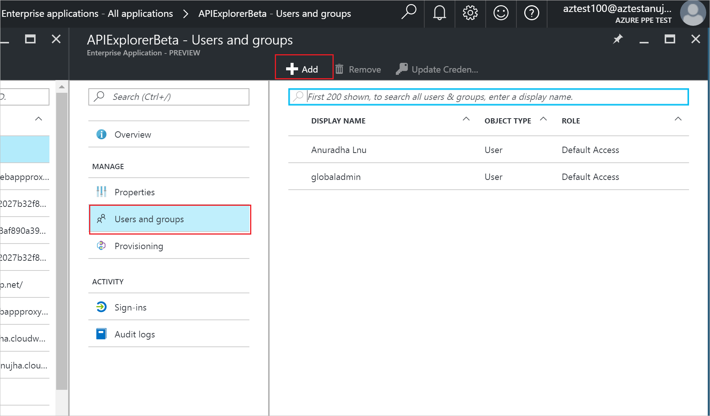

# Assign a user or group to an enterprise app in Azure Active Directory
To assign a user or group to an enterprise app, you must have the appropriate permissions to manage the enterprise app, and you must be global admin for the directory.

> [!NOTE]
> The features discussed in this article require an Azure Active Directory Premium P1 or Premium P2 license. For more information, see the [Azure Active Directory pricing page](https://azure.microsoft.com/pricing/details/active-directory).

> [!NOTE]
> For Microsoft Applications (such as Office 365 apps), use PowerShell to assign users to an enterprise app.


## How do I assign user access to an enterprise app in the Azure portal?
1. Sign in to the [Azure portal](https://portal.azure.com) with an account that's a global admin for the directory.
2. Select **All services**, enter Azure Active Directory in the text box, and then select **Enter**.
3. On the **Azure Active Directory - *directoryname*** blade (that is, the Azure AD blade for the directory you are managing), select **Enterprise applications**.

    
4. On the **Enterprise applications** blade, select **All applications**. This lists the apps you can manage.
5. On the **Enterprise applications - All applications** blade, select an app.
6. On the ***appname*** blade (that is, the blade with the name of the selected app in the title), select **Users & Groups**.

    
7. On the ***appname*** **- User & Group Assignment** blade, select the **Add** command.
8. On the **Add Assignment** blade, select **Users and groups**.

    
9. On the **Users and groups** blade, select one or more users or groups from the list and then select the **Select** button at the bottom of the blade.
10. On the **Add Assignment** blade, select **Role**. Then, on the **Select Role** blade, select a role to apply to the selected users or groups, and then select the **OK** button at the bottom of the blade.
11. On the **Add Assignment** blade, select the **Assign** button at the bottom of the blade. The assigned users or groups have the permissions defined by the selected role for this enterprise app.

## How do I assign a user to an enterprise app using PowerShell?

1. Open an elevated Windows PowerShell command prompt.

	>[!NOTE] 
	> You need to install the AzureAD module (use the command `Install-Module -Name AzureAD`). If prompted to install a NuGet module or the new Azure Active Directory V2 PowerShell module, type Y and press ENTER.

2. Run `Connect-AzureAD` and sign in with a Global Admin user account.
3. Use the following script to assign a user and role to an application:

    ```powershell
    # Assign the values to the variables
    $username = "<You user's UPN>"
    $app_name = "<Your App's display name>"
    $app_role_name = "<App role display name>"
    
    # Get the user to assign, and the service principal for the app to assign to
    $user = Get-AzureADUser -ObjectId "$username"
    $sp = Get-AzureADServicePrincipal -Filter "displayName eq '$app_name'"
    $appRole = $sp.AppRoles | Where-Object { $_.DisplayName -eq $app_role_name }
    
    # Assign the user to the app role
    New-AzureADUserAppRoleAssignment -ObjectId $user.ObjectId -PrincipalId $user.ObjectId -ResourceId $sp.ObjectId -Id $appRole.Id
    ``` 	

For more information about how to assign a user to an application role visit the documentation for [New-AzureADUserAppRoleAssignment](https://docs.microsoft.com/powershell/module/azuread/new-azureaduserapproleassignment?view=azureadps-2.0)

To assign a group to an enterprise app, you need to replace `Get-AzureADUser` with `Get-AzureADGroup`.

### Example

This example assigns the user Britta Simon to the [Microsoft Workplace Analytics](https://products.office.com/business/workplace-analytics) application using PowerShell.

1. In PowerShell, assign the corresponding values to the variables $username, $app_name and $app_role_name. 

    ```powershell
    # Assign the values to the variables
    $username = "britta.simon@contoso.com"
    $app_name = "Workplace Analytics"
    ```

2. In this example, we don't know what is the exact name of the application role we want to assign to Britta Simon. Run the following commands to get the user ($user) and the service principal ($sp) using the user UPN and the service principal display names.

    ```powershell
    # Get the user to assign, and the service principal for the app to assign to
    $user = Get-AzureADUser -ObjectId "$username"
    $sp = Get-AzureADServicePrincipal -Filter "displayName eq '$app_name'"
    ```
		
3. Run the command `$sp.AppRoles` to display the roles available for the Workplace Analytics application. In this example, we want to assign Britta Simon the Analyst (Limited access) Role.
	
	

4. Assign the role name to the `$app_role_name` variable.
		
    ```powershell
    # Assign the values to the variables
    $app_role_name = "Analyst (Limited access)"
    $appRole = $sp.AppRoles | Where-Object { $_.DisplayName -eq $app_role_name }
    ```

5. Run the following command to assign the user to the app role:

    ```powershell
    # Assign the user to the app role
    New-AzureADUserAppRoleAssignment -ObjectId $user.ObjectId -PrincipalId $user.ObjectId -ResourceId $sp.ObjectId -Id $appRole.Id
    ```

## Next steps
* [See all of my groups](../fundamentals/active-directory-groups-view-azure-portal.md)
* [Remove a user or group assignment from an enterprise app](remove-user-or-group-access-portal.md)
* [Disable user sign-ins for an enterprise app](disable-user-sign-in-portal.md)
* [Change the name or logo of an enterprise app](change-name-or-logo-portal.md)
