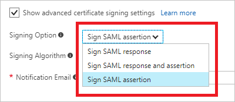
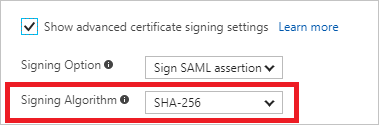

# Advanced certificate signing options in the SAML token for gallery apps in Azure Active Directory
Today Azure Active Directory (Azure AD) supports thousands of pre-integrated applications in the Azure Active Directory App Gallery. This number includes more than 500 applications that support single sign-on by using the SAML 2.0 protocol. When a user authenticates to an application through Azure AD by using SAML, Azure AD sends a token to the application (via an HTTP POST). Then, the application validates and uses the token to log in the user instead of prompting for a username and password. These SAML tokens are signed with the unique certificate that's generated in Azure AD and by specific standard algorithms.

Azure AD uses some of the default settings for the gallery applications. The default values are set up based on the application's requirements.

Azure AD supports advanced certificate signing settings. To select these options, first select the **Show advanced certificate signing settings** check box:

After you select this check box, you can set up certificate signing options and the certificate signing algorithm.

## Certificate signing options

Azure AD supports three certificate signing options:

* **Sign SAML assertion**. This default option is set for most of the gallery applications. If this option is selected, Azure AD as an IdP signs the SAML assertion and certificate with the X509 certificate of the application. Also, it uses the signing algorithm, which is selected in the **Signing Algorithm** drop-down list.

* **Sign SAML response**. If this option is selected, Azure AD as an IdP signs the SAML response with the X509 certificate of the application. Also, it uses the signing algorithm, which is selected in the **Signing Algorithm** drop-down list.

* **Sign SAML response and assertion**. If this option is selected, Azure AD as an IdP signs the entire SAML token with the X509 certificate of the application. Also, it uses the signing algorithm, which is selected in the **Signing Algorithm** drop-down list.

    

## Certificate signing algorithms

Azure AD supports two signing algorithms to sign the SAML response:

* **SHA-256**. Azure AD uses this default algorithm to sign the SAML response. It's the newest algorithm and is treated as more secure than SHA-1. Most of the applications support the SHA-256 algorithm. If an application supports only SHA-1 as the signing algorithm, you can change it. Otherwise, we recommend that you use the SHA-256 algorithm for signing the SAML response.

    

* **SHA-1**. This is the older algorithm, and it's treated as less secure than SH-256. If an application supports only this signing algorithm, you can select this option in the **Signing Algorithm** drop-down list. Azure AD then signs the SAML response with the SHA-1 algorithm.

    

## Next steps
* [Configure single sign-on to applications that are not in the Azure Active Directory App Gallery](configure-federated-single-sign-on-non-gallery-applications.md)
* [Troubleshoot SAML-based single sign-on](../develop/howto-v1-debug-saml-sso-issues.md)

