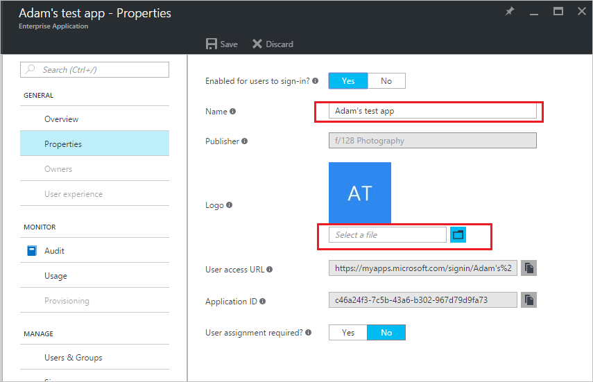

# Change the name or logo of an enterprise application in Azure Active Directory

It's easy to change the name or logo for a custom enterprise application in Azure Active Directory (Azure AD). You must have the appropriate permissions to make these changes, and you must be the creator of the custom application.

## How do I change an enterprise application's name or logo?

1. Sign in to the [Azure Active Directory portal](https://aad.portal.azure.com/) with an account that's a global admin for the directory. The **Azure Active Directory admin center** page appears.
2. In the left pane, select **Enterprise applications**. The list of your enterprise applications appears.
3. Select an application. The application overview page appears.
4. In the application overview pane, under the **Manage** heading, select **Properties**. The **Properties** page appears.
5. If you want to change the name, select the **Name** box, type the new name, and press **Enter**.
6. If you want to change the logo, find the **Logo** field, and select the folder icon next to the **Select a file** box, which is below the application's current logo image.

   

   Otherwise, if you aren't changing the logo, go to step 8.
7. In the file picker, select the file you want as the new logo. The name of the file appears in the box below the current logo image.

   > [!NOTE]
   > Azure requires the logo image to be a PNG file, and it applies limits on width, height, and file size.
8. Select **Save**. If you chose a new logo, the **Logo** field's image changes to reflect the new logo file.

## Next steps

* [Quickstart: View your organization's groups and members in Azure Active Directory](../fundamentals/active-directory-groups-view-azure-portal.md)
* [Assign a user or group to an enterprise app](assign-user-or-group-access-portal.md)
* [Remove a user or group assignment from an enterprise app](remove-user-or-group-access-portal.md)
* [Disable user sign-ins for an enterprise app](disable-user-sign-in-portal.md)
