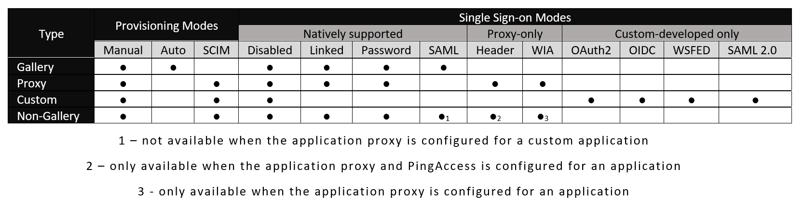

# How to choose which application type to use when adding an application

This article help you to understand the four main types of applications you can integrate with Azure AD:

* What is supported by each of them
* Why you might choose which application
* How to configure those application’s core properties, like how users are **provisioned**, or what **single sign-on** technology to use.

## Supported application types in Azure AD

Azure AD supports four main application types that you can add using the **Add** feature found under **Enterprise Applications**. These include:

-   **Azure AD Gallery Applications** – An application that has been pre-integrated for single sign-on with Azure AD.

-   **Application Proxy Applications** – An application running in your on-premises environment that you want to provide secure single-sign on to externally.

-   **Custom-developed Applications** – An application that your organization wishes to develop on the Azure AD Application Development Platform, but that may not exist yet.

-   **Non-Gallery Applications** – Bring your own applications! Any web link you want, or any application that renders a username and password field, supports SAML or OpenID Connect protocols, or supports SCIM that you wish to integrate for single sign-on with Azure AD.

## Features and capabilities supported by all the preceding application types

The following features are supported by any of the preceding four application types in Azure AD:

-   **Quick start** – get going with an application quickly by following [simple deployment steps](https://docs.microsoft.com/azure/active-directory/active-directory-integrating-applications-getting-started)

-   **General properties management** – get a [direct deeplink](https://docs.microsoft.com/azure/active-directory/active-directory-appssoaccess-whatis#deploying-azure-ad-integrated-applications-to-users) to an application, [customize the branding](https://docs.microsoft.com/azure/active-directory/active-directory-coreapps-change-app-logo-user-azure-portal) of an application, or [disable the application](https://docs.microsoft.com/azure/active-directory/active-directory-coreapps-disable-app-azure-portal) for all users.

-   **User and group management** – [assign](https://docs.microsoft.com/azure/active-directory/active-directory-coreapps-assign-user-azure-portal) or [remove](https://docs.microsoft.com/azure/active-directory/active-directory-coreapps-remove-assignment-azure-portal) users and groups to an application, and optionally assign the specific application roles these users and groups have access to

-   **Self-service application access** – enable your users to request [self-service application access](https://docs.microsoft.com/azure/active-directory/active-directory-self-service-application-access) to an application from their Application Access Panels either by adding an application directly or [joining a self-service enabled group](https://docs.microsoft.com/azure/active-directory/active-directory-accessmanagement-self-service-group-management), optionally requiring business approval along the way

-   **Sign-in logs** – see [all the sign-ins to an application](https://docs.microsoft.com/azure/active-directory/active-directory-reporting-activity-sign-ins), or all your applications

-   **Audit logs** – see [detailed audit logs about modifications to an application](https://docs.microsoft.com/azure/active-directory/active-directory-reporting-activity-audit-logs), or to all your applications

-   **Conditional and risk-based access** – set powerful [condition-based access rules](https://docs.microsoft.com/azure/active-directory/active-directory-conditional-access) that are enforced when users attempt to sign in to a specific application

-   **Permissions view** – view any of the [OAuth2 permissions](https://docs.microsoft.com/azure/active-directory/active-directory-apps-permissions-consent) an application has access to in your directory from a single place

## Single sign-on and provisioning modes supported by specific application types

The following table describes the different single sign-on and provisioning modes supported by each of the preceding application types. You can use this table to help you to understand which application you need to add to support a specific goal.

  

## How to choose a single sign-on mode

Following are the supported **single sign-on** modes for Azure AD applications.

-   **Azure AD single sign-on disabled** – choose Azure AD single sign-on disabled **single sign-on mode** if you are not yet ready to integrate this application with single sign-on with Azure AD, or are simply testing it out

-   **Linked Sign-on** – choose the [Linked Sign-on](https://docs.microsoft.com/azure/active-directory/active-directory-appssoaccess-whatis#how-does-single-sign-on-with-azure-active-directory-work) **single sign-on mode** if you have an application that is already connected with an existing single sign-on solution, or if you just want to publish a simple link for your users in their [Application Access Panel](https://docs.microsoft.com/azure/active-directory/active-directory-saas-access-panel-introduction) or [Office 365 application launcher](https://login.microsoftonline.com/common/oauth2/authorize?response_mode=form_post&response_type=id_token&scope=openid&nonce=d508a995-f6d6-4b8a-81b8-825c71f1be46.636253878097046923&state=https%3a%2f%2fsupport.office.com%2farticle%2fMeet-the-Office-365-app-launcher-79f12104-6fed-442f-96a0-eb089a3f476a%3fui%3den-US%26rs%3den-US%26ad%3dUS&client_id=4b233688-031c-404b-9a80-a4f3f2351f90&redirect_uri=https%3a%2f%2fsupport.office.com%2fauth%2fsignin&login_hint=asteen%40microsoft.com&prompt=none)

-   **Password-based Sign-on** – choose the [Password-based Sign-on](https://docs.microsoft.com/azure/active-directory/active-directory-appssoaccess-whatis#how-does-single-sign-on-with-azure-active-directory-work) **single sign-on mode** if your application renders an HTML username and password field and you want to store that username and password securely to be replayed to the application later

-   **SAML-based Sign-on** – choose the [SAML-based Sign-on](https://docs.microsoft.com/azure/active-directory/active-directory-appssoaccess-whatis#how-does-single-sign-on-with-azure-active-directory-work) single-sign on mode if your application supports the SAML or OpenID Connect protocols, or you want to be able to map users to specific application roles based on rules you define in your SAML claims *

   >[!NOTE]
   >This option is not available when the application proxy is configured for an application.
   >
   >

-   **Header-based Sign-on** – choose this [Header-based Sign-on](https://docs.microsoft.com/azure/active-directory/application-proxy-ping-access#what-is-pingaccess-for-azure-ad) single sign-on mode if you have an application using PingAccess that supports HTTP-header-based authentication that you wish to perform single-sign on to 

   >[!NOTE]
   >This option is only available when the application proxy and PingAccess is configured for an application.
   >
   >

-   **Integrated Windows Authentication** – choose the [Integrated Windows Authentication](https://docs.microsoft.com/azure/active-directory/active-directory-application-proxy-sso-using-kcd) single-sign on mode when exposing an on-premises WIA application that you wish to perform single-sign on to 

   >[!NOTE]
   >This option is only available when the application proxy is configured for an application.
   >
   >

## Single sign-on modes for custom-developed applications

Applications you have custom developed through the [Custom-developed application](#_Custom-Developed_Applications) experience also support additional single sign-on modes not previously listed, which include:

-   [OAuth 2.0](https://docs.microsoft.com/azure/active-directory/develop/active-directory-protocols-oauth-code) based sign-on

-   [OpenID Connect 1.0](https://docs.microsoft.com/azure/active-directory/develop/active-directory-protocols-openid-connect-code) based sign-on

-   [WS-Federation 1.2](http://docs.oasis-open.org/wsfed/federation/v1.2/os/ws-federation-1.2-spec-os.html) based sign-on

-   [SAML 2.0](https://docs.microsoft.com/azure/active-directory/develop/active-directory-saml-protocol-reference) based sign-on

Read the [Azure Active Directory developer’s guide](https://docs.microsoft.com/azure/active-directory/develop/active-directory-developers-guide) to learn more about how to create a custom-developed application that supports these single sign-on modes.

## How to set an application’s single sign-on mode

To set an application’s **single sign-on** mode, follow these instructions:

1.  Open the [**Azure portal**](https://portal.azure.com/) and sign in as a **Global Administrator** or **Co-admin.**

2.  Open the **Azure Active Directory Extension** by clicking **All services** at the top of the main left-hand navigation menu.

3.  Type in **“Azure Active Directory**” in the filter search box and select the **Azure Active Directory** item.

4.  click **Enterprise Applications** from the Azure Active Directory left-hand navigation menu.

5.  click **All Applications** to view a list of all your applications.

  * If you do not see the application you want show up here, use the **Filter** control at the top of the **All Applications List** and set the **Show** option to **All Applications.**

6.  Select the application for which you want to configure single sign-on.

7.  Once the application loads, click **Single sign-on** from the application’s left-hand navigation menu.

## How to choose a provisioning mode

-   **Manual Provisioning** – choose the [Manual](https://docs.microsoft.com/azure/active-directory/active-directory-enterprise-apps-manage-provisioning#provisioning-modes) provisioning mode if you have existing accounts, or wish to manage accounts for this application outside of Azure AD.

-   **Automatic Provisioning** – choose the [Automatic](https://docs.microsoft.com/azure/active-directory/active-directory-enterprise-apps-manage-provisioning#configuring-automatic-user-account-provisioning) **provisioning mode** if you want to enable automatic API-based provisioning and/or de-provisioning of user accounts to this application 

   >[!NOTE]
   >This option is available only for applications within the **featured** category of the [Azure AD Application Gallery](https://docs.microsoft.com/azure/active-directory/active-directory-enterprise-apps-whats-new-azure-portal#the-new-and-improved-application-gallery).
   >
   >

-   **SCIM-based Automatic Provisioning** – use [SCIM-based Automatic Provisioning](https://docs.microsoft.com/azure/active-directory/active-directory-scim-provisioning) if your application supports the SCIM protocol for detecting changes to users and groups, which are automatically emitted for changes to any application integrated with Azure AD 

   >[!NOTE]
   >This option is not listed as a specific provisioning mode, but is enabled by default for all applications that are integrated with Azure AD.
   >
   >

## How to set an application’s provisioning mode

To set an application’s **provisioning** mode, follow these instructions:

To set an application’s **single sign-on** mode, follow these instructions:

1.  Open the [**Azure portal**](https://portal.azure.com/) and sign in as a **Global Administrator** or **Co-admin.**

2.  Open the **Azure Active Directory Extension** by clicking **All services** at the top of the main left-hand navigation menu.

3.  Type in **“Azure Active Directory**” in the filter search box and select the **Azure Active Directory** item.

4.  click **Enterprise Applications** from the Azure Active Directory left-hand navigation menu.

5.  click **All Applications** to view a list of all your applications.

  * If you do not see the application you want show up here, use the **Filter** control at the top of the **All Applications List** and set the **Show** option to **All Applications.**

6.  Select the application for which you want to configure provisioning.

7.  Once the application loads, click **Provisioning** from the application’s left-hand navigation menu.

## Next steps
[Managing Applications with Azure Active Directory](what-is-application-management.md)
