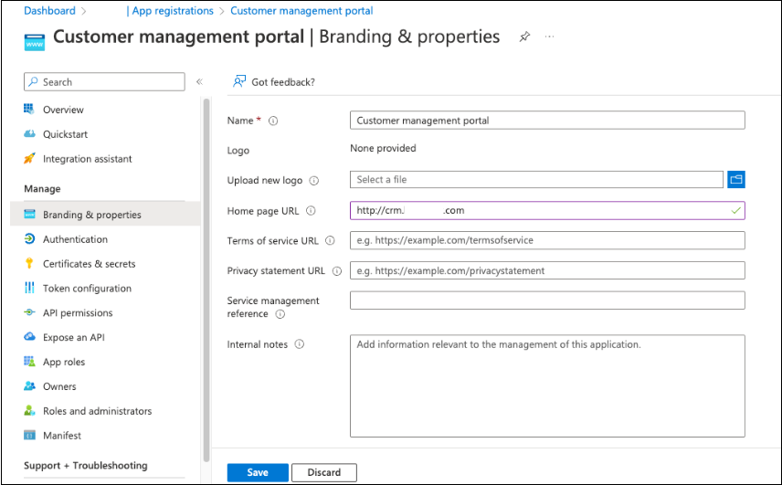
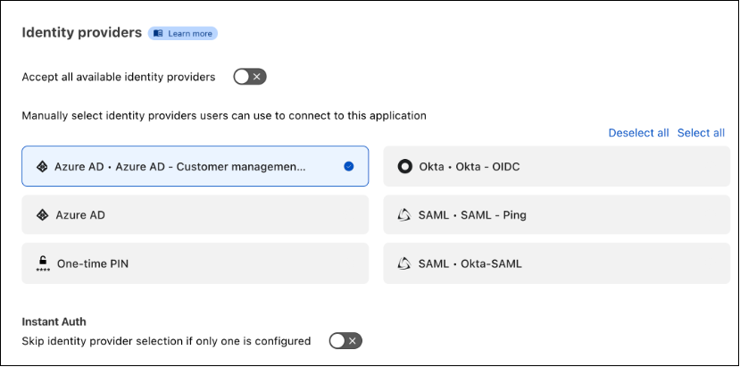
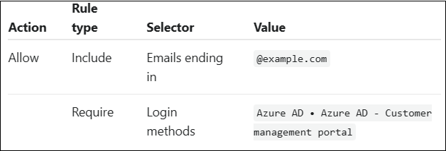

# Tutorial: Configure Conditional Access policies in Cloudflare Access

With Conditional Access, administrators enforce policies on application and user policies in Azure Active Directory (Azure AD). Conditional Access brings together identity-driven signals, to make decisions, and enforce organizational policies. Cloudflare Access creates access to self-hosted, software as a service (SaaS), or nonweb applications.

Learn more: [What is Conditional Access?](../conditional-access/overview.md)

## Prerequisites

* An Azure AD subscription
  * If you don't have one, get an [Azure free account](https://azure.microsoft.com/free/)
* An Azure AD tenant linked to the Azure AD subscription
  * See, [Quickstart: Create a new tenant in Azure AD](../fundamentals/active-directory-access-create-new-tenant.md)
* Global Administrator permissions
* Configured users in the Azure AD subscription  
* A Cloudflare account
  * Go to dash.cloudflare.com to [Get started with Cloudflare](https://dash.cloudflare.com/sign-up?https%3A%2F%2Fone.dash.cloudflare.com%2F)

## Scenario architecture

* **Azure AD** - Identity Provider (IdP) that verifies user credentials and Conditional Access
* **Application** - You created for IdP integration
* **Cloudflare Access** - Provides access to applications

## Set up an identity provider

Go to developers.cloudflare.com to [set up Azure AD as an IdP](https://developers.cloudflare.com/cloudflare-one/identity/idp-integration/azuread/#set-up-azure-ad-as-an-identity-provider).

   > [!NOTE]
   > It's recommended you name the IdP integration in relation to the target application. For example, **Azure AD - Customer management portal**.

## Configure Conditional Access

[!INCLUDE [portal updates](~/articles/active-directory/includes/portal-update.md)]

1. Sign in to the [Azure portal](https://portal.azure.com).
2. Select **Azure Active Directory**.
3. Under **Manage**, select **App registrations**.
4. Select the application you created.
5. Go to **Branding & properties**.
6. For **Home page URL**, enter the application hostname.

   

7. Under **Manage**, select **Enterprise applications**.
8. Select your application.
9. Select **Properties**.
10. For **Visible to users**, select **Yes**. This action enables the app to appear in App Launcher and in [My Apps](https://myapplications.microsoft.com/).
11. Under **Security**, select **Conditional Access**.
12. See, [Building a Conditional Access policy](../conditional-access/concept-conditional-access-policies.md).
13. Create and enable other policies for the application.

## Create a Cloudflare Access application

Enforce Conditional Access policies on a Cloudflare Access application.

1. Go to dash.cloudflare.com to [sign in to Cloudflare](https://dash.cloudflare.com/login).
2. In **Zero Trust**, go to **Access**.
3. Select **Applications**.
4. See, [Add a self-hosted application](https://developers.cloudflare.com/cloudflare-one/applications/configure-apps/self-hosted-apps/).
5. In **Application domain**, enter the protected application target URL.
6. For **Identity providers**, select the IdP integration.

   

7. Create an Access policy. See, [Access policies](https://developers.cloudflare.com/cloudflare-one/policies/access/) and the following example. 

   

   > [!NOTE]
   > Reuse the IdP integration for other applications if they require the same Conditional Access policies. For example, a baseline IdP integration with a Conditional Access policy requiring multifactor authentication and a modern authentication client. If an application requires specific Conditional Access policies, set up a dedicated IdP instance for that application.

## Next steps

* [What is Conditional Access?](../conditional-access/overview.md)
* [Secure Hybrid Access with Azure AD partner integrations](secure-hybrid-access-integrations.md)
* [Tutorial: Configure Cloudflare with Azure AD for secure hybrid access](cloudflare-integration.md)
