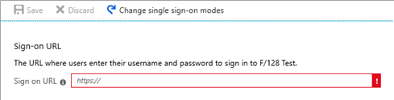
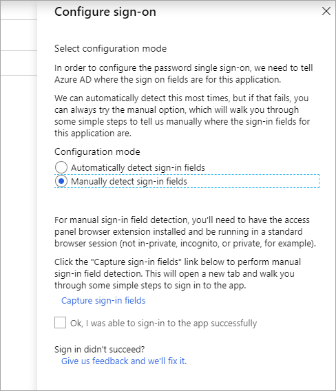

# Configure password single sign-on

When you [add a gallery app](add-gallery-app.md) or a [non-gallery web app](add-non-gallery-app.md) to your Azure AD Enterprise Applications, one of the single sign-on options available to you is [password-based single sign-on](what-is-single-sign-on.md#password-based-sso). This option is available for any web with an HTML sign-in page. Password-based SSO, also referred to as password vaulting, enables you to manage user access and passwords to web applications that don't support identity federation. It's also useful for scenarios where several users need to share a single account, such as to your organization's social media app accounts. 

Password-based SSO is a great way to get started integrating applications into Azure AD quickly, and allows you to:

-   Enable **Single Sign-on for your users** by securely storing and replaying usernames and passwords for the application you’ve integrated with Azure AD

-   **Support applications that require multiple sign-in fields** for applications that require more than just username and password fields to sign in

-   **Customize the labels** of the username and password input fields your users see on the [Application Access Panel](https://docs.microsoft.com/azure/active-directory/active-directory-saas-access-panel-introduction) when they enter their credentials

-   Allow your **users** to provide their own usernames and passwords for any existing application accounts they are typing in manually on the [Application Access Panel](https://docs.microsoft.com/azure/active-directory/active-directory-saas-access-panel-introduction)

-   Allow a **member of the business group** to specify the usernames and passwords assigned to a user by using the [Self-Service Application Access](https://docs.microsoft.com/azure/active-directory/active-directory-self-service-application-access) feature

-   Allow an **administrator** to specify a username and password to be used by individuals or groups when signing in to the application by using the Update Credentials feature 

## Before you begin

If the application hasn't been added to your Azure AD tenant, see [Add a gallery app](add-gallery-app.md) or [Add a non-gallery app](add-non-gallery-app.md).

## Open the app and select password single sign-on

1. Sign in to the [Azure portal](https://portal.azure.com) as a cloud application admin, or an application admin for your Azure AD tenant.

2. Navigate to **Azure Active Directory** > **Enterprise applications**. A random sample of the applications in your Azure AD tenant appears. 

3. In the **Application Type** menu, select **All applications**, and then select **Apply**.

4. Enter the name of the application in the search box, and then select the application from the results.

5. Under the **Manage** section, select **Single sign-on**. 

6. Select **Password-based**.

7. Enter the URL of the application's web-based sign-in page. This string must be the page that includes the username input field.

   

8. Select **Save**. Azure AD tries to parse the sign-in page for a username input and a password input. If the attempt succeeds, you're done. 
 
> [!NOTE]
> Your next step is to [Assign users or groups to the application](methods-for-assigning-users-and-groups.md). After you've assigned users and groups, you can provide credentials to be used on behalf of a user when they sign in to the application. Select **Users and groups**, select the checkbox for the user's or group's row, and then click **Update Credentials**. Then, enter the username and password to be used on behalf of the user or group. Otherwise, users will be prompted to enter the credentials themselves upon launch.
 

## Manual configuration

If Azure AD's parsing attempt fails, you can configure sign-on manually.

1. Under **\<application name> Configuration**, select **Configure \<application name> Password Single Sign-on Settings** to display the **Configure sign-on** page. 

2. Select **Manually detect sign-in fields**. Additional instructions describing the manual detection of sign-in fields appear.

   
3. Select **Capture sign-in fields**. A capture status page opens in a new tab, showing the message **metadata capture is currently in progress**.

4. If the **Access Panel Extension Required** box appears in a new tab, select **Install Now** to install the **My Apps Secure Sign-in Extension** browser extension. (The browser extension requires Microsoft Edge, Chrome, or Firefox.) Then install, launch, and enable the extension, and refresh the capture status page.

   The browser extension then opens another tab that displays the entered URL.
5. In the tab with the entered URL, go through the sign-in process. Fill in the username and password fields, and try to sign in. (You don't have to provide the correct password.)

   A prompt asks you to save the captured sign-in fields.
6. Select **OK**. The browser extension updates the capture status page with the message **Metadata has been updated for the application**. The browser tab closes.

7. In the Azure AD **Configure sign-on** page, select **Ok, I was able to sign-in to the app successfully**.

8. Select **OK**.

After the capture of the sign-in page, you may assign users and groups, and you can set up credential policies just like regular [password SSO applications](what-is-single-sign-on.md).

> [!NOTE]
> You can upload a tile logo for the application using the **Upload Logo** button on the **Configure** tab for the application.

## Next steps

- [Assign users or groups to the application](methods-for-assigning-users-and-groups.md)
- [Configure automatic user account provisioning](../app-provisioning/configure-automatic-user-provisioning-portal.md)
