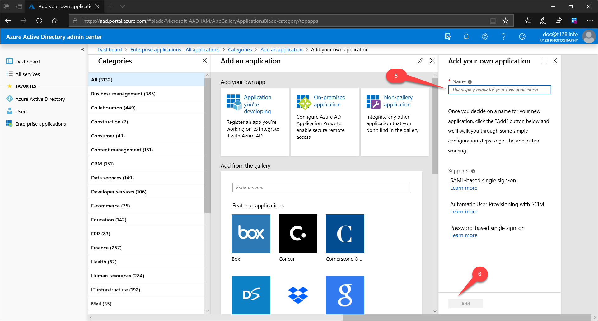
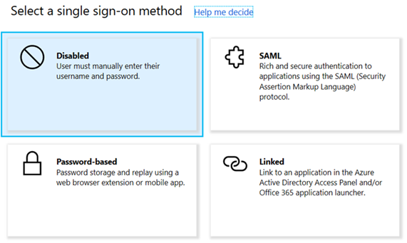
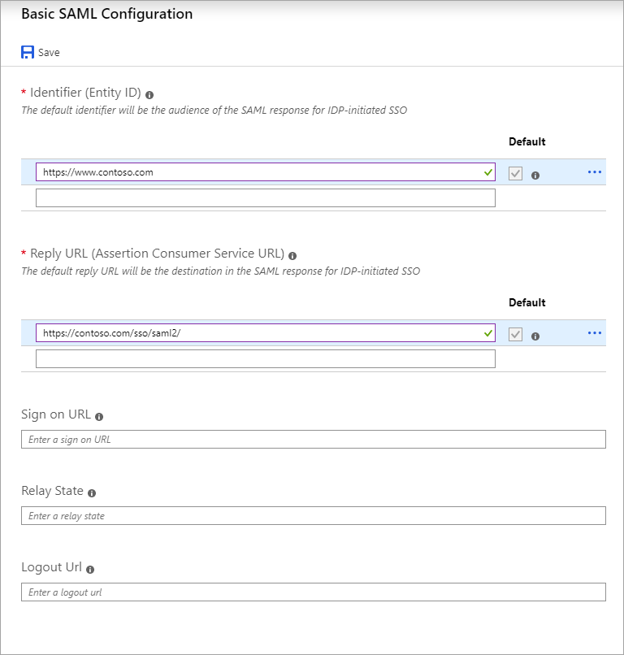
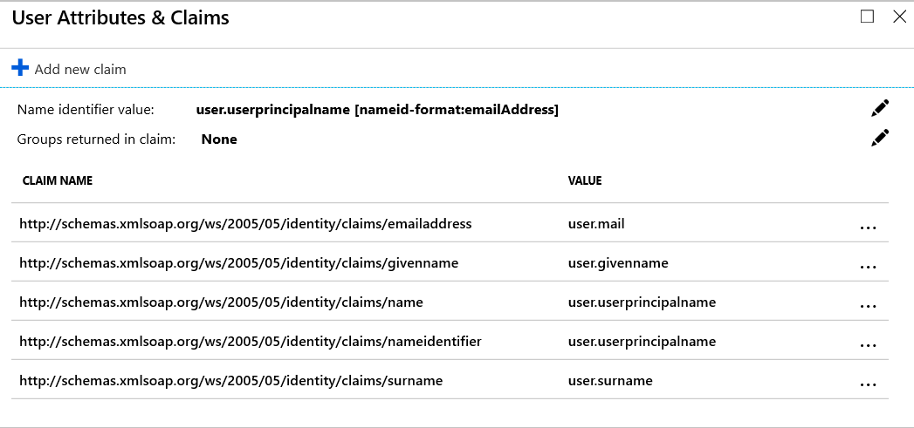
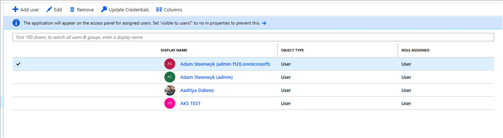
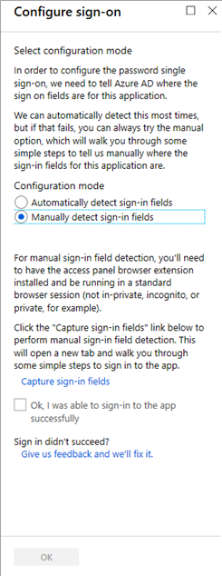

# Configure single sign-on to non-gallery applications in Microsoft identity platform

This article is about a feature that enables administrators to configure single sign-on for applications missing in the Microsoft identity platform app gallery *without writing code*.

If you are instead looking for developer guidance on how to integrate custom apps with Azure AD through code, see [Authentication Scenarios for Azure AD](../develop/authentication-scenarios.md).

The Microsoft identity platform application gallery provides a listing of applications that are known to support a form of single sign-on with Microsoft identity platform, as described in [this article](what-is-single-sign-on.md). Once you (as an IT specialist or system integrator in your organization) have found the application you want to connect, you can get started by following the step-by-step instructions presented in the Azure portal to enable single sign-on.

The following capabilities are also available, according to your license agreement. For more information, see the [pricing page](https://azure.microsoft.com/pricing/details/active-directory/).

- Self-service integration of an application that use a modern protocol like [OpenId Connect/OAuth](https://docs.microsoft.com/azure/active-directory/develop/active-directory-v2-protocols) to authenticate its users and obtain tokens for [Microsoft Graph](https://graph.microsoft.com).
- Self-service integration of any application that supports [Security Assertion Markup Language (SAML) 2.0](https://wikipedia.org/wiki/SAML_2.0) identity providers (SP-initiated or IdP-initiated)
- Self-service integration of any web application that has an HTML-based sign-in page using [password-based SSO](what-is-single-sign-on.md#password-based-sso)
- Self-service connection of applications that use the [System for Cross-Domain Identity Management (SCIM) protocol for user provisioning](use-scim-to-provision-users-and-groups.md)
- Ability to add links to any application in the [Office 365 app launcher](https://www.microsoft.com/microsoft-365/blog/2014/10/16/organize-office-365-new-app-launcher-2/) or the [Azure AD access panel](what-is-single-sign-on.md#linked-sign-on)

These capabilities can include self-service integration of a software as a service (SaaS) application that you use, even if nobody has onboarded the application to the Azure AD application gallery yet. Another capability is self-service integration of a third-party web application that your organization has deployed to servers you control, either in the cloud or on-premises.

Also known as *app integration templates*, these capabilities provide standards-based connection points for applications that support SAML, SCIM, or forms-based authentication. The capabilities include flexible options and settings for compatibility with a broad number of applications.

## Adding an unlisted application

The Microsoft identity platform provides two mechanisms to register applications.

An application that uses a modern protocol like [OpenId Connect/OAuth](../develop/active-directory-v2-protocols.md) to authenticate its users is registered using the [Application registration portal](../develop/quickstart-register-app.md).

To register applications using all other types of [supported authentication mechanisms](what-is-single-sign-on.md), like the [SAML](../develop/single-sign-on-saml-protocol.md) protocol, use the **Enterprise Applications** blade to connect them with the Microsoft identity platform.

To connect an unlisted application using an app integration template, do these steps:

1. Sign in to the [Azure Active Directory portal](https://aad.portal.azure.com/) using your Microsoft identity platform administrator account.
1. Select **Enterprise Applications** > **New application**.
1. (Optional but recommended) In the **Add from the gallery** search box, enter the display name of the application. If the application appears in the search results, select it and skip the rest of this procedure.
1. Select **Non-gallery application**. The **Add your own application** page appears.

   

1. Enter the display name for your new application.
1. Select **Add**.

By adding an application this way, you provide a similar experience to the one available for pre-integrated applications. First select **Single sign-on** from the application’s sidebar. The next page (**Select a single sign-on method**) presents the options for configuring SSO:

- **SAML**
- **Password-based**
- **Linked**



For more information about these options, see the following sections of this article.

## SAML-based single sign-on

Select the **SAML** option to configure SAML-based authentication for the application. (This option requires that the application support SAML 2.0.) The **Set up Single Sign-On with SAML** page appears.


This page has five different headings:

| Heading number | Heading name | For a summary of this heading, see: |
| --- | --- | --- |
| 1 | **Basic SAML Configuration** | [Enter basic SAML configuration](#enter-basic-saml-configuration) |
| 2 | **User Attributes & Claims** | [Review or customize the claims issued in the SAML token](#review-or-customize-the-claims-issued-in-the-saml-token) |
| 3 | **SAML Signing Certificate** | [Review certificate expiration data, status, and email notification](#review-certificate-expiration-data-status-and-email-notification) |
| 4 | **Set up \<application name>** | [Set up target application](#set-up-target-application) |
| 5 | **Test single sign-on with \<application name>** | [Test the SAML application](#test-the-saml-application) |

Now collect information on how to use the SAML capabilities of the application before continuing. Complete the following sections to configure SSO between the application and Azure AD.

### Enter basic SAML configuration

To set up Azure AD, go to the **Basic SAML Configuration** heading and select its **Edit** icon (a pencil). You can manually enter the values or upload a metadata file to extract the value of the fields.



The following two fields are required:

- **Identifier**. This value should uniquely identify the application for which single sign-on is being configured. You can find this value as the **Issuer** element in the **AuthnRequest** (SAML request) sent by the application. This value also appears as the **Entity ID** in any SAML metadata provided by the application. Check the application’s SAML documentation for details on what its **Entity ID** or **Audience** value is.

  The following code shows how the **Identifier** or **Issuer** appears in the SAML request that the application sends to Azure AD:

  ```xml
  <samlp:AuthnRequest
  xmlns="urn:oasis:names:tc:SAML:2.0:metadata"
  ID="id6c1c178c166d486687be4aaf5e482730"
  Version="2.0" IssueInstant="2013-03-18T03:28:54.1839884Z"
  xmlns:samlp="urn:oasis:names:tc:SAML:2.0:protocol">
    <Issuer xmlns="urn:oasis:names:tc:SAML:2.0:assertion">https://www.contoso.com</Issuer>
  </samlp:AuthnRequest>
  ```

- **Reply URL**. The reply URL is where the application expects to receive the SAML token. This URL is also referred to as the assertion consumer service (ACS) URL. Check the application’s SAML documentation for details on what its SAML token reply URL or ACS URL is.

  To configure multiple reply URLs, you can use the following PowerShell script.

  ```powershell
  $sp = Get-AzureADServicePrincipal -SearchString "<Exact app name>"
  $app = Get-AzureADApplication -SearchString "<Exact app name>"
  $urllist = New-Object "System.Collections.Generic.List[String]"
  $urllist.Add("<reply URL 1>")
  $urllist.Add("<reply URL 2>")
  $urllist.Add("<reply URL 3>")
  Set-AzureADApplication -ObjectId $app.ObjectId -ReplyUrls $urllist
  Set-AzureADServicePrincipal -ObjectId $sp.ObjectId -ReplyUrls $urllist
  ```

The following three fields are optional:

- **Sign On URL (SP-initiated only)**. This value indicates where the user goes to sign in to this application. If the application performs SP-initiated SSO, then when a user navigates to this URL, the SP does the necessary redirection to Azure AD to authenticate and sign in the user. If you specify this field, Azure AD uses this URL to launch the application from Office 365 and the Azure AD Access Panel. If you omit this field, Azure AD instead performs IdP-initiated sign-on during application launches from Office 365, the Azure AD Access Panel, or the Azure AD SSO URL (which you can copy from the **Dashboard** page).

- **Relay State**. You can specify a relay state in SAML to instruct the application where to redirect users after authentication. The value is typically a URL or URL path that takes users to a specific location within the application.

- **Logout URL**. This value is used to send the SAML logout response back to the application.

For more information, see [Single sign-on SAML protocol](../develop/single-sign-on-saml-protocol.md).

### Review or customize the claims issued in the SAML token

When a user authenticates to the application, Azure AD issues the application a SAML token with information (or claims) about the user that uniquely identifies them. By default, this information includes the user's username, email address, first name, and last name.

To view or edit the claims sent in the SAML token to the application:

- Go to the **User Attributes & Claims** heading and select the **Edit** icon. The **User Attributes & Claims** page appears.



You might need to edit the claims issued in the SAML token for two reasons:

- The application requires a different set of claim URIs or claim values.
- Your application requires the **Name identifier value** claim to be something other than the username (also known as the user principal name) stored in Microsoft identity platform.

For more information, see [How to: Customize claims issued in the SAML token for enterprise applications](../develop/active-directory-saml-claims-customization.md).

### Review certificate expiration data, status, and email notification

When you create a gallery or a non-gallery application, Azure AD creates an application-specific certificate that expires three years from its creation date. You need this certificate to set up the trust between Azure AD and the application. For details on the certificate format, see the application’s SAML documentation.

From Azure AD, you can download the active certificate in Base64 or Raw format directly from the main **Set up Single Sign-On with SAML** page. Alternatively, you can get the active certificate by downloading the application metadata XML file or by using the App federation metadata URL.

To view, create, or download your certificates (active or inactive), go to the **SAML Signing Certificate** heading and select the **Edit** icon. The **SAML Signing Certificate** appears.


Verify the certificate has:

- *The desired expiration date.* You can configure the expiration date for up to three years into the future.
- *A status of active for the desired certificate.* If the status is **Inactive**, change the status to **Active**. To change the status, right-click the desired certificate's row and select **Make certificate active**.
- *The correct signing option and algorithm.*
- *The correct notification email address(es).* When the active certificate is near the expiration date, Azure AD sends a notification to the email address configured in this field.  

For more information, see [Manage certificates for federated single sign-on](manage-certificates-for-federated-single-sign-on.md) and [Advanced certificate signing options in the SAML token](certificate-signing-options.md).

### Set up target application

To configure the application for SSO, locate the application's documentation. To find the documentation, go to the **Set up \<application name>** heading and select **View step-by-step instructions**. The documentation appears in the **Configure sign-on** page. That page guides you in filling out the **Login URL**, **Azure AD Identifier**, and **Logout URL** values in the **Set up \<application name>** heading.

The required values vary according to the application. For details, see the application's SAML documentation. The **Login URL** and **Logout URL** values both resolve to the same endpoint, which is the SAML request-handling endpoint for your instance of Azure AD. The **Azure AD Identifier** is the value of the **Issuer** in the SAML token issued to the application.

### Assign users and groups to your SAML application

Once you've configured your application to use Azure AD as a SAML-based identity provider, it is almost ready to test. As a security control, Azure AD only issues a token allowing a user to sign into the application if Azure AD has granted access to the user. Users may gain access directly or through a group membership.

To assign a new user or group to your application:

1. In the application sidebar, select **Users and groups**. The **\<application name> - Users and groups** page appears, which shows the current list of assigned users and groups.
1. Select **Add Users**. The **Add Assignments** page appears.
1. Select **Users and groups (\<Number> Selected)**. The **Users and groups** page appears, showing a list of available users and groups.
1. Type or scroll to find the user or group you wish to assign from the list.
1. Select each user or group that you want to add, and then select the **Select** button. The **Users and groups** page disappears.
1. In the **Add Assignments** page, select **Assign**. The **\<application name> - Users and groups** page appears with the additional users shown in the list.

   

From this list, you can:

- Remove a user.
- Edit their role.
- Update their credentials (username and password) so that the user can authenticate to the application from within the user's Access Panel.

You may edit or remove multiple users or groups at a time.

Assigning a user allows Azure AD to issue the user a token. It also causes a tile for this application to appear in the user's Access Panel. An application tile also appears in the Office 365 application launcher if the user is using Office 365.

> [!NOTE]
> You can upload a tile logo for the application using the **Upload Logo** button on the **Configure** tab for the application.

### Test the SAML application

Before you test the SAML application, you must have already set up the application with Azure AD and assigned users or groups to the application. To test the SAML application, select **Single sign-on**, which returns you to the **SAML-based sign-on** page. (If a different SSO method was in effect, select **Change single sign-on modes** > **SAML** too.) Then in the **Test single sign-on with \<application name>** heading, select **Test**. For more information, see [Debug SAML-based single sign-on to applications in Azure Active Directory](../develop/howto-v1-debug-saml-sso-issues.md).

## Password single sign-on

Select this option to configure [password-based single sign-on](what-is-single-sign-on.md) for a web application with an HTML sign-in page. Password-based SSO, also referred to as password vaulting, enables you to manage user access and passwords to web applications that don't support identity federation. It's also useful for scenarios where several users need to share a single account, such as to your organization's social media app accounts.

After you select **Password-based**, you're prompted to enter the URL of the application's web-based sign-in page.


Then do these steps:

1. Enter the URL. This string must be the page that includes the username input field.
1. Select **Save**. Azure AD tries to parse the sign-in page for a username input and a password input.
1. If Azure AD's parsing attempt fails, select **Configure \<application name> Password Single Sign-on Settings** to display the **Configure sign-on** page. (If the attempt succeeds, you can disregard the rest of this procedure.)
1. Select **Manually detect sign-in fields**. Additional instructions describing the manual detection of sign-in fields appear.

   

1. Select **Capture sign-in fields**. A capture status page opens in a new tab, showing the message **metadata capture is currently in progress**.
1. If the **Access Panel Extension Required** box appears in a new tab, select **Install Now** to install the **My Apps Secure Sign-in Extension** browser extension. (The browser extension requires Microsoft Edge, Chrome, or Firefox.) Then install, launch, and enable the extension, and refresh the capture status page.

   The browser extension then opens another tab that displays the entered URL.

1. In the tab with the entered URL, go through the sign-in process. Fill in the username and password fields, and try to sign in. (You don't have to provide the correct password.)

   A prompt asks you to save the captured sign-in fields.

1. Select **OK**. The tab closes, the browser extension updates the capture status page with the message **Metadata has been updated for the application**, and that browser tab also closes.
1. In the Azure AD **Configure sign-on** page, select **Ok, I was able to sign-in to the app successfully**.
1. Select **OK**.

After the capture of the sign-in page, you may assign users and groups, and you can set up credential policies just like regular [password SSO applications](what-is-single-sign-on.md).

> [!NOTE]
> You can upload a tile logo for the application using the **Upload Logo** button on the **Configure** tab for the application.

## Existing single sign-on

Select this option to add a link to the application in your organization's Azure AD Access Panel or Office 365 portal. You can use this method to add links to custom web applications that currently use Active Directory Federation Services (or other federation service) instead of Azure AD for authentication. Or, you can add deep links to specific SharePoint pages or other web pages that you just want to appear on your user's Access Panels.

After you select **Linked**, you're prompted to enter the URL of the application to link to. Type the URL and select **Save**. You may assign users and groups to the application, which causes the application to appear in the [Office 365 app launcher](https://blogs.office.com/2014/10/16/organize-office-365-new-app-launcher-2/) or the [Azure AD access panel](end-user-experiences.md) for those users.

> [!NOTE]
> You can upload a tile logo for the application using the **Upload Logo** button on the **Configure** tab for the application.

## Related articles

- [How to: Customize claims issued in the SAML token for enterprise applications](../develop/active-directory-saml-claims-customization.md)
- [Debug SAML-based single sign-on to applications in Azure Active Directory](../develop/howto-v1-debug-saml-sso-issues.md)
- [Microsoft identity platform (formerly Azure Active Directory for developers)](../develop/index.yml)
