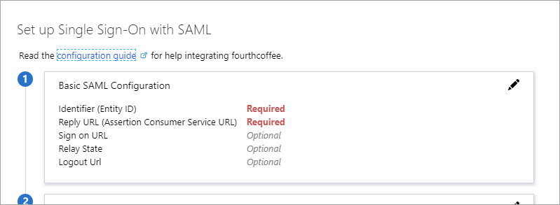
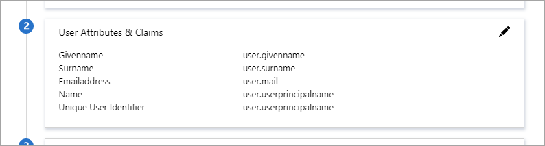
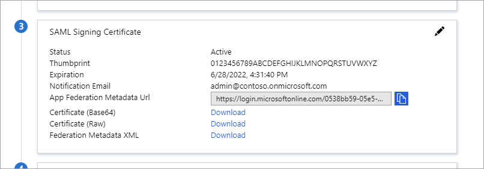
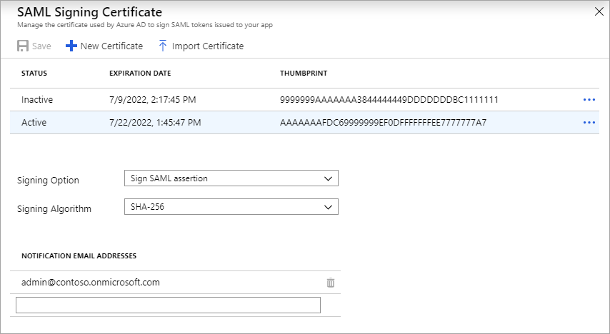
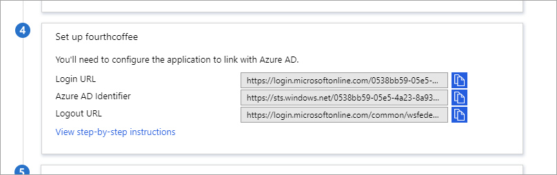
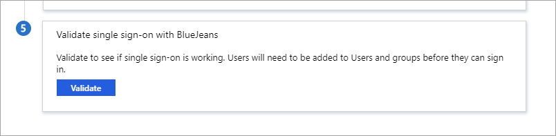
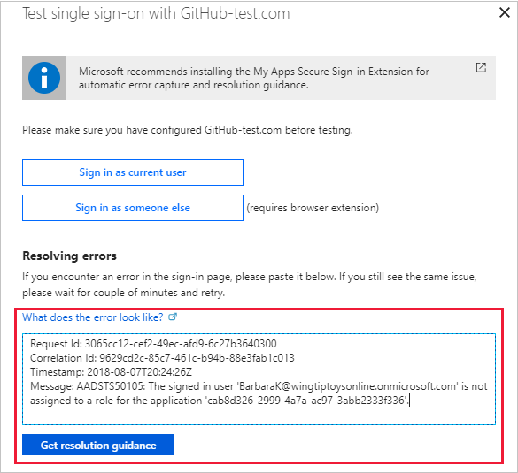

# Configure SAML-based single sign-on to non-gallery applications

When you [add a gallery app](add-gallery-app.md) or a [non-gallery web app](add-non-gallery-app.md) to your Azure AD Enterprise Applications, one of the single sign-on options available to you is [SAML-based single sign-on](what-is-single-sign-on.md#saml-sso). Choose SAML whenever possible for applications that authenticate using one of the SAML protocols. With SAML single sign-on, Azure AD authenticates to the application by using the user's Azure AD account. Azure AD communicates the sign-on information to the application through a connection protocol. You can map users to specific application roles based on rules you define in your SAML claims. This article describes how to configure SAML-based single sign-on for a non-gallery app. 

> [!NOTE]
> Adding a gallery app? Find step-by-step setup instructions in the [list of SaaS app tutorials](../saas-apps/tutorial-list.md)

To configure SAML single sign-on for a non-gallery application without writing code, you need to have a subscription or Azure AD Premium and the application must support SAML 2.0. For more information about Azure AD versions, visit [Azure AD pricing](https://azure.microsoft.com/pricing/details/active-directory/).

## Before you begin

If the application hasn't been added to your Azure AD tenant, see [Add a non-gallery app](add-non-gallery-app.md).

## Step 1. Edit the Basic SAML Configuration

1. Sign in to the [Azure portal](https://portal.azure.com) as a cloud application admin, or an application admin for your Azure AD tenant.

2. Navigate to **Azure Active Directory** > **Enterprise applications** and select the application from the list. 
   
   - To search for the application, in the **Application Type** menu, select **All applications**, and then select **Apply**. Enter the name of the application in the search box, and then select the application from the results.

3. Under the **Manage** section, select **Single sign-on**. 

4. Select **SAML**. The **Set up Single Sign-On with SAML - Preview** page appears.

   

5. To edit the basic SAML configuration options, select the **Edit** icon (a pencil) in the upper-right corner of the **Basic SAML Configuration** section.

1. Enter the following settings. You should get the values from the application vendor. You can manually enter the values or upload a metadata file to extract the value of the fields.

    | Basic SAML Configuration setting | SP-Initiated | idP-Initiated | Description |
    |:--|:--|:--|:--|
    | **Identifier (Entity ID)** | Required for some apps | Required for some apps | Uniquely identifies the application. Azure AD sends the identifier to the application as the Audience parameter of the SAML token. The application is expected to validate it. This value also appears as the Entity ID in any SAML metadata provided by the application. Enter a URL that uses the following pattern: 'https://<subdomain>.contoso.com' *You can find this value as the **Issuer** element in the **AuthnRequest** (SAML request) sent by the application.* |
    | **Reply URL** | Required | Required | Specifies where the application expects to receive the SAML token. The reply URL is also referred to as the Assertion Consumer Service (ACS) URL. You can use the additional reply URL fields to specify multiple reply URLs. For example, you might need additional reply URLs for multiple subdomains. Or, for testing purposes you can specify multiple reply URLs (local host and public URLs) at one time. |
    | **Sign-on URL** | Required | Don't specify | When a user opens this URL, the service provider redirects to Azure AD to authenticate and sign on the user. Azure AD uses the URL to start the application from Office 365 or the Azure AD Access Panel. When blank, Azure AD performs IdP-initiated sign-on when a user launches the application from Office 365, the Azure AD Access Panel, or the Azure AD SSO URL.|
    | **Relay State** | Optional | Optional | Specifies to the application where to redirect the user after authentication is completed. Typically the value is a valid URL for the application. However, some applications use this field differently. For more information, ask the application vendor.
    | **Logout URL** | Optional | Optional | Used to send the SAML Logout responses back to the application.

For more information, see [Single sign-on SAML protocol](../develop/single-sign-on-saml-protocol.md).

## Step 2. Configure User attributes and claims 

When a user authenticates to the application, Azure AD issues the application a SAML token with information (or claims) about the user that uniquely identifies them. By default, this information includes the user's username, email address, first name, and last name. You might need to customize these claims if, for example, the application requires specific claim values or a **Name** format other than username. Requirements for gallery apps are described in the [application-specific tutorials](../saas-apps/tutorial-list.md), or you can ask the application vendor. The general steps for configuring user attributes and claims are described below.

1. In the **User Attributes and Claims** section, select the **Edit** icon (a pencil) in the upper-right corner.

   

2. Verify the **Name Identifier Value**. The default value is *user.principalname*. The user identifier uniquely identifies each user within the application. For example, if the email address is both the username and the unique identifier, set the value to *user.mail*.

3. To modify the **Name Identifier Value**, select the **Edit** icon (a pencil) for the **Name Identifier Value** field. Make the appropriate changes to the identifier format and source, as needed. For details, see [Editing NameId](../develop/active-directory-saml-claims-customization.md#editing-nameid). Save the changes when you're done. 
 
4. To configure group claims, select the **Edit** icon for the **Groups returned in claim** field. For details, see [Configure group claims](../hybrid/how-to-connect-fed-group-claims.md).

5. To add a claim, select **Add new claim** at the top of the page. Enter the **Name** and select the appropriate source. If you select the **Attribute** source, you'll need to choose the **Source attribute** you want to use. If you select the **Translation** source, you'll need to choose the **Transformation** and **Parameter 1** you want to use. For details, see [Adding application-specific claims](../develop/active-directory-saml-claims-customization.md#adding-application-specific-claims). Save the changes when you're done. 

6. Select **Save**. The new claim appears in the table.

   > [!NOTE]
   > For additional ways to customize the SAML token from Azure AD to your application, see the following resources.
   >- To create custom roles via the Azure portal, see [Configure role claims](../develop/active-directory-enterprise-app-role-management.md).
   >- To customize the claims via PowerShell, see [Customize claims - PowerShell](../develop/active-directory-claims-mapping.md).
   >- To modify the application manifest to configure optional claims for your application, see [Configure optional claims](../develop/active-directory-optional-claims.md).
   >- To set token lifetime policies for refresh tokens, access tokens, session tokens, and ID tokens, see [Configure token lifetimes](../develop/active-directory-configurable-token-lifetimes.md). Or, to restrict authentication sessions via Azure AD Conditional Access, see [authentication session management capabilities](https://go.microsoft.com/fwlink/?linkid=2083106).

## Step 3. Manage the SAML signing certificate

Azure AD uses a certificate to sign the SAML tokens it sends to the application. You need this certificate to set up the trust between Azure AD and the application. For details on the certificate format, see the application’s SAML documentation. For more information, see [Manage certificates for federated single sign-on](manage-certificates-for-federated-single-sign-on.md) and [Advanced certificate signing options in the SAML token](certificate-signing-options.md).

From Azure AD, you can download the active certificate in Base64 or Raw format directly from the main **Set up Single Sign-On with SAML** page. Alternatively, you can get the active certificate by downloading the application metadata XML file or by using the App federation metadata URL. To view, create, or download your certificates (active or inactive), follow these steps.

1. Go to the **SAML Signing Certificate** section. 

   

2. Verify the certificate has:

   - *The desired expiration date.* You can configure the expiration date for up to three years into the future.
   - *A status of active for the desired certificate.* If the status is **Inactive**, change the status to **Active**. To change the status, right-click the desired certificate's row and select **Make certificate active**.
   - *The correct signing option and algorithm.*
   - *The correct notification email address(es).* When the active certificate is near the expiration date, Azure AD sends a notification to the email address configured in this field.

2. To download the certificate, select one of the options for Base64 format, Raw format, or Federation Metadata XML. Azure AD also provides the **App Federation Metadata Url** where you can access the metadata specific to the application in the format `https://login.microsoftonline.com/<Directory ID>/federationmetadata/2007-06/federationmetadata.xml?appid=<Application ID>`.

3. To manage, create, or import a certificate, select the **Edit** icon (a pencil) in the upper-right corner of the **SAML Signing Certificate** section.

   

   Take any of the following actions:

   - To create a new certificate, select **New Certificate**, select the **Expiration Date**, and then select **Save**. To activate the certificate, select the context menu (**...**) and select **Make certificate active**.
   - To upload a certificate with private key and pfx credentials, select **Import Certificate** and browse to the certificate. Enter the **PFX Password**, and then select **Add**.  
   - To configure advanced certificate signing options, use the following options. For descriptions of these options, see the [Advanced certificate signing options](certificate-signing-options.md) article.
      - In the **Signing Option** drop-down list, choose **Sign SAML response**, **Sign SAML assertion**, or **Sign SAML response and assertion**.
      - In the **Signing Algorithm** drop-down list, choose **SHA-1** or **SHA-256**.
   - To notify additional people when the active certificate is near its expiration date, enter the email addresses in the **Notification email addresses** fields.

4. If you made changes, select **Save** at the top of the **SAML Signing Certificate** section. 

## Step 4. Set up the application to use Azure AD

The **Set up \<applicationName>** section lists the values that need to be configured in the application so it will use Azure AD as a SAML identity provider. The required values vary according to the application. For details, see the application's SAML documentation. To find the documentation, go to the **Set up \<application name>** heading and select **View step-by-step instructions**. The documentation appears in the **Configure sign-on** page. That page guides you in filling out the **Login URL**, **Azure AD Identifier**, and **Logout URL** values in the **Set up \<application name>** heading.

1. Scroll down to the **Set up \<applicationName>** section. 
   
   

1. Copy the value from each row in this section as needed and follow the application-specific instructions for adding the value to the application. For gallery apps, you can view the documentation by selecting **View step-by-step instructions**. 
   - The **Login URL** and **Logout URL** values both resolve to the same endpoint, which is the SAML request-handling endpoint for your instance of Azure AD. 
   - The **Azure AD Identifier** is the value of the **Issuer** in the SAML token issued to the application.
2. When you've pasted all the values into the appropriate fields, select **Save**.

## Step 5. Validate single sign-on

Once you've configured your application to use Azure AD as a SAML-based identity provider, you can test the settings to see if single sign-on works for your account. 

2. Scroll to the **Validate single sign-on with <applicationName>** section.

   

3. Select **Validate**. The testing options appear.

4. Select **Sign in as current user**. 

If sign-on is successful, you're ready to assign users and groups to your SAML application.
If an error message appears, complete the following steps:

1. Copy and paste the specifics into the **What does the error look like?** box.

    

2. Select **Get resolution guidance**. The root cause and resolution guidance appear.  In this example, the user wasn't assigned to the application.

3. Read the resolution guidance and then, if possible, fix the issue.

4. Run the test again until it completes successfully.

For more information, see [Debug SAML-based single sign-on to applications in Azure Active Directory](../develop/howto-v1-debug-saml-sso-issues.md).

## Next steps

- [Assign users or groups to the application](methods-for-assigning-users-and-groups.md)
- [Configure automatic user account provisioning](configure-automatic-user-provisioning-portal.md)
