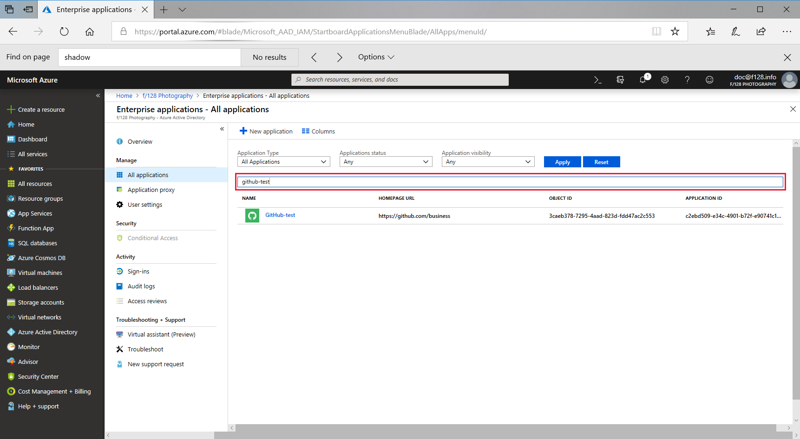
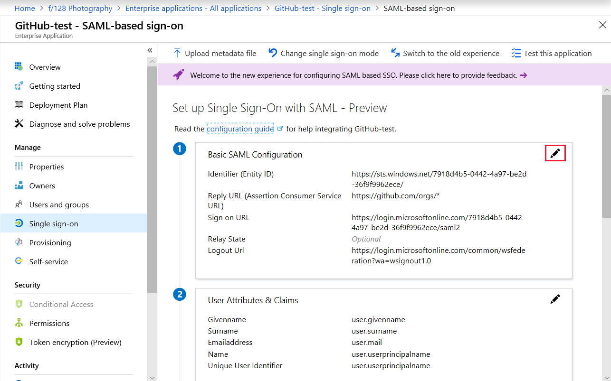

# Tutorial: Configure SAML-based single sign-on for an application with Azure Active Directory

This tutorial uses the [Azure portal](https://portal.azure.com) to configure SAML-based single sign-on for an application with Azure Active Directory (Azure AD). Use this tutorial when an [application-specific tutorial](../saas-apps/tutorial-list.md) isn't available.

This tutorial uses the Azure portal to:

> [!div class="checklist"]
> * Select the SAML-based single sign-on mode
> * Configure application-specific domain and URLs
> * Configure user attributes
> * Create a SAML signing certificate
> * Assign users to the application
> * Configure the application for SAML-based single sign-on
> * Test the SAML settings

## Before you begin

1. If the application hasn't been added to your Azure AD tenant, see  [Quickstart: Add an application to your Azure AD tenant](add-application-portal.md).
1. Ask your application vendor for the information described in [Configure basic SAML options](#configure-basic-saml-options).
1. Use a non-production environment to test the steps in this tutorial. If you don't have an Azure AD non-production environment, you can [get a one-month trial](https://azure.microsoft.com/pricing/free-trial/).
1. Sign in to the [Azure portal](https://portal.azure.com) as a cloud application admin, or an application admin for your Azure AD tenant.

## Select a single sign-on mode

After you've added an application to your Azure AD tenant, you're ready to configure single sign-on for the application.

To open the single sign-on settings:

1. In the [Azure portal](https://portal.azure.com), on the left navigation panel, select **Azure Active Directory**.
1. Under **Manage** in the **Azure Active Directory** navigation panel that appears, select **Enterprise applications**. A random sample of the applications in your Azure AD tenant appears.
1. In the **Application Type** menu, select **All applications**, and then select **Apply**.
1. Enter the name of the application for which you want to configure single sign-on. For example, you can enter **GitHub-test** to configure the application you added in the [add application](add-application-portal.md) quickstart.  

   

1. Choose the application for which you want to configure single sign-on.
1. Under the **Manage** section, select **Single sign-on**.
1. Select **SAML** to configure single sign-on. The **Set up Single Sign-On with SAML - Preview** page appears.

## Configure basic SAML options

To configure the domain and URLs:

1. Contact the application vendor to get the correct information for the following settings:

    | Configuration setting | SP-Initiated | idP-Initiated | Description |
    |:--|:--|:--|:--|
    | Identifier (Entity ID) | Required for some apps | Required for some apps | Uniquely identifies the application for which single sign-on is being configured. Azure AD sends the identifier to the application as the Audience parameter of the SAML token. The application is expected to validate it. This value also appears as the Entity ID in any SAML metadata provided by the application.|
    | Reply URL | Optional | Required | Specifies where the application expects to receive the SAML token. The reply URL is also referred to as the Assertion Consumer Service (ACS) URL. |
    | Sign-on URL | Required | Don't specify | When a user opens this URL, the service provider redirects to Azure AD to authenticate and sign on the user. Azure AD uses the URL to start the application from Office 365 or the Azure AD Access Panel. When blank, Azure AD relies on the identity provider to start single sign-on when a user launches the application.|
    | Relay State | Optional | Optional | Specifies to the application where to redirect the user after authentication is completed. Typically the value is a valid URL for the application. However, some applications use this field differently. For more information, ask the application vendor.
    | Logout URL | Optional | Optional | Used to send the SAML Logout responses back to the application.

1. To edit the basic SAML configuration options, select the **Edit** icon (a pencil) in the upper-right corner of the **Basic SAML Configuration** section.

     

1. In the appropriate fields on the page, enter the information provided by the application vendor in step 1.
1. At the top of the page, select **Save**.

## Configure user attributes and claims

You can control what information Azure AD sends to the application in the SAML token when a user signs in. You control this information by configuring user attributes. For example, you can configure Azure AD to send the user's name, email, and employee ID to the application when a user signs in.

These attributes may be required or optional to make single sign-on work properly. For more information, see the [application-specific tutorial](../saas-apps/tutorial-list.md), or ask the application vendor.

1. To edit user attributes and claims, select the **Edit** icon (a pencil) in the upper-right corner of the **User Attributes and Claims** section.

   The **Name Identifier Value** is set with the default value of *user.principalname*. The user identifier uniquely identifies each user within the application. For example, if the email address is both the username and the unique identifier, set the value to *user.mail*.

1. To modify the **Name Identifier Value**, select the **Edit** icon (a pencil) for the **Name Identifier Value** field. Make the appropriate changes to the identifier format and source, as needed. Save the changes when you're done. For more information about customizing claims, see the [Customize claims issued in the SAML token for enterprise applications](../develop/active-directory-saml-claims-customization.md) how-to article.
1. To add a claim, select **Add new claim** at the top of the page. Enter the **Name** and select the appropriate source. If you select the **Attribute** source, you'll need to choose the **Source attribute** you want to use. If you select the **Translation** source, you'll need to choose the **Transformation** and **Parameter 1** you want to use.
1. Select **Save**. The new claim appears in the table.

## Generate a SAML signing certificate

Azure AD uses a certificate to sign the SAML tokens that it sends to the application.

1. To generate a new certificate, select the **Edit** icon (a pencil) in the upper-right corner of the **SAML Signing Certificate** section.
1. In the **SAML Signing Certificate** section, select **New Certificate**.
1. In the new certificate row that appears, set the **Expiration Date**. For more information about available configuration options, see the [Advanced certificate signing options](certificate-signing-options.md) article.
1. Select **Save** at the top of the **SAML Signing Certificate** section.

## Assign users to the application

It's a good idea to test the single sign-on with several users or groups before rolling out the application to your organization.

> [!NOTE]
> These steps take you to the **Users and groups** configuration section in the portal. When you finish, you'll need to navigate back to the **Single sign-on** section to complete the tutorial.

To assign a user or group to the application:

1. Open the application in the portal, if it isn't already open.
1. In the left navigation panel for the application, select **Users and groups**.
1. Select **Add user**.
1. In the **Add Assignment** section, select **Users and groups**.
1. To find a specific user, type the user name into the **Select member or invite an external user** box. Then, select the user’s profile photo or logo, and then choose **Select**.
1. In the **Add Assignment** section, select **Assign**. When finished, the selected users appear in the **Users and groups** list.

## Set up the application to use Azure AD

You're almost done.  As a final step, you need to set up the application to use Azure AD as a SAML identity provider. 

1. Scroll down to the **Set up \<applicationName>** section. For this tutorial, this section is called **Set up GitHub-test**.
1. Copy the value from each row in this section. Then, paste each value into the appropriate row in the **Basic SAML Configuration** section. For example, copy the **Login URL** value from the **Set up GitHub-test** section and paste it into the **Sign On URL** field in the **Basic SAML Configuration** section, and so on.
1. When you've pasted all the values into the appropriate fields, select **Save**.

## Test single sign-on

You're ready to test your settings.  

1. Open the single sign-on settings for your application.
1. Scroll to the **Validate single sign-on with \<applicationName>** section. For this tutorial, this section is called **Set up GitHub-test**.
1. Select **Test**. The testing options appear.
1. Select **Sign in as current user**. This test lets you first see if single sign-on works for you, the admin.

If there's an error, an error message appears. Complete the following steps:

1. Copy and paste the specifics into the **What does the error look like?** box.

    

1. Select **Get resolution guidance**. The root cause and resolution guidance appear.  In this example, the user wasn't assigned to the application.
1. Read the resolution guidance and then, if possible, fix the issue.
1. Run the test again until it completes successfully.

## Next steps

In this tutorial, you configured the single sign-on settings for an application. After finishing the configuration, you assigned a user to the application, and configured the application to use SAML-based single sign-on. When all of this work was finished, you verified the SAML sign-on is working properly.

You did these things:
> [!div class="checklist"]
> * Selected SAML for the single sign-on mode
> * Contacted the application vendor to configure domain and URLs
> * Configured user attributes
> * Created a SAML signing certificate
> * Manually assigned users or groups to the application
> * Configured the application to use Azure AD as a SAML identity provider
> * Tested the SAML-based single sign-on

To roll out the application to more users in your organization, use automatic user provisioning.

> [!div class="nextstepaction"]
> [Learn how to assign users with automatic provisioning](configure-automatic-user-provisioning-portal.md)
