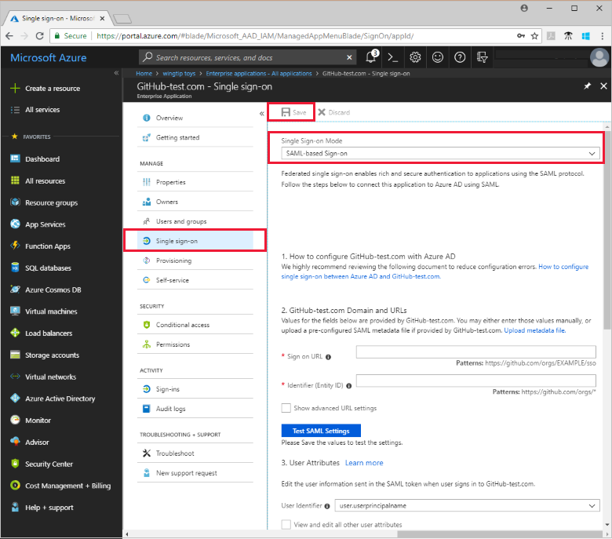
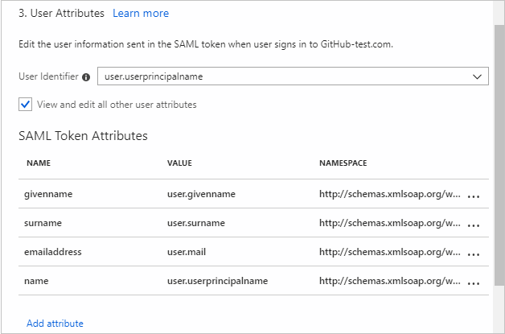
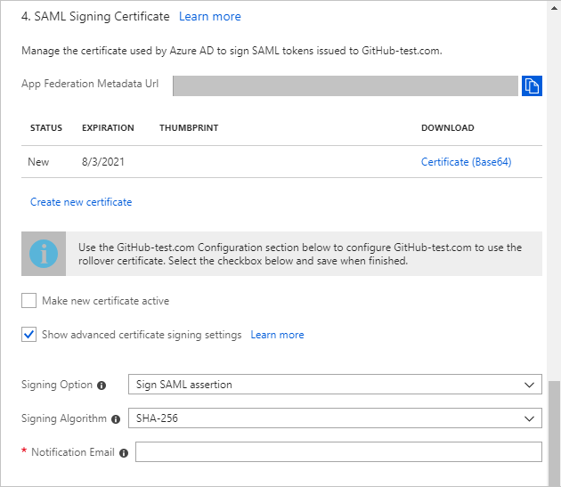
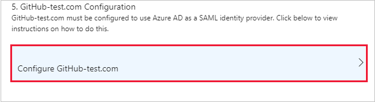
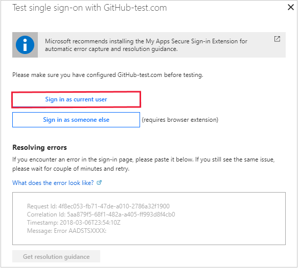
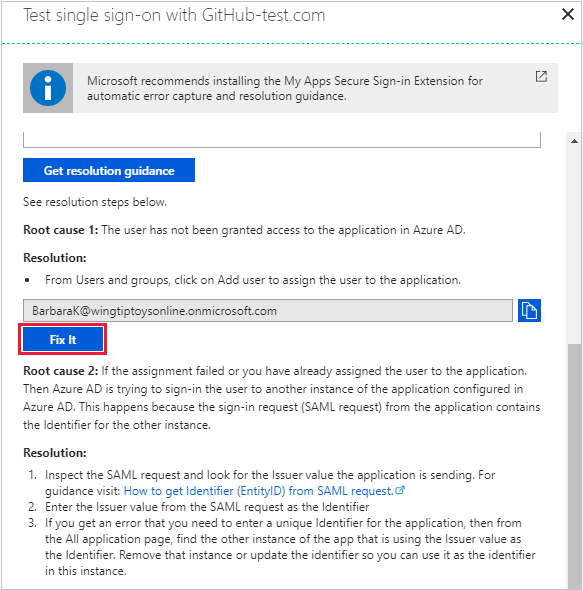

# Tutorial: Configure SAML-based single sign-on for an application with Azure Active Directory

This tutorial uses the [Azure portal](https://portal.azure.com) to configure SAML-based single sign-on for an application with Azure Active Directory (Azure AD). Use this tutorial for configuring applications that do not have an [application-specific tutorial](../saas-apps/tutorial-list.md). 

This tutorial uses the Azure portal to:

> [!div class="checklist"]
> * Select the SAML-based single sign-on mode
> * Configure application-specific domain and URLs
> * Configure user attributes
> * Create a SAML signing certificate
> * Assign users to the application
> * Configure the application for SAML-based single sign-on
> * Test the SAML settings

## Before you begin

1. If the application has not been added to your Azure AD tenant, see  [Quickstart: Add an application to your Azure AD tenant](add-application-portal.md).

2. Ask your application vendor for the information described in [Configure domain and URLS](#configure-domain-and-urls).

3. To test the steps in this tutorial, we recommend using a non-production environment. If you don't have an Azure AD non-production environment, you can [get a one-month trial](https://azure.microsoft.com/pricing/free-trial/).

4. Sign in to the [Azure portal](https://portal.azure.com) as a global admin for your Azure AD tenant, a cloud application admin, or an application admin.

## Select a single sign-on mode

After an application is added to your Azure AD tenant, you are ready to configure single sign-on for the application.

To open the single sign-on settings:

1. In the [Azure portal](https://portal.azure.com), on the left navigation panel, click **Azure Active Directory**. 

2. In the **Azure Active Directory** blade, click **Enterprise applications**. The **All applications** blade opens to show a random sample of the applications in your Azure AD tenant. 

3. In the **Application Type** menu, select **All applications**, and click **Apply**.

4. Enter the name of the application for which you want to configure single sign-on. Choose your own application, or use the GitHub-test application that was added in the [add application](add-application-portal.md) quickstart.

5. Click **Single sign-on**. Under **Single Sign-on Mode**, **SAML-based Sign-on** appears as the default option. 

    

6. Click **Save** at the top of the blade. 

## Configure domain and URLs

To configure the domain and URLs:

1. Contact the application vendor to get the correct information for the following settings:

    | Configuration setting | SP-Initiated | idP-Initiated | Description |
    |:--|:--|:--|:--|
    | Sign-on URL | Required | Do not specify | When a user opens this URL, the service provider redirects to Azure AD to authenticate and sign on the user. Azure AD uses the URL to start the application from Office 365 and the Azure AD Access Panel. When blank, Azure AD performs idP-initiated single sign-on when a user launches the application from Office 365, the Azure AD Access Panel, or from the Azure AD single sign-on URL.|
    | Identifier (Entity ID) | Required for some apps | Required for some apps | Uniquely identifies the application for which single sign-on is being configured. Azure AD sends the identifier back to the application as the Audience parameter of the SAML token, and the application is expected to validate it. This value also appears as the Entity ID in any SAML metadata provided by the application.|
    | Reply URL | Optional | Required | Specifies where the application expects to receive the SAML token. The reply URL is also referred to as the Assertion Consumer Service (ACS) URL. |
    | Relay State | Optional | Optional | Specifies to the application where to redirect the user after authentication is completed. Typically the value is a valid URL for the application, however some applications use this field differently. For more information, ask the application vendor.

2. Enter the information. To see all the settings, click **Show advanced URL settings**.

    

3. At the top of the blade, click **Save**.

4. There is a **Test SAML Settings** button in this section. Run this test later in the tutorial in the [Test single sign-on](#test-single-sign-on) section.

## Configure user attributes

User attributes allow you to control what information Azure AD sends to the application. For example, Azure AD could send the name, email, and employee ID of the user to the application. Azure AD sends the user attributes to the application in the SAML token each time a user signs-in. 

These attributes may be required or optional to make single sign-on work properly. For more information, see the [application-specific tutorial](../saas-apps/tutorial-list.md), or ask the application vendor.

1. To view all the options, click **View and edit all other user attributes**.

    

2. Enter **User Identifier**.

	The user identifier uniquely identifies each user within the application. For example, if the email address is both the username and the unique identifier, set the value to *user.mail*.

3. For more SAML token attributes, click **View and edit all other user attributes**.

4. To add an attribute to the **SAML Token Attributes**, click **Add attribute**. Enter the **Name** and select the **Value** from the menu.

5. Click **Save**. You see the new attribute in the table.
 
## Create a SAML signing certificate

Azure AD uses a certificate to sign the SAML tokens that it sends to the application. 

1. To see all the options, click **Show advanced certificate signing options**.

    

2. To configure a certificate, click **Create new certificate**.

3. In the **Create New Certificate** blade, set the expiration date, and click **Save**.

4. Click **Make new certificate active**.

5. To learn more, see [Advanced certificate signing options](certificate-signing-options.md).

6. To keep the changes you have made so far, be sure to click **Save** at the top of the **Single sign-on** blade. 

## Assign users to the application

Microsoft recommends testing the single sign-on with several users or groups before rolling out the application to your organization.

To assign a user or group to the application:

1. Open the application in the portal, if it is not already open.
2. In the left application blade, click **Users and groups**.
3. Click **Add user**.
4. In the **Add Assignment** blade, click **Users and groups**.
5. To find a specific user, type the user name into the **Select** box, click the checkbox next to the user’s profile photo or logo, and click **Select**. 
6. Find your current username and select it. You can optionally select more users.
7. In the **Add Assignment** blade, click **Assign**. When completed, the selected users appear in the **Users and groups** list.

## Configure the application to use Azure AD

You're almost done.  As a final step, you need to configure the application to use Azure AD as a SAML identity provider. 

1. Scroll down to the end of the **Single sign-on** blade for your application. 

    

2. Click **Configure application** in the portal, and follow the instructions.
3. Manually create user accounts in the application for the purpose of testing single sign-on. Create the user accounts you assigned to the application in the [previous section](#assign-users-to-the-application).   When you are ready to roll out the application to the organization, we recommend using automatic user provisioning to automatically create user accounts in the application.

## Test single sign-on

You are ready to test your settings.  

1. Open the single sign-on settings for your application. 
2. Scroll to the **Configure domain and URLs** section.
2. Click **Test SAML Settings**. The testing options appear.

     

3. Click **Sign in as current user**. This lets you first see if single sign-on works for you, the admin.
4. If there is an error, an error message appears. Copy and paste the specifics into the **What does the error look like?** box.

    

5. Click **Get resolution guidance**. Root cause and resolution guidance appears.  In this example, the user was not assigned to the application.

    

6. Read the resolution guidance and then, if appropriate, click **Fix it**.

7. Run the test again until it completes successfully.

## Next steps
In this tutorial, you used the Azure portal to configure an application for single sign-on with Azure AD. You found the single sign-on configuration page, and configured the single sign-on settings. After finishing the configuration, you assigned a user to the application, and configured the application to use SAML-based single sign-on. When all of this work was finished, you verified the SAML sign-on is working properly.

You did these things:
> [!div class="checklist"]
> * Selected SAML for the single sign-on mode
> * Contacted the application vendor to configure domain and URLs
> * Configured user attributes
> * Created a SAML signing certificate
> * Manually assigned users or groups to the application
> * Configured the application for single sign-on
> * Tested the SAML-based single sign-on

To roll out the application to more users in your organization, we recommend using automatic provisioning.

> [!div class="nextstepaction"]
>[Learn how to assign users with automatic provisioning](configure-automatic-user-provisioning-portal.md)

