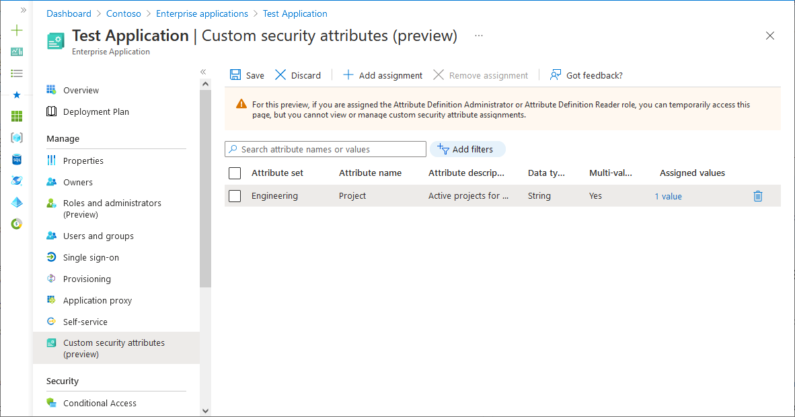
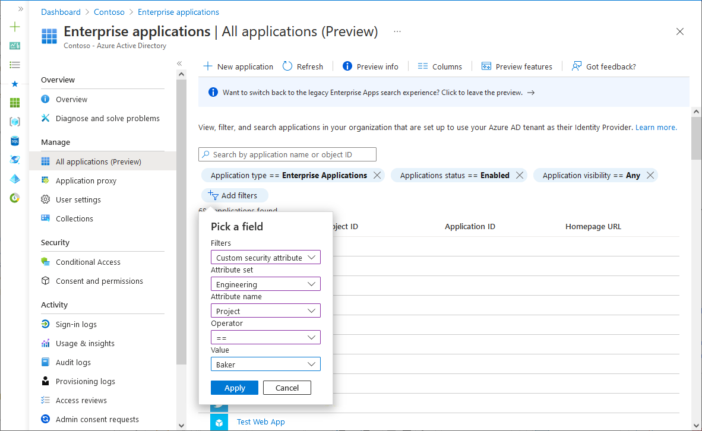

# Manage custom security attributes for an application (Preview)

> [!IMPORTANT]
> Custom security attributes are currently in PREVIEW.
> For more information about previews, see [Universal License Terms For Online Services](https://www.microsoft.com/licensing/terms/product/ForOnlineServices/all).

[Custom security attributes](../fundamentals/custom-security-attributes-overview.md) in Microsoft Entra ID are business-specific attributes (key-value pairs) that you can define and assign to Microsoft Entra objects. For example, you can assign custom security attribute to filter your applications or to help determine who gets access. This article describes how to assign, update, list, or remove custom security attributes for Microsoft Entra enterprise applications.

## Prerequisites

To assign or remove custom security attributes for an application in your Microsoft Entra tenant, you need:

- Microsoft Entra ID P1 or P2 license
- [Attribute Assignment Administrator](../roles/permissions-reference.md#attribute-assignment-administrator)
- Make sure you have existing custom security attributes. To learn how to create a security attribute, see [Add or deactivate custom security attributes in Microsoft Entra ID](../fundamentals/custom-security-attributes-add.md).


> [!IMPORTANT]
> By default, [Global Administrator](../roles/permissions-reference.md#global-administrator) and other administrator roles don't have permissions to read, define, or assign custom security attributes.

## Assign, update, list, or remove  custom attributes for an application

Learn how to work with custom attributes for applications in Microsoft Entra ID.
### Assign custom security attributes to an application

[!INCLUDE [portal updates](~/articles/active-directory/includes/portal-update.md)]


:::zone pivot="portal"

Undertake the following steps to assign custom security attributes through the Microsoft Entra admin center.

1. Sign in to the [Microsoft Entra admin center](https://entra.microsoft.com) as an [Attribute Assignment Administrator](../roles/permissions-reference.md#attribute-assignment-administrator). 
1. Browse to **Identity** > **Applications** > **Enterprise applications**. 

1. Find and select the application you want to add a custom security attribute to.

1. In the Manage section, select **Custom security attributes (preview)**.

1. Select **Add assignment**.

1. In **Attribute set**, select an attribute set from the list.

1. In **Attribute name**, select a custom security attribute from the list.
  
1. Depending on the properties of the selected custom security attribute, you can enter a single value, select a value from a predefined list, or add multiple values.

    - For freeform, single-valued custom security attributes, enter a value in the **Assigned values** box.
    - For predefined custom security attribute values, select a value from the **Assigned values** list.
    - For multi-valued custom security attributes, select **Add values** to open the **Attribute values** pane and add your values. When finished adding values, select **Done**.

    

1. When finished, select **Save** to assign the custom security attributes to the application.

### Update custom security attribute assignment values for an application

1. Sign in to the [Microsoft Entra admin center](https://entra.microsoft.com) as an [Attribute Assignment Administrator](../roles/permissions-reference.md#attribute-assignment-administrator). 
1. Browse to **Identity** > **Applications** > **Enterprise applications**.

1. Find and select the application that has a custom security attribute assignment value you want to update.

1. In the Manage section, select **Custom security attributes (preview)**.

1. Find the custom security attribute assignment value you want to update.

    Once you've assigned a custom security attribute to an application, you can only change the value of the custom security attribute. You can't change other properties of the custom security attribute, such as attribute set or custom security attribute name.

1. Depending on the properties of the selected custom security attribute, you can update a single value, select a value from a predefined list, or update multiple values.

1. When finished, select **Save**.

### Filter applications based on custom security attributes

You can filter the list of custom security attributes assigned to applications on the **All applications** page.

1. Sign in to the [Microsoft Entra admin center](https://entra.microsoft.com) as at least an [Attribute Assignment Reader](../roles/permissions-reference.md#attribute-assignment-reader). 
1. Browse to **Identity** > **Applications** > **Enterprise applications**.

1. Select **Add filters** to open the Pick a field pane.

    If you don't see **Add filters**, select the banner to enable the Enterprise applications search preview.

1. For **Filters**, select **Custom security attribute**.

1. Select your attribute set and attribute name.

1. For **Operator**, you can select equals (**==**), not equals (**!=**), or **starts with**.

1. For **Value**, enter or select a value.

    

1. To apply the filter, select **Apply**.

### Remove custom security attribute assignments from applications

1. Sign in to the [Microsoft Entra admin center](https://entra.microsoft.com) as a [Attribute Assignment Administrator](../roles/permissions-reference.md#attribute-assignment-administrator). 
1. Browse to **Identity** > **Applications** > **Enterprise applications**.

1. Find and select the application that has the custom security attribute assignments you want to remove.

1. In the **Manage** section, select **Custom security attributes (preview)**.

1. Add check marks next to all the custom security attribute assignments you want to remove.

1. Select **Remove assignment**.

:::zone-end

:::zone pivot="aad-powershell"
### PowerShell

To manage custom security attribute assignments for applications in your Microsoft Entra organization, you can use PowerShell. The following commands can be used to manage assignments.

### Assign a custom security attribute with a multi-string value to an application (service principal)

Use the [Set-AzureADMSServicePrincipal](/powershell/module/azuread/set-azureadmsserviceprincipal) command to assign a custom security attribute with a multi-string value to an application (service principal).

- Attribute set: `Engineering`
- Attribute: `Project`
- Attribute data type: Collection of Strings
- Attribute value: `("Baker","Cascade")`

```powershell
$attributes = @{
    Engineering = @{
        "@odata.type" = "#Microsoft.DirectoryServices.CustomSecurityAttributeValue"
        "Project@odata.type" = "#Collection(String)"
        Project = @("Baker","Cascade")
    }
}
Set-AzureADMSServicePrincipal -Id 7d194b0c-bf17-40ff-9f7f-4b671de8dc20 -CustomSecurityAttributes $attributes
```

### Update a custom security attribute with a multi-string value for an application (service principal)

Provide the new set of attribute values that you would like to reflect on the application. In this example, we're adding one more value for project attribute.

- Attribute set: `Engineering`
- Attribute: `Project`
- Attribute data type: Collection of Strings
- Attribute value: `("Alpine","Baker")`

```powershell
$attributesUpdate = @{
    Engineering = @{
        "@odata.type" = "#Microsoft.DirectoryServices.CustomSecurityAttributeValue"
        "Project@odata.type" = "#Collection(String)"
        Project = @("Alpine","Baker")
    }
}
Set-AzureADMSServicePrincipal -Id 7d194b0c-bf17-40ff-9f7f-4b671de8dc20 -CustomSecurityAttributes $attributesUpdate 
```

### Get the custom security attribute assignments for an application (service principal)

Use the [Get-AzureADMSServicePrincipal](/powershell/module/azuread/get-azureadmsserviceprincipal) command to get the custom security attribute assignments for an application (service principal).

```powershell
Get-AzureADMSServicePrincipal -Select CustomSecurityAttributes
Get-AzureADMSServicePrincipal -Id 7d194b0c-bf17-40ff-9f7f-4b671de8dc20  -Select "CustomSecurityAttributes, Id"
```

:::zone-end

:::zone pivot="ms-powershell"

To manage custom security attribute assignments for applications in your Microsoft Entra organization, you can use Microsoft Graph PowerShell. The following commands can be used to manage assignments.

### Assign a custom security attribute with a multi-string value to an application (service principal)

Use the [Set-AzureADMSServicePrincipal](/powershell/module/azuread/set-azureadmsserviceprincipal) command to assign a custom security attribute with a multi-string value to an application (service principal).

Given the values

- Attribute set: Engineering
- Attribute: Project
- Attribute data type: String
- Attribute value: "Baker"

```powershell
#Retrieve the servicePrincipal

$ServicePrincipal= (Get-MgServicePrincipal -Filter "displayName eq 'Microsoft Graph'").Id

$params = @{
CustomSecurityAttributes = @{
Engineering =@{
"@odata.type" = "#Microsoft.DirectoryServices.CustomSecurityAttributeValue"
ProjectDate ="Baker"
}
 }
 }

Update-MgServicePrincipal -ServicePrincipalId $ServicePrincipal -BodyParameter $params
```

### Update a custom security attribute with a multi-string value for an application (service principal)

Provide the new set of attribute values that you would like to reflect on the application. In this example, we're adding one more value for project attribute.

```powershell
$params = @{
 CustomSecurityAttributes = @{
Engineering =@{
"@odata.type" = "#Microsoft.DirectoryServices.CustomSecurityAttributeValue"
Project =@(
 "Baker"
"Cascade"
)
 }
 }
 }
Update-MgServicePrincipal -ServicePrincipalId $ServicePrincipal -BodyParameter $params
```

### Filter applications based on custom security attributes

This example filters a list of applications with a custom security attribute assignment that equals the specified value.

```powershell
Get-MgServicePrincipal -CountVariable CountVar -Property "id,displayName,customSecurityAttributes" -Filter "customSecurityAttributes/Engineering/Project eq 'Baker'" -ConsistencyLevel eventual
```

### Remove custom security attribute assignments from applications

In this example, we remove a custom security attribute assignment that supports multiple values. 

```powershell
$params = @{
CustomSecurityAttributes = @{
Engineering =@{
"@odata.type" = "#Microsoft.DirectoryServices.CustomSecurityAttributeValue"
 Project =@(
 )
 }
 }
 }
Update-MgServicePrincipal -ServicePrincipalId $ServicePrincipal -BodyParameter $params
```


:::zone-end

:::zone pivot="ms-graph"

To manage custom security attribute assignments for applications in your Microsoft Entra organization, you can use the Microsoft Graph API. Make the following API calls to manage assignments.

For other similar Microsoft Graph API examples for users, see [Assign, update, list, or remove custom security attributes for a user](../enterprise-users/users-custom-security-attributes.md#powershell-or-microsoft-graph-api) and [Examples: Assign, update, list, or remove custom security attribute assignments using the Microsoft Graph API](/graph/custom-security-attributes-examples).

### Assign a custom security attribute with a multi-string value to an application (service principal)

Use the [Update servicePrincipal](/graph/api/serviceprincipal-update?view=graph-rest-beta&preserve-view=true) API to assign a custom security attribute with a string value to an application.

Given the values

- Attribute set: Engineering
- Attribute: Project
- Attribute data type: String
- Attribute value: "Baker"

```http
PATCH https://graph.microsoft.com/beta/servicePrincipals/{id}
Content-type: application/json

{
    "customSecurityAttributes":
    {
        "Engineering":
        {
            "@odata.type":"#Microsoft.DirectoryServices.CustomSecurityAttributeValue",
            "Project@odata.type":"#Collection(String)",
            "Project": "Baker"
        }
    }
}
```

### Update a custom security attribute with a multi-string value for an application (service principal)

Provide the new set of attribute values that you would like to reflect on the application. In this example, we're adding one more value for project attribute.

```http
PATCH https://graph.microsoft.com/beta/servicePrincipals/{id}
Content-type: application/json

{
    "customSecurityAttributes":
    {
        "Engineering":
        {
            "@odata.type":"#Microsoft.DirectoryServices.CustomSecurityAttributeValue",
            "Project@odata.type":"#Collection(String)",
            "Project":["Baker","Cascade"]
        }
    }
}
```

### Filter applications based on custom security attributes

This example filters a list of applications with a custom security attribute assignment that equals the specified value.

```http
GET https://graph.microsoft.com/beta/servicePrincipals?$count=true&$select=id,displayName,customSecurityAttributes&$filter=customSecurityAttributes/Engineering/Project eq 'Baker'ConsistencyLevel: eventual
```

### Remove custom security attribute assignments from an application

In this example, we remove a custom security attribute assignment that supports multiple values. 

```http
PATCH https://graph.microsoft.com/beta/servicePrincipals/{id}
Content-type: application/json

{
    "customSecurityAttributes":
    {
        "Engineering":
        {
            "@odata.type":"#Microsoft.DirectoryServices.CustomSecurityAttributeValue",
            "Project":[]
        }
    }
}
```

:::zone-end

## Next steps

- [Add or deactivate custom security attributes in Microsoft Entra ID](../fundamentals/custom-security-attributes-add.md)
- [Assign, update, list, or remove custom security attributes for a user](../enterprise-users/users-custom-security-attributes.md)
- [Troubleshoot custom security attributes in Microsoft Entra ID](../fundamentals/custom-security-attributes-troubleshoot.md)
