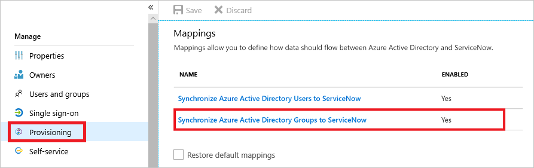

# Customizing User Provisioning Attribute-Mappings for SaaS Applications in Azure Active Directory
Microsoft Azure AD provides support for user provisioning to third-party SaaS applications such as Salesforce, Google Apps and others. If you have user provisioning for a third-party SaaS application enabled, the Azure portal controls its attribute values in form of  attribute-mappings.

There is a pre-configured set of attributes and attribute-mappings between Azure AD user objects and each SaaS app’s user objects. Some apps manage other types of objects in addition to Users, such as Groups.   
 You can customize the default attribute-mappings according to your business needs. This means, you can change or delete existing attribute-mappings, or create new attribute-mappings.
 
## Editing user attribute-mappings

In the Azure AD portal, you can access this feature by clicking a **Mappings** configuration under **Provisioning** in the **Manage** section of an **Enterprise application**.

 

Clicking a **Mappings** configuration, opens the related **Attribute-Mapping** screen. There are attribute-mappings that are required by a SaaS application to function correctly. For required attributes, the **Delete** feature is unavailable.

In the example above, you can see that the **Username** attribute of a managed object in Salesforce is populated with the **userPrincipalName** value of the linked Azure Active Directory Object.

You can customize existing **Attribute-Mappings** by clicking a mapping. This opens the **Edit Attribute** screen.

### Understanding attribute-mapping types
With attribute-mappings, you control how attributes are populated in a third-party SaaS application. 
There are four different mapping types supported:

* **Direct** – the target attribute is populated with the value of an attribute of the linked object in Azure AD.
* **Constant** – the target attribute is populated with a specific string you have specified.
* **Expression** - the target attribute is populated based on the result of a script-like expression. 
  For more information, see [Writing Expressions for Attribute-Mappings in Azure Active Directory](functions-for-customizing-application-data.md).
* **None** - the target attribute is left unmodified. However, if the target attribute is ever empty, it is populated with the Default value that you specify.

In addition to these four basic types, custom attribute-mappings support the concept of an optional **default** value assignment. The default value assignment ensures that a target attribute is populated with a value if there is neither a value in Azure AD nor on the target object. The most common configuration is to leave this blank.

### Understanding attribute-mapping properties

In the previous section, you have already been introduced to the attribute-mapping type property.
In addition to this property, attribute-mappings do also support the following attributes:

- **Source attribute** - The user attribute from the source system (example: Azure Active Directory).
- **Target attribute** – The user attribute in the target system (example: ServiceNow).
- **Match objects using this attribute** – Whether or not this mapping should be used to uniquely identify users between the source and target systems. This is typically set on the userPrincipalName or mail attribute in Azure AD, which is typically mapped to a username field in a target application.
- **Matching precedence** – Multiple matching attributes can be set. When there are multiple, they are evaluated in the order defined by this field. As soon as a match is found, no further matching attributes are evaluated.
- **Apply this mapping**
    - **Always** – Apply this mapping on both user creation and update actions
    - **Only during creation** - Apply this mapping only on user creation actions

## Editing group attribute-mappings

A selected number of applications, such as ServiceNow, Box, and Google Apps, support the ability to provision Group objects in addition to User objects. Group objects can contain group properties such as display names and email aliases, in addition to group members.

Group provisioning can be optionally enabled or disabled by selecting the group mapping under **Mappings**, and setting **Enabled** to the desired option in the **Attribute-Mapping** screen.

The attributes provisioned as part of Group objects can be customized in the same manner as User objects, described previously. 

>[!TIP]
>Provisioning of group objects (properties and members) is a distinct concept from [assigning groups](assign-user-or-group-access-portal.md) to an application. It is possible to assign a group to an application, but only provision the user objects contained in the group. Provisioning of full group objects is not required to use groups in assignments.

## Editing the list of supported attributes

The user attributes supported for a given application are pre-configured. Most application's user management APIs do not support schema discovery, therefore the Azure AD provisioning service is not able to dynamically generate the list of supported attributes by making calls to the application. 

However, some applications support custom attributes. In order for the Azure AD provisioning service to be able to read and write to custom attributes, their definitions must be entered into the Azure portal using the **Show advanced options** check box at the bottom of the **Attribute-Mapping** screen.

Applications and systems that support customization of the attribute list include:

* Salesforce
* ServiceNow
* Workday
* Azure Active Directory ([Azure AD Graph API default attributes](https://msdn.microsoft.com/Library/Azure/Ad/Graph/api/entity-and-complex-type-reference#user-entity) and custom directory extensions are supported)
* Apps that support [SCIM 2.0](https://tools.ietf.org/html/rfc7643), where attributes defined in the [core schema](https://tools.ietf.org/html/rfc7643) need to be added

>[!NOTE]
>Editing the list of supported attributes is only recommended for administrators who have customized the schema of their applications and systems, and have first-hand knowledge of how their custom attributes have been defined. This sometimes requires familiarity with the APIs and developers tools provided by an application or system. 

 

When editing the list of supported attributes, the following properties are provided:

* **Name** - The system name of the attribute, as defined in the target object's schema. 
* **Type** - The type of data the attribute stores, as defined in the target object's schema. This can be one of the following:
   * *Binary* - Attribute contains binary data.
   * *Boolean* - Attribute contains a True or False value.
   * *DateTime* - Attribute contains a date string.
   * *Integer* - Attribute contains an integer.
   * *Reference* - Attribute contains an ID that references a value stored in another table in the target application.
   * *String*  - Attribute contains a text string. 
* **Primary Key?** - Whether or not the attribute is defined as a primary key field in the target object's schema.
* **Required?** - Whether or not the attribute is required to be populated in the target application or system.
* **Multi-value?** - Whether or not the attribute supports multiple values.
* **Exact case?** - Whether or not the attributes values are evaluated in a case-sensitive way.
* **API Expression** - Do not use, unless instructed to do so by the documentation for a specific provisioning connector (such as Workday).
* **Referenced Object Attribute** - If this is a Reference type attribute, then this menu allows you to select the table and attribute in the target application that contains the value associated with the attribute. For example, if you have an attribute named "Department" whose stored value references an object in a separate "Departments" table, you would select "Departments.Name". Note that the reference tables and the primary ID fields supported for a given application are pre-configured and currently cannot be edited using the Azure portal, but can be edited using the [Graph API](https://developer.microsoft.com/graph/docs/api-reference/beta/resources/synchronization-configure-with-custom-target-attributes).

To add a new attribute, scroll to the end of the list of supported attributes, populate the fields above using the provided inputs, and select **Add Attribute**. Select **Save** when finished adding attributes. You will then need to reload the **Provisioning** tab for the new attributes to become available in the attribute-mapping editor.

## Restoring the default attributes and attribute-mappings

Should you need to start over, and reset your existing mappings back to their default state, you can select the **Restore default mappings** check box and save the configuration. This sets all mappings as if the application had just been added to your Azure AD tenant from the application gallery. 

Selecting this option will effectively force a re-synchronization of all users while the provisioning service is running. 

>[!IMPORTANT]
>It is strongly recommended that **Provisioning status** be set to **Off** before invoking this option.

## What you should know

* Microsoft Azure AD provides an efficient implementation of a synchronization process. In an initialized environment, only objects requiring updates are processed during a synchronization cycle. 

* Updating attribute-mappings has an impact on the performance of a synchronization cycle. An update to the attribute-mapping configuration requires all managed objects to be reevaluated. 

* It is a recommended best practice to keep the number of consecutive changes to your attribute-mappings at a minimum.

## Next steps

* [Automate User Provisioning/Deprovisioning to SaaS Apps](user-provisioning.md)
* [Writing Expressions for Attribute-Mappings](functions-for-customizing-application-data.md)
* [Scoping Filters for User Provisioning](define-conditional-rules-for-provisioning-user-accounts.md)
* [Using SCIM to enable automatic provisioning of users and groups from Azure Active Directory to applications](use-scim-to-provision-users-and-groups.md)
* [List of Tutorials on How to Integrate SaaS Apps](../saas-apps/tutorial-list.md)

