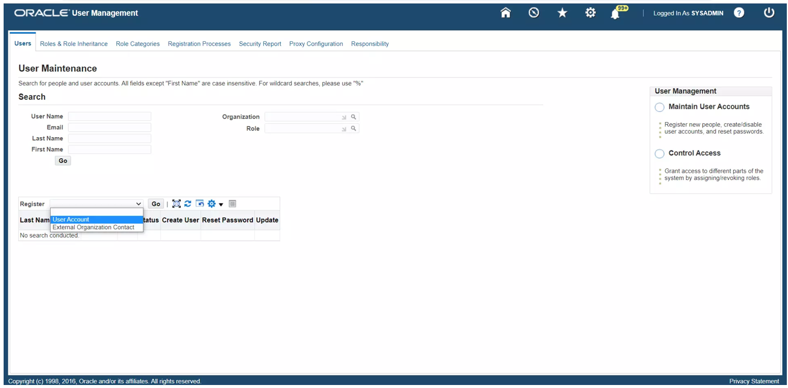
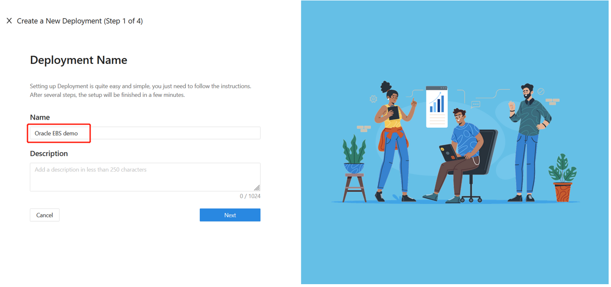
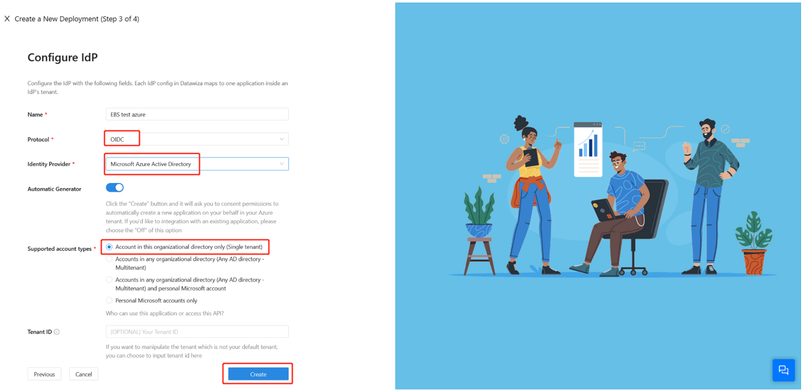
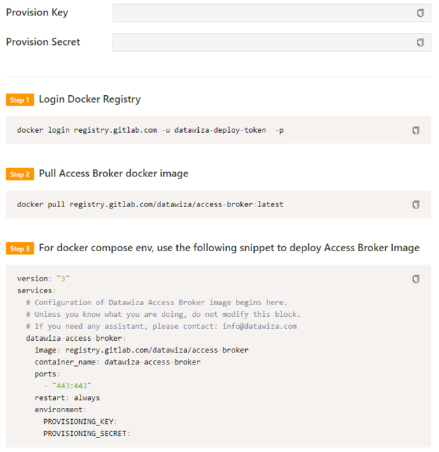
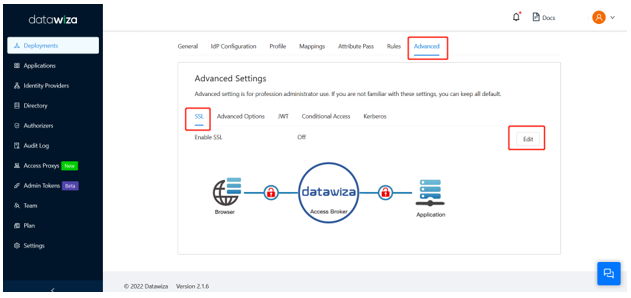
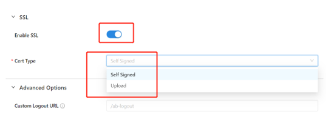
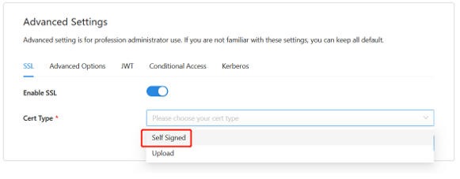
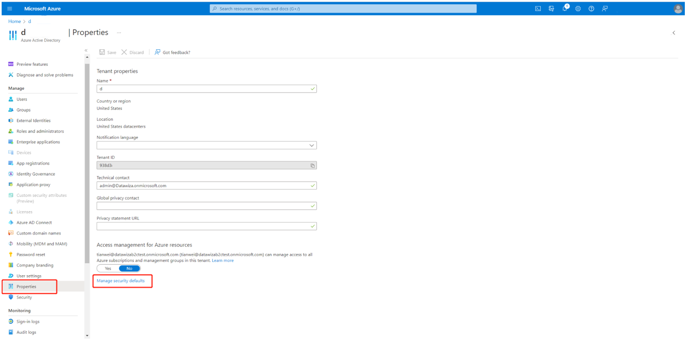
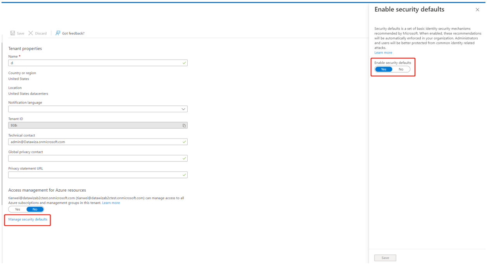

# Configure Datawiza for Azure Active Directory Multi-Factor Authentication and single sign-on to Oracle EBS 

In this tutorial, learn how to enable Azure Active Directory Multi-Factor Authentication (MFA) and single sign-on (SSO) for an Oracle E-Business Suite (Oracle EBS) application via Datawiza. 

The benefits of integrating applications with Azure Active Directory (Azure AD) via Datawiza:

* [Embrace proactive security with Zero Trust](https://www.microsoft.com/security/business/zero-trust) - a security model that adapts to modern environments and embraces hybrid workplace, while it protects people, devices, apps, and data
* [Azure Active Directory single sign-on](https://azure.microsoft.com/solutions/active-directory-sso/#overview) - secure and seamless access for users and apps, from any location, using a device
* [How it works: Azure AD Multi-Factor Authentication](../authentication/concept-mfa-howitworks.md) - users are prompted during sign-in for forms of identification, such as a code on their cellphone or a fingerprint scan
* [What is Conditional Access?](../conditional-access/overview.md) - policies are if-then statements, if a user wants to access a resource, then they must complete an action
* [Easy authentication and authorization in Azure AD with no-code Datawiza](https://www.microsoft.com/security/blog/2022/05/17/easy-authentication-and-authorization-in-azure-active-directory-with-no-code-datawiza/) - use web applications such as: Oracle JDE, Oracle E-Business Suite, Oracle Sibel, and home-grown apps
* Use the [Datawiza Cloud Management Console](https://console.datawiza.com) (DCMC) - manage access to applications in public clouds and on-premises

## Scenario description

This document focuses on modern identity providers (IdPs) integrating with the legacy Oracle EBS application. Oracle EBS requires a set of Oracle EBS service account credentials and an Oracle EBS database container (DBC) file. 

## Architecture

The solution contains the following components:

* **Azure AD** Microsoft's cloud-based identity and access management service, which helps users sign in and access external and internal resources.
* **Oracle EBS** the legacy application to be protected by Azure AD.
* **Datawiza Access Proxy (DAP)**: A super lightweight container-based reverse-proxy implements OIDC/OAuth or SAML for user sign-on flow and transparently passes identity to applications through HTTP headers.
* **Datawiza Cloud Management Console (DCMC)**:  A centralized management console that manages DAP. DCMC provides UI and RESTful APIs for administrators to manage the configurations of DAP and its granular access control policies.

### Prerequisites

Ensure the following prerequisites are met. 

* An Azure subscription. 
  * If you don't have on, you can get an [Azure free account](https://azure.microsoft.com/free/)
* An Azure AD tenant linked to the Azure subscription
* An account with Azure AD Application Admin permissions
  * See, [Azure AD built-in roles](../roles/permissions-reference.md)
* Docker and Docker Compose are required to run DAP
  * See, [Get Docker](https://docs.docker.com/get-docker/) and [Overview, Docker Compose](https://docs.docker.com/compose/install/)
* User identities synchronized from an on-premises directory to Azure AD, or created in Azure AD and flowed back to your on-premises directory
  * See, [Azure AD Connect sync: Understand and customize synchronization](../hybrid/how-to-connect-sync-whatis.md)

* An Oracle EBS environment

## Configure the Oracle EBS environment for SSO and create the DBC file

To enable SSO in the Oracle EBS environment:

1.	Sign in to the Oracle EBS Management console as an Administrator.
2.	Scroll down the Navigator panel and expand **User Management**. 

   

3. Add a user account. 

   

4. For **User Name**, enter **DWSSOUSER**.
5. For **Password**, enter a password.
6. For **Description**, enter **DW User account for SSO**.
7. For **Password Expiration**, select **None**.
8. Assign the **Apps Schema Connect** role to the user.

   

## Register DAP with Oracle EBS

In the Oracle EBS Linux environment, generate a new DBC file for DAP. You need the apps user credentials, and the default DBC file (under $FND_SECURE) used by the Apps Tier. 

1.	Configure the environment for Oracle EBS using a command similar to: `./u01/install/APPS/EBSapps.env run`
2.	Use the AdminDesktop utility to generate the new DBC file. Specify the name of a new Desktop Node for this DBC file: 

>>`java oracle.apps.fnd.security.AdminDesktop apps/apps CREATE NODE_NAME=\<ebs domain name> DBC=/u01/install/APPS/fs1/inst/apps/EBSDB_apps/appl/fnd/12.0.0/secure/EBSDB.dbc`

3.	This action generates a file called `ebsdb_\<ebs domain name>.dbc` in the location where you ran the previous command.
4.	Copy the DBC file content to a notebook. You will use the content later.

## Enable Oracle EBS for SSO

1. To integrate JDE with Azure AD, sign in to [Datawiza Cloud Management Console (DCMC)](https://console.datawiza.com/).
2. The Welcome page appears.
3. Select the orange Getting started button.

   

4. Enter a **Name**.
5. Enter a **Description**.
6. Select **Next**. 

   

7. On **Add Application**, for **Platform** select **Oracle E-Business Suite**.
8. For **App Name**, enter the app name.
9. For **Public Domain** enter the external-facing URL of the application, for example `https://ebs-external.example.com`. You can use localhost DNS for testing.
10. For **Listen Port**, select the port that DAP listens on. You can use the port in Public Domain if you aren't deploying the DAP behind a load balancer.
11. For **Upstream Servers**, enter the URL and port combination of the Oracle EBS implementation being protected.
12. For **EBS Service Account**, enter the username from Service Account (DWSSOUSER).
13. For **EBS Account Password**, enter the password for the Service Account.
14. For **EBS User Mapping**, the product decides the attribute to be mapped to Oracle EBS username for authentication.
15. For **EBS DBC Content**, use the content you copied.
16. Select **Next**.

    

### IdP configuration

Use the DCMC one-click integration to help you complete Azure AD configuration. With this feature, you can reduce management costs and configuration errors are less likely.

   

### Docker Compose file

Configuration on the management console is complete. You are prompted to deploy Datawiza Access Proxy (DAP) with your application. Make a note the deployment Docker Compose file. The file includes the image of the DAP, PROVISIONING_KEY, and PROVISIONING_SECRET. DAP uses this information to pull the latest configuration and policies from DCMC. 

   

### SSL configuration

1. For certificate configuration, select the **Advanced** tab on your application page.

   

2. Enable SSL. 
3. Select a **Cert Type**.

   

4. There's a self-signed certificate for localhost, which you can use for testing.

   

5. (Optional) You can upload a certificate from a file.

   

6. Select **Save**.

### Optional: Enable MFA on Azure AD

To provide more security for sign-ins, you can enforce MFA for user sign-in by enabling MFA on the Azure portal.

1.	Sign in to the Azure portal as a Global Administrator.
2.	Select **Azure Active Directory** > **Manage** > **Properties**.
3.	Under **Properties**, select **Manage security defaults**.
   
    

4. Under **Enable security defaults**, select **Yes**.
5. Select **Save**.

   

## Next steps 

- Video: [Enable SSO and MFA for Oracle JD Edwards with Azure AD via Datawiza](https://www.youtube.com/watch?v=_gUGWHT5m90)
- [Tutorial: Configure Secure Hybrid Access with Azure AD and Datawiza](./datawiza-with-azure-ad.md)
- [Tutorial: Configure Azure AD B2C with Datawiza to provide secure hybrid access](../../active-directory-b2c/partner-datawiza.md)
- Go to docs.datawiza.com for Datawiza [User Guides](https://docs.datawiza.com/)
