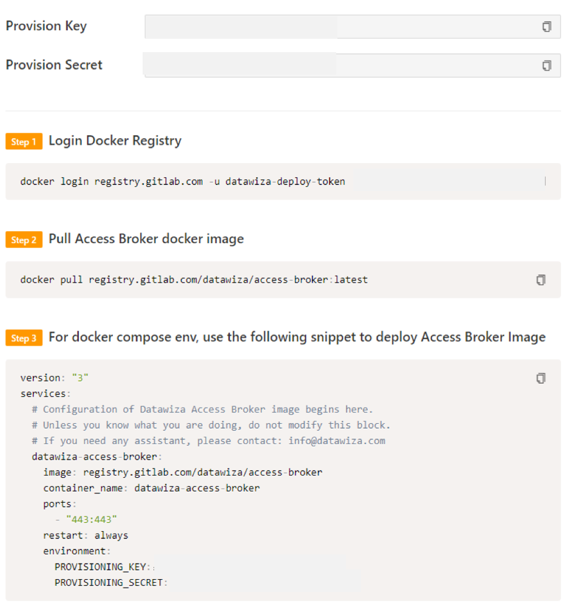
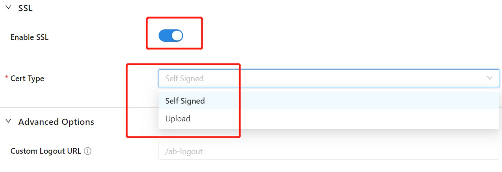
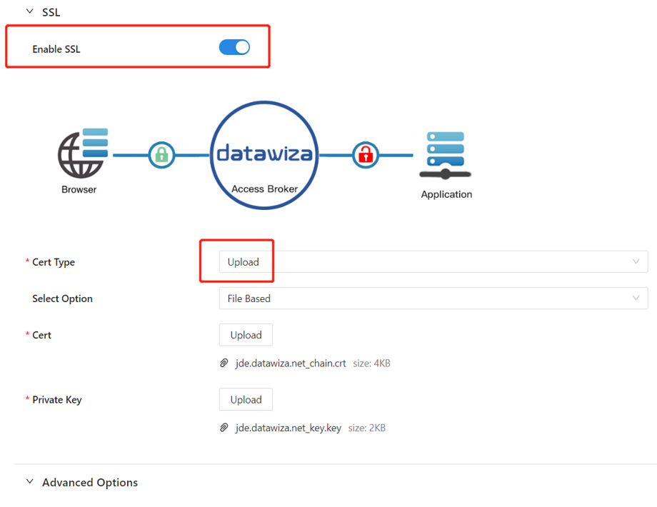

# Tutorial: Configure Datawiza to enable Azure Active Directory Multi-Factor Authentication and single sign-on to Oracle JD Edwards

This tutorial shows how to enable Azure Active Directory (Azure AD) single sign-on (SSO) and Azure AD Multi-Factor Authentication for an Oracle JD Edwards (JDE) application using Datawiza Access Broker (DAB).

Benefits of integrating applications with Azure AD using DAB include:

- [Proactive security with Zero Trust](https://www.microsoft.com/security/business/zero-trust) through [Azure AD SSO](https://azure.microsoft.com/solutions/active-directory-sso/OCID=AIDcmm5edswduu_SEM_e13a1a1787ce1700761a78c235ae5906:G:s&ef_id=e13a1a1787ce1700761a78c235ae5906:G:s&msclkid=e13a1a1787ce1700761a78c235ae5906#features), [Azure AD Multi-Factor Authentication](../authentication/concept-mfa-howitworks.md) and
  [Conditional Access](../conditional-access/overview.md).

- [Easy authentication and authorization in Azure AD with no-code Datawiza](https://www.microsoft.com/security/blog/2022/05/17/easy-authentication-and-authorization-in-azure-active-directory-with-no-code-datawiza/). Use of web applications such as: Oracle JDE, Oracle E-Business Suite, Oracle Sibel, Oracle Peoplesoft, and home-grown apps.

- Use the [Datawiza Cloud Management Console](https://console.datawiza.com), to manage access to applications in public clouds and on-premises.

## Scenario description

This scenario focuses on Oracle JDE application integration using HTTP authorization headers to manage access to protected content.

In legacy applications, due to the absence of modern protocol support, a direct integration with Azure AD SSO is difficult. Datawiza Access Broker (DAB) is used to bridge the gap between the legacy application and the modern ID control plane, through protocol transitioning. DAB lowers integration overhead, saves engineering time, and improves application security.

## Scenario architecture

The scenario solution has the following components:

- **Azure AD**: The Microsoft cloud-based identity and access management service, which helps users sign in and access external and internal resources.

- **Oracle JDE application**: Legacy application protected by Azure AD.

- **Datawiza Access Broker (DAB)**: A lightweight container-based reverse-proxy that implements OpenID Connect (OIDC), OAuth, or Security Assertion Markup Language (SAML) for user sign-in flow. It transparently passes identity to applications through HTTP headers.

- **Datawiza Cloud Management Console (DCMC)**: A centralized console to manage DAB. DCMC has UI and RESTful APIs for administrators to configure Datawiza Access Broker and access control policies.

Understand the SP initiated flow by following the steps mentioned in [Datawiza and Azure AD authentication
architecture](./datawiza-with-azure-ad.md#datawiza-with-azure-ad-authentication-architecture).

## Prerequisites

Ensure the following prerequisites are met.

- An Azure subscription. If you don't have one, you can get an [Azure free account](https://azure.microsoft.com/free)

- An Azure AD tenant linked to the Azure subscription.
  - See, [Quickstart: Create a new tenant in Azure Active Directory.](../fundamentals/active-directory-access-create-new-tenant.md)

- Docker and Docker Compose

  - Go to docs.docker.com to [Get Docker](https://docs.docker.com/get-docker) and [Install Docker Compose](https://docs.docker.com/compose/install).

- User identities synchronized from an on-premises directory to Azure AD, or created in Azure AD and flowed back to an on-premises directory.

  - See, [Azure AD Connect sync: Understand and customize synchronization](../hybrid/how-to-connect-sync-whatis.md).

- An account with Azure AD and the Application administrator role

  - See, [Azure AD built-in roles, all roles](../roles/permissions-reference.md#all-roles).

- An Oracle JDE environment

- (Optional) An SSL web certificate to publish services over HTTPS. You can also use default Datawiza self-signed certs for testing. 

## Getting started with DAB

To integrate Oracle JDE with Azure AD:

1. Sign in to [Datawiza Cloud Management Console.](https://console.datawiza.com/)

2. The Welcome page appears.

3. Select the orange **Getting started** button.

   

4. In the **Name** and **Description** fields, enter the relevant information.

5. Select **Next**.

   

6. On the **Add Application** dialog, use the following values:

   | Property| Value|
   |:-----|:-------|
   | Platform | Web |
   | App Name | Enter a unique application name.|
   | Public Domain | For example: `https://jde-external.example.com`.  For testing, you can use localhost DNS. If you aren't deploying DAB behind a load balancer, use the **Public Domain** port. |
   | Listen Port | The port that DAB listens on.|
   | Upstream Servers | The Oracle JDE implementation URL and port to be protected.|

7. Select **Next**.

   

8. On the **Configure IdP** dialog, enter the relevant information.

   >[!Note]
   >DCMC has [one-click integration](https://docs.datawiza.com/tutorial/web-app-azure-one-click.html) to help complete Azure AD configuration. DCMC calls the Graph API to create an application registration on your behalf in your Azure AD tenant.

9. Select **Create**.

   

10. The DAB deployment page appears.

11. Make a note of the deployment Docker Compose file. The file includes the DAB image, also the Provisioning Key and Provision Secret, which pulls the latest configuration and policies from DCMC.

    

## SSO and HTTP headers

DAB gets user attributes from IdP and passes them to the upstream application with a header or cookie.

For the Oracle JDE application to recognize the user correctly, there's another configuration step. Using a certain name, it instructs DAB to pass the values from the IdP to the application through the HTTP header.

1. In Oracle JDE, from the left navigation, select **Applications**.

2. Select the **Attribute Pass** subtab.

3. Use the following values.

   | Property| Value |
   |:-----------|:-------------|
   | Field | Email |
   | Expected | JDE_SSO_UID |
   | Type | Header |

   

   >[!Note]
   >This configuration uses the Azure AD user principal name as the sign in username used by Oracle JDE. To use another user identity, go to the **Mappings** tab.

   

4. Select the **Advanced** tab.

   

   

5. Select **Enable SSL**.

6. From the **Cert Type** dropdown, select a type.

   

7. For testing purposes, we'll be providing a self-signed certificate. 

   

   >[!NOTE]
   >You have the option to upload a certificate from a file.

   

8. Select **Save**.

## Enable Azure AD Multi-Factor Authentication 

To provide an extra level of security for sign-ins, enforce multifactor authentication (MFA) for user sign-in. One way to achieve this is to [enable MFA on the Azure portal](../authentication/tutorial-enable-azure-mfa.md).

1. Sign in to the Azure portal as a **Global Administrator**.

2. Select **Azure Active Directory** > **Manage** > **Properties**. 

3. Under **Properties**, select **Manage security defaults**. 

4. Under **Enable Security defaults**, select **Yes** and then **Save**.

## Enable SSO in the Oracle JDE EnterpriseOne Console

To enable SSO in the Oracle JDE environment:

1. Sign in to the Oracle JDE EnterpriseOne Server Manager Management Console as an **Administrator**.

2. In **Select Instance**, select the option above **EnterpriseOne HTML Server**.

3. In the **Configuration** tile, select **View as Advanced**, and then select **Security**.

4. Select the **Enable Oracle Access Manager** checkbox.

5. In the **Oracle Access Manager Sign-Off URL** field, enter **datawiza/ab-logout**.

6. In the **Security Server Configuration** section, select **Apply**.

7. Select **Stop** to confirm you want to stop the managed instance.

   >[!NOTE]
   >If a message shows the web server configuration (jas.ini) is out-of-date, select **Synchronize Configuration**.

8. Select **Start** to confirm you want to start the managed instance.

## Test an Oracle JDE-based application

Testing validates the application behaves as expected for URIs. To test an Oracle JDE application, you validate application headers, policy, and overall testing. If needed, use header and policy simulation to validate header fields and policy execution.

To confirm Oracle JDE application access occurs correctly, a prompt appears to use an Azure AD account for sign-in. Credentials are checked and the Oracle JDE appears.

## Next steps

- [Watch the video - Enable SSO/MFA for Oracle JDE with Azure AD via Datawiza](https://www.youtube.com/watch?v=_gUGWHT5m90).

- [Configure Datawiza and Azure AD for secure hybrid access](./datawiza-with-azure-ad.md)

- [Configure Datawiza with Azure AD B2C](../../active-directory-b2c/partner-datawiza.md)

- [Datawiza documentation](https://docs.datawiza.com/)