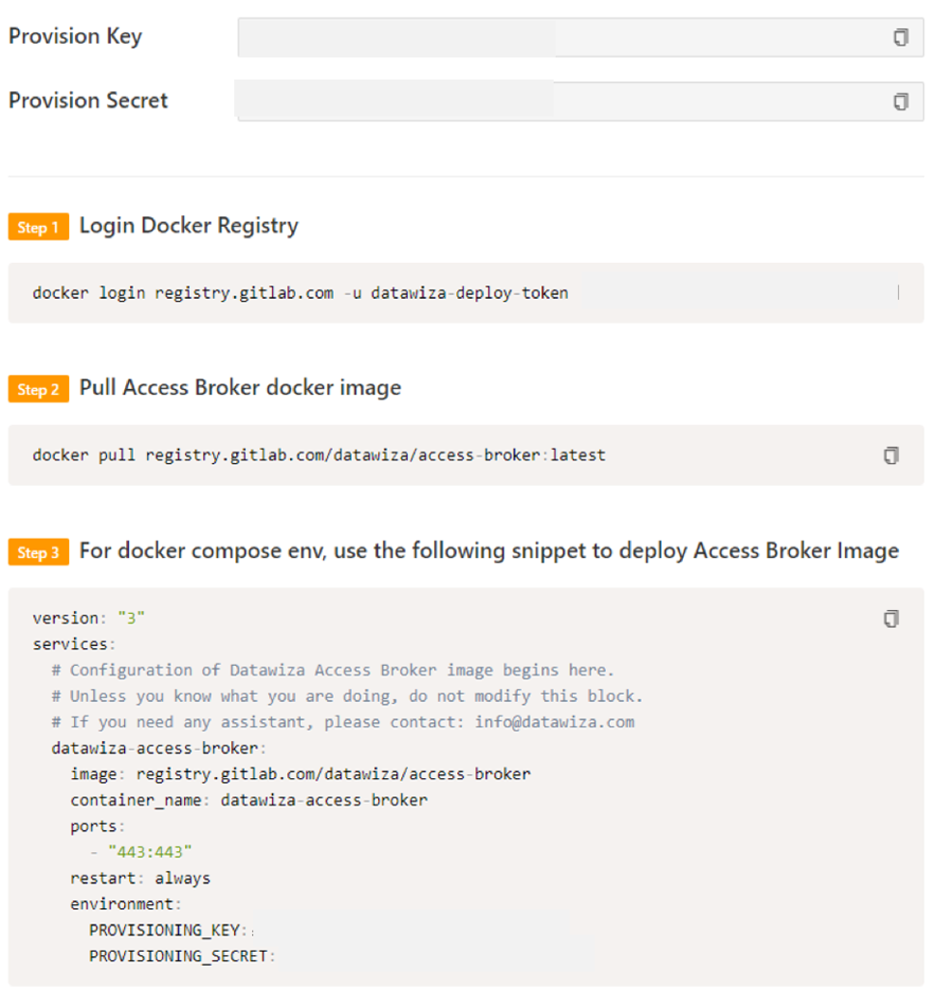
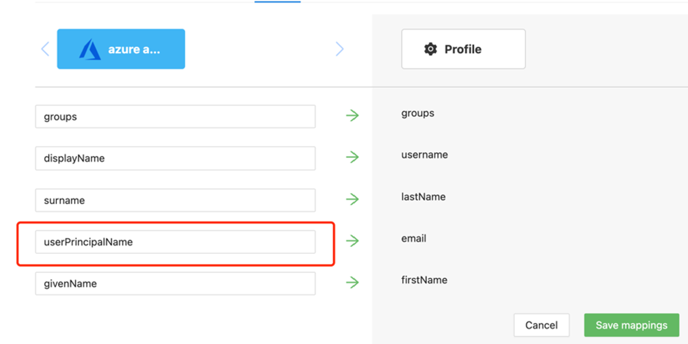
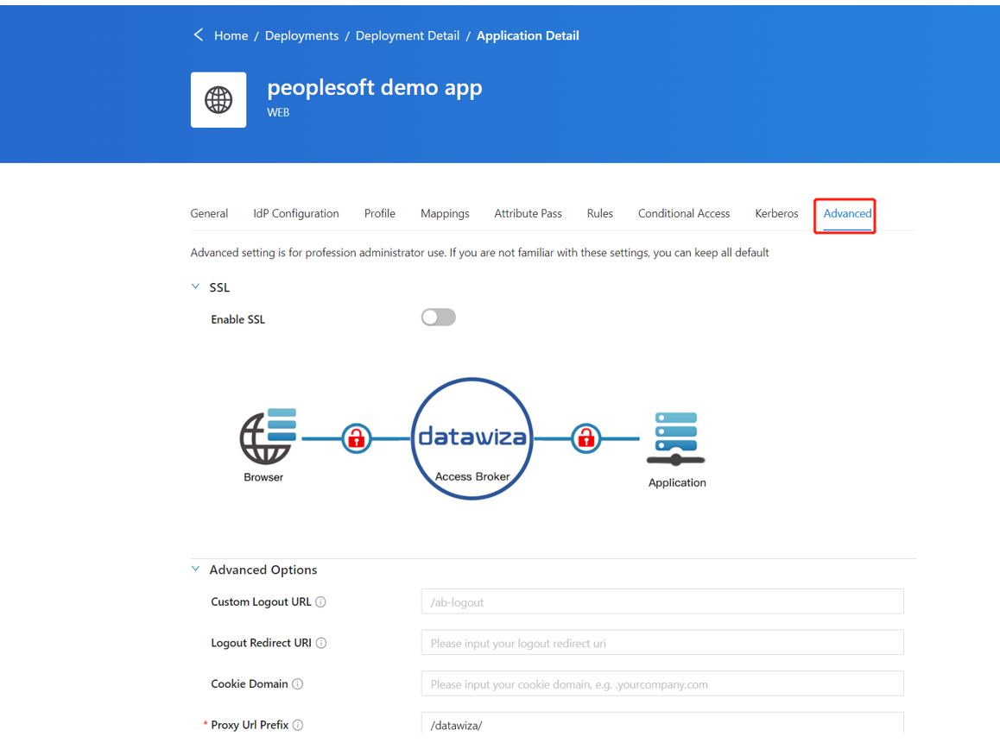
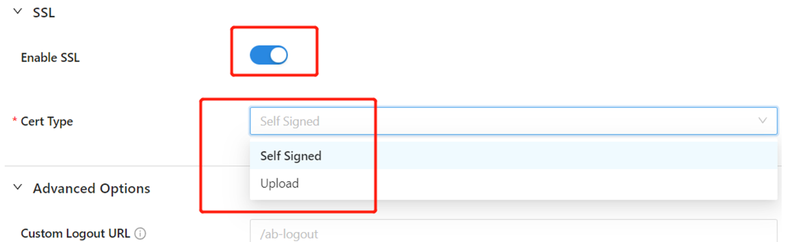
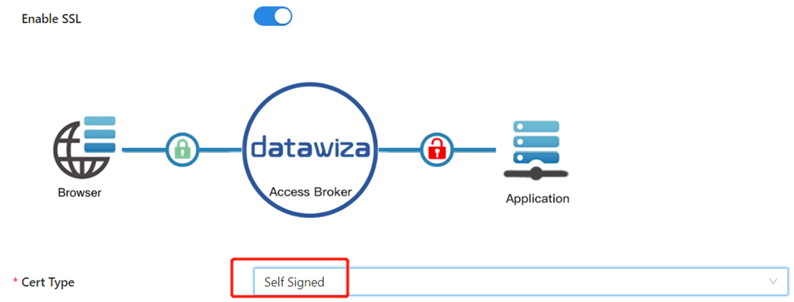
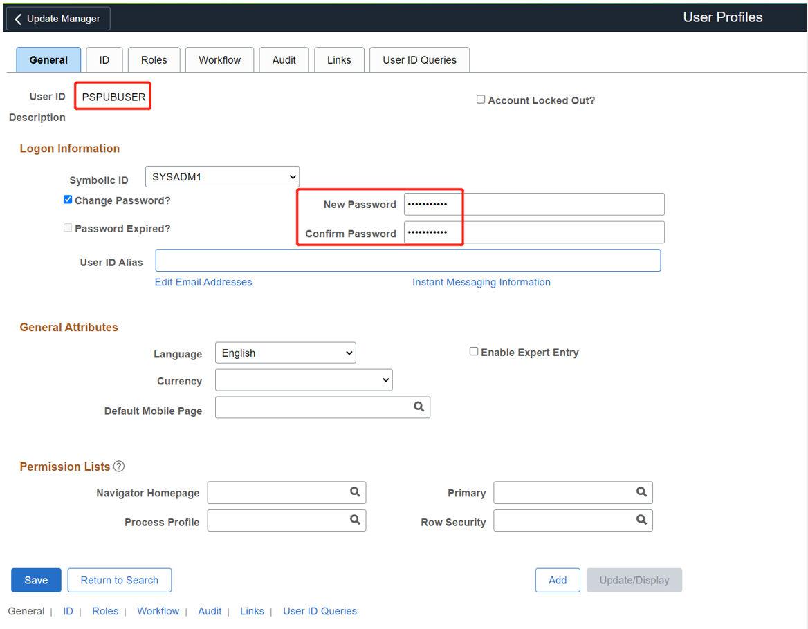
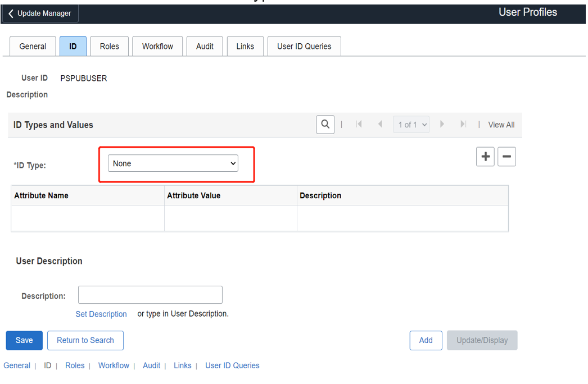
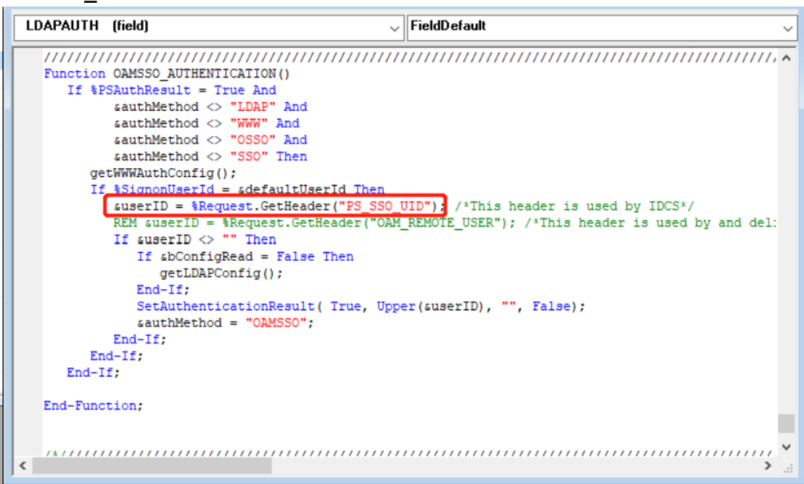

# Tutorial: Configure Datawiza to enable Azure Active Directory Multi-Factor Authentication and single sign-on to Oracle PeopleSoft

This tutorial shows how to enable Azure Active Directory (Azure AD) single sign-on (SSO) and Azure AD Multi-Factor Authentication for an
Oracle PeopleSoft application using Datawiza Access Broker (DAB).

Benefits of integrating applications with Azure AD using DAB include:

- [Proactive security with Zero Trust](https://www.microsoft.com/security/business/zero-trust) through [Azure AD SSO](https://azure.microsoft.com/solutions/active-directory-sso/OCID=AIDcmm5edswduu_SEM_e13a1a1787ce1700761a78c235ae5906:G:s&ef_id=e13a1a1787ce1700761a78c235ae5906:G:s&msclkid=e13a1a1787ce1700761a78c235ae5906#features), [Azure AD Multi-Factor Authentication](../authentication/concept-mfa-howitworks.md) and
  [Conditional Access](../conditional-access/overview.md).

- [Easy authentication and authorization in Azure AD with no-code Datawiza](https://www.microsoft.com/security/blog/2022/05/17/easy-authentication-and-authorization-in-azure-active-directory-with-no-code-datawiza/). Use of web applications such as: Oracle JDE, Oracle E-Business Suite, Oracle Sibel, and home-grown apps.

- Use the [Datawiza Cloud Management Console](https://console.datawiza.com), to manage access to applications in public clouds and on-premises.

## Scenario description

This scenario focuses on Oracle PeopleSoft application integration using
HTTP authorization headers to manage access to protected content.

In legacy applications, due to the absence of modern protocol support, a
direct integration with Azure AD SSO is difficult. Datawiza Access
Broker (DAB) bridges the gap between the legacy application and the
modern ID control plane, through protocol transitioning. DAB lowers
integration overhead, saves engineering time, and improves application
security.

## Scenario architecture

The scenario solution has the following components:

- **Azure AD**: The Microsoft cloud-based identity and access management service, which helps users sign in and access external and internal resources.

- **Datawiza Access Broker (DAB)**: A lightweight container-based reverse-proxy that implements OpenID Connect (OIDC), OAuth, or Security Assertion Markup Language (SAML) for user sign-in flow. It transparently passes identity to applications through HTTP headers.

- **Datawiza Cloud Management Console (DCMC)**: A centralized console to manage DAB. DCMC has UI and RESTful APIs for administrators to configure Datawiza Access Broker and access control policies.

- **Oracle PeopleSoft application**: Legacy application going to be protected by Azure AD and DAB.

Understand the SP initiated flow by following the steps mentioned in [Datawiza and Azure AD authentication architecture](https://learn.microsoft.com/azure/active-directory/manage-apps/datawiza-with-azure-ad#datawiza-with-azure-ad-authentication-architecture).

## Prerequisites

Ensure the following prerequisites are met.

- An Azure subscription. If you don't have one, you can get an [Azure free account](https://azure.microsoft.com/free)

- An Azure AD tenant linked to the Azure subscription.

  - See, [Quickstart: Create a new tenant in Azure Active Directory.](https://learn.microsoft.com/azure/active-directory/fundamentals/active-directory-access-create-new-tenant)

- Docker and Docker Compose

  - Go to docs.docker.com to [Get Docker](https://docs.docker.com/get-docker) and [Install Docker Compose](https://docs.docker.com/compose/install).

- User identities synchronized from an on-premises directory to Azure AD, or created in Azure AD and flowed back to an on-premises directory.

  - See, [Azure AD Connect sync: Understand and customize synchronization](https://learn.microsoft.com/azure/active-directory/hybrid/how-to-connect-sync-whatis).

- An account with Azure AD and the Application administrator role

  - See, [Azure AD built-in roles, all roles](https://learn.microsoft.com/azure/active-directory/roles/permissions-reference#all-roles).

- An Oracle PeopleSoft environment

- (Optional) An SSL web certificate to publish services over HTTPS. You can also use default Datawiza self-signed certs for testing.

## Getting started with DAB

To integrate Oracle PeopleSoft with Azure AD:

1. Sign in to [Datawiza Cloud Management Console.](https://console.datawiza.com/)

2. The Welcome page appears.

3. Select the orange **Getting started** button.
  
   

4. In the Name and Description fields, enter the relevant information.

   >

5. Select **Next**.

6. On the Add Application dialog, use the following values:

   | Property | Value |
   |:-----------|:-------------|
   | Platform         | Web |
   | App Name         | Enter a unique application name|
   | Public Domain    | For example: `https://ps-external.example.com`  For testing, you can use localhost DNS. If you aren't deploying DAB behind a load balancer, use the Public Domain port.                      |
   | Listen Port      | The port that DAB listens on. |
   | Upstream Servers | The Oracle PeopleSoft implementation URL and port to be protected.|  

   
   
7. Select **Next**.

8. On the Configure IdP dialog, enter the relevant information.

   >[!Note]
   >DCMC has [one-click integration](https://docs.datawiza.com/tutorial/web-app-azure-one-click.html) to help complete Azure AD configuration. DCMC calls the Microsoft Graph API to create an application registration on your behalf in your Azure AD tenant.

9. Select **Create**.

   

10. The DAB deployment page appears.

11. Make a note of the deployment Docker Compose file. The file includes the DAB image, also the Provisioning Key and Provision Secret, which pulls the latest configuration and policies from DCMC.

    

## SSO and HTTP headers

DAB gets user attributes from the Identity provider (IdP) and passes them to the upstream application with a header or cookie.

For the Oracle PeopleSoft application to recognize the user correctly, there's another configuration step. Using a certain name, it instructs DAB to pass the values from the IdP to the application through the HTTP header.

1. In Oracle PeopleSoft, from the left navigation, select **Applications**.

2. Select the **Attribute Pass** subtab.

3. Use the following values.

   | Property | Value |
   |:--------------|:--------------|
   |Field  |        Email|
   |Expected |      PS_SSO_UID |
   |Type |          Header|

   

   >[!Note]
   >This configuration uses the Azure AD user principal name as the sign in username used by Oracle PeopleSoft. To use another user identity, go to the Mappings tab.

   

## SSL Configuration

1. Select the **Advanced tab**.

   

2. Select **Enable SSL**.

3. From the Cert Type dropdown, select a type.

   

4. For testing purposes, we'll be providing a self-signed certificate.

   

   >[!Note]
   >You have the option to upload a certificate from a file.

   

5. Select **Save**.

## Enable Azure AD Multi-Factor Authentication

To provide an extra level of security for sign-ins, enforce multi-factor authentication (MFA) for user sign-in. One way to achieve this is to [enable MFA on the Azure
portal](https://learn.microsoft.com/azure/active-directory/authentication/tutorial-enable-azure-mfa).

1. Sign in to the Azure portal as a **Global Administrator**.

2. Select **Azure Active Directory** > **Manage** > **Properties**.

3. Under Properties, select **Manage security defaults**.

4. Under Enable Security defaults, select **Yes** and then **Save**.

## Enable SSO in the Oracle PeopleSoft console

To enable SSO in the Oracle PeopleSoft environment:

1. Sign in PeopleSoft Consol `http://{your-peoplesoft-fqdn}:8000/psp/ps/?cmd=start` using Admin credentials, for example, PS/PS.

   

2. Add a default public access user to PeopleSoft

    a.  From the main menu, navigate to **PeopleTools > Security > User Profiles > User Profiles > Add a New Value**.

    b.  Select **Add a new value**.

    c.  Create user **PSPUBUSER** and enter the password.

    

    d.  Select the **ID** tab and choose the type as **none**.

    

3. Configure the web profile.

    a. Navigate to **PeopleTools > Web Profile > Web Profile Configuration > Search > PROD > Security** to configure the user profile.

    b. Select the **Allow Public Access** box and then enter the user ID **PSPUBUSER** and password.

    

    c. Select **Save**.

4. Enable SSO.

    a. Navigate to **PeopleTools > Security > Security Objects > Signon PeopleCode**.

    b. Select the **Signon PeopleCode** page.

    c. Enable the `OAMSSO_AUTHENTICATION` and then select **Save**.

5. Configure PeopleCode using the PeopleTools application designer.

    a.  Navigate to **File > Open > Definition: Record > Name: `FUNCLIB_LDAP`**.

    b.  Open **FUNCLIB_LDAP**.

    

    c.  Select the record.

    d.  Select **LDAPAUTH > View PeopleCode**

    e.  Search for the `getWWWAuthConfig()` function `Change &defaultUserId = ""; to &defaultUserId = PSPUBUSER`

    f.  Double check the user Header is `PS_SSO_UID` for `OAMSSO_AUTHENTICATION` function. Save the record definition.

    

## Test an Oracle PeopleSoft application

Testing validates the application behaves as expected for URIs. To test an Oracle PeopleSoft application, you validate application headers, policy, and overall testing. If needed, use header and policy simulation to validate header fields and policy execution.

To confirm Oracle PeopleSoft application access occurs correctly, a prompt appears to use an Azure AD account for sign-in. Credentials are checked and the Oracle PeopleSoft appears.

## Next steps

- [Watch the video - Enable SSO/MFA for Oracle PeopleSoft with Azure AD via Datawiza](https://www.youtube.com/watch?v=_gUGWHT5m90).

- [Configure Datawiza and Azure AD for secure hybrid access](https://learn.microsoft.com/azure/active-directory/manage-apps/datawiza-with-azure-ad)

- [Configure Datawiza with Azure AD B2C](https://learn.microsoft.com/azure/active-directory-b2c/partner-datawiza)

- [Datawiza documentation](https://docs.datawiza.com/)
