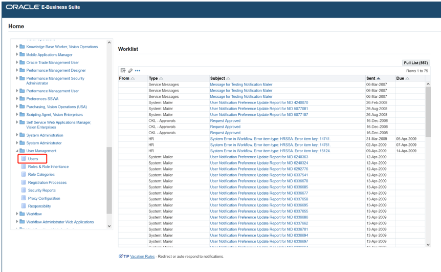
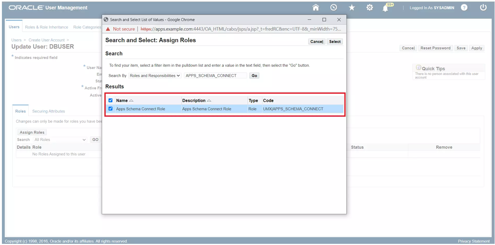
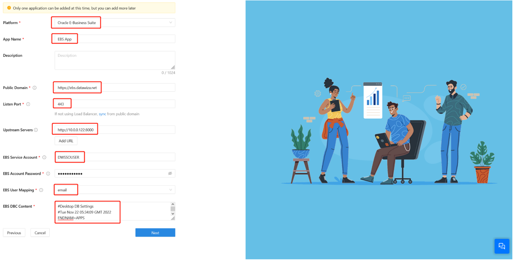
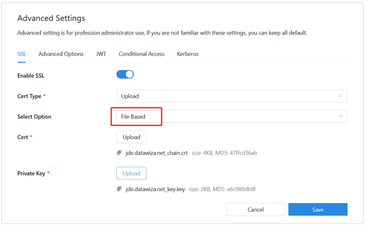

# Configure Datawiza for Azure AD Multi-Factor Authentication and single sign-on to Oracle EBS

In this article, learn how to enable Azure Active Directory (Azure AD) Multi-Factor Authentication and single sign-on (SSO) for an Oracle E-Business Suite (Oracle EBS) application via Datawiza.

Here are some benefits of integrating applications with Azure AD via Datawiza:

* A [Zero Trust](https://www.microsoft.com/security/business/zero-trust) security model adapts to modern environments and embraces a hybrid workplace while it helps protect people, devices, apps, and data.
* [Single sign-on](https://azure.microsoft.com/solutions/active-directory-sso/#overview) provides secure and seamless access for device users and apps from any location.
* [Multi-Factor Authentication](../authentication/concept-mfa-howitworks.md) prompts users during sign-in for forms of identification, such as a code on their device or a fingerprint scan.
* [Conditional Access](../conditional-access/overview.md) provides policies as if/then statements. If a user wants to access a resource, then they must complete an action.
* [Datawiza](https://www.microsoft.com/security/blog/2022/05/17/easy-authentication-and-authorization-in-azure-active-directory-with-no-code-datawiza/) provides authentication and authorization in Azure AD with no code. Use web applications such as Oracle JDE, Oracle EBS, Oracle Siebel, and home-grown apps.
* Use the [Datawiza Cloud Management Console](https://console.datawiza.com) (DCMC) to manage access to applications in public clouds and on-premises.

This article focuses on modern identity providers (IdPs) integrating with the legacy Oracle EBS application. The application requires a set of Oracle EBS service account credentials and an Oracle EBS database container (DBC) file.

## Architecture

The solution has the following components:

* **Azure AD**: Microsoft's cloud-based identity and access management service, which helps users sign in and access external and internal resources.
* **Oracle EBS**: The legacy application that Azure AD will help protect.
* **Datawiza Access Proxy (DAP)**: A lightweight container-based reverse proxy that implements OIDC/OAuth or SAML for user sign-on flow. It transparently passes identity to applications through HTTP headers.
* **DCMC**: A centralized management console that manages DAP. The console provides UI and RESTful APIs for administrators to manage the configurations of DAP and its granular access control policies.

## Prerequisites

To complete the steps in this article, you need:

* An Azure subscription. If you don't have one, you can get an [Azure free account](https://azure.microsoft.com/free/).
* An Azure AD tenant linked to the Azure subscription.
* An account with Azure AD Application Administrator permissions. For more information, see [Azure AD built-in roles](../roles/permissions-reference.md).
* Docker and Docker Compose, to run DAP. For more information, see [Get Docker](https://docs.docker.com/get-docker/) and [Docker Compose Overview](https://docs.docker.com/compose/install/).
* User identities synchronized from an on-premises directory to Azure AD, or created in Azure AD and flowed back to your on-premises directory. For more information, see [Azure AD Connect sync: Understand and customize synchronization](../hybrid/how-to-connect-sync-whatis.md).
* An Oracle EBS environment.

## Configure the Oracle EBS environment for SSO and create the DBC file

To enable SSO in the Oracle EBS environment:

1. Sign in to the Oracle EBS management console as an administrator.
2. Scroll down the navigation pane, expand **User Management**, and then select **Users**.

   

3. Add a user account. Select **Create User** > **User Account**.

   

4. For **User Name**, enter **DWSSOUSER**.
5. For **Password**, enter a password.
6. For **Description**, enter **DW User account for SSO**.
7. For **Password Expiration**, select **None**.
8. Assign **Apps Schema Connect Role** to the user.

   

## Register DAP with Oracle EBS

In the Oracle EBS Linux environment, generate a new DBC file for DAP. You need the app's user credentials and the default DBC file (under `$FND_SECURE`) that the application tier uses.

1. Configure the environment for Oracle EBS by using a command similar to `./u01/install/APPS/EBSapps.env run`.
2. Use the AdminDesktop utility to generate the new DBC file. Specify the name of a new desktop node for this DBC file:

   `java oracle.apps.fnd.security.AdminDesktop apps/apps CREATE NODE_NAME=\<ebs domain name> DBC=/u01/install/APPS/fs1/inst/apps/EBSDB_apps/appl/fnd/12.0.0/secure/EBSDB.dbc`

   This action generates a file called `ebsdb_\<ebs domain name>.dbc` in the location where you ran the command.
3. Copy the DBC file's content to a notebook. You'll use the content later.

## Enable Oracle EBS for SSO

1. To integrate JDE with Azure AD, sign in to the [Datawiza Cloud Management Console](https://console.datawiza.com/).

   The welcome page appears.
1. Select the orange **Getting started** button.

   

1. For **Name**, enter a name for the deployment.

   
1. For **Description**, enter a description of the deployment.
1. Select **Next**.

1. On **Add Application**, for **Platform**, select **Oracle E-Business Suite**.
1. For **App Name**, enter the app name.
1. For **Public Domain**, enter the external-facing URL of the application. For example, enter `https://ebs-external.example.com`. You can use localhost DNS for testing.
1. For **Listen Port**, select the port that DAP listens on. You can use the port in **Public Domain** if you aren't deploying the DAP behind a load balancer.
1. For **Upstream Servers**, enter the URL and port combination of the Oracle EBS implementation that you want to protect.
1. For **EBS Service Account**, enter the username from the service account (**DWSSOUSER**).
1. For **EBS Account Password**, enter the password for the service account.
1. For **EBS User Mapping**, the product decides the attribute to be mapped to the Oracle EBS username for authentication.
1. For **EBS DBC Content**, use the content that you copied.
1. Select **Next**.

### IdP configuration

Use the DCMC one-click integration to help you complete Azure AD configuration. With this feature, you can reduce management costs and the likelihood of configuration errors.

### Docker Compose file

Configuration on the management console is complete. You're prompted to deploy DAP with your application. Make a note of the deployment Docker Compose file. The file includes the DAP image, `PROVISIONING_KEY`, and `PROVISIONING_SECRET`. DAP uses this information to pull the latest configuration and policies from DCMC.

### SSL configuration

1. For certificate configuration, select the **Advanced** tab on your application page. Then select **SSL** > **Edit**.

   

2. Turn on the **Enable SSL** toggle.
3. For **Cert Type**, select a certificate type.

   

   There's a self-signed certificate for localhost. To use that certificate for testing, select **Self Signed**.

   

   Optionally, you can upload a certificate from a file. For **Cert Type**, select **Upload**. Then, for **Select Option**, select **File Based**.

   

4. Select **Save**.

### Optional: Enable Multi-Factor Authentication on Azure AD

[!INCLUDE [portal updates](~/articles/active-directory/includes/portal-update.md)]

To provide more security for sign-ins, you can enable Multi-Factor Authentication in the Azure portal:

1. Sign in to the [Azure portal](https://portal.azure.com) as a Global Administrator.
2. Select **Azure Active Directory** > **Manage** > **Properties**.
3. Under **Properties**, select **Manage security defaults**.

   

4. Under **Enable security defaults**, select **Yes**.

   

5. Select **Save**.

## Next steps

- [Video: Enable SSO and MFA for Oracle JD Edwards with Azure AD via Datawiza](https://www.youtube.com/watch?v=_gUGWHT5m90)
- [Tutorial: Configure Secure Hybrid Access with Azure AD and Datawiza](./datawiza-with-azure-ad.md)
- [Tutorial: Configure Azure AD B2C with Datawiza to provide secure hybrid access](../../active-directory-b2c/partner-datawiza.md)
- [Datawiza user guides](https://docs.datawiza.com/)
