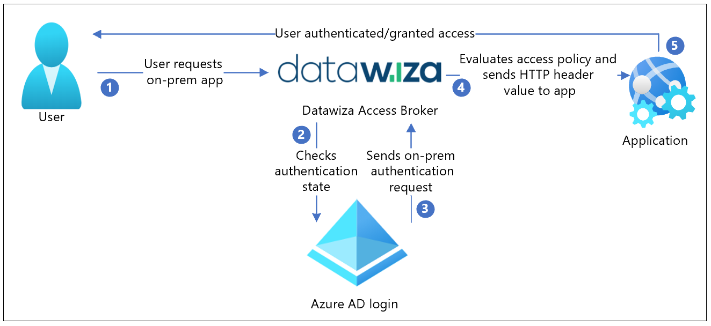
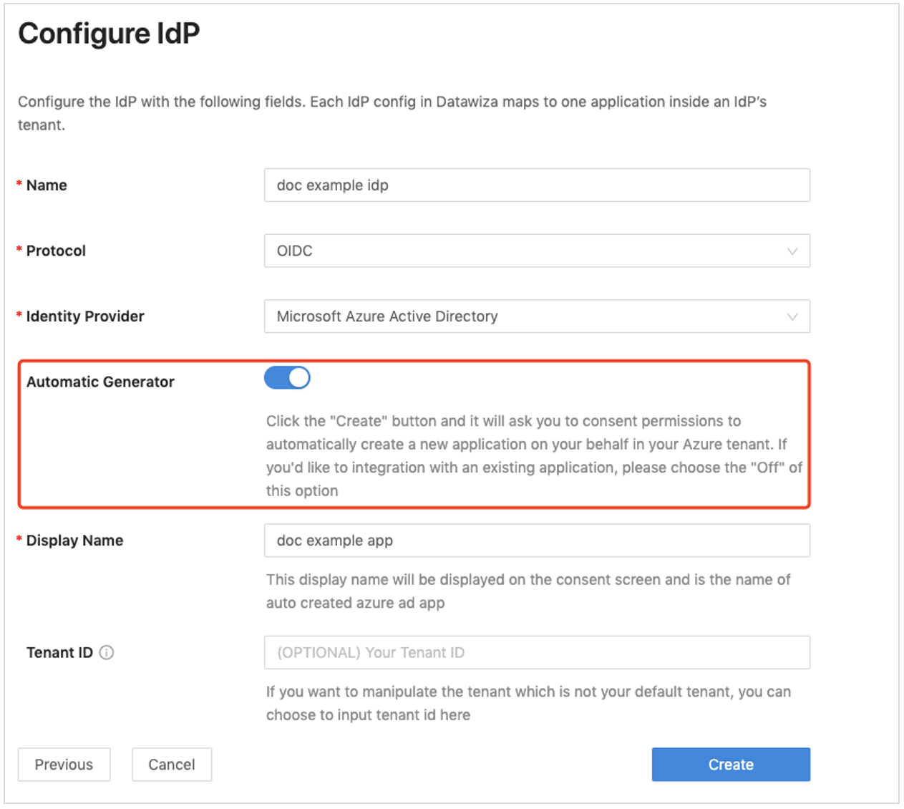
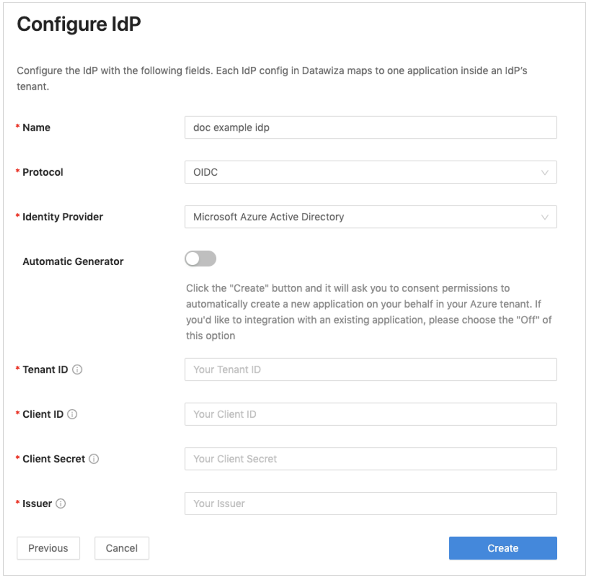
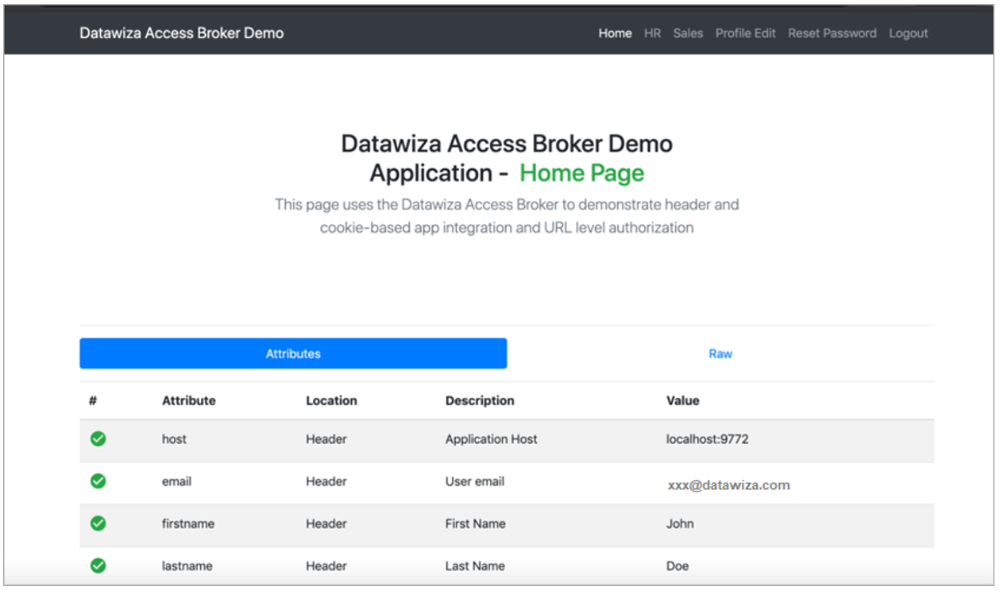

# Tutorial: Configure Secure Hybrid Access with Azure Active Directory and Datawiza

Datawiza's [Datawiza Access Broker (DAB)](https://www.datawiza.com/access-broker) extends Azure AD to enable single sign-on (SSO) and provide granular access controls to protect on-premises and cloud-hosted applications, such as Oracle E-Business Suite, Microsoft IIS, and SAP. By using this solution, enterprises can quickly transition from legacy web access managers (WAMs), such as Symantec SiteMinder, NetIQ, Oracle, and IBM, to Azure AD without rewriting applications. Enterprises can also use Datawiza as a no-code or low-code solution to integrate new applications to Azure AD. This approach enables enterprises to implement their Zero Trust strategy while saving engineering time and reducing costs.

In this tutorial, learn how to integrate Azure Active Directory (Azure AD) with [Datawiza](https://www.datawiza.com/) for [hybrid access](../devices/concept-azure-ad-join-hybrid.md).

## Datawiza with Azure AD Authentication Architecture

Datawiza integration includes the following components:

- [Azure AD](../fundamentals/active-directory-whatis.md) - A cloud-based identity and access management service from Microsoft. Azure AD helps users sign in and access external and internal resources.

- Datawiza Access Broker (DAB) - The service that users sign on to. DAB transparently passes identity information to applications through HTTP headers.

- Datawiza Cloud Management Console (DCMC) - A centralized management console that manages DAB. DCMC provides UI and RESTful APIs for administrators to manage the DAB configuration and access control policies.

The following diagram describes the authentication architecture orchestrated by Datawiza in a hybrid environment.



|Step| Description|
|:----------|:-----------|
| 1. | The user makes a request to access the on-premises or cloud-hosted application. DAB proxies the request made by the user to the application.|
| 2. | DAB checks the user's authentication state. If it doesn't receive a session token, or the supplied session token is invalid, it sends the user to Azure AD for authentication.|
| 3. | Azure AD sends the user request to the endpoint specified during the DAB application's registration in the Azure AD tenant.|
| 4. | DAB evaluates access policies and calculates attribute values to be included in HTTP headers forwarded to the application. During this step, DAB may call out to the identity provider to retrieve the information needed to set the header values correctly. DAB sets the header values and sends the request to the application. |
| 5. |  The user is authenticated and has access to the application.|

## Prerequisites

To get started, you need:

- An Azure subscription. If you don\'t have a subscription, you can get a [trial account](https://azure.microsoft.com/free/).

- An [Azure AD tenant](../fundamentals/active-directory-access-create-new-tenant.md)
that's linked to your Azure subscription.

- [Docker](https://docs.docker.com/get-docker/) and [docker-compose](https://docs.docker.com/compose/install/), which are required to run DAB. Your applications can run on any platform, such as a virtual machine and bare metal.

- An on-premises or cloud-hosted application that you'll transition from a legacy identity system to Azure AD. In this example, DAB is deployed on the same server as the application. The application runs on localhost: 3001, and DAB proxies traffic to the application via localhost: 9772. The traffic to the application reaches DAB first and is then proxied to the application.

## Configure Datawiza Cloud Management Console

1. Sign in to [Datawiza Cloud Management Console](https://console.datawiza.com/) (DCMC).

2. Create an application on DCMC and generate a key pair for the app. The key pair consists of a `PROVISIONING_KEY` and `PROVISIONING_SECRET`. To create the app and generate the key pair, follow the instructions in [Datawiza Cloud Management Console](https://docs.datawiza.com/step-by-step/step2.html).

3. Register your application in Azure AD by using Datawiza's convenient [one-click integration](https://docs.datawiza.com/tutorial/web-app-azure-one-click.html).



To use an existing web application, you can manually populate the fields of the form. You'll need the tenant ID, client ID, and client secret. For more information about creating a web application and getting these values, see [Microsoft Azure AD in the Datawiza documentation](https://docs.datawiza.com/idp/azure.html).



4. Run DAB using either Docker or Kubernetes. The docker image is needed to create a sample header-based application.

   - For Docker-specific instructions, see [Deploy Datawiza Access Broker With Your App](https://docs.datawiza.com/step-by-step/step3.html).
   - For Kubernetes-specific instructions, see [Deploy Datawiza Access Broker with a Web App using Kubernetes](https://docs.datawiza.com/tutorial/web-app-AKS.html).

   You can use the following sample docker image docker-compose.yml file:

   ```yaml
   services:
      datawiza-access-broker:
      image: registry.gitlab.com/datawiza/access-broker
      container_name: datawiza-access-broker
      restart: always
      ports:
      - "9772:9772"
      environment:
      PROVISIONING_KEY: #############################################
      PROVISIONING_SECRET: ##############################################
      
      header-based-app:
      image: registry.gitlab.com/datawiza/header-based-app
      restart: always
   ports:
   - "3001:3001"
   ```

5. Sign in to the container registry and download the images of DAB and the header-based application by following the instructions in this [Important Step](https://docs.datawiza.com/step-by-step/step3.html#important-step).

6. Run the following command:

   `docker-compose -f docker-compose.yml up`

   The header-based application should now have SSO enabled with Azure AD.

7. In a browser, go to `http://localhost:9772/`. An Azure AD sign-in page appears.

8. Pass user attributes to the header-based application. DAB gets user attributes from Azure AD and can pass these attributes to the application via a header or cookie. To pass user attributes such as an email address, a first name, and a last name to the header-based application, follow the instructions in [Pass User Attributes](https://docs.datawiza.com/step-by-step/step4.html).

9. Confirm you have successfully configured user attributes by observing a green check mark next to each attribute.



## Test the flow

1. Go to the application URL. DAB should redirect you to the Azure AD sign-in page.

2. After successfully authenticating, you should be redirected to DAB.

DAB evaluates policies, calculates headers, and sends you to the upstream application. Your requested application should appear.

## Next steps

- [Configure Datawiza with Azure AD B2C](../../active-directory-b2c/partner-datawiza.md)

- [Configure Azure AD Multi-Factor Authentication and SSO for Oracle JDE applications using DAB](datawiza-azure-ad-sso-oracle-jde.md)

-  [Configure Azure AD Multi-Factor Authentication and SSO for Oracle PeopleSoft applications using DAB](datawiza-azure-ad-sso-oracle-peoplesoft.md)

- [Datawiza documentation](https://docs.datawiza.com)
