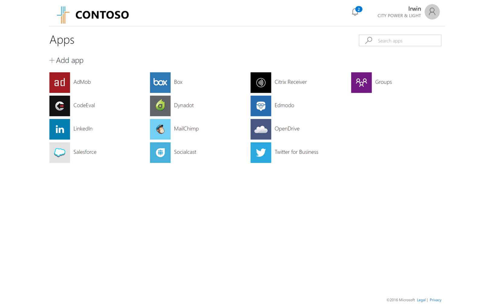
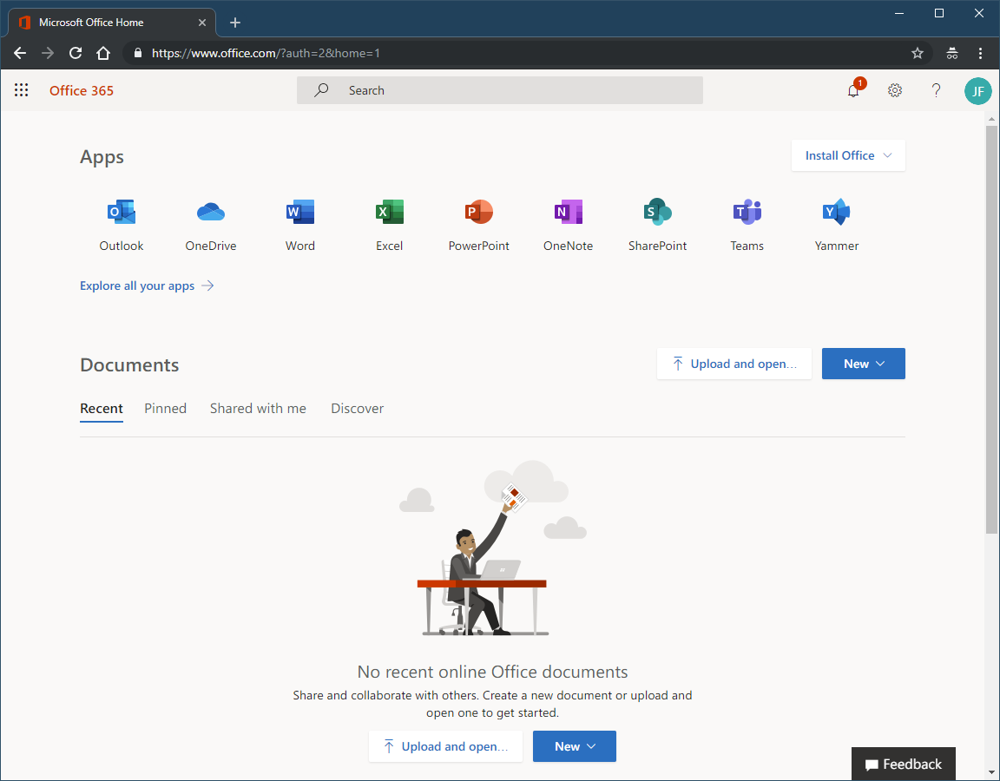
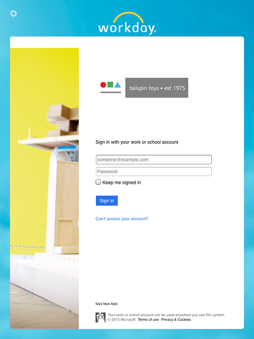

# End-user experiences for applications in Azure Active Directory

Azure Active Directory (Azure AD) provides several customizable ways to deploy applications to end users in your organization:

* Azure AD access panel
* Office 365 application launcher
* Direct sign-on to federated apps
* Deep links to federated, password-based, or existing apps

Which method(s) you choose to deploy in your organization is your discretion.

## Azure AD access panel

The Access Panel at https://myapps.microsoft.com is a web-based portal that allows an end user with an organizational account in Azure Active Directory to view and launch cloud-based applications to which they have been granted access by the Azure AD administrator. If you are an end user with [Azure Active Directory Premium](https://azure.microsoft.com/pricing/details/active-directory/), you can also utilize self-service group management capabilities through the Access Panel.

The Access Panel is separate from the Azure portal and does not require users to have an Azure subscription or Office 365 subscription.

For more information on the Azure AD access panel, see the [introduction to the access panel](../user-help/active-directory-saas-access-panel-introduction.md).

## Office 365 application launcher

For organizations that have deployed Office 365, applications assigned to users through Azure AD will also appear in the Office 365 portal at [https://portal.office.com/myapps](https://portal.office.com/myapps). This makes it easy and convenient for users in an organization to launch their apps without having to use a second portal, and is the recommended app launching solution for organizations using Office 365.

For more information about the Office 365 application launcher, see [Have your app appear in the Office 365 app launcher](https://msdn.microsoft.com/office/office365/howto/connect-your-app-to-o365-app-launcher).

## Direct sign-on to federated apps

Most federated applications that support SAML 2.0, WS-Federation, or OpenID connect also support the ability for users to start at the application, and then get signed in through Azure AD either by automatic redirection or by clicking on a link to sign in. This is known as service provider -initiated sign-on, and most federated applications in the Azure AD application gallery support this (see the documentation linked from the app’s single sign-on configuration wizard in the Azure portal for details).

## Direct sign-on links

Azure AD also supports direct single sign-on links to individual applications that support password-based single sign-on, linked single sign-on, and any form of federated single sign-on.

These links are specifically crafted URLs that send a user through the Azure AD sign-in process for a specific application without requiring the user launch them from the Azure AD access panel or Office 365. These **User access URLs** can be found under the properties of available enterprise applications. In the Azure portal, select **Azure Active Directory** > **Enterprise applications**. Select the application, and then select **Properties**.

These links can be copied and pasted anywhere you want to provide a sign-in link to the selected application. This could be in an email, or in any custom web-based portal that you have set up for user application access. Here's an example of an Azure AD direct single sign-on URL for Twitter:

`https://myapps.microsoft.com/signin/Twitter/230848d52c8745d4b05a60d29a40fced`

Similar to organization-specific URLs for the access panel, you can further customize this URL by adding one of the active or verified domains for your directory after the myapps.microsoft.com domain. This ensures any organizational branding is loaded immediately on the sign-in page without the user needing to enter their user ID first:

`https://myapps.microsoft.com/contosobuild.com/signin/Twitter/230848d52c8745d4b05a60d29a40fced`

When an authorized user clicks on one of these application-specific links, they first see their organizational sign-in page (assuming they are not already signed in), and after sign-in are redirected to their app without stopping at the access panel first. If the user is missing pre-requisites to access the application, such as the password-based single sign browser extension, then the link will prompt the user to install the missing extension. The link URL also remains constant if the single sign-on configuration for the application changes.

These links use the same access control mechanisms as the access panel and Office 365, and only those users or groups who have been assigned to the application in the Azure portal will be able to successfully authenticate. However, any user who is unauthorized will see a message explaining that they have not been granted access, and are given a link to load the access panel to view available applications for which they do have access.

## Next steps

For deployment plans, see [Azure Active Directory deployment plans](../fundamentals/active-directory-deployment-plans.md)
